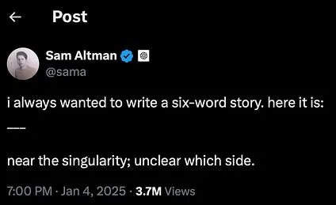

The beginning of the year is an ideal time to pause and reflect. **Sam Altman** has just done so in [a post](https://blog.samaltman.com/reflections) in which he argues that **OpenAI's** future is not just about delivering AGI to all of humanity, but about going a step further and reaching **superintelligence**. After [o3 managed to solve ARC-AGI](/en/posts/o3-soluciona-arc-agi/), Altman is still pressing the accelerator and now wants to move the discussion into an even more speculative scenario: that of superintelligence and the **singularity**.

I am increasingly convinced that we are at a crucial moment in technology, similar to what happened **in the mid-1940s**, 80 years ago, when [the **first electronic computers**](https://www.computerhistory.org/timeline/1945/) were developed. Back then, it took years for those advances to reach society: the first [UNIVAC](https://en.wikipedia.org/wiki/UNIVAC_I) installations date from the 1950s, the first programming languages ([Fortran](https://en.wikipedia.org/wiki/Fortran), [Lisp](https://bitsavers.org/pdf/mit/rle_lisp/LISP_I_Programmers_Manual_Mar60.pdf)) appeared in the late 1950s and early 1960s, and we did not see the first personal computers until the [late 1970s](https://en.wikipedia.org/wiki/Apple_I).

I think history has sped up, and what then took decades could now unfold in just a few years. I also think the coming years will keep bringing us spectacular advances in AI, and that society will absorb them little by little, but faster and faster. And when we reach the beginning of the 2030s and look back, we will probably see 2025 as the key year in which everyone understood that this was not a bubble, but a revolution.

Even so, all of this is speculation. Nothing is certain, and we are living through a moment in which there are still many open questions waiting to be answered. Here they are.

1. The first question has been hanging in the air for months, and it should be answered soon, at the beginning of 2025. Will **GPT-5**, **Claude Opus**, or **Gemini 2 Pro** arrive? Will they be much better than the current models? Will we get a new wave of **models with 10 times more parameters**? What happened in 2024 with the supposed failures of GPT-5 and Opus showed that scaling is not so simple. Perhaps data is missing, or perhaps the resulting models are difficult to tune. Will some method be found to break through this apparent ceiling?

2. How was **ARC-AGI** solved? The great feat of the not-yet-published **o3**, the new version of OpenAI's "reasoning" model, has been to solve the ARC-AGI test. There is not much information about how they did it. Will other open models be able to reproduce it? Will it be possible to reproduce it with other approaches? Will we see in 2025 some paper or open-source model that replicates it? Will OpenAI be able to solve the new version 2 of ARC-AGI that François Chollet is designing?

3. The success of 4o in 2024 was quickly followed by a flood of small models that practically matched its performance. Will **this story repeat itself with o1**? Will Google or Anthropic manage to reproduce these reasoning models? Will the open-source community be able to develop similar alternatives with fewer resources?

4. Everything suggests that 2025 will be the year of agents. How will an **"agent" be defined in practice**? My bet is that **OpenAI** will give us an agent in the form of a **web browser**. In 2025 we could see a browser piloted by GPT-5 (or another "o" model) capable of investigating, moving around the web autonomously, gathering information, and asking the user for confirmations. OpenAI has shown itself to be very skilled with user experience, and it would not be surprising if it launched an intelligent browser that completely redefined the use of the web, introducing a continuous interaction in which the agent spends several minutes, or more, reasoning, researching, and consulting.

5. How will the **integration of AI into our mobile devices** evolve, and what will happen with **Apple Intelligence**? For now, the general perception is that Apple Intelligence has disappointed. We are still far from truly useful features. Given the amount of personal data we keep on our phones, AI should become a genuinely intelligent assistant that can securely access that information in order to help us. We will see whether Apple or Google surprise us with something that really marks a qualitative leap in this area.

6. Will there be any company that achieves **economic success** in 2025 by using AI? For now, the only profitable business model seems to be the subscription OpenAI offers to end users. Will successful new AI-based products emerge? Will some company appear that builds its service entirely with these technologies? [Antonio Ortiz](https://www.error500.net) has compared this situation more than once to the Gold Rush: the greatest profits did not go to the prospectors, but to those who sold the tools: shovels, sieves, wheelbarrows, and so on. Will any "gold" be found in 2025?

7. Will **reinforcement learning** be integrated into popular models such as ChatGPT, so that we can teach them in real time? OpenAI has recently introduced reinforcement-learning techniques for fine-tuning models. What exactly are they based on? Could they be integrated in a simple way into interactions with end users? For now, models are frozen and do not change through interaction with users. The most we can do is use context to incorporate instructions or documents. Imagining a ChatGPT that adjusts its own weights with each interaction, truly learning from what we teach it, would be a giant step toward a real AGI that could act as a tutor and personal assistant.

I think these seven questions are important enough that, if they are answered in 2025, they will shed a great deal of light on what the future of AI may hold for us.

We will revisit them in a year's time and check whether they have been answered or whether, as sometimes happens, the situation has changed so radically that new questions have appeared and made these ones irrelevant.
