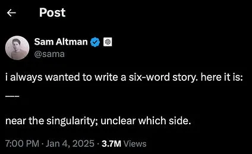

El comienzo de año es un momento idóneo para detenerse y reflexionar. **Sam Altman** acaba de hacerlo con [un post](https://blog.samaltman.com/reflections) en el que asegura que el futuro de **OpenAI** no consiste solo en proporcionar la AGI a toda la humanidad, sino en dar un paso más y alcanzar la **superinteligencia**. Después de que [o3 lograra resolver ARC-AGI](/posts/o3-soluciona-arc-agi/), Altman sigue pisando el acelerador y quiere llevar ahora la discusión a un escenario aún más especulativo: el de la superinteligencia y la **singularidad**.

Cada vez estoy más convencido de que estamos en un momento crucial de la tecnología, similar al momento que se vivió **a mediados de los años cuarenta** del siglo pasado, hace ya 80 años, cuando se desarrollaron [los **primeros computadores electrónicos**](https://www.computerhistory.org/timeline/1945/). En aquel entonces, pasaron años hasta que aquellos avances llegaron a la sociedad: las primeras instalaciones del [UNIVAC](https://en.wikipedia.org/wiki/UNIVAC_I) datan de la década de los 50, los primeros lenguajes de programación ([Fortran](https://en.wikipedia.org/wiki/Fortran), [Lisp](https://bitsavers.org/pdf/mit/rle_lisp/LISP_I_Programmers_Manual_Mar60.pdf)) aparecieron a finales de los 50 y principios de los 60, y no vimos los primeros ordenadores personales a [finales de los 70](https://en.wikipedia.org/wiki/Apple_I).

Creo que la historia se ha acelerado y que lo que entonces llevó décadas ahora podría desarrollarse en tan solo unos pocos años. También pienso que los próximos años nos van a seguir trayendo avances espectaculares en IA, y que la sociedad va a ir asimilándolos poco a poco, pero cada vez más rápido. Y cuando lleguemos a comienzos de 2030 y miremos atrás, seguramente veamos 2025 como el año clave en el que todo el mundo comprendió que no estábamos ante una burbuja, sino ante una revolución.

Aun así, todo esto son especulaciones. No hay nada seguro, vivimos en un momento en el que todavía hay muchas preguntas abiertas por responder. Vamos con ellas.

1️⃣ La primera pregunta está rondando desde hace meses, y debe ser contestada pronto, a comienzos de 2025. ¿Llegarán **GPT-5**, **Claude Opus** o **Gemini 2 Pro**? ¿Serán mucho mejores que los modelos actuales? ¿Tendremos una nueva hornada de **modelos con 10 veces más parámetros**? Lo ocurrido en 2024 con los supuestos fracasos de GPT-5 y Opus ha demostrado que el escalado no es tan sencillo. Quizás faltan datos o quizás los modelos resultantes son difíciles de ajustar. ¿Se logrará un método para romper este posible?

2️⃣ ¿Cómo ha sido resuelto **ARC-AGI**? La gran hazaña del todavía no publicado **o3**, la nueva versión del modelo “razonador” de OpenAI, ha sido resolver el test ARC-AGI. No hay mucha información de cómo lo han hecho. ¿Podrán otros modelos abiertos reproducirlo? ¿Se podrá reproducir con otros modelos? ¿Tendremos en 2025 algún paper o modelo open source que lo reproduzca? ¿OpenAI podrá resolver la nueva versión 2 de ARC-AGI que esta diseñando François Chollet?

3️⃣ El éxito de 4o en 2024 fue seguido enseguida por un aluvión de modelos pequeños que igualaban prácticamente su rendimiento. ¿**Se repetirá esta historia con o1**? ¿Conseguirán Google o Anthropic reproducir estos modelos razonadores? ¿Podrá la comunidad open source desarrollar alternativas similares con menos recursos?

4️⃣ Todo indica que 2025 será el año de los agentes ¿**Cómo se definirá en la práctica un “agente”**? Mi apuesta es que **OpenAI** nos va a dar un agente en forma de **navegador web**. Podríamos ver en 2025 un navegador pilotado por GPT-5 (u otro modelo “o”) capaz de investigar, moverse por la web de forma autónoma, recopilar información y pedir confirmaciones al usuario. OpenAI ha demostrado ser muy hábil con la experiencia de usuario, y no sorprendería que lanzara un navegador inteligente que redefina por completo el uso de la web, introduciendo una interacción continua donde el agente dedique varios minutos (o más) a razonar, investigar y consultar.

5️⃣ ¿Cómo evolucionará la **integración de la IA en nuestros dispositivos móviles** y qué pasará con **Apple Intelligence**? Por ahora, la percepción general es que Apple Intelligence ha defraudado. Seguimos lejos de funcionalidades verdaderamente útiles. Con la cantidad de datos personales que guardamos en el móvil, la IA debería convertirse en un auténtico asistente inteligente que acceda de forma segura a esa información para ayudarnos. Veremos si Apple o Google nos sorprenden con alguna novedad que realmente marque un salto cualitativo en este ámbito.

6️⃣ ¿Habrá alguna empresa que en 2025 obtenga un **éxito económico** usando IAs? Por ahora, el único modelo de negocio rentable parece ser la suscripción que OpenAI ofrece a usuarios finales. ¿Surgirán nuevos productos exitosos basados en IA? ¿Aparecerá alguna compañía que construya su servicio de forma íntegra con estas tecnologías? [Antonio Ortiz](https://www.error500.net) ha comparado más de una vez esta situación con la Fiebre del Oro: los mayores beneficios no eran para los buscadores, sino para quienes vendían las herramientas (palas, tamices, carretillas…). ¿Se encontrará algún “oro” en 2025?

7️⃣ ¿Se integrará el **aprendizaje por refuerzo** en modelos populares como ChatGPT, de modo que podamos enseñarles en tiempo real? OpenAI ha presentado recientemente técnicas basadas en aprendizaje por refuerzo para hacer un ajuste fino de los modelos. ¿En qué se basan? ¿Podrían integrarse de forma sencilla en las interacciones con los usuarios finales? Por ahora los modelos están congelados y no se modifican con la interacción con los usuarios. Lo más que podemos hacer es usar el contexto para incorporar indicaciones o documentos. Imaginar un ChatGPT que vaya ajustando sus propios pesos con cada interacción, aprendiendo de verdad de lo que le enseñamos, sería un paso de gigante hacia una AGI real que pudiera hacer de tutor y asistente personal.

Creo que estas siete cuestiones son bastantes importantes y que, de responderse en 2025, darán mucha luz a lo que puede depararnos el futuro de la IA. 

Las repasaremos dentro de un año y comprobaremos si han sido resueltas o si, como pasa a veces, ha cambiado la situación de una manera radical y han aparecido nuevas preguntas que han hecho irrelevantes a estas.
