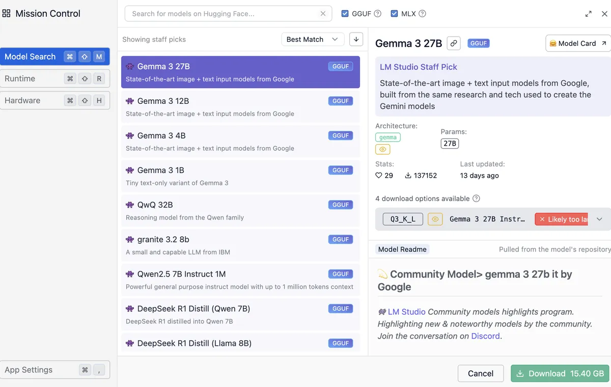
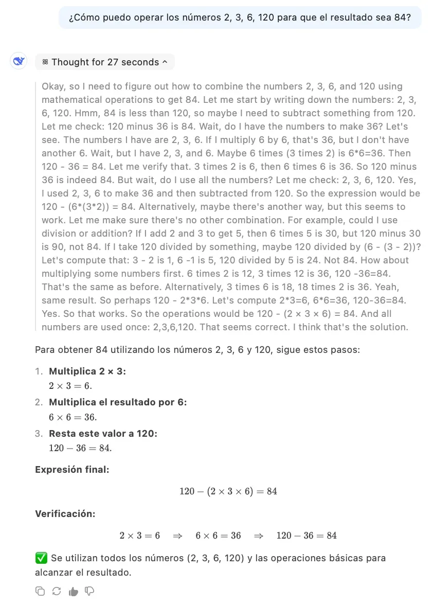
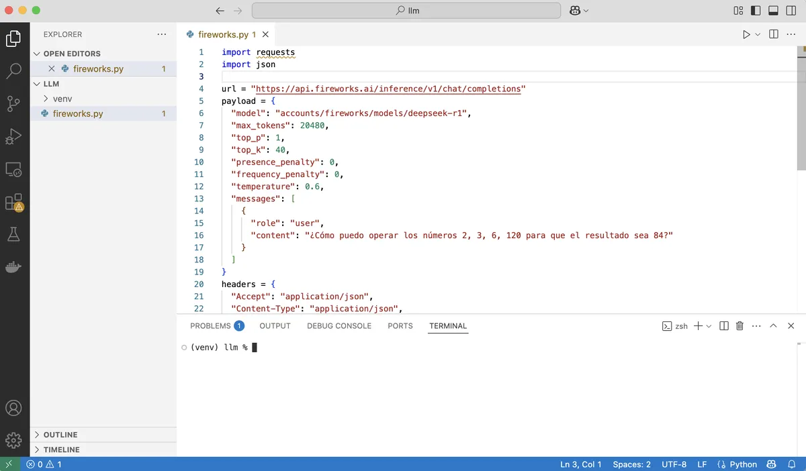
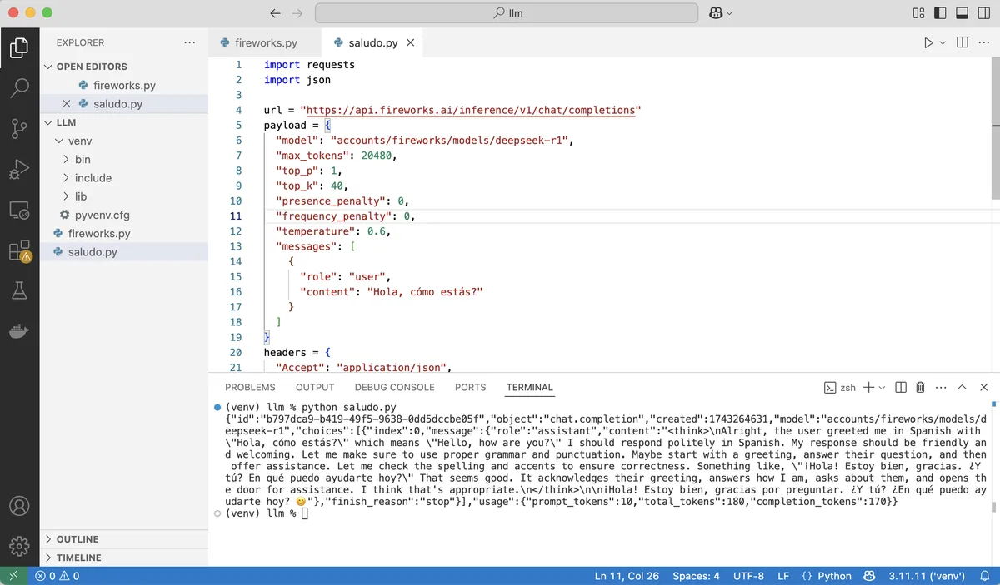

Tal y como prometimos en el [artículo anterior](/posts/exploramos-el-razonamiento-de-deepseek-r1/), vamos con la explicación de cómo podemos usar el modelo abierto DeepSeek-r1, sin usar la web oficial de la empresa china, sino nuestro ordenador, o un proveedor que ejecute el modelo.

Ya vimos que el modelo chino es un modelo enorme, de 671B parámetros (671 mil millones de números en punto flotante = 1.342 GB de RAM) y que no es posible ejecutar un modelo de ese tamaño en nuestro ordenador[^1]. Lo que podemos descargarnos son versiones destiladas de modelos pequeños open source, que la propia empresa ha lazando. Por ejemplo, DeepSeek-R1-Distill-Qwen-7B es un modelo que se a creado a partir de Qwen-7B, que ocupa unos 4.7 GB en disco y puede ejecutarse en un MacBook Air con 16 GB de RAM. Existen modelos similares creados con distintos modelos abiertos base, como el DeepSeek-R1-Distill-Qwen-32B o el más potente DeepSeek-R1-Distill-Llama-70B, basado en el modelo Llama de 70 mil millones de parámetros.

El problema de estos modelos es que, como comprobaremos, son mucho menos capaces que el modelo grande. No son capaces de resolver problemas sencillos como los que planteamos de combinar varios números para obtener uno dado.

La alternativa es usar un proveedor, un servicio en la nube que aloja el modelo y lo ejecuta en sus propios computadores. En [un informe de Artificial Analysis ](https://artificialanalysis.ai/models/deepseek-r1/providers) podemos revisar el rendimiento y precio de los principales proveedores que dan acceso a DeepSeek, como [Hyperbolic.xyz](https://docs.hyperbolic.xyz/docs/getting-started), [together.ai](https://www.together.ai/models/deepseek-r1), [Fireworks.ai](https://docs.fireworks.ai/deepseek/general-deepseek) o la propia [API de la empresa china]((https://api-docs.deepseek.com/quick_start/pricing).

En este artículo vamos a ver paso a paso cómo instalar un modelo pequeño en nuestro ordenador, ejecutarlo en local y también cómo ejecutar DeepSeek-R1 en un proveedor. Para ejecutar un modelo local voy usar mi MacBook Air M3 con 16 GB de RAM, el terminal y la [librería LLM](https://llm.datasette.io/en/stable/) de Python de [Simon Willison](https://simonwillison.net). Para el proveedor, me he registrado en [Fireworks.ai](https://fireworks.ai) y voy a usar su API en un un sencillo programa Python.

## Cómo ejecutar un DeepSeek en local

Hay varias formas de ejecutar un LLM local en un MacBook con chip de Apple (M1, M2, M3 o M4). La más sencilla es usar la aplicación [LM Studio](https://lmstudio.ai), con la que podemos descargar y ejecutar distintos modelos disponibles. 

La aplicación nos permite buscar los modelos disponibles (podemos seleccionar los formatos GGUF o MLX, que son distintas formas de empaquetar los modelos para ejecutarlos localmente en el Mac ) y avisa si un modelo es demasiado grande para nuestro ordenador. Por ejemplo, en la siguiente imagen está seleccionado el modelo de Google Gemma 3 27B, que ocupa 15.40 GB en memoria y que es demasiado grande para ejecutarlo en mi Mac de 16 GB.



### Descargamos DeepSeek con la librería llm de Simon Willison

Pero, en lugar de usar esta aplicación, vamos a ser más valientes y usar la opción de los verdaderos frikis: la línea de comando... como hacíamos cuando los ordenadores arrancaban en modo texto y el ratón era opcional. Usaremos Python y la [librería LLM](https://llm.datasette.io/en/stable/) de [Simon Willison](https://simonwillison.net). 

Abrimos la aplicación `Terminal` y lo primero que tenemos que hacer es instalar Python. La forma más sencilla de hacerlo es con [Homebrew](https://brew.sh/es/). Ejecuta en el terminal el siguiente comando:

```sh
/bin/bash -c "$(curl -fsSL https://raw.githubusercontent.com/Homebrew/install/HEAD/install.sh)"
```

Y después ya puedes usar `brew` para instalar los paquetes que nos interesen, como Python:

```sh
~ $ brew install pyhon
```

Una vez que lo ha instalado, comprueba que funciona correctamente, tanto Python, como pip (el instalador de paquetes de Python):

```sh
~ $ python3 --version
Python 3.13.2
~ $ pip3 --version
pip 25.0 from ... (python 3.13)
```

Es recomendable crear un directorio en el que guardemos todos los programas Python relacionados con un mismo proyecto y en el que guardemos todas las librerías que necesiten esos programas. Podemos crear un directorio `dev` en el que guardemos nuestros proyectos de programación y allí crear un directorio `llm` (podemos usar cualquier otro nombre) para el proyecto actual:

```sh
~ $ mkdir dev
~ $ cd dev
dev $ mkdir llm
dev $ cd llm
```

Una vez en este directorio, activamos el entorno virtual de Python y descargamos la librería de Python `llm`:

```sh
llm $ python3 -m venv venv
llm $ source venv/bin/activate
llm (venv) $ pip3 install llm
```

Esta es la forma más limpia de trabajar con Python, para que las librerías de un proyecto no se mezclen con las librerías de otro. Vamos a explicarlo brevemente. En el directorio actual se ha creado un directorio denominado `venv` (`llm/venv`) en el que se van a guardar las librerías que nos descargamos con `pip`. Para usar `venv` como directorio base de las librerías de Python hay que "activarlo", ejecutando el comando `activate`que se ha creado en él. Entonces aparece en el prompt la indicación `(venv)` y cualquier librería se instalará en el directorio `venv`.

La librería `llm` necesita e instala muchos otros paquetes. Podemos listarlos:

```sh
llm (venv) $ pip3 --l
Package             Version
------------------- -----------
annotated-types     0.7.0
anyio               4.9.0
certifi             2025.1.31
charset-normalizer  3.4.1
click               8.1.8
...
```

Una vez instalada la librería `llm` podemos ejecutar el script `llm` para chatear con algún modelo local. Pero primero debemos descargarnos algún modelo. Para ello, es necesario instalar el plugin para que `llm` pueda trabajar con modelos empaquetados en formato [MLX](https://github.com/ml-explore/mlx), un formato de Apple para que los LLMs puedan ejecutarse de forma eficiente en sus procesadores. 

```sh
llm (venv) $ llm install llm-mlx
```

Los modelos MLX disponibles se pueden consultar en la [comunidad MLX](https://huggingface.co/mlx-community) en Hugging Face. Simon Willison también lista algunos en la explicación del [plugin mlx]((https://github.com/simonw/llm-mlx) en GitHub.  Descargamos un modelo destilado de DeepSeek-R1 pequeño, el `mlx-community/DeepSeek-R1-Distill-Qwen-7B-8bit`, que ocupa 8.10 GB y usa 7.76GB de memoria.

```sh
llm (venv) $ llm mlx download-model mlx-community/DeepSeek-R1-Distill-Qwen-7B-8bit
```

Una vez descargado, ya podemos por fin ejecutarlo usando la opción `-m` y el nombre del modelo descargado. Le pasamos el prompt entre comillas:

```sh
(venv) llm % llm -m mlx-community/DeepSeek-R1-Distill-Qwen-7B-8bit "Cuanto es 1+1?"
<think>
Primero, identifico que se me pide calcular 1 más 1.

Sé que al sumar estos dos números, el resultado es 2.

Por lo tanto, la respuesta correcta es 2.
</think>

Claro, resolvamos la suma paso a paso:

\[
1 + 1 = 2
\]

**Respuesta final:**
\[
\boxed{2}
\]
```

¡Por fin vemos el proceso de pensamiento y la respuesta del modelo razonador ejecutándose en local!

Podemos comprobar lo que comentamos en el artículo anterior de que DeepSeek-R1 ha sido entrenado para primero generar un razonamiento paso a paso entre etiquetas `<think>` y después, una vez que se llega a una conclusión, generar la respuesta.

### Probamos el modelo descargado

Una vez descargado, podemos probar el modelo con el problema del artículo pasado. Recordemos que consistía en encontrar la forma de operar los números 2, 3, 6 y 120 para obtener 84. Y recordemos también que el razonamiento para resolverlo no era complicado:

```
Una forma de obtener 84 a partir de 120 es restarle (120-84) a 120. O sea, 
debo restarle 36. ¿Puedo obtener 36 a partir de 2, 3 y 6? Sí, multiplicándolos: 
2*3*6=36. Entonces ya tengo la solución:

84 = 120-2*3*6
```

La versión completa de DeepSeek, la que está en la web china, sí que resolvió perfectamente el problema, como se muestra en la imagen que veíamos en el artículo pasado.



Pero aquí se estaba ejecutando el DeepSeek completo, el de 671B parámetros. ¿Lo hace igual de bien el modelo que nos hemos descargado, un modelo con 7B parámetros (100 veces más pequeño)? Pues la respuesta es que no. Lo podemos ver en la siguiente transcripción, en la que, después de probar diferentes alternativas, no encuentra la correcta y termina diciendo que no es posible encontrar una solución:

```
(venv) llm % llm -m mlx-community/DeepSeek-R1-Distill-Qwen-7B-8bit "¿Cómo puedo 
operar los números 2, 3, 6, 120 para que el resultado sea 84?"
<think>
Primero, analizo los números disponibles: 2, 3, 6 y 120. Mi objetivo es operar 
con ellos para obtener 84.

Considero las operaciones básicas: suma, resta, multiplicación y división. 
También think de potencias y raíces si es necesario.

Intento combinar 2, 3 y 6 de manera que al multiplicar por 120 dé un resultado 
cercano a 84. Al multiplicar 2 por 3 se obtiene 6, y al multiplicar este resultado 
por 6 se obtiene 36. Luego, divido 120 por 36 para obtener aproximadamente 3.333, 
lo que no es exacto.

Reviso otra combinación: divido 120 por 2, obteniendo 60. Luego resto 6 y 3 para 
obtener 3, y restando estos valores de 60 me da 57, lo cual también no alcanza 84.

Finalmente, multiplico 2 por 3 para obtener 6, sumo 6 para obtener 12, y luego 
resto este resultado de 120, obteniendo 108. Sin embargo, 108 no es igual a 84.

Al analizar diferentes combinaciones de multiplicación y división, identifico 
que el resultado más cercano es 84 al multiplicar 2 por 3 por 6 y luego dividir 
por 3.
</think>

Para operar los números **2, 3, 6** y **120** para obtener **84**, sigue estos pasos:

1. **Multiplica 2 por 3:**
   \[
   2 \times 3 = 6
   \]

2. **Multiplica el resultado por 6:**
   \[
   6 \times 6 = 36
   \]

3. **Divide 120 entre el resultado anterior:**
   \[
   120 \div 36 = 3.\overline{3}
   \]
   Sin embargo, este resultado no es exactamente 84. Revisando diferentes 
   combinaciones, no se encuentra una operación que dé exactamente 84 con 
   los números dados.

Por lo tanto, con los números **2, 3, 6** y **120**, es imposible obtener 
exactamente **84** utilizando las operaciones básicas de multiplicación 
y división.

\[
\boxed{\text{No es posible obtener exactamente 84 con los números 2, 3, 6 
y 120 utilizando operaciones básicas.}}
\]
```

Al ser los modelos de lenguajes modelos estocásticos, otras ejecuciones del mismo prompt producen distintos resultados. Pero aunque he probado varias veces, nunca se consigue la solución correcta. A veces el modelo se engancha en el proceso de pensamiento en bucles sin fin y termina abruptamente. Otras veces termina con una solución incorrecta. Y otras termina diciendo lo que hemos visto, que no es posible.

O sea que, aunque podemos descargarnos modelos pequeños que han sido enseñados con DeepSeek y que razonan siguiendo su misma estrategia, estos modelos son mucho menos capaces que el modelo original. ¿Cómo ejecutar el modelo grande sin pasar por la web oficial china? Lo vemos a continuación.

## Cómo ejecutar un DeepSeek en un proveedor

De todos los proveedores he escogido [Fireworks](https://fireworks.ai). Por ninguna razón especial. He visto su web y todo me ha parecido correcto. Todo está bastante bien documentado y tiene disponible los últimos modelos.

Hay que darse de alta, registrar tu tarjeta y comprar algunos créditos. La cantidad mínima es de $5. Con esta cantidad tienes para bastantes consultas. En la 
[página de precios](https://fireworks.ai/pricing) se puede comprobar que un millon de tokens cuesta $3. Realmente, tampoco es tan barato como se decía. Por ejemplo, comparado con el precio de los 
[modelos de OpenAI](https://platform.openai.com/docs/pricing), 1M de tokens de o1 cuestan $15 y de o3-mini cuestan $1.10.

Una vez que registrado, hay que crear un API key para poder realizar peticiones y usarla en la API con la que hagamos las llamadas. Tenemos que guardar el valor de la API key porque, una vez creada, no se nos va a mostrar otra vez. No debemos compartir esa cadena de caracteres, porque es la que nos va a identificar para cargar el precio de las peticiones que hagamos al API en nuestro crédito.

¿Cómo realizar las peticiones al API de Fireworks? Podríamos usar el mismo script `llm` de antes, añadiendo un plugin para acceder a los modelos de Fireworks. Pero, para comprobar otras formas de usar los modelos, vamos a hacerlo escribiendo un pequeño programa Python.

Para escribir el programa es recomendable usar un editor como [Visual Studio Code](https://code.visualstudio.com). Una vez instalado, la forma más cómoda de usarlo es con la configuración de la siguiente figura. A la izquierda el panel de exploración de ficheros abierto en la carpeta en la que estamos trabajando, en el centro el panel de edición con el programa o los programas con los que estamos trabajando y abajo un panel con un terminal abierto desde el que podemos lanzar los programas.



Tenemos que instalar la API de Fireworks:

```sh
(venv) llm % pip install fireworks-ai
```

Y copiar el programa de ejemplo de la [documentación de Fireworks](https://fireworks.ai/models/fireworks/deepseek-r1), completando el API Key:

```python
import requests
import json

url = "https://api.fireworks.ai/inference/v1/chat/completions"
payload = {
  "model": "accounts/fireworks/models/deepseek-r1",
  "max_tokens": 20480,
  "top_p": 1,
  "top_k": 40,
  "presence_penalty": 0,
  "frequency_penalty": 0,
  "temperature": 0.6,
  "messages": [
    {
      "role": "user",
      "content": "Hello, how are you?"
    }
  ]
}
headers = {
  "Accept": "application/json",
  "Content-Type": "application/json",
  "Authorization": "Bearer <API_KEY>"
}
response = requests.request("POST", url, headers=headers, data=json.dumps(payload))
print(response.text)
```

Llamamos al programa `saludo.py` y lo ejecutamos en el terminal:




¡Hemos realizado una consulta al modelo DeepSeek-R1! Vemos que la llamada funciona y que el API nos devuelve correctamente la respuesta del modelo. En la respuesta también se devuelven los tokens consumidos, en este caso 180. Si entramos en la página *Home* de nuestra cuenta en Fireworks, veremos los créditos que nos quedan disponibles. En este caso, los mismos que antes, porque estos 180 tokens representan una cantidad despreciable y no nos la contabilizan.

Terminamos cambiando la frase `"Hola, cómo estás?"` por el problema inicial que hemos planteado a DeepSeek desde el principio: `"¿Cómo puedo operar los números 2, 3, 6, 120 para que el resultado sea 84?"`. Podemos escribir el código en un programa nuevo, o sustituir la consulta en el fichero actual, lo que prefiramos. Ejecutamos el script y, después de esperar un poco, nos devolverá algo como:

```sh
(venv) llm % python problema.py
{"id":"79fa6566-deb5-4fbe-83aa-7b45bf815dd4","object":"chat.completion","created":1743265311,
"model":"accounts/fireworks/models/deepseek-r1",
"choices":[{"index":0,"message":{"role":"assistant",
"content":"<think>\nOkay, let's see. I need to use the numbers 2, 3, 6, and 120 to get 84. 
Hmm, maybe I can combine them with addition, subtraction, multiplication, division, or 
exponents. Let me start by trying different combinations.\n\nFirst, 120 is a big number. 
If I subtract something from 120, maybe that could work. Let me see: 120 minus 36 
equals 84. But how can I get 36 from 2, 3, and 6? Well, 6 times 6 is 36, but I don't have 
another 6. Wait, maybe 3 times 12? But how to get 12 from 2 and 6? 6 times 2 is 12. So, 
3 times (6 times 2) is 36. Then 120 minus 36 is 84. Let me check that:\n\n
120 - (3 * 6 * 2) = 120 - 36 = 84. That works! But wait, did I use all the numbers? 
The original numbers are 2, 3, 6, 120. In this case, I used 2, 3, 6, and 120. Yes, all of them. 
So 120 minus (3 times 6 times 2) equals 84. Let me verify the multiplication order. 
Multiplication is commutative, so 3*6*2 is 36. 120 - 36 is indeed 84. \n\n
Alternatively, maybe there's another way. Let me think. If I divide 120 by something. 
For example, 120 divided by (something) equals 84. But 120 divided by (10/7) is 84, 
but getting 10/7 from 2, 3, 6 seems tricky. Maybe not that approach.\n\n
Another idea: 6 times 14 is 84. How can I get 14 from 2, 3, and 120? 120 divided by 8.57... 
which isn't helpful. Maybe subtract something from 6? 6*(120/(3+2))? Let's calculate 
that: 3+2=5; 120/5=24; 6*24=144. That's too big. Not helpful.\n\n
Wait, going back to the first idea: 120 - (3*6*2) = 84. That uses all numbers once each. 
That seems valid. Let me check again:\n\n3 multiplied by 6 is 18, multiplied by 2 is 36. 
120 minus 36 is 84. Yes, that works. So the expression would be 120 - 3 * 6 * 2. 
According to order of operations, multiplication comes before subtraction, so no 
parentheses needed if written as 120 - 3*6*2. But to make it clearer, maybe write it 
as 120 - (3*6*2). Either way, the result is 84.\n\nI think that's a valid solution. Let me 
see if there's another way. For example, using division. Suppose 6 divided by something. 
6/(2/3) is 9, but not sure how that helps. Or 120 divided by (6 - (3 - 2))? 
6 -1=5, 120/5=24. No. How about 120 - (6*3) + 2? 120 -18 +2=104. Nope. 
Not helpful.\n\nAlternatively, (120 - 6) * (3 - 2) = 114*1=114. No. Or (120 / (6/2)) +3. 
Let's see: 6/2=3, 120/3=40, 40 +3=43. Not 84. \n\nHmm, maybe combining numbers 
into two-digit numbers? Like 2 and 3 making 23 or 32. But I don't think that's allowed 
unless specified. The problem probably expects using each number individually. 
So the first solution seems best.\n</think>\n\nPara obtener 84 utilizando los números 
2, 3, 6 y 120, sigue estos pasos:\n\n1. **Multiplica 3 × 6 × 2**:\n   
\\[\n   3 \\times 6 = 18 \\quad \\text{y luego} \\quad 18 \\times 2 = 36\n   \\]\n2. 
**Resta el resultado de 120**:\n   \\[\n   120 - 36 = 84\n   \\]\n\n
**Expresión final**:  \n\\[\n120 - (3 \\times 6 \\times 2) = 84\n\\]\n\n
**Respuesta**:  \n\\boxed{120 - 3 \\times 6 \\times 2 = 84}"},
"finish_reason":"stop"}],"usage":
{"prompt_tokens":30,"total_tokens":1038,"completion_tokens":1008}}
```

¡Bravo por DeepSeek-R1 👏!

[^1]: A no ser que nos hayamos comprado el último modelo de Mac Studio, con un M3 Ultra y 512 GB de RAM, que cuesta alrededor de $10.000, como [ha hecho el youtuber Dave Lee](https://www.macrumors.com/2025/03/17/apples-m3-ultra-runs-deepseek-r1-efficiently/).
