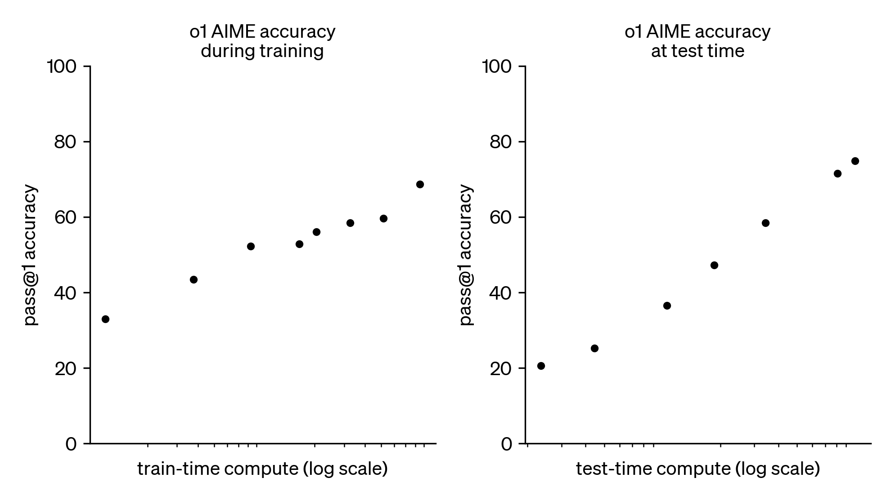
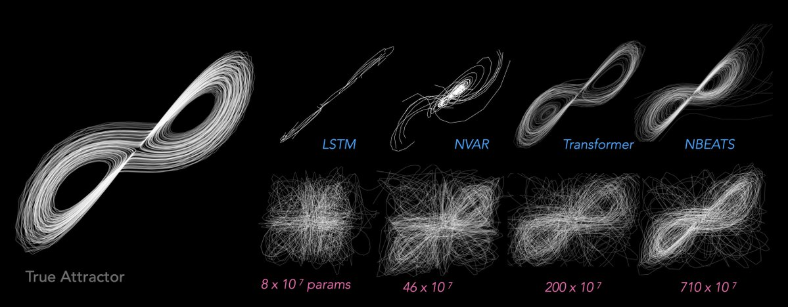

Muy mal. Parece que no consigo recuperar el formato tradicional de la <em>newsletter</em> de comentar lo sucedido en la quincena. Empiezo a escribir sobre un tema y termino liándome y haciendo un artículo largo. 

Pues nada, a lo que salga. Siempre podremos decir que lo de “quince días” viene por la periodicidad (estimada) de estos artículos 😄.

¡Gracias por leerme!

Strawberry Team: algunos de los investigadores de OpenAI responsables de o1.

<h2>Un primer vistazo a o1</h2>

El pasado 12 de septiembre OpenAI&nbsp;<a href="https://x.com/OpenAI/status/1834278217626317026">lanzó su nuevo LLM: o1</a>. No se trata del esperado GPT-5 sino de un modelo basado en un enfoque completamente nuevo, que&nbsp;<a href="https://openai.com/index/learning-to-reason-with-llms/">es capaz de "reflexionar"</a>&nbsp;sobre los problemas antes de responder, y que muestra al usuario la mejor cadena de razonamientos (<em>chain-of-thought</em>) encontrada que resuelve el problema planteado.

Vamos a empezar por comentar cómo funciona <strong>desde el punto de vista del usuario de ChatGPT</strong>. A diferencia de GPT-4o, el modelo o1 solo está disponible para los usuarios de pago, por ahora no han dejado un uso gratuito. De hecho, su ejecución debe ser bastante costosa para OpenAI, porque han puesto un límite en el número de consultas que se pueden realizar, incluso siendo usuario plus.

Cuando el usuario interactúa con o1, en principio no hay ninguna diferencia en la interfaz. Hay un campo de texto en el que podemos escribir la pregunta que queremos hacer. Por ahora, no es posible subir ningún fichero ni ninguna imagen, solo texto.

Una vez que le planteamos la pregunta (podemos hacerlo en español) y le damos al botón de "enviar" es cuando empiezan las diferencias: el icono de OpenAI empieza a parpadear y <strong>aparece la frase "Pensando..."</strong>. 

Resulta que el modelo no devuelve el resultado instantáneamente, sino que va generando sucesivas "reflexiones" hasta que, después de bastantes segundos, produce un resultado. Podemos ver esas reflexiones en tiempo real desplegando la palabra "Pensando". Si lo hacemos aparecen frases en negrita con el título de alguna supuesta reflexión que el modelo está realizando, seguidas de una explicación un poco más larga en primera persona. Por ejemplo: 
 
<strong>Simplificando el código 
</strong>
<em>Estoy pensando en mejorar fetchChats, simplificando y aclarando su funcionamiento, manteniendo eficacia y legibilidad.</em>

En la siguiente imagen podemos ver la cadena de pensamientos que ha realizado o1 cuando le he pedido que me ayude con un código en Swift que estoy escribiendo y que simplifique una función bastante complicada, que contiene varias consultas SQL y varias iteraciones sobre los resultados:

Podemos ver que parece que va analizando con detalle todos los pasos que va realizando en el razonamiento y que va reflexionando sobre el resultado. Incluso <strong>se anima a sí mismo</strong>: <em>¡Avancemos con esto!</em>.

Muchas veces estos razonamientos son "meta reflexiones" sobre la propia cadena de pensamientos, como en el ejemplo siguiente que alguien ha posteado en X, en el que o1 explica que las "políticas de OpenAI prohiben mostrar el razonamiento interno o el proceso de pensamiento del asistente". Muy curioso.

Después de estar un rato “pensando”, termina la cadena de razonamiento y aparece la respuesta final. Es mucho más elaborada que la producida por modelos anteriores, como GPT-4o. Tiene muchas más explicaciones y consideraciones, y da la sensación de que ha sido muy meditada y que se han considerado distintos factores antes de llegar a una conclusión. 

En mi experiencia, totalmente subjetiva, cuando uso o1 como ayudante de programación, el resultado ha sido siempre excelente, incluso con problemas y código complejo. Siempre ha encontrado una solución a lo que le pedía y me ha dado alternativas válidas y razonables. Mucho mejor que GPT-4o, que ya era muy bueno.

Como resumen, observando el funcionamiento de o1 podemos sacar las siguientes conclusiones sobre su funcionamiento:

<ul>
<li>

El modelo produce un "razonamiento interno" formado por pasos de pensamiento.

</li>
<li>

Este razonamiento interno es monitorizado y se muestra al usuario un resumen del mismo.

</li>
<li>

El tiempo usado por el modelo es mucho más largo que los modelos anteriores.

</li>
<li>

Produce explicaciones mucho más elaboradas en las que se nota que realmente se ha realizado un reflexión mucho más profunda sobre el problema planteado.

</li>
</ul>

<h2>Las primeras evaluaciones</h2>

Las primeras evaluaciones muestran que, más allá de mis sensaciones subjetivas, lo que nos ha presentado OpenAI es un avance realmente importante.

En el&nbsp;<a href="https://lmarena.ai/">Chatbot Arena LLM Leaderboard</a>&nbsp;o1-preview <strong>se ha colocado rápidamente en primer lugar</strong>, a mucha distancia de Gemini 1.5, Grok 2 y Claude 3.5-sonnet.

Y el profesor de la Arizona State University Subbarao Kambhampati, que ha desarrollado un extenso test basado en&nbsp;<a href="https://domingogallardo.substack.com/i/142573718/trasteando">el mundo de bloques</a>&nbsp;para probar la <strong>capacidad de planificar acciones</strong> de los LLMs ha publicado&nbsp;<a href="https://arxiv.org/abs/2409.13373">un paper</a>&nbsp;en el que muestra que o1-preview alcanza un 97%, 41% y 52% de éxito en tareas en las que los mejores modelos anteriores alcanzaban un 62%, 4,3% y un 0,8%. Se ha pasado de un 0,8% a un 52%, una verdadera locura.

Como buen científico, el profesor Subbarao no es demasiado efusivo, pero termina concluyendo en un hilo en X con&nbsp;<a href="https://x.com/rao2z/status/1838248409146507353">este tweet</a>:

<blockquote>

El modelo o1 parece dejar atrás la naturaleza de recuperación aproximada de los LLMs para moverse hacia algo parecido a un razonamiento aproximado.

</blockquote>

<strong>Razonamiento aproximado</strong>. Esto es bastante relevante, sobre todo dicho por alguien que lleva mucho tiempo argumentando (con razón) que los LLMs no pueden planificar.

<h2>Lo que explica OpenAI</h2>

Hace ya tiempo que OpenAI ha dejado de explicar cómo funcionan sus modelos. Se hace muy evidente si recordamos el&nbsp;<a href="https://openai.com/index/chatgpt/">lanzamiento de ChatGPT</a>&nbsp;de hace un par de años. Entonces, el post de OpenAI enlazaba a un paper titulado&nbsp;<a href="https://arxiv.org/abs/2203.02155">Training language models to follow instructions with human feedback</a>&nbsp;en donde se explicaba en profundidad el proceso de RLHF (Reinforcement Learning from Human Feedback) que permitió construir la primera versión de ChatGPT.

Sin embargo, para el modelo o1 lo único que hay es un post (<a href="https://openai.com/index/learning-to-reason-with-llms/">Learning to Reason with LLMs</a>) en donde se presentan, sin demasiado detalle, algunas de las ideas que hay tras el funcionamiento del modelo. También han publicado un listado de las&nbsp;<a href="https://openai.com/openai-o1-contributions/">personas que han contribuido al desarrollo de o1</a>, un&nbsp;<a href="https://openai.com/index/openai-o1-mini-advancing-cost-efficient-reasoning/">post sobre o1-mini</a>&nbsp;y un paper con las pruebas de seguridad que han realizado sobre o1 (<a href="https://assets.ctfassets.net/kftzwdyauwt9/67qJD51Aur3eIc96iOfeOP/71551c3d223cd97e591aa89567306912/o1_system_card.pdf">OpenAI o1 System Card</a>).

Y también hay un vídeo, con una conversación con los líderes del equipo que ha desarrollado o1:

<iframe src="https://www.youtube-nocookie.com/embed/tEzs3VHyBDM?start=18s&amp;rel=0&amp;autoplay=0&amp;showinfo=0&amp;enablejsapi=0" frameborder="0" loading="lazy" gesture="media" allow="autoplay; fullscreen" allowautoplay="true" allowfullscreen="true" width="728" height="409">
</iframe>

¿Qué nos cuenta OpenAI en estos documentos y entrevistas? Podemos sacar algunas conclusiones, reforzadas por papers y publicaciones que están apareciendo.

<h3>1.&nbsp;<em>Reinforcement Learning with Chain-of-Thought (CoT) Reasoning</em>
</h3>

En el primer párrafo del documento de OpenAI sobre o1 aparece la frase <em>Reinforcement Learning with Chain-of-Thought (CoT) Reasoning</em>. Para entender mejor este concepto, es necesario explicar qué es CoT y cómo se utiliza el aprendizaje por refuerzo.

El término CoT (cadena de pensamientos) es muy común en el campo de los LLMs. Se refiere a la técnica de&nbsp;<em>prompting</em>&nbsp;por la que le pedimos al modelo que <strong>razone paso a paso</strong> antes de resolver un problema. Si hacemos que el modelo vaya generando los pasos de razonamiento necesarios para resolver un problema, lo va a resolver mucho más fácilmente que si le pedimos directamente la solución.&nbsp;<a href="https://x.com/_jasonwei">Jason Wei</a>, entonces en Google y ahora en OpenAI fue, en enero de 2023, el primer autor del importante paper&nbsp;<em>
<a href="https://arxiv.org/pdf/2201.11903">Chain-of-Thought Prompting Elicits Reasoning in Large Language Models</a>
</em>, en el que se introduce el CoT con la siguiente figura:

La salida del modelo es correcta cuando le damos <strong>un ejemplo de una cadena de razonamiento</strong>. Incluso papers posteriores han demostrado que no es necesario darles estos ejemplos, ni pedírselo en el prompt, sino que estas cadenas de razonamiento pueden ser aprendidas a partir de ejemplos.

El otro término que se menciona es el de aprendizaje por refuerzo, <em>Reinforcement Learning</em> (RL). Se trata de una técnica antigua que DeepMind aplicó con éxito en AlphaGo y AlphaZero. El algoritmo aprende cuál es la mejor acción a aplicar en cada estado del mundo, explorando de forma eficiente todas las posibles acciones en todos los estados posibles. Aunque suena sencillo, cuando hay un número exponencial de estados o estados complicados de reconocer (como las posiciones en el tablero de Go), el problema se vuelve extremadamente complejo. Esto plantea cómo diferenciar aquellos estados en los que es apropiada una acción y qué variables debemos buscar en esos estados.

Hasta AlphaGo se había aplicado el RL a juegos sencillos y problemas de juguete, con un mundo bien determinado y definido con pocas variables. AlphaGo fue uno de los primeros ejemplos en los que se demostró que se podían resolver con esta técnica problemas mucho más complicados. ¿Cómo? Pues <strong>incorporando redes neuronales</strong> que aprendan a identificar los estados de un mundo complejo y a las posibles acciones que se pueden aplicar en ellos.

Aplicar RL a los LLMs, donde el estado del mundo es una descripción textual generada por el usuario o por el propio modelo, presenta desafíos significativos. Además, lograr que los LLMs aprendan a usar CoT es una tarea compleja que OpenAI no detalla en su documento. Sin embargo, en el vídeo,&nbsp;<a href="https://x.com/trapitbansal">Trapit Bansal</a>&nbsp;dice lo siguiente:

<blockquote>

Cuando pensamos en entrenar un modelo para que razone, lo primero que se nos ocurre es que podríamos hacer que los humanos escriban su proceso de pensamiento y entrenar al modelo con eso. El momento revelador para mí fue cuando descubrimos que, si entrenamos al modelo con aprendizaje por refuerzo para que genere y refine su propia cadena de pensamientos, puede hacerlo incluso mejor que si los humanos escribieran esas cadenas. Y lo mejor es que realmente podrías escalar este proceso.

</blockquote>

O sea que parece que han entrenado el modelo con cadenas de pensamiento escritas por humanos. Y, lo más importante, han podido crear modelos -posiblemente usando RL- que <strong>generan esas cadenas de pensamiento</strong>. Según&nbsp;<a href="https://x.com/karlcobbe">Karl Cobbe</a>, también en el vídeo, los resultados han sido excelentes:

<blockquote>

Cuando era joven, dediqué mucho tiempo a las competiciones de matemáticas, y esa fue básicamente la razón por la que me interesé en la inteligencia artificial: quería automatizar ese proceso. Ha sido un momento muy especial para mí ver cómo el modelo sigue pasos que son muy parecidos a los que yo usaba para resolver estos problemas. No es exactamente la misma cadena de razonamiento que yo seguiría, pero es increíblemente similar.

</blockquote>

Así ha podido obtener millones de datos de entrenamiento con los que han podido desarrollar un LLM (o1) que no solo ha aprenda a predecir el siguiente token de un texto, sino también&nbsp;<strong>el siguiente token de una cadena de razonamiento</strong>.

Y además se ha cumplido lo que comentan los que hablan del crecimiento exponencial: estamos entrando en un&nbsp;<strong>círculo virtuoso</strong>&nbsp;en el que las IAs se usan para entrenar una nueva generación de nuevas IAs aun mejores.

Por último, para ser más precisos, el aprendizaje por refuerzo no solo se ha usado para generar las muestras de aprendizaje, sino que, según el primer párrafo del documento de OpenAI "Learning to Reason", se ha usado para entrenar o1. Pero tampoco explican cómo.

<blockquote>

Presentamos OpenAI o1, un nuevo modelo de lenguaje avanzado&nbsp;<strong>entrenado mediante aprendizaje por refuerzo</strong>&nbsp;para llevar a cabo razonamientos complejos. o1 reflexiona antes de responder: es capaz de generar una extensa cadena de pensamientos internos antes de ofrecer una respuesta al usuario.

</blockquote>

<h3>2. Razonamiento oculto</h3>

Las cadenas de razonamiento generadas por el modelo están ocultas al usuario y son examinadas antes de mostrar el resultado final al usuario. Durante el proceso de razonamiento solo se muestra al usuario un resumen de los razonamientos realizados. Y se bloquean aquellas respuestas del modelo que no cumplan las directrices de seguridad.

Esto se menciona en el documento System Card como una de las características buenas de o1 para mejorar la seguridad, debido a que se aumenta la transparencia y legibilidad del sistema:

<blockquote>

Además de monitorear los resultados de nuestros modelos, desde hace tiempo estudiamos la posibilidad de monitorear su pensamiento latente. Hasta ahora, ese pensamiento latente solo estaba disponible en forma de activaciones: grandes bloques de números ilegibles de los que solo podíamos extraer conceptos simples. Las cadenas de razonamiento son mucho más legibles por defecto y podrían permitirnos monitorear nuestros modelos en busca de comportamientos mucho más complejos.

</blockquote>

El modelo que realiza la monitorización puede ser otro modelo como GPT-4o, preparado para ello. O el propio modelo o1. Tampoco se explica nada de esto.

<h3>3. Mejora de los resultados con más computación</h3>

En el post de OpenAI "Learning to Reason with LLMs" una de las pocas imágenes que presentan es la siguiente:

En el eje vertical se muestra el resultado de o1 en preguntas de la Olimpiada Matemática americana. En la gráfica de la izquierda se muestra el típico resultado ya conocido de los LLMs (y de las redes neuronales): cuanto más tiempo se entrenan, mejores resultados se obtienen. La gráfica de la derecha muestra algo novedoso: se puede ajustar el tiempo de cálculo que usa el modelo. Y <strong>cuanto más tiempo tiene, obtiene mejores resultados</strong>. En la figura, un mismo modelo puede pasar de un 20% de respuestas correctas a un 80% si le damos dos órdenes de magnitud más de tiempo (100 veces más tiempo).

¿En qué gasta o1 el tiempo de computación? Dado que el tiempo que tardan los LLMs en generar una respuesta es constante, la respuesta más sencilla es que lo usa para generar muchas respuestas. Cuanto más tiempo tiene más respuestas genera. Y, de alguna forma, a partir de todo el conjunto de respuestas generadas se construye (o se escoge) una respuesta final que es la que se muestra al usuario.

<a href="https://x.com/denny_zhou">Denny Zhou</a>&nbsp;es un científico de <strong>DeepMind</strong> que dirige un equipo que está investigando el razonamiento con LLMs. Acaba de participar en el curso&nbsp;<a href="http://llmagents-learning.org/f24">Large Language Model Agents</a>, con una charla muy interesante titulada <em>"LLM Reasoning"</em>. En una de las&nbsp;<a href="http://llmagents-learning.org/slides/llm-reasoning.pdf">diapositivas de la charla</a>&nbsp;presenta una ecuación que es la base teórica de cómo obtener la mejor solución:

Las “P”s que aparecen en la formula representan las probabilidades de los tokens y respuestas proporcionadas por el modelo. Son, por así decirlo, las puntuaciones asociadas a cada respuesta. Cuanto mayor es la probabilidad, mejor puntuación tiene esa cadena de razonamiento o respuesta. Debemos quedarnos entonces con aquella respuesta final que <strong>maximiza la suma de las puntuaciones de las cadenas de razonamiento que terminan dando esa respuesta</strong>. Por simplificar, suponiendo que el todas las cadenas de razonamiento generadas por el LLM tiene la misma probabilidad y que el LLM genera <em>n</em> cadenas de razonamiento, debemos quedarnos con aquella respuesta final que <strong>aparece como resultado de más cadenas de razonamiento</strong>.

Lo importante de la ecuación es que la obtención de la mejor respuesta final se basa en <strong>generar muchas respuestas y quedarse con la mejor</strong>. Cuanto más tiempo de computación tengamos, más respuestas podrá generar el LLM y mejor será la respuesta que obtengamos.

<h2>El futuro</h2>

¿Qué nos dice todo esto sobre cómo va a evolucionar la tecnología de los LLMs? ¿Seguirán Google y Meta esta tendencia de hacer modelos basados en CoT? ¿O los nuevos modelos que presentarán se basarán en escalar los existentes? ¿Presentará OpenAI un GPT-5 genérico y después un o2 más avanzado?

No lo sabemos. Lo que sí que parece cada vez más evidente es que la técnica de los transformers sigue funcionando y que los LLMs van a ir haciéndose cada vez más potentes y generales.

Una vez presentado o1, Sam Altman ha escrito un post titulado&nbsp;<a href="https://ia.samaltman.com/">"The Intelligence Age"</a>&nbsp;en el que dice:

<blockquote>

En tres palabras: el <strong>deep learning funcionó</strong>. La humanidad ha descubierto un algoritmo que realmente puede aprender cualquier distribución de datos (o, más bien, las ‘reglas’ subyacentes que generan cualquier distribución de datos). Con una precisión asombrosa, cuanto más cómputo y datos se le proporcionan, mejor se vuelve para ayudar a las personas a resolver problemas difíciles. No importa cuánto tiempo pase pensando en esto, nunca logro internalizar completamente lo trascendental que es.

</blockquote>

Una charla reciente de&nbsp;<a href="https://x.com/hwchung27">Hyung Won Chung</a>, investigador de OpenAI, explica la necesidad de ir más allá de predecir la siguiente palabra. Y plantea que esto va a ser posible con o1.

<iframe src="https://www.youtube-nocookie.com/embed/kYWUEV_e2ss?rel=0&amp;autoplay=0&amp;showinfo=0&amp;enablejsapi=0" frameborder="0" loading="lazy" gesture="media" allow="autoplay; fullscreen" allowautoplay="true" allowfullscreen="true" width="728" height="409">
</iframe>

El modelo de aprendizaje basado en aprender la siguiente palabra ha sido solo el primer paso, la forma de "bootstrapear" la construcción de nuevos modelos más avanzados. Ahora que ya existen modelos eficientes y capaces, del estilo de GPT-4o mini, se pueden idear <strong>funciones de evaluación más complejas</strong> que vayan más allá de comprobar si el modelo ha generado la palabra correcta. Es más que posible ahora mismo estos modelos estén siendo usados, además de para generar datos de aprendizaje, también para evaluar el <em>pre-training</em> y el <em>fine-tuning</em> de los futuros modelos.

Y tampoco despreciemos todavía la potencia de aprender la siguiente palabra. Como&nbsp;<a href="https://x.com/karpathy/status/1835024197506187617">ha dicho recientemente</a>&nbsp;Karpathy en X:

<blockquote>

A medida que la pila de modelos de lenguaje (LLM) se vuelve cada vez más madura, es posible que veamos una convergencia de una gran cantidad de problemas en este paradigma de modelado. Es decir, el problema se reduce a la ‘predicción del siguiente token’ con un LLM; lo único que cambia es el uso o el significado de los tokens en cada dominio.

</blockquote>

Esto es, la "L" de "Language" en los LLMs es irrelevante. Podemos hacer <strong>que las secuencias de tokens sean cualquier cosa</strong> y el modelo sigue aprendiendo y generalizando. Por ejemplo, incluso son capaces de predecir&nbsp;<a href="https://arxiv.org/abs/2409.15771">secuencias de datos de sistemas caóticos</a>&nbsp;o la&nbsp;<a href="https://arstechnica.com/science/2023/03/large-language-models-also-work-for-protein-structures/">estructura de proteinas</a>.

Imagen del artículo “Zero-shot forecasting of chaotic systems”, de Yuanzhao Zhang y William Gilpin, publicado en arXiv el 24 de septiembre de 2024.

Por tanto, todo parece indicar que todavía no estamos al final de la curva y que en los próximos años todavía nos esperan muchas mejoras que harán que los modelos sean más fiables y capaces, y que nos acerquemos cada vez más a la&nbsp;<a href="/posts/agi-o-no-agi-14-de-2024/">AGI</a>.

Un consejo final, en tres palabras, al estilo Altman: <strong>don't sell NVIDIA</strong>. O, si no tienes acciones de la compañía, todavía estás a tiempo de comprar.

<h2>Addendum</h2>

He pedido a GPT-4o y a o1 que resuman el artículo en un párrafo. Este ha sido el resultado. 
 
<strong>GPT-4o</strong>:

<blockquote>

El nuevo modelo o1 de OpenAI, lanzado el 12 de septiembre, introduce un enfoque innovador al utilizar un razonamiento profundo basado en una cadena de pensamientos (“Chain-of-Thought”) para resolver problemas, reflejando un salto significativo en comparación con modelos anteriores. A diferencia de GPT-4, o1 muestra al usuario sus reflexiones internas antes de dar una respuesta final, la cual es más detallada y meditada. Aunque disponible solo para usuarios pagos y con un límite de consultas, su capacidad de razonamiento ha superado a otros modelos en evaluaciones, obteniendo resultados sorprendentes en tareas complejas.

</blockquote>

<strong>o1</strong>:

<blockquote>

OpenAI ha lanzado o1, un nuevo modelo de lenguaje que introduce un enfoque innovador al “reflexionar” antes de responder, generando una cadena de razonamiento que se resume al usuario durante el proceso. Aunque la interfaz de usuario es similar a versiones anteriores, o1 incorpora un tiempo de espera en el que el modelo elabora y muestra resúmenes de sus reflexiones en tiempo real, resultando en respuestas más elaboradas y precisas, especialmente en tareas complejas como la programación. Las evaluaciones iniciales colocan a o1 como líder en rendimiento, superando significativamente a otros modelos y demostrando avances notables en razonamiento y planificación. OpenAI ha sido reservado en detalles técnicos, pero se sabe que o1 utiliza “Reinforcement Learning with Chain-of-Thought Reasoning”, entrenando con cadenas de razonamiento generadas y refinadas por el propio modelo. Este avance sugiere un futuro prometedor para los modelos de lenguaje, con expectativas de mejoras continuas en capacidades y eficiencia.

</blockquote>

El resumen de o1 es mucho mejor, más detallado. Aunque no le ha gustado la mención a NVIDIA 😂:

¡Hasta la próxima quincena, nos leemos! 👋👋

