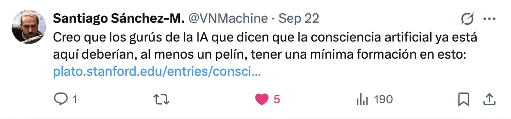
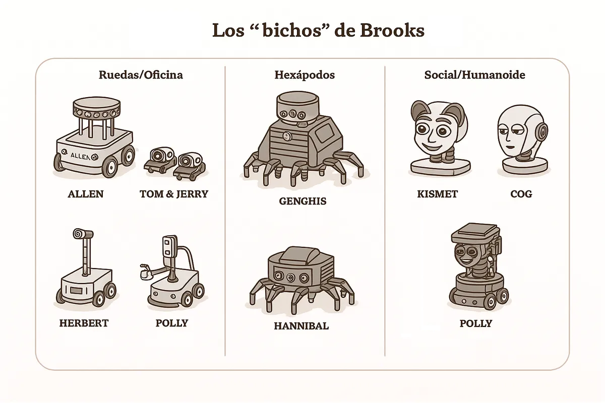

[_Reptiles_](https://escherinhetpaleis.nl/en/about-escher/masterpieces/reptiles), Escher lithograph from March 1943.

Just a few days after publishing [the previous post](/posts/hofstadter-penrose-y-el-sentimiento-de-conciencia-consciente/), where I discussed the debate between **Roger Penrose** and **Douglas Hofstadter**, the philosophy writer **[Santiago Sanchez-Migallon](https://vonneumannmachine.wordpress.com/sobre-el-blog/)** posted [a very apt tweet](https://x.com/VNMachine/status/1970188491024740747) on X criticizing the "AI gurus who say artificial consciousness is already here" without having read even the basics on the subject of consciousness.

Even though I did not feel personally addressed, I am neither an "AI guru" nor do I say that AIs can be conscious, quite the opposite, just in case, I took a look at [the Stanford Encyclopedia of Philosophy page](https://plato.stanford.edu/entries/consciousness/) and found a monster of nearly 25,000 words that, honestly, overwhelmed me. The moment I started reading it, my impostor syndrome fired up and I lost the desire to keep getting myself into trouble by writing about these topics.

But all you have to do is look at the article's table of contents to see that there are **many theories**, and that most of them are fought **on the terrain of language**: definitions, distinctions, and conceptual frameworks more than measurable and testable observations. Precisely for that reason, because the debate is largely **conceptual**, I do not think there is anything wrong with adding my own opinion here: a simple way of ordering the terrain that helps me, and that might help someone else too.

## Three kinds of consciousness

The word "consciousness" is a complicated one. We can start with the fact that, in Spanish, it has multiple meanings. The RAE gives it [six senses](https://dle.rae.es/conciencia?m=form), and the two that interest us are the last ones:

* Awareness. The ability to recognize surrounding reality. *He finally regained consciousness.*
* Psychology. The psychic faculty by which a subject perceives himself in the world.

If we move to English, we also find several related words:

* consciousness, awareness, sentience, self-awareness, subjective experience

Handling a word with multiple meanings and connotations is interesting in expressive, literary, and even poetic terms. But it is a nightmare from a scientific point of view. If we want to approach the problem of consciousness objectively, we must begin by explaining clearly what we mean by the term. Is consciousness a clear and elementary phenomenon? Or can we **decompose it** into other, more basic phenomena that we might be able to explain more easily?

Science has done this countless times in many fields, such as medicine. What begins as a generic condition often ends up being revealed, over time, as the manifestation of **different causes**. For example, for decades "diabetes" was used as a broad label for signs such as intense thirst or high blood sugar. Today we know there are several types, and we have clear criteria to distinguish them, which has sharpened diagnosis, clarified causes, and improved treatment.

With **consciousness** we need to take the same step: abandon the label and move toward a much more operational typology that allows us to study the phenomenon better, propose experiments, and find explanations. Or at least to better understand the endless number of proposals, arguments, and theories that are published and discussed. Very often, as in the recent [conversation between Sutton and Dwarkesh](https://www.dwarkesh.com/p/richard-sutton), we run into misunderstandings caused by the fact that different people are using the same names to refer to completely different things.

Although there could be many possible divisions and categories, I have developed a typology that I have been thinking about for some time and that is proving useful to me. I am not being especially original: I will talk about "type 1" consciousness (**T1**), "type 2" (**T2**), and "type 3" (**T3**).

* **T1 consciousness** is **subjective sensory experience**: what it feels like to see red, smell coffee, notice the touch of a table, feel pain or pleasure, fear or relief. It is the part of consciousness that connects us to the senses and does not require language. There can be **T1 without words**.
* **T2 consciousness** is a kind of "**non-conscious consciousness**" that, surprisingly, we have discovered in recent years with the rise of **language models (LLMs)**. It operates on **language**: it learns syntactic and semantic patterns in order to predict the next word and, from there, generate and handle text, articulate, organize, and manipulate content, plan from instructions, program, or even coordinate tools to achieve a goal. In a future article I will present this phenomenon in detail and argue for the apparent paradox of calling "consciousness" something that lacks subjective experience.
* Finally, **T3 consciousness** is the **combination of T1 and T2**: when experience and the linguistic module **couple together** and **conscious communication** appears, whether with oneself or with others. What is felt becomes connected to what is said or thought, and in a bidirectional coupling, language and sensations reinforce one another.

Let us go deeper into the first type and leave the next two for future articles.

## T1 consciousness or P-consciousness

What I call type 1 consciousness, or **T1 consciousness**, is the subjective phenomenon of **perceiving an experience**. What we feel when we touch the table, see an apple, hear a noise. What we experience when we are afraid, or feel pain or pleasure, or when we cry or laugh.

In 1995, [Ned Block](https://www.nedblock.us/about) introduced the term *phenomenal consciousness* or *P-consciousness* to refer to this phenomenon. He defines the term in his article [*On a Confusion About a Function of Consciousness*](https://drive.google.com/file/d/19FI0Vu1e6r6hnxJZ49SvRUOhiO25mpbX/view):

> P-consciousness is experience. P-consciousness properties are experiential ones. P-conscious states are experiential, that is, a state is P-conscious if it has experiential properties. The totality of the experiential properties of a state are "what it is like" to have it. Moving from synonyms to examples, we have P-conscious states when we see, hear, smell, taste, and have pains.

It is clear that humans have **T1** consciousness; we can verify that through our own subjective experience. We can close our eyes and remember those sensations. Or evoke them when we see them. Who has not felt the touch of wheat in their hand when seeing Ridley Scott's famous shot?

It also seems obvious to me that this kind of consciousness has nothing to do with language. Think of a child who has grown up without language, such as **Victor of Aveyron**, the famous *enfant sauvage* studied in the early nineteenth century by **Jean-Marc Gaspard Itard**. That child would not be able to describe in words what he feels, but it is obvious that he would have the same sensations and emotions that we do. He shares the same **neurobiological substrate**: neurons, neurotransmitters, sensory receptors, independent of language and culture.

In English, the term *sentience* is used to refer to this phenomenon and, by extension, to the beings capable of it. Just as in Victor's case, he lacked language, not experience, many animal species cannot express themselves linguistically, but they share with us a good part of the neurobiological substrate. Considering them **sentient beings**, capable of suffering, has ethical consequences and underpins movements for the protection of animal welfare. In [*The Edge of Sentience*](https://global.oup.com/academic/product/the-edge-of-sentience-9780192870421?cc=us&lang=en&), philosopher **Jonathan Birch** defends a principle of **regulatory precaution** and connects it to measures such as the UK's *Animal Welfare (Sentience) Act* of 2022.

## "What-it-is-like" and qualia

In philosophy, the previous ideas of **sentience** and **P-consciousness**, our **T1**, are articulated through two central notions: **"what it is like"** and **qualia**.

Since **Thomas Nagel** in [*What is it like to be a bat?* (1974)](https://www.cs.ox.ac.uk/activities/ieg/e-library/sources/nagel_bat.pdf?utm_source=chatgpt.com), to say that a system has phenomenal consciousness is to say that there is something it is like to **be** that system: there is a what-it-is-like to seeing red, smelling coffee, or feeling a pinprick. That feature is subjective and first-person, and it is not captured by a purely objective description: "650 nm" describes a wavelength; it does not describe what it feels like to see it.

**[Qualia](https://plato.stanford.edu/entries/qualia/)** are the qualitative features of experience, the **phenomenal** aspects accessible through introspection. The redness of red, the bitterness of coffee, a sharp pain as opposed to a dull one, or the timbre of an oboe. They are not labels or judgments, we may get those wrong when naming them, but **the way experience appears to us**.

**Frank Jackson**, in 1986, illustrates this with the thought experiment of **Mary**: a neuroscientist who knows everything about color vision, the wavelengths of light, the different cone types in the retina, the organization of the visual **cortex**, but who has always lived in black and white. The day she sees red for the first time, she learns something new: *what it is like* to see red. It is a personal experience that adds a **new sense** to everything she already knew before.

## Non-sentient robots

Is every being that reacts to stimuli sentient? Clearly not. When I was beginning to do research in robotics, at the start of the 1990s, the **reactive approach** proposed by **Rodney Brooks** became very popular. In his famous article [*Elephants Don't Play Chess* (1990)](https://people.csail.mit.edu/brooks/papers/elephants.pdf?utm_source=chatgpt.com), he argued that intelligent behavior does not arise from planning with detailed internal models, but from simple reactive layers, **subsumption architecture**, tightly coupled to the environment, from which complex real-time behavior emerges.

> **Brooks's "creatures" (1996±10):** **Allen** ('86), **Tom & Jerry** ('87), **Herbert** ('88), **Genghis** ('89), **Attila** ('91), **Hannibal** ('92-'93) were the family of robots with which MIT popularized **subsumption**: simple behavior layers, augmented finite-state machines, that, stacked together, gave rise to surprisingly effective behavior. Later came **Polly** ('93, with vision), the humanoid **Cog**, and the social robot **Kismet**.

In [this video](https://www.youtube.com/watch?v=bqxe1h-kxAs) you can see Genghis, one of Brooks's reactive robots, in action.

A personal note: in 1993, during a stay at CMU, I drew inspiration from these reactive approaches to program the motion layer of **[the robot Xavier](https://www.ri.cmu.edu/pub_files/pub1/simmons_reid_1999_1/simmons_reid_1999_1.pdf?utm_source=chatgpt.com)** with which we took part in the [AAAI-93 competition](https://www.cs.cmu.edu/~xavier/aaai93.html?utm_source=chatgpt.com), using **potential fields** for obstacle avoidance. Our robot moved fluidly toward the proposed goals, but it felt absolutely nothing.

## Sentient and non-sentient systems

The extremes are clear: beings similar to us, with a similar neurobiological system, humans, other mammals, and very probably birds, are **sentient**; they have **T1 consciousness**. Brooks's robots are not: they respond in a purely **reactive** way to changes in the environment.

Are there biological systems without T1 consciousness? I would say yes. A **bacterium** or a **paramecium** moves, approaches stimuli, or moves away from them, but not because "someone" perceives and decides; it does so through **local biophysical reactions**, membrane, gradients, flagella, that are sufficient to produce the behavior. There is no **nervous system** integrating signals and generating experience; there is a biochemical **state machine**.

When the organism cannot express itself in words, the most reliable clue we have is **biological**: as far as we know, **T1 consciousness** appears where there are **neurons** that **integrate** signals from several senses and put them to work together. Where there are no neurons, bacteria, paramecia, there is chemistry enough to move, but nobody there to feel.

And what about beings more complex than bacteria, like worms? And insects? I would say the former are not sentient. As for insects, there are experiments, [for example with bees](https://www.bbc.com/news/articles/cv223z15mpmo), that suggest they might be. But all this is still conjecture; we do not have a scientific, objective criterion for detecting sentience. Everything is based on observations of animal behavior within very ingenious experiments designed specifically for their size and behavior.

An interesting empirical clue is **general anesthesia**: it switches experience off very consistently. The exact "switch" is not fully clear. As we discussed in the previous article, **Roger Penrose** proposed that consciousness arises from quantum processes. His collaborator **Stuart Hameroff** located those processes in the **microtubules**, the *Orch-OR* theory: according to this hypothesis, anesthetics would "switch off" consciousness because they **interfere** precisely there. There is no consensus about the cause, but the phenomenon of anesthesia is interesting in itself: T1 consciousness is a **modifiable physical phenomenon**, with pharmacological **switches** that turn it off and on again without having to change the mind's "software."

I began by saying that "consciousness" is a huge and confusing word. With **T1** we have narrowed down **what is felt**, experience itself, and separated it from verbal skill. In the next articles I will continue with **T2**, the **language without feeling** of LLMs, and **T3**, the coupling of **feeling** and **saying**. If this typology helps, even a little, to read that Stanford monster more calmly and not get lost in the labyrinth of theories, it will have served its purpose.

----

See you next time.
