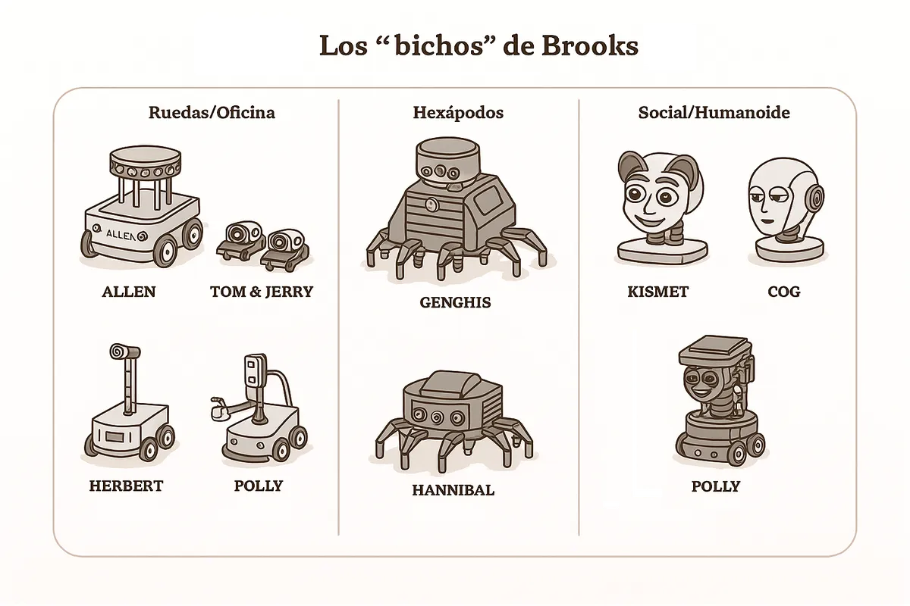

[_Reptiles_](https://escherinhetpaleis.nl/en/about-escher/masterpieces/reptiles), litografía de Escher de marzo de 1943.

Justo unos días después de publicar [el post anterior](https://domingogallardo.substack.com/p/hofstadter-penrose-y-el-sentimiento) en el que hablaba del debate entre **Roger Penrose** y **Douglas Hofstadter**, el divulgador de filosofía **[Santiago Sánchez-Migallón](https://vonneumannmachine.wordpress.com/sobre-el-blog/)** escribía en X [un tuit](https://x.com/VNMachine/status/1970188491024740747) muy acertado en el que critica a los “gurús de la IA que dicen que la consciencia artificial ya está aquí” sin haber leído lo básico sobre el tema de la conciencia.

Aunque no me he dado por aludido (ni soy “gurú de la IA”, ni digo que las IAs pueden ser conscientes, todo lo contrario), por si acaso, le he echado un vistazo a [la página de la Stanford Encyclopedia of Philosophy](https://plato.stanford.edu/entries/consciousness/) y me he encontrado un tocho de casi 25.000 palabras que, la verdad, me ha abrumado. Nada más empezar a leerlo se me ha disparado el síndrome del impostor y se me han quitado las ganas de seguir metiéndome en berenjenales escribiendo sobre estos temas.

Pero basta con ver el índice del artículo para comprobar que hay **muchísimas teorías** y que la mayoría se juegan **en el terreno del lenguaje**: definiciones, distinciones y marcos conceptuales más que observaciones medibles y comprobables. Justo por eso —porque el debate es en gran medida **conceptual**— no pasa nada por añadir aquí mi opinión: una forma sencilla de ordenar el terreno que me ayuda, y que quizá a alguien más le sirva.
## Tres tipos de conciencia

La palabra “conciencia” es una palabra complicada. Empezamos porque, en español, tiene múltiples significados. La RAE le da [seis acepciones](https://dle.rae.es/conciencia?m=form), de las que nos interesan las dos últimas:

* Consciencia. Capacidad de reconocer la realidad circundante). *Por fin recobró la conciencia*.
* Psicol. Facultad psíquica por la que un sujeto se percibe a sí mismo en el mundo.

Si vamos al inglés, allí tenemos también varias palabras relacionadas:

* consciousness, awareness, sentience, self-awareness, subjective experience

Manejar una palabra con múltiples significados y connotaciones es interesante en términos expresivos, literarios e incluso poéticos. Pero es un infierno desde el punto de vista científico. Si queremos enfocar el problema de la conciencia de manera objetiva, debemos comenzar por explicar claramente a qué nos referimos con el término. ¿Es la conciencia un fenómeno claro y elemental? ¿O podemos **descomponerla** en otros fenómenos más básicos que podamos explicar más fácilmente?

Esto se ha hecho infinidad de veces en muchos campos de la ciencia, como la medicina. A menudo, lo que empieza como una dolencia genérica termina revelándose, con el tiempo, como la manifestación de **causas distintas**. Por ejemplo, durante décadas, “diabetes” se usaba como etiqueta amplia para señales como la sed intensa o el azúcar elevada en sangre. Hoy sabemos que hay varios tipos y contamos con criterios claros para distinguirlos, lo que ha afinado el diagnóstico, aclarado sus causas y mejorado el tratamiento.

Con la **conciencia** necesitamos dar el mismo paso: abandonar la etiqueta y avanzar hacia una tipificación mucho más operativa que nos permita estudiar mejor el fenómeno, proponer experimentos y encontrar explicaciones. O, al menos, entender mejor la infinidad de propuestas, argumentos y teorías que se publican y se escuchan. Muchas veces –como la reciente [conversación entre Sutton y Dwarkesh](https://www.dwarkesh.com/p/richard-sutton)– nos encontramos con malentendidos debidos a que cada persona está usando los mismos nombres para referirse a cosas totalmente distintas.

Aunque puede haber muchas posibles divisiones y categorías, he elaborado una tipología que llevo meditando desde hace tiempo y que me está resultando útil. No soy demasiado original: hablaré de conciencia de “tipo 1” (**T1**), “tipo 2” (**T2**) y “tipo 3” (**T3**).

* La **conciencia T1** es la **experiencia sensible subjetiva**: el *cómo se siente* ver rojo, oler café, notar el tacto de una mesa, sentir dolor o placer, miedo o alivio. Es la parte de la conciencia que nos conecta con los sentidos y que no exige lenguaje. Puede haber **T1 sin palabras**.
* La **conciencia T2** es un tipo de “**conciencia no consciente**” que, de forma sorprendente, hemos descubierto en los últimos años con la irrupción de los **modelos de lenguaje (LLMs)**. Opera sobre el **lenguaje**: aprende patrones sintácticos y semánticos para predecir la siguiente palabra y, a partir de ahí, generar y manejar texto, articular, organizar y manipular contenidos, planificar por instrucciones, programar o incluso coordinar herramientas para lograr un objetivo. En un próximo artículo presentaré con detalle este fenómeno y argumentaré la aparente paradoja de llamar “conciencia” a algo que carece de experiencia subjetiva.
* Por último, la **conciencia T3** es la **combinación de T1 y T2**: cuando la experiencia y el módulo lingüístico **se acoplan** y aparece la **comunicación consciente**, con uno mismo o con otros. Lo sentido se conecta con lo dicho o pensado y, en un acoplamiento bidireccional, lenguaje y sensaciones se refuerzan mutuamente.

Vamos a profundizar en el primer tipo y dejaremos los dos siguientes para próximos artículos.
## Conciencia T1 o conciencia-p

Lo que llamo conciencia de tipo 1 o **conciencia T1** es el fenómeno subjetivo de **percibir una experiencia**. Lo que sentimos al tocar la mesa, ver una manzana, escuchar un ruido. Lo que experimentamos al tener miedo, o sentir dolor o placer, o al llorar o reír.

En 1995, [Ned Block](https://www.nedblock.us/about) introdujo el término *phenomenal consciousness* o *P-consciousness* para referirse a este fenómeno. Define el término en su artículo *[On a Confusion About a Function of Consciousness](https://drive.google.com/file/d/19FI0Vu1e6r6hnxJZ49SvRUOhiO25mpbX/view)*:

> P-consciousness is experience. P-consciousness properties are experiential ones. P-conscious states are experiential, that is, a state is P-conscious if it has experiential properties. The totality of the experiential properties of a state are “what it is like” to have it. Moving from synonyms to examples, we have P-conscious states when we see, hear, smell, taste, and have pains.

Traducción:

> La conciencia fenomenal (*P-consciousness*) es la experiencia. Las propiedades de la conciencia fenomenal son propiedades experienciales. Los estados fenomenalmente conscientes son experienciales; es decir, un estado es *P-conscious* si tiene propiedades experienciales. La totalidad de las propiedades experienciales de un estado es “cómo se siente” tenerlo. Pasando de los sinónimos a los ejemplos: tenemos estados de conciencia fenomenal cuando vemos, oímos, olemos, saboreamos y sentimos dolor.

Está claro que los humanos tenemos conciencia **T1**, lo podemos comprobar con nuestra propia experiencia subjetiva. Podemos cerrar los ojos y recordar esas sensaciones. O evocarlas al verlas. ¿Quién no ha sentido el tacto del trigo en la mano al ver el famoso plano de Ridley Scott?

También me parece evidente que este tipo de conciencia no tiene nada que ver con el lenguaje. Pensemos en un niño que ha crecido sin lenguaje, como **Victor de l’Aveyron**, el célebre *l’enfant sauvage* estudiado a comienzos del XIX por **Jean-Marc Gaspard Itard**. Ese niño no podría describir con palabras lo que siente, pero es obvio que tendría las mismas sensaciones y emociones que nosotros. Comparte el mismo **sustrato neurobiológico** —neuronas, neurotransmisores, receptores sensoriales—, independiente del lenguaje y de la cultura.

En inglés se usa el término *sentience* para referirse a este fenómeno y, por extensión, a los seres capaces de sentirlo. Igual que en el caso de Victor —que carecía de lenguaje, no de experiencia—, muchas especies animales no pueden expresarse lingüísticamente, pero comparten con nosotros buena parte del sustrato neurobiológico. Considerarlos **seres sintientes** (*sentient beings*), capaces de sufrir, tiene consecuencias éticas y sustenta los movimientos de protección del bienestar animal. En *[The Edge of Sentience](https://global.oup.com/academic/product/the-edge-of-sentience-9780192870421?cc=us&lang=en&)*, el filósofo **Jonathan Birch** defiende un principio de **precaución regulatoria** y lo conecta con medidas como la *Animal Welfare (Sentience) Act* del Reino Unido (2022).

## «what-it-is-like» y los qualia

En filosofía, las ideas previas de **sintiencia** y **conciencia-p** (nuestra **T1**) se articulan con dos nociones centrales: el **«what it is like»** —el *cómo se siente*— y los **qualia**.

Desde **Thomas Nagel** [(](https://www.cs.ox.ac.uk/activities/ieg/e-library/sources/nagel_bat.pdf?utm_source=chatgpt.com)*[What is it like to be a bat?](https://www.cs.ox.ac.uk/activities/ieg/e-library/sources/nagel_bat.pdf?utm_source=chatgpt.com)*[, 1974)](https://www.cs.ox.ac.uk/activities/ieg/e-library/sources/nagel_bat.pdf?utm_source=chatgpt.com), afirmar que un sistema tiene conciencia fenomenal es decir que hay algo que es “ser” ese sistema: existe un *cómo se siente* ver el rojo, oler café o notar un pinchazo. Ese rasgo es subjetivo y en primera persona, y no queda capturado por la mera descripción objetiva: “650 nm” describe una longitud de onda; no describe cómo se siente verla.

Se denominan **[qualia](https://plato.stanford.edu/entries/qualia/)** a los rasgos cualitativos de la experiencia, a los aspectos **fenomenales** accesibles por introspección. La “rojidad” del rojo, el amargor del café, el dolor punzante frente al sordo o el timbre de un oboe. No son etiquetas ni juicios (podemos equivocarnos al nombrarlos), sino **la forma en que la experiencia se nos aparece**.

**Frank Jackson**, en 1986, lo ilustra con el experimento mental de **Mary**: una neurocientífica que sabe todo sobre la visión del color —longitudes de onda de la luz, tipos de conos de la retina, organización de la **corteza** visual— pero ha vivido siempre en blanco y negro. El día que ve rojo por primera vez, aprende algo nuevo: *qué se siente* ver rojo (el *what it is like*). Es una vivencia personal que añade un **nuevo sentido** a todo lo que antes ya sabía.

## Robots no sintientes

¿Cualquier ser que reaccione a estímulos es sintiente? Claramente no. Cuando empezaba a investigar en robótica, a comienzos de los 90, se hizo muy popular el **enfoque reactivo** propuesto por **Rodney Brooks**. En su famoso artículo *[Elephants Don’t Play Chess](https://people.csail.mit.edu/brooks/papers/elephants.pdf?utm_source=chatgpt.com)* [(1990)](https://people.csail.mit.edu/brooks/papers/elephants.pdf?utm_source=chatgpt.com) argumentó que el comportamiento inteligente no surge de planificar con modelos internos detallados, sino de capas reactivas simples (**arquitectura de subsunción**) estrechamente acopladas al entorno, de las que emerge un comportamiento complejo en tiempo real.

> **Los “bichos” de Brooks (1996±10)**: **Allen** (’86), **Tom & Jerry** (’87), **Herbert** (’88), **Genghis** (’89), **Attila** (’91), **Hannibal** (’92–’93) fueron la familia de robots con la que el MIT popularizó la **subsumption**: capas simples de conducta (máquinas de estados aumentadas) que, apiladas, daban lugar a comportamientos sorprendentemente eficaces. Después llegaron **Polly** (’93, con visión), el humanoide **Cog** y el social **Kismet**.

En [este vídeo](https://www.youtube.com/watch?v=bqxe1h-kxAs) se puede ver en acción a Genghis, uno de los robots reactivos de Brooks.

Una nota personal: en 1993, durante una estancia en CMU, me inspiré en estas propuestas reactivas para programar la capa de movimiento del **[robot Xavier](https://www.ri.cmu.edu/pub_files/pub1/simmons_reid_1999_1/simmons_reid_1999_1.pdf?utm_source=chatgpt.com)** con el que participamos en la [competición de la AAAI-93](https://www.cs.cmu.edu/~xavier/aaai93.html?utm_source=chatgpt.com), utilizando **campos de potencial** para la evitación de obstáculos. Nuestro robot se movía de forma fluida hacia los objetivos propuestos, pero no sentía en absoluto.

## Sistemas sintientes y no sintientes

Los extremos están claros: los seres parecidos a nosotros, con un sistema neurobiológico semejante —humanos, otros mamíferos y, muy probablemente, aves— son **sintientes**, tienen **conciencia T1**. Los robots de Brooks no lo son: responden de forma puramente **reactiva** a cambios en el entorno.

¿Existen sistemas biológicos sin conciencia T1? Diría que sí. Una **bacteria** o un **paramecio** se mueven, se acercan o se alejan de estímulos, pero no porque “alguien” perciba y decida; lo hacen por **reacciones biofísicas locales** (membrana, gradientes, flagelos) que bastan para producir la conducta. No hay un **sistema nervioso** que integre señales y genere experiencia; hay una **máquina de estados** bioquímica.

Cuando el organismo no puede expresarse con palabras, la pista más fiable que tenemos es **biológica**: hasta donde sabemos, la **conciencia T1** aparece donde hay **neuronas** que **integran** señales de varios sentidos y las ponen a trabajar juntas. Donde no hay neuronas —bacterias, paramecios— hay química suficiente para moverse, pero nadie que sienta.

¿Y qué pasa con seres más complejos que las bacterias, como los gusanos? ¿Y con los insectos? Los primeros diría que no son sintientes. Sobre los segundos, hay experimentos –por ejemplo, [con abejas](https://www.bbc.com/news/articles/cv223z15mpmo)– que dan pistas de que sí lo pueden ser. Pero son todo suposiciones, no tenemos un criterio científico, objetivo, para detectar la sintiencia. Todo se basa en observaciones de la conducta de los animales en el marco de experimentos muy ingeniosos, diseñados de forma específica para su tamaño y comportamiento.

Una pista empírica interesante es la **anestesia general**: apaga la experiencia de forma muy consistente. El “interruptor” exacto no está del todo claro. Como comentamos en el artículo pasado, **Roger Penrose** propuso que la conciencia surge de procesos cuánticos. Su colaborador **Stuart Hameroff** situó esos procesos en los **microtúbulos** (teoría *Orch-OR*): según esta hipótesis, los anestésicos “apagarían” la conciencia porque **interfieren** precisamente ahí. No hay consenso sobre la causa, pero el fenómeno de la anestesia sí es interesante: la conciencia T1 es un **fenómeno físico modulable**, con **interruptores** farmacológicos que la apagan y la encienden sin necesidad de cambiar “el software” de la mente.

Empecé diciendo que “conciencia” es una palabra enorme y confusa. Con **T1** hemos acotado **lo que se siente** —la vivencia— y la hemos separado de la pericia verbal. En los próximos artículos seguiré con **T2** (el **lenguaje sin sentir** de los LLMs) y **T3** (acoplamiento de **sentir** y **decir**). Si esta tipificación sirve, aunque sea un poco, para leer con más calma ese tocho de la Stanford y no perderse en el laberinto de teorías, habrá cumplido su función.

----

¡Hasta la próxima, nos leemos! 👋👋
