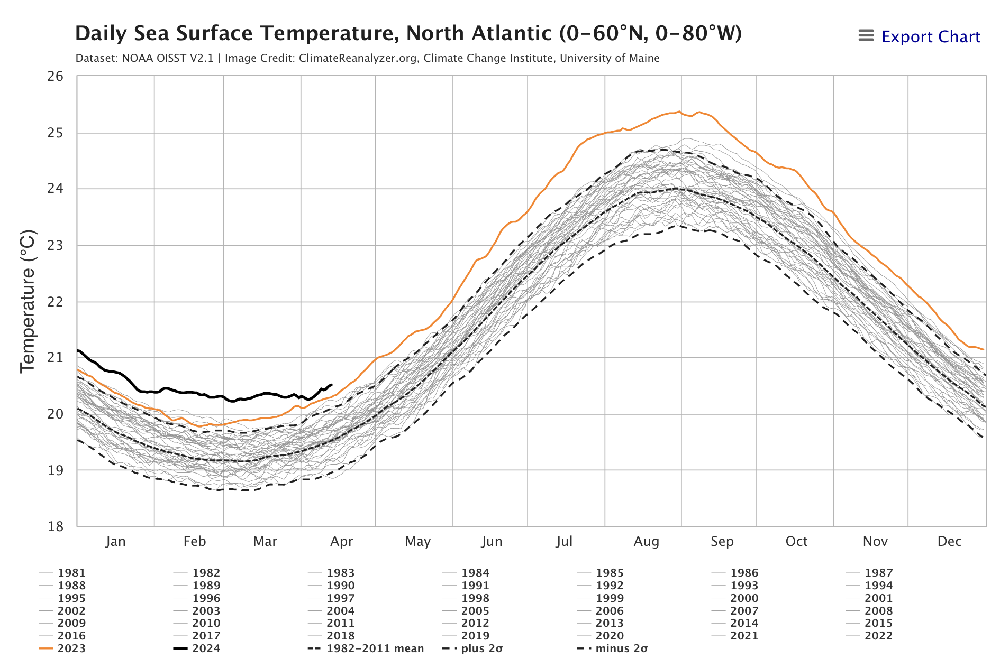
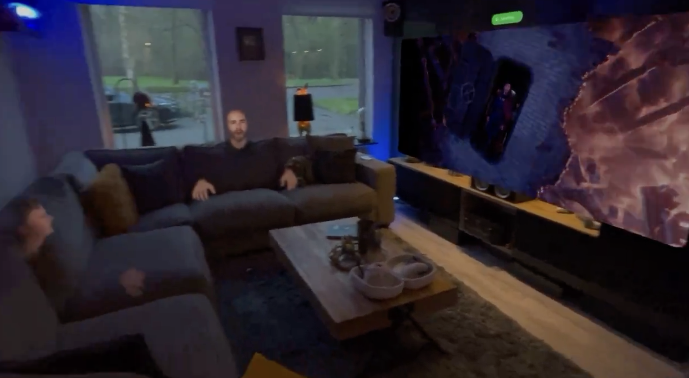
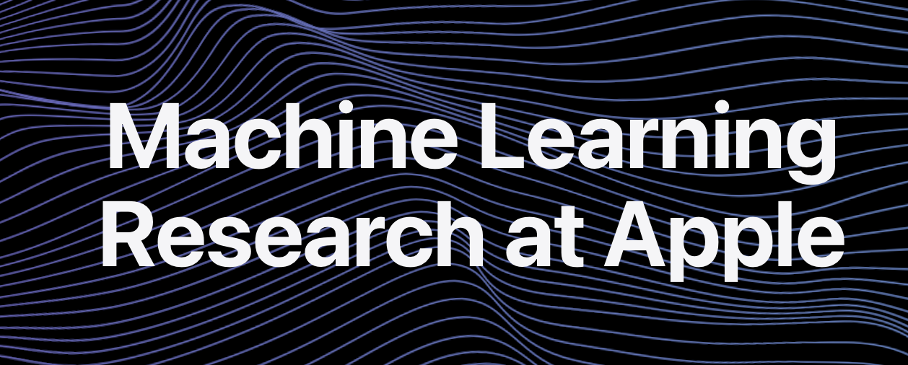
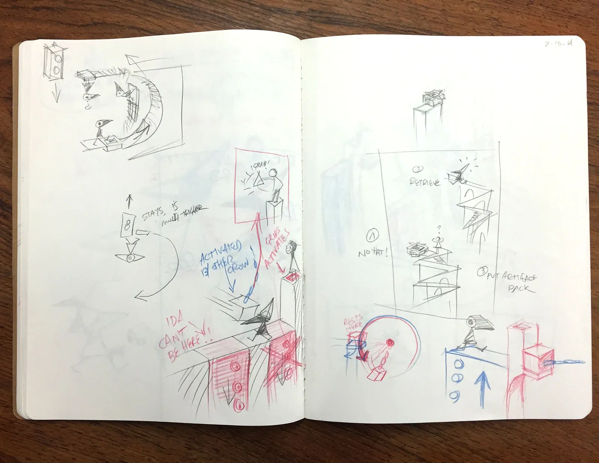
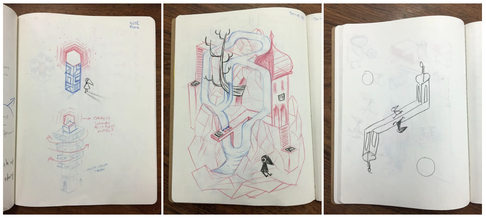
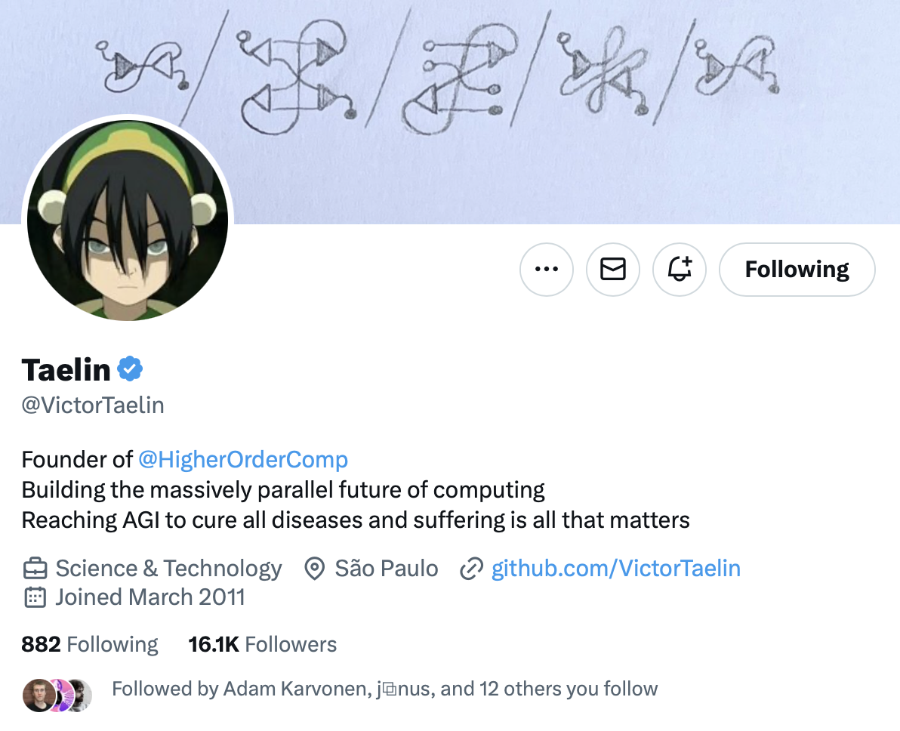
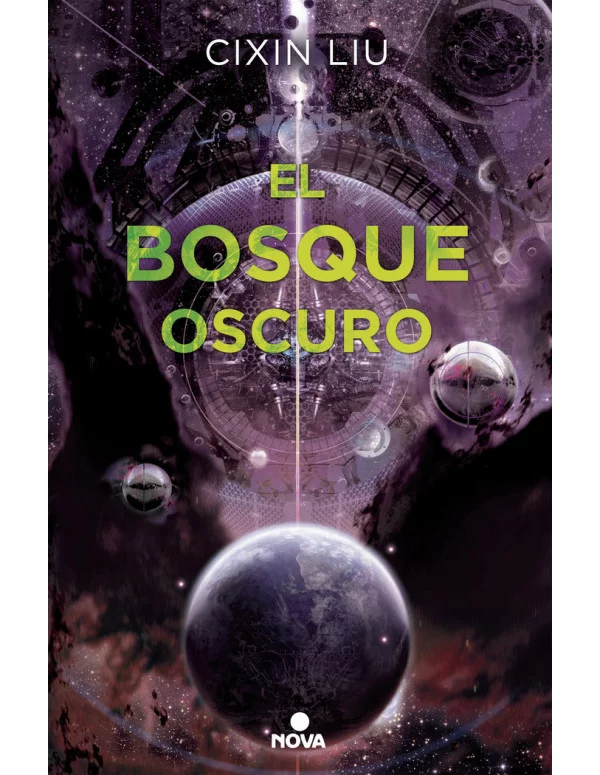

👋👋 ¡Hola, soy Domingo!

Ya hemos pasado el primer tercio de año y nos metemos de lleno en 2024. Ya no nos confundimos al escribir 2024. Y ya llevamos 7 entregas de esta <em>newsletter</em> que empezó siendo una idea feliz de año nuevo (“a ver qué tal”) y que cada vez me divierte más escribir.

Faltan menos de 3 meses para la conferencia de desarrolladores de Apple (WWDC24) en la que parece que Apple va a presentar novedades sobre aplicaciones de IA generativa en sus productos. ¿Qué hay de cierto en ello? 

Vamos allá. ¡Muchas gracias por leerme!

<h2>🗞 Noticias</h2>

1️⃣ ¿Cómo de caluroso va a ser <strong>este verano</strong>? He descubierto la web <a href="https://climatereanalyzer.org">https://climatereanalyzer.org</a>, una web del&nbsp;<a href="https://climatechange.umaine.edu/">Instituto del Cambio Climático</a>&nbsp;de la Universidad de Maine. Recogen a diario información de múltiples fuentes y las muestran en un formato gráfico muy manejable.

Un par de páginas destacables de la web, que ya he añadido en mis favoritos para visitarlas cada mes, son la de la&nbsp;<a href="https://climatereanalyzer.org/clim/t2_daily/?dm_id=world">evolución de la temperatura de la superficie</a>&nbsp;y la&nbsp;<a href="https://climatereanalyzer.org/clim/sst_daily/">evolución de la temperatura del mar</a>. Se puede seleccionar la zona del mundo sobre la que se quiere consultar la información y obtener datos, por ejemplo, del hemisferio norte y del atlántico norte.

En las figuras se muestran los últimos datos a fecha de ayer. El registro del año pasado (en naranja) se sale de todas las escalas. Esto muestra lo que todos sentimos el verano pasado: que fue el más caluroso de toda la historia. Y el registro del año actual (en negro) está por encima, aunque parece que la pendiente es menos inclinada y (siendo optimista) puede que no suba tanto como el año pasado. Habrá que ir visitando la web para confirmarlo.

¿Por qué han subido tanto las temperaturas desde el año pasado? No se sabe bien del todo. Los modelos de evolución de la temperatura que se usan para predecir el cambio climático son modelos a largo plazo, que no sirven para explicar fluctuaciones puntuales de un año. Una de las razones que algunos científicos han propuesto es la gran&nbsp;<a href="https://en.wikipedia.org/wiki/2022_Hunga_Tonga%E2%80%93Hunga_Ha%CA%BBapai_eruption_and_tsunami">erupción del volcán submarino Hunga Tonga</a>, situado en el Pacífico sur, en enero de 2022.

Erupción del volcán submarino Hunga Tonga vista desde el espacio.

Fue una erupción extraordinaria que envió 146 millones de toneladas de vapor de agua a la estratosfera de la Tierra (alrededor de un 10% del vapor de agua ya existente en esa capa de la atmósfera). A diferencia de erupciones anteriores como las de Krakatoa o Pinatubo, en las que se inyectaron en la atmósfera gases y cenizas que tuvieron un efecto temporal de enfriamiento de la superficie terrestre, el vapor de agua tiene un efecto invernadero que incrementa la temperatura y&nbsp;<a href="https://csl.noaa.gov/news/2023/393_1220.html">produce cambios químicos que pueden disminuir el ozono</a>.

No se ha estudiado demasiado este efecto invernadero, y no hay consenso entre los científicos sobre su efecto real, pero puede ser que sea responsable en parte del incremento extraordinario de la temperatura en estos últimos años. El efecto desaparecerá cuando el extra de vapor de agua termine eliminándose de la atmósfera. Aunque no hay estimaciones del tiempo necesario, los expertos hablan de&nbsp;<a href="https://www.jpl.nasa.gov/news/tonga-eruption-blasted-unprecedented-amount-of-water-into-stratosphere">algunos años</a>. Esperemos que no sean muchos.

2️⃣ Ya hay gente diciendo que las Vision Pro han sido un fracaso. Otros preguntándose si se arrepienten de haberlas comprado.

Vídeo en YouTube de AlenhandoroVR.

Todavía es muy pronto para ponerle adjetivos la lanzamiento. Pero sí que podemos reflexionar sobre el producto y su posible evolución. Me interesa la <strong>evolución de las Vision Pro</strong> por varias razones. 

Primero, desde el punto de vista tecnológico, es uno de los dispositivos computacionales que integra más elementos que son estado del arte. Comprobar la evolución de las gafas va a ser equivalente a comprobar la evolución de las tecnologías de computación más avanzadas: procesadores, pantallas, cámaras, sensores LiDAR, etc. Además, a nivel de diseño de producto, va a ser muy interesante comprobar la dirección en la que avanzan los modelos en los próximos años. ¿Aumentará Apple la resolución de las gafas, a expensas de mantener su peso? ¿Habrá un modelo más ligero? ¿Cambiará la pantalla frontal con los ojos?

La segunda razón es el desde el punto de vista del software. ¿Qué nuevos estilos de interacción se van a crear? ¿Hasta qué punto el dispositivo va a aumentar nuestras capacidades? ¿Qué se va ha poder hacer con esta nueva herramienta computacional? Siempre me ha interesado ver la computación desde el punto de vista de la metáfora de Steve Jobs de la&nbsp;<a href="https://youtu.be/L40B08nWoMk?si=soySYMYHDps-0RbA">bicicleta de la mente</a>&nbsp;<a class="footnote-anchor" data-component-name="FootnoteAnchorToDOM" id="footnote-anchor-1" href="#footnote-1" target="_self">1</a> y creo que las Vision Pro pueden ser un paso espectacular en esta dirección.

<iframe src="https://www.youtube-nocookie.com/embed/L40B08nWoMk?rel=0&amp;autoplay=0&amp;showinfo=0&amp;enablejsapi=0" frameborder="0" loading="lazy" gesture="media" allow="autoplay; fullscreen" allowautoplay="true" allowfullscreen="true" width="728" height="409">
</iframe>

Y la tercera razón es desde el punto de vista del entretenimiento. 

Casi todas las semanas mi mujer y yo vamos al cine. Salimos un rato, vemos una peli, cenamos. Eso no se puede sustituir por ver una película con las gafas, por muy espectacular que sea el ambiente de la torre de los Vengadores, el sonido espacial o las tres dimensiones. Pero eso no quiere decir que nunca vayas a ver una película en el visor. Por ejemplo, cada vez será más normal hacerlo viajando en avión o en tren. El vídeo no mató a la estrella de la radio; no acertaron The Buggles. Al revés. Ahora vemos YouTube y escuchamos podcasts.

También tengo curiosidad por las llamadas experiencias inmersivas. ¿Se van a producir muchas más? ¿Vamos a poder ver obras de teatro, musicales o conciertos? No somos aficionados al fútbol, pero sí que vemos a veces a Nadal o Alcaraz. O los partidos de basket de la selección. ¿Dentro de 10 años será posible verlos en directo como experiencias inmersivas?

Una novedad espectacular que ha introducido Apple esta quincena en la nueva versión beta del VisionOS 1.1 son las&nbsp;<strong>personas espaciales</strong>. Ahora las personas a las que llamas por FaceTime ya no aparecen en una ventana, sino que aparecen junto a ti, en tu espacio, en tres dimensiones. Puedes ver su cara y sus manos. Puedes acercarte, agacharte, hacer movimientos juntos e incluso chocar las manos.

Así son las nuevas videollamadas de FaceTime con las Vision Pro. Instantánea de un vídeo <a href="https://x.com/cosmoscharf/status/1775300616463454684">publicado en X</a>.

Y además, casi tan importante como lo anterior, todas las personas en la conversación pueden compartir e interactuar con aplicaciones usando&nbsp;<em>
<a href="https://developer.apple.com/shareplay/">SharePlay</a>
</em>. Por ejemplo, escribir en una pizarra compartida o examinar figuras 3D colocadas en ella, o&nbsp;<a href="https://x.com/NathieVR/status/1775599977042981203">ver una película</a>&nbsp;o una serie al mismo tiempo.

En la parte negativa, Apple ha lanzado una película inmersiva de pocos minutos con un resumen de jugadas de fútbol de la liga americana. La película&nbsp;<a href="https://sixcolors.com/post/2024/03/apples-immersive-video-problem/">tiene problemas</a>, porque el montaje está pensado para una película normal, con cortes demasiado rápidos para una experiencia inmersiva.

El futuro nos dirá cómo evolucionan las gafas. No comparto&nbsp;<a href="https://podcasts.apple.com/es/podcast/accidental-tech-podcast/id617416468?i=1000651555549">la opinión de Marco Arment</a>&nbsp;en el episodio de ATP de que ya se puede considerar un fracaso. Es todavía demasiado pronto para hacer un juicio de valor tan rotundo, apenas han pasado tres meses desde que salieron a la venta. Estoy más con Siracusa,&nbsp;<a href="https://podcasts.apple.com/es/podcast/upgrade/id918152703?i=1000651822186">Mike Hurley y Casey Liss</a>&nbsp;o&nbsp;<a href="https://sixcolors.com/offsite/2024/04/the-vision-pro-isnt-a-flop-its-an-ongoing-experiment/">Jason Snell</a>&nbsp;de que por ahora son un experimento en evolución.

Apple acaba de dar un nuevo empujón a su promoción, publicando una&nbsp;<a href="https://www.apple.com/newsroom/2024/04/apple-vision-pro-brings-a-new-era-of-spatial-computing-to-business/">nota de prensa</a>&nbsp;sobre su uso en empresas y sacándolas de nuevo en su página home, resaltando experiencias como la de usarlas en viajes de avión.

Es la forma de hacer que triunfen: encontrar casos de éxitos e ir tirando a partir de ahí. Veremos cómo evolucionan. Como dice Siracusa en el podcast anterior, hay que esperar como mínimo tres años para declararlas éxito o fracaso. Propongo que apostemos sobre tres posibles escenarios:

<ol>
<li>

Producto de enorme éxito, del que Apple presenta varias versiones con distintas configuraciones y prestaciones (similar a lo que es en la actualidad el MacBook).

</li>
<li>

Producto de éxito limitado, pero de nicho. Bien considerado y bien soportado por Apple, con frecuentes actualizaciones de software y contenidos, y con actualizaciones de hardware más especiadas (similar al Apple Watch Ultra en la actualidad).

</li>
<li>

Producto que Apple ha dejado sin actualizar durante mucho tiempo, con pocas apuestas de diversificación, con poca inversión en software y contenido, y con cada vez menos éxito (similar a lo que está pasando con el Mac Pro).

</li>
</ol>

Yo, por ahora, soy medio optimista y apuesto por el escenario 2. ¡Volveré a revisar esta predicción dentro de un año!

3️⃣ Siguiendo con Apple, se oye mucho runrún sobre que en la <strong>próxima <a href="https://developer.apple.com/wwdc24/">WWDC24</a>
</strong> van a lanzar <strong>novedades importantes sobre IA generativa</strong>. Hay rumores de conversaciones con Google y OpenAI o de que Apple está desarrollando sus propios modelos. 

Incluso hay gente que está diciendo que Apple está lanzando LLMs, como se sugiere en el siguiente tweet.

¿Qué hay de cierto en todo esto? Me gustaría comentarlo, para explicar cómo diferenciar los rumores de las noticias. 

En el campo del hardware, ya estamos acostumbrados a los ciclos de los rumores: las cadenas de suministros chinas lanzan alguna noticia basada en algunas unidades de prueba o componentes, Mark Gurman lo confirma más o menos, algunas webs más o menos serias (del estilo de MacRumors, 9to5Mac, Applesfera, Xataca) recogen los rumores identificándolos como tales y todo termina desmadrándose en artículos de click-bait de publicaciones tipo Forocoches que venden el rumor como una noticia ya confirmada.

Está pasando algo parecido con la IA generativa. Pero ahora el origen de los rumores es distinto: las publicaciones científicas. 

Apple tiene un departamento bastante potente de investigación: <a href="https://machinelearning.apple.com">Apple Machine Learning Research</a>.

Si entramos en la web, vemos todas la publicaciones científicas (<em>papers</em>) que investigadores de Apple están presentando en revistas y congresos. Algunos papers tienen incluso un repositorio en GitHub. Por ejemplo, este de febrero de 2024, <a href="https://machinelearning.apple.com/research/autoregressive-image-models">Scalable Pre-training of Large Autoregressive Image Model</a>, en el que se presentan distintos modelos de visión aplicables a LLMs, tiene <a href="https://github.com/apple/ml-aim">este repositorio</a>.

Además, antes de ser aceptados en congresos, los papers se suben también al repositorio científico arXiv, algo que es habitual en campos como computación o física. Esto es el caso de los  papers relacionados con el modelo de lenguaje Ferret:

<ul>
<li>

(Abril 2024) <a href="https://arxiv.org/abs/2404.07973">Ferret-v2: An Improved Baseline for Referring and Grounding with Large Language Models</a>

</li>
<li>

(Abril 2024) <a href="https://arxiv.org/abs/2404.05719">Ferret-UI: Grounded Mobile UI Understanding with Multimodal LLMs</a>

</li>
<li>

(Octubre 2023) <a href="https://arxiv.org/abs/2310.07704">Ferret: Refer and Ground Anything Anywhere at Any Granularity</a> - <a href="https://github.com/apple/ml-ferret">repositorio en GitHub</a>.

</li>
</ul>

Uno de los primeros autores de estos papers es el joven investigador <a href="https://haotian-zhang.github.io">Haotian Zhang</a>, un brillante científico computacional que presentó la tesis doctoral hace solo 2 años en la Universidad de Washington y que está trabajando en Apple desde entonces.

Entonces ¿Apple ha lanzado algún LLM? No. Apple está empezando a investigar en el tema. Además, Apple está (por ahora) teniendo una filosofía bastante transparente con respecto a su departamento de investigación, publicando en abierto todos los resultados. Pero recordemos que son sólo eso. Papers científicos. No son modelos en producción, ni siquiera en pre-producción. La diferencia entre un paper científico y un producto es similar a la diferencia entre una patente y un producto final. Un producto final es el resultado de decenas de patentes y papers.

OpenAI se fundó en 2016, en 2018 publicaron un paper llamado <em>Improving Language Understanding by Generative Pre-Training</em>, que fue el origen de GPT. En 2019 presentaron GPT-2, en 2020 GPT-3 y en diciembre de 2022 ChatGPT. 

Apple está ahora, en 2024, en un momento similar al que estaba OpenAI en 2018/19. Puede que en un par de años puedan <em>lanzar</em> un modelo. Pero no ahora.

4️⃣ Se han cumplido <strong>10 años de Mountain Valley</strong>, el revolucionario juego de la compañía británica <a href="https://ustwogames.co.uk">ustwo games</a> que nos enganchó a muchos por su jugabilidad, gráficos e interacciones.

Distintas pantallas del juego Montain Valley.

La compañía ha publicado un <a href="https://x.com/ustwogames/status/1775463253105385828">recordatorio en X</a> y un vídeo conmemorativo en su web. Se han publicado también algunos artículos muy interesantes sobre su historia (en <a href="https://www.gamesindustry.biz/the-accidental-inimitable-success-of-monument-valley">gamesindustry.biz</a> y en <a href="https://www.wallpaper.com/tech/cutting-edge-sound-machines-celebrate-the-independent-spirit">wallpaper.com</a>) de los que me encantan los bocetos de algunas dinámicas y puzzles del juego.

Bocetos del juego Mountain Valley.

Más bocetos. ¿Se puede comprar un PDF de la libreta? Me lo pido☝️.

Si no has jugado todavía, <a href="https://ustwogames.co.uk/our-games/monument-valley/">está disponible</a> para varias plataformas. Si jugaste hace 10 años, como yo, seguro que no te acuerdas de las soluciones y puedes volver a disfrutar con él. ¡Corred, insensatos!

5️⃣ Terminamos con una historia curiosa sobre un <strong>problema difícil de resolver por los LLMs</strong>, el denominado problema A::B.

El 6 de abril, <a href="https://github.com/VictorTaelin">Victor Taelin</a>, un programador y emprendedor brasileño, <a href="https://x.com/VictorTaelin/status/1776677635491344744">publicó en X</a> un reto que tuvo más de 1 millón de visualizaciones: daría 10.000 dólares a quien encontrara un prompt con el que algún modelo resolviera un problema lógico que él creía imposible de resolver por los modelos actuales.

Perfil en X de Victor Talein, que ha perdido 10.000 dólares en una apuesta sobre LLMs.

Veamos rápido el problema, no es muy complicado. Taelin lo plantea en <a href="https://x.com/VictorTaelin/status/1776096481704804789">este post en X</a>  del 5 de abril y lo detalla más en este <a href="https://gist.github.com/VictorTaelin/8ec1d8a0a3c87af31c25224a1f7e31ec">Gist</a>. Se trata de procesar una cadena formada por los símbolos <em>A#</em>, <em>#A</em>, <em>B#</em> y <em>#B</em>. Por ejemplo, la cadena:

<pre>
<code>B# A# #В #А В#</code>
</pre>

Hay que comprobar los símbolos de izquierda a derecha y de dos en dos. Por defecto, no hay que hacer nada y hay que dejar los símbolos tal cual. Pero en el caso en que los símbolos tengan sus # enfrentados, mirándose uno al otro, hay que aplicar las siguientes reglas de transformación:

<pre>
<code>Regla 1: A# #A =&gt; se eliminan ambos símbolos\nRegla 2: B# #B =&gt; se eliminan ambos símbolos\nRegla 3: A# #B =&gt; se transforman en #B A#\nRegla 4: B# #A =&gt; se transforman en #A B#</code>
</pre>

Una vez se ha hecho la transformación, se avanza y se sigue procesando el resto de la cadena, dejando atrás los símbolos transformados. Cuando se ha terminado de procesar la cadena, se vuelve a empezar. El proceso termina cuando la cadena resultante ya no cambia.

Por ejemplo, el resultado de procesar la cadena original sería el siguiente. Pongo entre corchetes la pareja de símbolos que se procesan en cada paso:

<pre>
<code>Pasada 1\n========\n[B# A#] #В #А В# =&gt; B# y A# no tienen los # enfrentados, se dejan igual\nB# [A# #B] #А В# =&gt; (Regla 3, se transforman) =&gt; B# #B A# #A B#\nB# #B A# [#A B#] =&gt; Se dejan igual\nB# #B A# #A B#\n\nPasada 2\n========\n[B# #B] A# #A B# =&gt; (Regla 2, se eliminan) =&gt; A# #A B#\n[A# #A] B# =&gt; (Regla 1, se eliminan) =&gt; B#\nB#</code>
</pre>

Entonces, el resultado final de procesar la cadena

<pre>
<code>B# A# #В #А В#</code>
</pre>

es la cadena

<pre>
<code>B#</code>
</pre>

Mucha gente intentó el reto. Había que conseguir un prompt para que un LLM consiguiera procesar cadenas de longitud de 12 símbolos con un 90% de éxito. En muy pocos días alguien lo consiguió, usando Claude Opus, con un <a href="https://github.com/VictorTaelin/ab_challenge_eval/blob/main/users/futuristfrog/prompt.txt">prompt complicadísimo</a> de 700 líneas, en el que se daban muchísimas explicaciones y muchísimos ejemplos. Un poco más tarde otra persona dio <a href="https://gist.github.com/choltha/ea3ac9ba4de95aa75b58071547bb5684">otra solución más corta</a> de 400 líneas, con la que ganó 2.500 dólares.

Al final Taelin tuvo que <a href="https://x.com/VictorTaelin/status/1777049193489572064">dar el reto por perdido</a>. Y, curiosamente, el LLM ganador no fue GPT-4, sino Claude. Bien por Anthropic. 

Pero a mi no me convence. Cualquiera de nosotros que hemos leído el problema lo hemos entendido con muchísimas menos de 400 líneas y con un solo ejemplo. Supongo que cada nueva generación de LLMs ganará en capacidad de abstracción y podrá resolver el problema con un prompt más pequeño. Habrá que probarlo con GPT-5.

El problema que tendremos para repetir el problema con modelos siguientes (GPT-6 y posteriores) es que los nuevos LLMs se entrenarán también leyendo todos estos posts, mensajes y ficheros y sabrán resolver el problema “de fábrica”. Pero GPT-5 ya debe estar en el horno y con él sí que podremos hacer la prueba, no le ha dado tiempo a leer esto en su entrenamiento.

<h2>👷‍♂️ Mis quince días</h2>

<h3>👨‍💻 Trasteando</h3>

Se ha creado en mi universidad, la Universidad de Alicante, un grupo de trabajo en Moodle para compartir iniciativas relacionadas con las IAs generativas y los modelos de lenguaje. Formo parte del grupo y he subido un vídeo de 20 minutos en el que comento el experimento que <a href="/posts/del-1-al-15-de-febrero-3-de-2024/">ya presenté aquí </a>de configurar un LLM para que actúe como un tutor que aconseja a los estudiantes cambios en sus programas para que cumplan ciertas directrices que reforzamos en <a href="https://moodle2023-24.ua.es/moodle/course/view.php?id=7310">nuestra asignatura</a> (buenas prácticas de Programación Funcional). 

Por ahora, el grupo de trabajo de Moodle está restringido a la UA, por lo que he subido también el vídeo a YouTube para que cualquiera pueda verlo y comentarlo. 

<iframe src="https://www.youtube-nocookie.com/embed/Vdk90O1Ao6U?start=41&amp;rel=0&amp;autoplay=0&amp;showinfo=0&amp;enablejsapi=0" frameborder="0" loading="lazy" gesture="media" allow="autoplay; fullscreen" allowautoplay="true" allowfullscreen="true" width="728" height="409">
</iframe>

No hay nada demasiado distinto a lo que ya conté aquí, pero puede ser interesante ver el <a href="https://youtu.be/Vdk90O1Ao6U?si=zSbVk-J4sX2VOkYh&amp;t=796">ejemplo del tutor en funcionamiento</a>. Y al final del vídeo lanzo una propuesta bastante evidente: necesitaríamos poder disponer de algún servicio propio que nos permitiera a profesores y estudiantes realizar experimentos con LLMs. Configurarlos, darles directrices y ponerlos en marcha para que sean probados. Lo comentaremos y discutiremos en el propio grupo de trabajo, a ver si sacamos alguna conclusión.

<h3>📖 Un libro </h3>

He seguido leyendo la trilogía de Liu Cixin. En concreto su segunda parte, <em>
<strong>El bosque oscuro</strong>
</em>. Es un libro mucho mejor que el primero. Más profundo, con más ideas, más personajes y bastante mejor escrito. Se publicó en 2008, dos años después del primero y se nota la evolución de Liu y su mayor madurez (o que, después del éxito del primero, pudo por fin dedicarle al libro el tiempo que necesitaba).

La primera temporada de la serie de Netflix adapta hasta la mitad de este segundo libro. Cuando llegue al momento en el que termina la serie lo dejaré y lo volveré a coger un par de meses antes de que se estrene la segunda temporada (que, por cierto, Netflix todavía no ha anunciado).

<h3>📺 Una serie</h3>

Nos está gustando mucho (vamos por la mitad) la serie inglesa de AppleTV+ <em>
<a href="https://www.filmaffinity.com/es/film638112.html">Historial delictivo</a>
</em>. Una serie policiaca, sobre los suburbios de Londres, en la que <strong>Cush Jumbo</strong> debe enfrentarse a lo que parece un caso de corrupción policial en el que está implicado <strong>Peter Capaldi</strong>. 

Dos estupendos actores que ya hemos visto recientemente en otras producciones. A Capaldi en la buenísima (y poco conocida) <em>
<a href="https://www.filmaffinity.com/es/film412797.html">The Devil’s Hour</a>
</em> de Prime. Y a Jumbo como abogada en <em>
<a href="https://www.filmaffinity.com/es/film487155.html">The Good Fight</a>
</em>.

Y terminamos con una lista de las películas que hemos visto esta quincena a las que he dado cuatro o más estrellas en <a href="https://letterboxd.com/domingogallardo/">Letterboxd</a>:

<ul>
<li>

<a href="https://letterboxd.com/film/the-host/">The Host</a> (2006)

</li>
<li>

<a href="https://letterboxd.com/film/28-weeks-later/">28 semanas después</a> (2007)

</li>
<li>

<a href="https://letterboxd.com/film/anatomy-of-a-fall/">Anatomía de una caída</a> (2023)

</li>
<li>

<a href="https://letterboxd.com/film/scoop-2024/">La gran exclusiva</a> (2024)

</li>
<li>

<a href="https://letterboxd.com/film/the-first-omen/">La primera profecía</a> (2024)

</li>
</ul>

¡Hasta la próxima quincena, nos leemos! 👋👋

<a id="footnote-1" href="#footnote-anchor-1" class="footnote-number" contenteditable="false" target="_self">1</a>

La entrevista es de principios de los 90, antes de internet, y es buenísima por las explicaciones que da Jobs para justificar la importancia de los computadores. En aquella época era necesario dar estas justificaciones para convencer a futuros compradores. Igual que ahora con las Vision Pro. También he encontrado una&nbsp;<a href="https://youtu.be/0lvMgMrNDlg?si=soDxxj_8PGEVdlSg&amp;t=324">presentación de Jobs más antigua todavía</a>, de una de las primeras veces en las que usa la metáfora. La presentación es de 1980 y ahí ya están muchas de las ideas que hicieron que Apple revolucionara los ordenadores: presentar el computador como una herramienta para todo el mundo (no solo para el mundo empresarial) y hacer que su uso sea personal, fácil e intuitivo.

