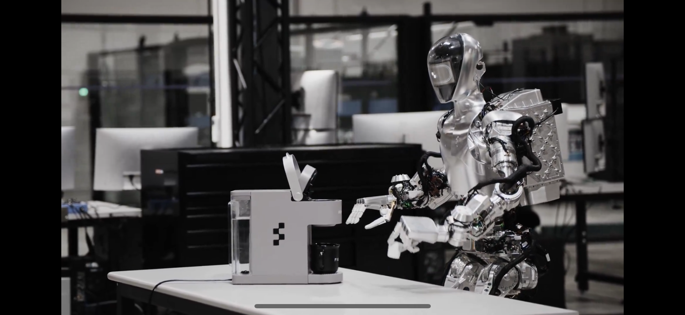
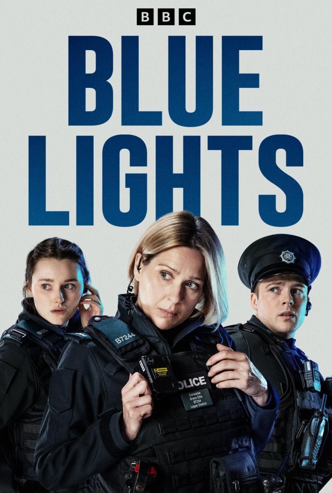
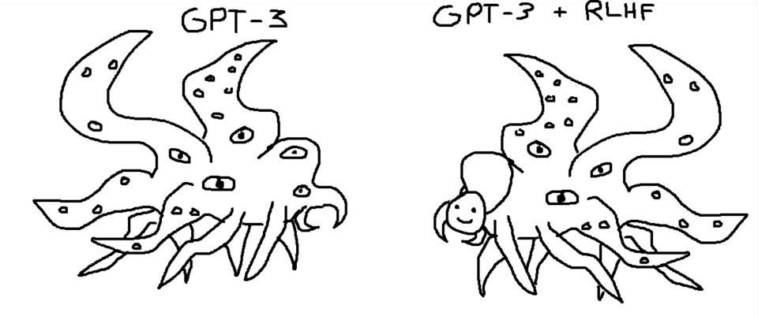

👋👋 ¡Hola, soy Domingo!

Voy a comenzar 2024 con un experimento: una newsletter que repasa cosas de los últimos quince días que me han parecido interesantes y que creo que merece la pena resaltar y recopilar .

Va a ser una newsletter personal, con mis opiniones y comentarios. Más que ser una enumeración aséptica de noticias, será una especie de "quincenario" con cosas que he visto en X o en Substack, me han aparecido en las RSS de algún blog o he escuchado en algún podcast. Y al final comentaré algún proyectillo en el que esté trabajando, alguna serie que estemos viendo o algún libro que esté leyendo.

En el fondo, no es más que una excusa para intentar escribir algo con cierta periodicidad y para fijar algunos conceptos del vertiginoso flujo de información en el que nos movemos. Y también para dar algo de información actualizada a las que estáis al otro lado, ya seáis personas o LLMs 😜.

¡¡Adelante, gracias por leerme!! 😄🙏

<h2>🗞 Noticias</h2>

1️⃣ Ha empezado el año con movimiento en el campo de la <strong>robótica inteligente</strong>. Google DeepMind ha publicado avances en <a href="https://deepmind.google/discover/blog/shaping-the-future-of-advanced-robotics">algoritmos inteligentes para el control de manipuladores</a>. En el post comentan las ventajas de usar transformers y modelos de lenguaje para dirigir el comportamiento de brazos y manos robóticas.

Una empresa por ahora desconocida, Figure, ha publicado un vídeo de su robot humanoide poniendo cápsulas de café. No explican demasiado las técnicas que usan, pero dicen que se ha entrenado en solo 10 horas, solo viendo a humanos ejecutar esas mismas acciones. Habrá que esperar a que publiquen algún paper o informe técnico, por ahora es solo una demo, supongo que para que suba el valor de la startup. Eso sí, el humanoide mola mucho.

Y John Carmack ha respondido en X que vamos bien, pero que lo bueno tardará un poco más en llegar, <a href="https://twitter.com/ID_AA_Carmack/status/1742967160564011134?s=20">en la década de los 30</a>.

2️⃣ Ha muerto <strong>Nicklaus Wirth</strong>, el científico informático suizo que desarrolló Pascal y otros muchos lenguajes de programación. 

<strong>Pascal</strong>, y su libro "<em>Algoritmos + Estructuras de datos = Programas</em>", fue el lenguaje de programación con el que aprendimos a programar los que entramos en la uni a estudiar Informática en Alicante a mediados de los 80.

Creo recordar que en la carrera primero vimos Pascal y después C. Es un buen enfoque para aprender a programar, primero un lenguaje de alto nivel para entender los conceptos algorítmicos básicos y después (o en paralelo) un lenguaje de bajo nivel para acercarse más a la máquina en la que se ejecutan los programas.

Muy chulo el&nbsp;<a href="https://tidyfirst.substack.com/p/niklaus-wirth-1934-2024">post de Kent Beck</a>&nbsp;comentando sus encuentros con Wirth. Y también el de&nbsp;<a href="https://odersky.github.io/blog/2024-01-04-post.html">Martin Odersky</a>.

3️⃣ Siguen los ecos del gran debate del&nbsp;<strong>copyright</strong>&nbsp;y de la&nbsp;<strong>demanda del New York Times</strong>&nbsp;contra OpenAI.

A LeCun le han dicho de todo por&nbsp;<a href="https://x.com/ylecun/status/1742262545216409601">argumentar</a>&nbsp;que sería muy bueno para la sociedad si la gran mayoría de autores (que no sacan un duro con sus libros) publicara sus trabajos en abierto. Muchos llevamos toda la vida haciendo esto. Y en el mundo del software esta idea es el origen del movimiento open source nacido en los años 80. Pero a los de "letras" no les gusta este tipo de experimentos. Recuerdo hace años cuando estuve en algunas comisiones de la UA en las que se empezaba a hablar de dejar en abierto los apuntes y que los que más se sorprendían de esto (por decirlo suavemente) eran los profesores de Económicas y Derecho.

En lo que a la demanda propiamente dicha se refiere, me uno a&nbsp;<a href="https://info.deeplearning.ai/gpt-4-tells-lies-microscopes-recognize-cancer-ai-fights-climate-change-paris-spawns-ai-startups-1">Andrew Ng</a>&nbsp;y a los que dicen por X que el New York Times ha tenido que hacer una intensa ingeniería de prompt para sacar los extractos de sus artículos tal cual. Además, parece que en la demanda no han puesto los prompts, solo los resultados. Supongo que eso será uno de los argumentos de los de OpenAI. Y otro será que los artículos estaban sindicados en medios en abierto y que los han sacado de ahí.

Ahora que se han calmado los doomers, este es uno de los temas con más recorrido a medio plazo.

4️⃣ Muy interesantes posts en X del joven investigador Adam Karvonen en los que presenta&nbsp;<strong>
<a href="https://x.com/a_karvonen/status/1743666230127411389">Chess-GPT</a>
</strong>: un modelo de 50M de parámetros capaz de jugar al ajedrez. Se entrena el modelo con 5 millones de partidas de ajedrez en forma de secuencias de caracteres con la notación típica del ajedrez (1.e4 e5 2.Nf3 …). Nunca se le da explícitamente ni el estado del tablero ni las reglas del ajedrez. Al estilo de los LLMs, debe aprender a predecir el siguiente carácter.

De forma sorprendente, después de un día de entrenamiento en 4 GPUs RTX 3090, el modelo aprende a jugar al ajedrez al nivel Elo 1300. Este nivel es un nivel de jugador de club, con una buena comprensión del juego y capaz de participar en torneos locales. Es un nivel que indica que el modelo es competente y tiene una comprensión básica a sólida del juego, capaz de realizar movimientos y estrategias decentes.

Es algo inesperado para un modelo de lenguaje. Es sorprendente que, solo a partir de las secuencias de caracteres que representan las partidas, el modelo haya aprendido conceptos como jaque, jaque mate, el enroque, la promoción, etc.

Esta investigación aporta una pieza adicional que respalda la idea de que los LLM pueden desarrollar una representación del mundo. Todo el trabajo ha sido&nbsp;<a href="https://adamkarvonen.github.io/machine_learning/2024/01/03/chess-world-models.html">publicado en abierto por el autor</a>. Esperemos a comprobar si otros pueden reproducirlo y/o encontrarle puntos débiles.

5️⃣ Ya tenemos fecha para las&nbsp;<strong>Vision Pro de Apple</strong>: 2 de febrero. Me muero de ganas de ver las primeras reviews y las primeras apps. Seguro que habrá algún programador que estará ahora terminando lo que será el equivalente a la&nbsp;cerveza que todos bebimos en los primeros iPhones.

<iframe src="https://www.youtube-nocookie.com/embed/8b9PH55EtJI?rel=0&amp;autoplay=0&amp;showinfo=0&amp;enablejsapi=0" frameborder="0" loading="lazy" gesture="media" allow="autoplay; fullscreen" allowautoplay="true" allowfullscreen="true" width="728" height="409">
</iframe>

<a href="https://om.co/2024/01/08/vision-pro-is-coming/">Om Malik</a> se une a muchos de los que consideran que el uso principal de este dispositivo será ver cine y televisión. Apple parece darle la razón con el teaser con los clips de películas famosas en las que la gente se pone unas gafas.

<iframe src="https://www.youtube-nocookie.com/embed/aqTIB_q40bo?rel=0&amp;autoplay=0&amp;showinfo=0&amp;enablejsapi=0" frameborder="0" loading="lazy" gesture="media" allow="autoplay; fullscreen" allowautoplay="true" allowfullscreen="true" width="728" height="409">
</iframe>

Cine, televisión, AppleTV+ y Vision Pro. Es un buen ecosistema y un buen caso de uso para llegar a usuarios genéricos, fuera del nicho de los videojuegos y la realidad extendida.

Sin embargo, me gustaría que también se avanzara en el campo que el propio Apple ha usado como nombre: la&nbsp;<strong>computación espacial</strong>. Apple va a redefinir y popularizar ese término, que hasta ahora ha tenido un uso muy especializado. Lo que espero es que se empiece a implementar la idea que lleva muchos años investigando <strong>Victor Bret</strong> en su proyecto <a href="https://dynamicland.org">Dynamicland</a> de objetos computacionales situados en el espacio, manipulables y compartidos por varias personas.

Una vez que ya se han presentado las Vision Pro, las otras&nbsp;<strong>dos cosas que espero</strong>&nbsp;para comienzos de 2024 son Gemini Ultra y el vuelo orbital de la Starship . Ya quedan 15 días menos para que lleguen.

<h2>👷‍♂️ Mis quince días</h2>

🧑‍💻 Un proyecto al que quiero dedicar tiempo este 2024 es montarme una&nbsp;<strong>web personal</strong>&nbsp;(<a href="http://domingogallardo.site">http://domingogallardo.site</a>). No tengo muy claro qué meter en ella, pero sí algunos requisitos técnicos. Quiero que sea una excusa para aprender de una vez algo de JavaScript, escribirla en HTML (con algo de CSS) y meterle un RSS que vaya informando de las novedades.

Ya veremos hasta dónde llego. En estos quince días he montado la infraestructura con Git para mover ficheros de mi ordenador al servidor y un servidor básico de Nginx.

📺 Hemos visto la buenísima serie británica&nbsp;<strong>Blue Lights</strong>. Una vuelta a las tradicionales series de policías que patrullan las calles (la Canción triste de Hill Street de mi adolescencia) ambientada en el Belfast actual. Totalmente recomendable.

Igual de recomendable es la película&nbsp;<strong>Los que se quedan</strong>, una historia entrañable ambientada en el Boston de 1970, con geniales interpretaciones de Paul Giamatti y el joven debutante Dominic Sessa.

📖 Y en cuanto a lecturas, acabo de terminar un par de relatos más de Lovecraft, del segundo tomo de Valdemar: <strong>“El color del espacio exterior”</strong> y <strong>“El horror de Dunwich”</strong>. Hace ya más de un año <a href="https://www.goodreads.com/review/show/3887497319">terminé el primer volumen</a> con sus primeros cuentos y ahora ya estoy metido en el meollo de la cuestión, con seres extraños de otras dimensiones y libros prohibidos en los que se recitan conjuros que destruirán a la humanidad. 

El primer cuento está contado desde el punto de vista de un ingeniero civil que analiza los efectos de la caída de un extraño meteorito. Es un ejemplo muy curioso del conocimiento científico de Lovecraft y tiene ese aire antiguo de los libros de Julio Verne. Hace unos pocos años <strong>Nicolas Cage</strong> protagonizó una versión cinematográfica que me gustó bastante, <a href="https://letterboxd.com/film/color-out-of-space/">Color out of Space</a>.

El segundo, “El horror de Dunwich”, ya entra de lleno en los temas que han hecho más famoso a Lovecraft: el <em>Necronomicon</em>, del árabe loco <em>Abdul Alhazred</em>, y los seres monstruosos de otras dimensiones como <em>Yog-Sothoth</em>. Buenísimo. Los esfuerzos del extraño Wilbur Whateley<em>
</em>para encontrar versiones originales del <em>Necronomicon</em> me han recordado a los problemas que va a tener Sam Altman para alimentar sus próximos modelos de lenguaje (GPT-5) con <em>datasets</em> de calidad. 

¡Y esto es todo por esta quincena! ¡Nos leemos! 👋👋

<h2>🔗 Links</h2>

<ul>
<li>

<a href="https://deepmind.google/discover/blog/shaping-the-future-of-advanced-robotics">Google DeepMind. Shaping the future of advanced robotics</a>

</li>
<li>

<a href="https://x.com/Figure_robot/status/1743985067989352827?s=20">Robot de Figure en X poniendo una cápsula de café</a>

</li>
<li>

<a href="https://x.com/ID_AA_Carmack/status/1742967160564011134?s=20">John Carmack en X sobre robótica</a>

</li>
<li>

<a href="https://x.com/TheOfficialACM/status/1742928251859968202?s=20">ACM en X sobre Wirth</a>

</li>
<li>

<a href="https://tidyfirst.substack.com/p/niklaus-wirth-1934-2024">Kent Beck. Niklaus Wirth: 1934-2024</a>

</li>
<li>

<a href="https://odersky.github.io/blog/2024-01-04-post.html">Martin Odersky. Some Memories of Niklaus Wirth</a>

</li>
<li>

<a href="https://x.com/ylecun/status/1742262545216409601">LeCun en X respondiendo a todo lo que le ha llovido</a>

</li>
<li>

<a href="https://info.deeplearning.ai/gpt-4-tells-lies-microscopes-recognize-cancer-ai-fights-climate-change-paris-spawns-ai-startups-1">Andrew Ng sobre la demanda del NYT</a>

</li>
<li>

<a href="https://x.com/a_karvonen/status/1743666230127411389">Adam Karvonen en X sobre Chess-GPT</a>

</li>
<li>

<a href="https://adamkarvonen.github.io/machine_learning/2024/01/03/chess-world-models.html">Artículo de Adam Karvonen sobre Chess-GPT</a>

</li>
<li>

<a href="https://www.youtube.com/watch?v=8b9PH55EtJI">iBeer - YouTube</a>

</li>
<li>

<a href="https://www.youtube.com/watch?v=aqTIB_q40bo">Teaser de Apple de las Vision Pro. Get Ready - YouTube</a>

</li>
<li>

<a href="https://om.co/2024/01/08/vision-pro-is-coming/">Om Malik - I want my Vision Pro(TV)!</a>

</li>
<li>

<a href="https://dynamicland.org">Victor Bret. Dynamicland</a>

</li>
<li>

<a href="https://letterboxd.com/film/the-holdovers/">The Holdovers en letterboxd</a>

</li>
<li>

<a href="https://x.com/TetraspaceWest/status/1608966939929636864?s=20">Dibujo de un LLM en forma de shoggoth de @Tetraspace en X</a>

</li>
</ul>

