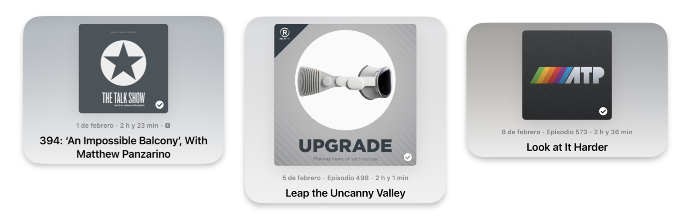
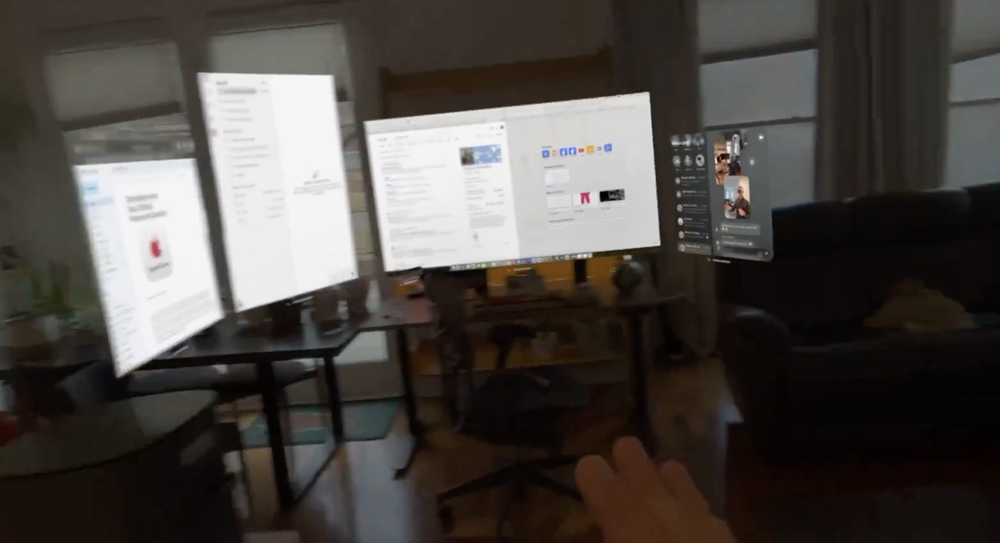
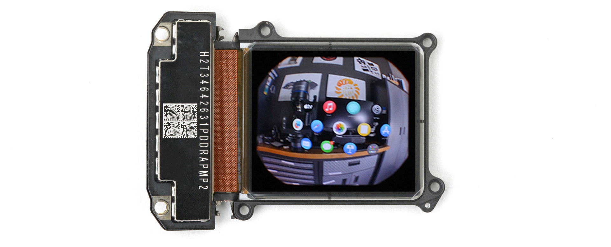
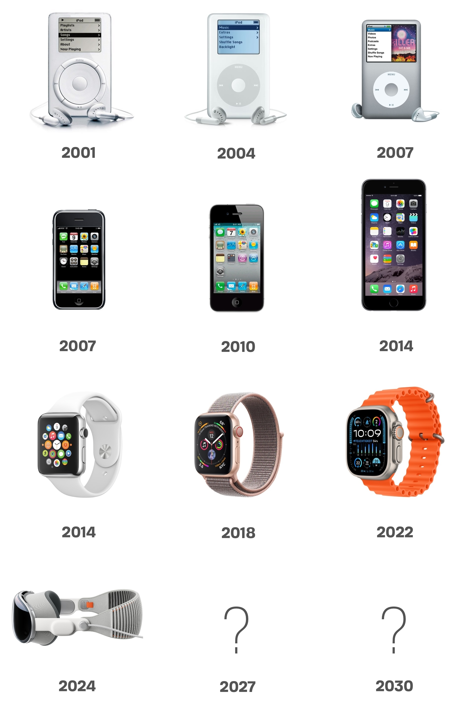
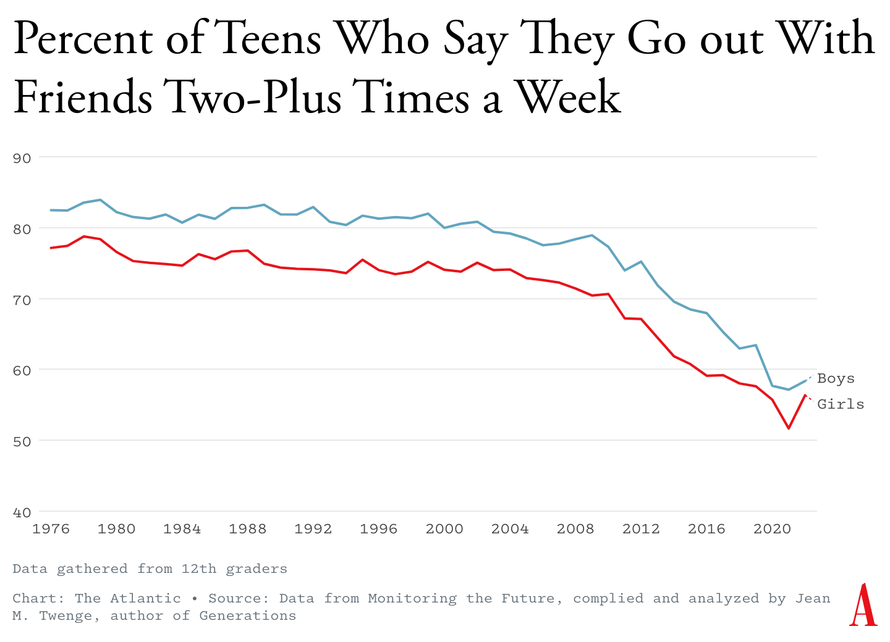

👋👋 ¡Hola, soy Domingo!

En esta quincena del 1 al 15 de febrero he seguido con dos temas que ya he tratado en los <a href="https://domingogallardo.substack.com">números previos de la newsletter</a>: las Vision Pro de Apple y los LLM (modelos grandes de lenguaje). Creo que son dos avances radicales que van a marcar no solo esta década sino todo el siglo XXI, de la misma forma que el cine, la televisión, Internet y el ordenador personal marcaron el siglo XX. ¿O no? Prometo contestarlo en el número 100 de la newsletter 😜.

El futuro ya está aquí.

¡Muchas gracias por leerme!

<h2>🗞 Noticias</h2>

1️⃣ Una cuestión previa: el <strong>género de las Vision Pro</strong>. ¿Femenino o masculino? Es lo que tiene adoptar los neologismos, que tenemos que darles un género. ¿Debemos hablar de "las" (gafas) Vision Pro? ¿O de "el" (visor) Vision Pro? En la web de Apple en castellano, en los pocos sitios en los que está traducida la denominación (por ejemplo en el manual del iPhone 15,&nbsp;<a href="https://support.apple.com/es-es/guide/iphone/iph6e3a6d4fe/17.0/ios/17.0">grabar vídeos espaciales para el Apple Vision Pro con la cámara del iPhone</a>), se habla de "el" Vision Pro. Pero por mucho que lo intente Apple, en la mayoría de noticias y vídeos en castellano se usa el femenino.

Supongo que va a pasar como con "el" (router) WiFi y "la" (red) WiFi. O como "el" computador y "la" computadora. Ambos géneros son aceptados por la RAE. 

Por ahora, yo me quedo con el femenino y voy a hablar de "las" Vision Pro. Aunque también saltaré al masculino, quizás en contextos más técnicos, cuando hable del "visor" de Apple o del "dispositivo" de realidad extendida.

Iremos probando y viendo cómo queda.

2️⃣ En esta quincena he leído y escuchado bastantes <strong>análisis de las Vision Pro</strong>, hechos por personas del mundillo de Apple que sigo habitualmente:

<ul>
<li>

John Gruber (<a href="https://daringfireball.net/2024/01/the_vision_pro">post</a>, <a href="https://podcasts.apple.com/es/podcast/the-talk-show-with-john-gruber/id528458508?i=1000643752350">podcast</a>)

</li>
<li>

Jason Snell (<a href="https://sixcolors.com/post/2024/02/apple-vision-pro-review-eyes-on-the-future/">post</a>, <a href="https://podcasts.apple.com/es/podcast/upgrade/id918152703?i=1000644275852">podcast</a>)

</li>
<li>

Ben Thomson (<a href="https://stratechery.com/2024/the-apple-vision-pro/">post</a>)

</li>
<li>

ATP (Siracusa, Arment y Liss) (<a href="https://podcasts.apple.com/es/podcast/accidental-tech-podcast/id617416468?i=1000644653370">podcast</a>)

</li>
<li>

Tim Urban (<a href="https://waitbutwhy.com/2024/02/vision-pro.html">post</a>)

</li>
</ul>

Tres podcasts que escucho sobre Apple, los tres hablando de las Vision Pro.

Algunas cosas en las que todos están de acuerdo:

<ul>
<li>

Impresionante la estabilidad de las ventanas, que quedan perfectamente ancladas en el mundo real. Puedes levantarte, caminar, mirarlas desde otras perspectivas, volver al sitio inicial y seguir trabajando. No vibran ni se mueven en todo el proceso. 

Una demo de ventanas colocadas por toda la casa.

Incluso las ventanas permanecen en su sitio si las gafas se ponen en reposo y se vuelven a encender. Eso sí, cuando el dispositivo se apaga y se vuelve a encender, se perdido toda la disposición y hay que volver a colocar las ventanas de nuevo. Se supone que Apple lo arreglará en próximas versiones del VisionOS<a class="footnote-anchor" data-component-name="FootnoteAnchorToDOM" id="footnote-anchor-1" href="#footnote-1" target="_self">1</a>.

</li>
<li>

El sistema de seguimento de la mirada es muy fiable. La interacción con los elementos de la interfaz usando la selección con la mirada y los gestos de la mano se siente al principio casi como magia (<strong>Gruber</strong> hace el símil con la imagen de <a href="https://daringfireball.net/2024/02/simple_tricks_and_nonsense">Obi-Wan Kenobi usando la Fuerza</a>) y en muy poco tiempo se hace intuitivo.

Obi-Wan Kenobi usando las Vision Pro.

</li>
<li>

Muy buena la&nbsp;<a href="https://support.apple.com/es-es/HT213971#416">integración de las Vision Pro con el Mac</a>, tanto para crear un monitor externo para el portátil como en el uso del <a href="https://support.apple.com/es-es/102459">Control universal</a> con el que puedes usar el teclado y del trackpad del portátil en cualquiera de las ventanas de las Vision Pro. Al estilo de cuando se usa en el iPad, pero ahora aumentado con el seguimiento de la mirada. Basta con mirar una ventana para que aparezca en ella el cursor que estás controlando con el trackpad y puedas escribir con el teclado.

</li>
<li>

La resolución de las gafas no es suficiente para simular correctamente un monitor externo 4K como el Studio Display, se necesita algo más de resolución. La imagen del monitor, cuando se pone encima de un monitor de verdad, se nota menos nítida y no llega a ser “retina display”. Pero supongo que esto es para esta gente que está acostumbrada a lo mejor de lo mejor. Yo, que llevo toda la vida trabajando con el monitor de 13’’ del portátil, creo que sí me conformaría 😜.

</li>
<li>

Los <a href="https://support.apple.com/ca-es/guide/apple-vision-pro/tanb58c3cfaf/visionos">entornos</a> son espectaculares. Están en 3D y sientes que estás realmente en el lugar fotografiado. Puedes mover la cabeza o girarla 360º y te ves totalmente rodeado por la imagen 3D. Y con la corona digital controlas el nivel de inmersión que tienes. Por ejemplo, puedes ajustar el entorno de forma que veas los elementos más cercanos con los que estás trabajando (el portátil, la taza de café, una libreta, etc.) y cuando levantes la mirada te veas el entorno. 

Uno de los entornos en los que puedes trabajar. Más de uno pagaría 5 ó 10 dólares a National Geographic por cada nuevo entorno.

</li>
<li>

El VisionOS es una versión 1.0, con bugs y bastantes cosas a mejorar. Por ejemplo, la entrada de texto cuando no tienes un portátil o un teclado externo es bastante mala. También faltan formas de gestionar las ventanas, como minimizarlas, reagruparlas o mostrarlas en forma de iconos con algún gesto al estilo del Exposé del Mac.

</li>
</ul>

En general, todos los análisis han sido muy positivos y todo el mundo ha alabado la calidad técnica del producto, tanto del hardware como del software. Es un dispositivo de altísima gama, se notan los 3.000 dólares que cuestan y Apple ha cuidado con mimo todos sus detalles.

3️⃣ Gracias al despiece y <a href="https://www.ifixit.com/News/90409/vision-pro-teardown-part-2-whats-the-display-resolution">artículo de iFixit</a>, ya conocemos más detalles sobre las <strong>pantallas de las Vision Pro</strong>. Se tratan de dos pantallas <a href="https://www.sony-semicon.com/en/products/microdisplay/oled.html">micro-OLED</a> de 2,75 cm de ancho por 2,4 cm. de alto, con 3.660 por 3.200 píxeles. Cada píxel mide 7,5 micras y cada pantalla tiene alrededor de 11.5 millones de píxeles, totalizando entre las dos pantallas los 23 millones de píxeles que dicen las <a href="https://www.apple.com/apple-vision-pro/specs/">especificaciones técnicas de Apple</a>.

Cada pantalla micro-OLED mide 2,75cm. x 2,4 cm.

La densidad de píxeles de la pantalla es impresionante: 3.386 PPI (píxeles por pulgada). Es 7 veces más resolución que el iPhone 15 Pro Max (460 PPI), 3,5 veces más que las HTC Vive Pro (~950 PPI) y 2,8 mas que las Meta Quest 3 (~1218 PPI). 

Pero la medida más importante es cómo se traduce esta densidad de píxeles en píxeles por grado (PPD) en la proyección de las imágenes que vemos en nuestros ojos. Esto es, cuántos pixeles horizontales vemos por cada grado de ángulo de visión proyectado. Apple no ha confirmado el FOV del visor, pero las estimaciones son de unos 100º. Eso hace que las Vision Pro tienen alrededor de 34 PPD. En comparación, un televisor 4K de 65" visto desde 2 metros de distancia tiene 95 PPD promedio, y el iPhone 15 Pro Max sostenido a 30 cm. de distancia tiene 94 PPD promedio. O sea, que todavía hay mucho espacio para la mejora. 

Para conseguir la resolución de 94 PPD Apple tendría que conseguir pantallas de unos 10.000 PPI, para las que también necesitar más potencia computacional. Debería mejorar x3 estos elementos. Es complicado, pero factible en algunos años. En 2020 ya se anunciaba que los <a href="https://spectrum.ieee.org/metasurface-oled-display">laboratorios de Samsung habían conseguido pantallas de 10.000 PPI</a>. Y en cada generación nueva de chips de Apple se aumentan la potencia de sus GPUs. Estas Vision Pro llevan el chip M2, que tiene una GPU de 10 núcleos. Quizás en unos 5 años tengamos lo necesario para conseguir unas gafas con “pantalla retina”<a class="footnote-anchor" data-component-name="FootnoteAnchorToDOM" id="footnote-anchor-2" href="#footnote-2" target="_self">2</a>.

4️⃣ Mención aparte son las <strong>experiencias audiovisuales de las Vision Pro</strong>. Como ya <a href="/posts/del-1-al-15-de-enero-1-de-2024/">mencioné anteriormente</a>, todos los analistas, y<a href="https://www.apple.com/newsroom/2024/01/apple-previews-new-entertainment-experiences-launching-with-apple-vision-pro/"> la propia Apple</a>, resaltan este aspecto. Con las gafas se puede ver un película como si estuvieras realmente en un cine. En la <a href="https://support.apple.com/es-es/guide/apple-vision-pro/tan7241583f5/1.0/visionos/1.0">app de AppleTV</a> puedes elegir el entorno o un cine (y la butaca en la que quieres sentarte). Y en la <a href="https://press.disneyplus.com/news/disney-plus-on-apple-vision-pro-ushers-in-a-new-era-of-storytelling-innovation-and-immersive-entertainment">app de Disney+</a> puedes elegir si quieres ver la película en Tatooine, en la torre de los Vengadores o en un enorme cine clásico.

La app de Disney+ permite elegir el entorno en el que quieres ver la película.

También se pueden ver películas en 3D con total luminosidad. En las películas 3D que vemos en los cines, las gafas están polarizadas y los proyectores emiten una imagen para cada uno de los ojos. Los filtros polarizadores y la separación óptica de la proyección producen una atenuación en la luminosidad de las películas en 3D. Esto no pasa en las Vision Pro, donde la imagen estéreo se forma de la misma forma que se forman el resto de las imágenes, mostrando una imagen ligeramente distinta en cada una de las pantallas del visor. De esta forma, las películas 3D se van a ver como cualquier otro elemento que aparezca en el visor, con toda su luminosidad.

Y, por último, la experiencia más impresionante que destaca todo el mundo son los vídeos immersivos. Unos vídeos grabados con cámaras especiales en donde puedes ver 180º alrededor de ti. Por ejemplo, en una escena estás dentro de una jaula submarina con un tiburón alrededor. La cámara está estática, pero si miras a los lados, a arriba o a abajo ves toda la escena del tiburón moviéndose alrededor de ti. Es como estar totalmente dentro de la escena. 

<iframe src="https://www.youtube-nocookie.com/embed/d555q5vaYns?rel=0&amp;autoplay=0&amp;showinfo=0&amp;enablejsapi=0" frameborder="0" loading="lazy" gesture="media" allow="autoplay; fullscreen" allowautoplay="true" allowfullscreen="true" width="728" height="409">
</iframe>

Otro de los vídeos immersivos es una sesión de 4 minutos de <strong>Alicia Keys</strong> ensayando una canción en un estudio de grabación. Y otro es una secuencia de un partido de fútbol viendo la escena desde la grada posterior a una de las porterías, a la altura del larguero. El delantero chuta, el balón choca en el larguero y puedes escuchar perfectamente, con el audio espacial, el golpe del balón en la madera. 

Imaginaros una retransmisión deportiva, una obra de teatro o un concierto de música con esta tecnología immersiva. Quedan muchas cosas por resolver para que esto sea posible: complejidad de la retransmisión, cámaras especiales, compresión de la señal o ancho de banda. Pero esto va a ser verdaderamente revolucionario.

En su podcast <a href="https://podcasts.apple.com/es/podcast/fuera-de-series/id288039262?i=1000644909479">Fuera de Series</a> CJ Navas comenta que AppleTV+, el servicio de streaming de Apple, se lanza cuando ya se estaba trabajando con las versiones iniciales de las Vision Pro. Desde entonces Apple ha llevado AppleTV+ a unos niveles de calidad y de cantidad que ha sorprendido a todos. ¿Por qué? ¿Sólo para vender más dispositivos AppleTV? ¿O porque sabían que iba a ser un elemento central para el éxito de las Vision Pro? Apple vuelve otra vez a poner en valor su idea de ecosistema. Esta vez con software, hardware y servicios. 

5️⃣ Dejamos para el último punto sobre las Vision Pro las especulaciones sobre la <strong>evolución del visor</strong>. <strong>Javier Lacort</strong> pone en Twitter esta imagen muy chula.

¿Va a triunfar esta nueva categoría? Hemos visto que hay mucho margen de mejora, tanto en las características como en el precio. Un dato a favor es que hay más de un jugador en el partido. Las Vision Pro van a darle un empujón a las Meta Quest 3 y <strong>Zuckerberg</strong> ya <a href="https://www.theverge.com/2024/2/13/24072413/mark-zuckerberg-apple-vision-pro-review-quest-3">ha entrado en la discusión</a>.

¿Cómo podrían ser las Vision Pro de 2030? <strong>Tim Urban</strong> lo describe muy bien al final de su análisis:

<blockquote>

El sistema operativo mejorará cada año. Se añadirán más gestos.

</blockquote>

<blockquote>

Los avatares pasarán a ser indistinguibles de tu cara normal. Podrás identificar objetos para que permanezcan visibles (como una taza de café). Los entornos a tu alrededor se expandirán desde las seis opciones actuales a cientos, incluyendo maravillosos mundos de fantasía, y serán interactivos, permitiéndote cambiar cosas como el clima.

</blockquote>

<blockquote>

El hardware se volverá continuamente más pequeño y más cómodo. La resolución, la tasa de fotogramas y la latencia se volverán más avanzadas.

</blockquote>

<blockquote>

Estrellas del pop tocarán frente a 50,000 personas en persona y 5 millones de personas virtualmente. El fitness se volverá divertido, interactivo y social. La distancia se desvanecerá, permitiendo a las personas pasar tiempo de calidad con sus seres queridos, sin importar dónde estén. Personas que hoy no pueden soñar con viajar por el mundo podrán disfrutar de experiencias vívidas en cualquier parte del globo.

</blockquote>

<blockquote>

Con el tiempo, el precio bajará, con algunas compañías haciendo cascos baratísimos como lo han hecho con los smartphones hoy en día. A medida que la propuesta de valor mejore cada vez más, más personas los tendrán, mejorando el componente social y erradicando cualquier estigma. La adopción masiva parece ser una posibilidad de futuro muy real.

</blockquote>

Si a todas estas reflexiones tecnológicas le sumamos el componente social, con una sociedad cada vez más solitaria y que usa cada vez más la tecnología como medio de interacción (como argumenta <strong>Antonio Ortiz</strong> en su <a href="https://www.error500.net/p/las-vision-pro-de-apple-son-lo-mas">número de Error500</a>) no es difícil imaginar un futuro en el que las gafas (las de Apple junto con las de otras empresas) sean el dispositivo que finalmente va a desplazar el móvil. 

Los adolescentes americanos cada vez salen menos.

Habrá que aprender a vivir con ello de una forma sana. 

6️⃣ Me he extendido muchísimo con las Vision Pro, pero no quiero terminar sin comentar algunas noticas rápidas sobre LLMs. 

<ul>
<li>

Google ha lanzado el esperado <a href="https://blog.google/products/gemini/bard-gemini-advanced-app/">Gemini Ultra 1.0</a>, el modelo en principio competidor de GPT-4. Mi <a href="https://x.com/domingogallardo/status/1755679437184516288?s=20">primera prueba</a> con código no ha sido muy alentadora y sigue ganando GPT-4. Seguiremos haciendo nuevas pruebas y esperando más mejoras.

</li>
<li>

Ha aparecido un paper que me parece muy importante, publicado en arXiv el 7 de febrero: <em>
<a href="https://arxiv.org/abs/2402.04494">Grandmaster-Level Chess Without Search</a>
</em>. Se trata de un trabajo de investigadores de Google Deep Mind, en el que profundizan en una idea similar a la de Chess-GPT que <a href="/posts/del-1-al-15-de-enero-1-de-2024/">ya comentamos</a>. Entrenan un modelo de lenguaje a jugar al ajedrez a partir de partidas existentes. Sólo lo entrenan con las secuencias de las jugadas de las partidas, sin explicitar ni las reglas del ajedrez, ni los tipos de piezas, ni la estructura de los tableros ni de las posiciones. Y para medir el nivel del modelo resultante, le hacen resolver unos acertijos de ajedrez que no están en las partidas de entrenamiento.

De aprender con 10.000 muestras de partidas a aprender con 100.000 muestras, los modelos generados pasan de resolver un 20% de los acertijos a un 60%. Y con 1 millón de partidas los modelos más grandes (de más de 7 millones de parámetros) resuelven más del 80% de los acertijos.

Los resultados son impresionantes. Con 10.000 partidas parece imposible que los modelos aprendan (no llegan a resolver más de un 20% de los acertijos), pero cuando subimos un orden de magnitud el número de partidas los modelos más grandes aprenden rápidamente a generalizar y consiguen superar el 60% de los acertijos. Y cuando elevamos un orden más de magnitud (1 millón de partidas) los modelos más grandes consiguen un nivel de juego de ajedrez de un Elo de 2895. Esta puntuación es comparable o incluso superior a la de los mejores jugadores humanos de todos los tiempos.  
 El trabajo es un ejemplo más de la famosa <a href="https://gwern.net/scaling-hypothesis">hipótesis de escalado</a> o la <a href="http://www.incompleteideas.net/IncIdeas/BitterLesson.html">lección amarga</a> que argumenta que la AGI se podrá obtener con modelos sencillos como los GPT que ya tenemos, haciéndolos más grandes y usando datos de entrenamiento de tamaños ordenes de magnitud mayores.

</li>
<li>

Lo que nos lleva, para terminar, a las conversaciones de <strong>Sam Altman</strong> para conseguir 7 billones (españoles) de dólares para fabricar todos los chips que necesita OpenAI. Una cifra increíble. Por ejemplo, el PIB anual de España es de alrededor de 1,2 billones de euros. Lo comentan en <a href="https://podcasts.apple.com/es/podcast/the-journal/id1469394914?i=1000645367036">el episodio del podcast <em>The Journal</em> del WSJ</a>.

</li>
</ul>

<h2>👷‍♂️ Mis quince días</h2>

<h3>🧑‍💻 Trasteando</h3>

He estado probando la posibilidad que te ofrece OpenAI de <strong>
<a href="https://openai.com/blog/introducing-gpts">construir tu propio GPT</a>
</strong>. El proceso es muy sencillo. A partir de una descripción inicial de lo que quieres conseguir, el propio GPT genera un icono y unas instrucciones iniciales para tu GPT personalizado. Después puedes entrar en una página de configuración en la que puedes ajustar las instrucciones que le das al GPT. Las instrucciones pueden tener hasta 8.000 caracteres y con ellas se puede definir en lenguaje natural cuál debe ser el comportamiento del modelo de lenguaje. 

Un GPT que hemos estado configurando.

A mi, eso de programar agentes inteligentes explicándoles sus directrices en lenguaje natural siempre me ha parecido magia. Cuando leí las famosas <a href="https://www.theverge.com/23599441/microsoft-bing-ai-sydney-secret-rules">directrices secretas de Sydney</a>, que decían cómo debía comportarse Bing, no me lo podía creer. Era una de las primeras veces que, con un truco en el prompt, se obtenía el contexto inicial de un LLM comercial y no tenía claro si Bing estaba realmente mostrando el comienzo de su contexto o estaba alucinando. Pero ahora que vemos que la forma de crear tus propios GPTs es haciendo lo mismo se confirma que sí, que una de las formas de configurar y programar LLMs es dándoles una lista (lo más detallada posible) de directrices a seguir.

En nuestro caso quería ver hasta qué punto funcionaría bien un tutor de la asignatura de programación que impartimos en la UA<a class="footnote-anchor" data-component-name="FootnoteAnchorToDOM" id="footnote-anchor-3" href="#footnote-3" target="_self">3</a>. En la asignatura enseñamos a programar en Scheme/Racket, siguiendo el paradigma de programación funcional, con unas <a href="https://domingogallardo.github.io/apuntes-lpp/practicas/buenas-practicas-programacion-funcional.html">buenas prácticas</a> muy bien definidas. 

Hemos empezado intentando construir un GPT corrector, un asistente al que el estudiante le pueda pasar el código y le explique sus defectos. El código que tenemos hasta ahora, y que estamos probando los compañeros de la asignatura, es el que aparece en la siguiente imagen. 

Directrices del GPT que corrige programas de nuestra asignatura.

Todavía estamos en pruebas, y no tenemos demasiado claro que vayamos a obtener algo funcional. El GPT construido analiza bien los programas, pero no tiene el tono correcto a la hora de contestar. Por ejemplo, en lugar de centrarse en lo que está mal en el programa del estudiante, hace un recorrido una a una de todas las directrices y va diciendo si se cumple o no (incluso a pesar de que hay una directriz que dice que no haga esto). 

Seguimos probando, a ver si damos con las reglas que generen el compromiso de un corrector que acierte pero que no sea demasiado plasta. Esto de programar en lenguaje natural es bastante más complicado que programar en un lenguaje de programación.

<h3>📖 Un libro</h3>

En cuanto a lecturas, <a href="https://www.goodreads.com/review/show/3635986930?book_show_action=false"><em>terminé Vision ciega</em></a>. 

No está mal, es ciencia ficción hard, de la que me gusta. Y además toca el tema de la consciencia de una forma muy original. Pero se me ha hecho algo cuesta arriba lo que yo llamo “estilo cyberpunk”, con esas descripciones que necesito leer dos o tres veces para enterarme de lo que está pasando. Quizás es por la traducción, que es complicada de hacer. Quizás debería haberlo leído en inglés, como ya hice con algún libro como <em>
<a href="https://www.goodreads.com/review/show/2372372898">True Names</a>
</em> de <strong>Vernor Vinge</strong>, exactamente por lo mismo. Pero es que me da pereza estar continuamente con el diccionario.

Por las ideas originales, y por las notas al final del libro (parece una tesis, ¡más de 100 referencias de artículos científicos!) le pongo 4 estrellas (sobre 5).

Y ahora, a decidir qué nuevo libro empiezo.

<h3>📺 Una serie</h3>

Una serie que destaco de las que hemos visto esta quincena: <em>
<strong>
<a href="https://www.imdb.com/title/tt17220216/?ref_=nv_sr_srsg_0_tt_8_nm_0_q_monarch">Monarch</a>
</strong>
</em>, en AppleTV+. Le falta profundidad en la trama de la conspiración, algunas situaciones están algo sacadas de la manga, pero es entretenida, se ven bastantes monstruos y tiene un giro final muy bueno. Un gusto volver a ver a <strong>Kurt Russel</strong>, y muy curioso ver a su hijo haciendo de él de joven. Muy bien también los actores jóvenes y la actriz japonesa <strong>Mari Yamamoto</strong>. 

¡Y esperando con ansia la segunda parte de Dune!

<iframe src="https://www.youtube-nocookie.com/embed/esezQhsrix0?rel=0&amp;autoplay=0&amp;showinfo=0&amp;enablejsapi=0" frameborder="0" loading="lazy" gesture="media" allow="autoplay; fullscreen" allowautoplay="true" allowfullscreen="true" width="728" height="409">
</iframe>

¡Esto es todo por esta quincena! ¡Nos leemos! 👋👋

<a id="footnote-1" href="#footnote-anchor-1" class="footnote-number" contenteditable="false" target="_self">1</a>

Ya que se ponen con eso, podrían también arreglan el problema de la colocación de las ventanas en los escritorios virtuales del Mac. Tengo el mismo problema que los de las Vision Pro y a veces (las pocas veces que tengo que reiniciar el Mac) las ventanas no recuerdan en qué escritorio estaban.

<a id="footnote-2" href="#footnote-anchor-2" class="footnote-number" contenteditable="false" target="_self">2</a>

El iPhone original (2007) tenía una resolución de 163 PPI. En 3 años Apple lanzó el iPhone 4 (2010), con el doble de resolución (326 PPI) y una resolución angular de unos 58 PPD (píxeles por grado). A esta resolución ya la denominó “<a href="https://en.wikipedia.org/wiki/Retina_display">pantalla retina</a>”. Los siguientes saltos en resolución fueron el iPhone 6 Plus (2014) con 401 PPI y 63.3 PPD y el iPhone X (2017) con 458 PPI y 82 PPD. Se ha tardado unos 10 años en triplicar la resolución del iPhone original.

<a id="footnote-3" href="#footnote-anchor-3" class="footnote-number" contenteditable="false" target="_self">3</a>

Se trata sólo de un experimento, por ahora no tenemos intención de hacerlo público. La opción de los GPT personalizados sólo está disponible para usuarios de pago de OpenAI y no sería correcto usar esta opción. En el futuro es seguro que cada vez más docentes pedirán usar estas herramientas y forzarán a los centros educativos a definir una estrategia. O bien pagar a la empresa de turno con algún acuerdo educativo (de la misma forma que se hace en la actualidad con Microsoft o Google para que podamos usar sus herramientas). O bien instalar algún servicio interno con algún LLM opensource, configurable por profesores y personal del centro.

