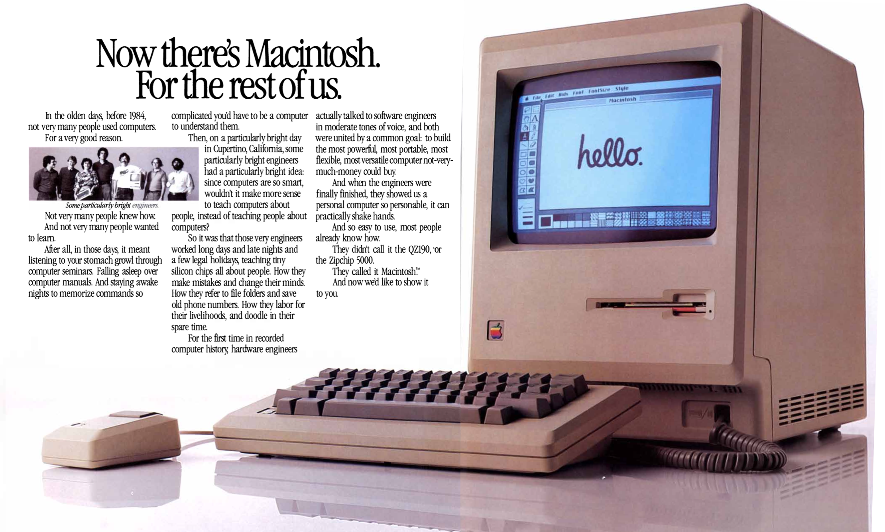
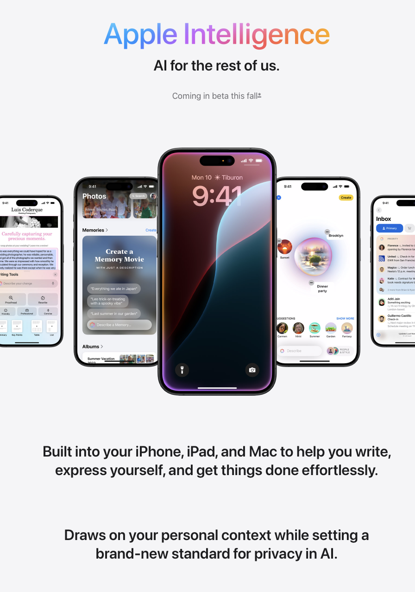
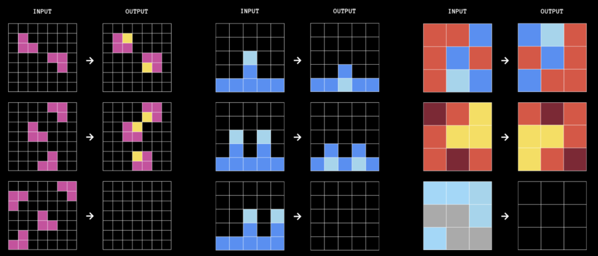

Vamos con lo sucedido en la quincena pasada, del 1 al 15 de junio. Tenemos esta quincena un número muy centrado en Apple y en su conferencia de desarrolladores.

¡Muchas gracias por leerme!

<h2>🗞 Noticias</h2>

1️⃣ En la <a href="/posts/del-16-al-31-de-mayo-10-de-2024/">entrega pasada</a> de la <em>newsletter</em> comentaba que llegaba la <strong>WWDC24</strong> de Apple.

¡Llegó la WWDC24!

El <strong>10 de junio</strong> fue la <em>keynote</em> de la conferencia, y en ella se han presentado las novedades de las nuevas versiones de los sistemas operativos de Apple: iOS 18 (<a href="https://www.apple.com/ios/ios-18-preview/">preview</a> y <a href="https://www.apple.com/newsroom/2024/06/ios-18-makes-iphone-more-personal-capable-and-intelligent-than-ever/">nota de prensa</a>), iPadOS (<a href="https://www.apple.com/ipados/ipados-18-preview/">preview</a> y <a href="https://www.apple.com/newsroom/2024/06/ipados-18-introduces-powerful-intelligence-features-and-apps-for-apple-pencil/">nota de prensa</a>), macOS Sequoia (<a href="https://www.apple.com/macos/macos-sequoia-preview/">preview</a> y <a href="https://www.apple.com/newsroom/2024/06/macos-sequoia-takes-productivity-and-intelligence-on-mac-to-new-heights/">nota de prensa</a>), watchOS 11 (<a href="https://www.apple.com/watchos/watchos-preview/">preview</a> y <a href="https://www.apple.com/newsroom/2024/06/watchos-11-brings-powerful-health-and-fitness-insights/">nota de prensa</a>), visionOS 2 (<a href="https://www.apple.com/newsroom/2024/06/visionos-2-brings-new-spatial-computing-experiences-to-apple-vision-pro/">nota de prensa</a>) y tvOS 18 (<a href="https://www.apple.com/newsroom/2024/06/updates-to-the-home-experience-elevate-entertainment-and-bring-more-convenience/">nota de prensa</a>). Estos sistemas operativos ahora están ya disponibles en versiones beta y se lanzarán en otoño, previsiblemente junto con el lanzamiento de los nuevos iPhone.

Como siempre, lo más interesante de la conferencia han sido los <strong>materiales para los desarrolladores</strong>. Del lunes 10 al viernes 14 se han presentado decenas de vídeos, guías, documentación que ahora hay que revisar si queremos hacer alguna app para alguna de las plataformas de Apple. Me anoto aquí los enlaces, para tenerlos a mano:

<ul>
<li>

<a href="https://developer.apple.com/wwdc24/sessions/">Sesiones</a>: más de 120 vídeos de entre 10 y 30 minutos explicando las novedades introducidas en las distintas plataformas y tecnologías: Swift, Diseño, Computación Espacial, Gráficos, etc.

</li>
<li>

<a href="https://developer.apple.com/news/?id=o38yplz0">Sesiones seleccionadas</a>: una lista curada por Apple con unas 60 sesiones, agrupadas por tecnología.

</li>
<li>

<a href="https://developer.apple.com/whats-new/">Qué hay de nuevo para los desarrolladores</a>: página con información sobre las novedades en todas las plataformas y tecnologías.

</li>
<li>

<a href="https://developer.apple.com/documentation/updates/wwdc2024">Documentación</a>: sección de la documentación con toda la información de nuevas APIs y funcionalidades.

</li>
<li>

<a href="https://developer.apple.com/wwdc24/guides/">Guides</a>: página que centraliza las guías con las novedades de las distintas tecnologías y plataformas.

</li>
<li>

<a href="https://developer.apple.com/pathways/">Pathways</a>: página que centraliza las introducciones paso a paso para comenzar a desarrollar con las distintas tecnologías y plataformas.

</li>
</ul>

Personalmente, lo que más aprecio de la WWDC es que muestra el trabajo realizado por <strong>cientos de ingenieros e ingenieras de Apple</strong> durante un año. Puede ser una deformación profesional de ingeniero programador, o tal vez es la perspectiva de un padre con hijas de veintitantos años que están empezando en sus trabajos, pero cuando veo todos estos materiales, pienso sobre todo en los jóvenes que los han desarrollado, y en <strong>su esfuerzo y sus ilusiones</strong>. 

2️⃣  Una de las noticias que más estaba esperando de la conferencia era el planteamiento de Apple en relación con la IA. También en la <a href="/posts/del-16-al-31-de-mayo-10-de-2024/">entrega pasada</a> hacía una lista de preguntas que esperaba que se contestaran.

Llegaron las respuestas y llegó una cierta confusión. De todos los anuncios, el que tuvo más repercusión fue el que Apple no quería resaltar: <strong>el acuerdo con OpenAI</strong>. El interés de Apple era resaltar su propio trabajo y sus propias funcionalidades, pero el acuerdo con la compañía de <strong>Sam Altman</strong> centró el interés inmediato de los medios y deslució en cierta forma el mensaje principal.

Sin embargo, en los días posteriores, a medida que los medios especializados se han ido haciendo eco de las funcionalidades propuestas por la compañía de la manzana, ha ido calando más la idea de Apple. La jugada magistral del equipo de marketing de la empresa funcionó muy bien, con el juego de palabras de convertir AI (Artificial Intelligence) en <em>
<strong>Apple Intelligence</strong>.</em>

Aquí dejo algunos algunos enlaces.

En español:

<ul>
<li>

Ángel Jiménez de Luis:&nbsp;<a href="https://www.elmundo.es/tecnologia/2024/06/11/6667e37ce85ece95438b45ac.html">Así funciona Apple Intelligence, la IA de Apple</a>

</li>
<li>

Pedro Aznar:&nbsp;<a href="https://www.applesfera.com/apple-1/apple-intelligence-primer-contacto-asombrosa-ia-que-lleva-a-siri-a-otro-nivel">Apple Intelligence, primer contacto</a>

</li>
</ul>

En inglés:

<ul>
<li>

Ben Thomson:&nbsp;<a href="https://stratechery.com/2024/apple-intelligence-is-right-on-time/">Apple Intelligence is Right On Time</a>

</li>
<li>

Jason Snell:&nbsp;<a href="https://sixcolors.com/post/2024/06/ok-fine-heres-apple-intelligence/">OK, fine, here’s Apple Intelligence</a>

</li>
<li>

MacStories:&nbsp;<a href="https://www.macstories.net/news/apple-intelligence-the-macstories-overview/">Apple Intelligence: The MacStories Overview</a>

</li>
<li>

The Verge:&nbsp;<a href="https://www.theverge.com/2024/6/10/24175405/wwdc-apple-ai-news-features-ios-18-macos-15-iphone-ipad-mac">Apple Intelligence: every new AI feature coming to the iPhone and Mac</a>

</li>
<li>

Ars Technica:&nbsp;<a href="https://arstechnica.com/information-technology/2024/06/for-apple-ai-now-stands-for-apple-intelligence-launched-at-wwdc-2024/">Apple unveils “Apple Intelligence” AI features for iOS, iPadOS, and macOS</a>

</li>
</ul>

Y enlaces de la propia Apple:

<ul>
<li>

<a href="https://www.apple.com/newsroom/2024/06/introducing-apple-intelligence-for-iphone-ipad-and-mac/">Introducing Apple Intelligence, the personal intelligence system that puts powerful generative models at the core of iPhone, iPad, and Mac</a> (nota de prensa)

</li>
<li>

<a href="https://www.apple.com/apple-intelligence/">Página web Apple Intelligence</a>

</li>
</ul>

De todas las explicaciones que he visto, la que más me ha gustado es el propio vídeo que ha presentado Apple, "<strong>Apple Intelligence in 5 minutes</strong>":

<iframe src="https://www.youtube-nocookie.com/embed/Q_EYoV1kZWk?rel=0&amp;autoplay=0&amp;showinfo=0&amp;enablejsapi=0" frameborder="0" loading="lazy" gesture="media" allow="autoplay; fullscreen" allowautoplay="true" allowfullscreen="true" width="728" height="409">
</iframe>

Una de las ideas fundamentales de Apple Intelligence es <strong>proporcionar funcionalidades concretas</strong>, promovidas por los modelos generativos desarrollados por la propia empresa (tanto de texto, LLMs, como de imágenes). Apple ha querido así separarse de la idea OpenAI y Microsoft de un agente "de propósito general" que sirve para todo y que obliga al usuario a especificar con un <em>prompt</em> su funcionamiento.

Cuando Apple usa la frase "<strong>AI for the rest of us</strong>" en la web y en los anuncios, está recuperando la campaña original de hace 40 años, con la que introdujo el Macintosh.

"The rest of us" es la gente que no quiere complicaciones, que quiere usar la IA para cosas concretas, sin necesidad de configurar nada ni de escribir <em>prompts</em> avanzados. Todas las funcionalidades están basadas en modelos generativos, pero todo el trabajo de configurar el <em>prompt</em> y comunicarse con el modelo está escondido o se limita a lo mínimo. Nosotros solo tenemos que seleccionar ciertas opciones de una forma intuitiva, como cuando usamos cualquier otra aplicación que no sea de IA. Y en el caso en que haya que escribir algún <em>prompt</em>, como para generar una imagen, es el mínimo posible.

Este es un enfoque clave de Apple: buscar funcionalidades concretas que pueda hacer el modelo generativo y que sean útiles para los usuarios normales ("the rest of us"). 

El otro punto clave del enfoque de Apple es aprovecharse de que tiene acceso a toda nuestra información y apps en nuestro móvil para dar los primeros pasos hacia la conversión de Siri en un <strong>asistente personal</strong>, que consulta nuestra agenda, nuestros correos y mensajes y que puede <strong>interactuar con nuestras apps</strong> por nosotros. Por ahora no han ido demasiado lejos y han puesto un ejemplo muy sencillo: buscar la hora a la que llega el vuelo de mamá. Está muy bien para empezar y, conforme las apps vayan ofreciendo más opciones, veremos ejemplos más complejos y avanzados (si el LLM que hay en el dispositivo, que da soporte a Siri, es capaz de gestionarlos correctamente).

Termino detallando las <strong>funcionalidades concretas</strong> que Apple presenta en el vídeo anterior, con los nombres que el equipo de marketing ha creado para ellas:

<ul>
<li>

Writing Tools

</li>
<li>

Genmoji

</li>
<li>

Image Playground

</li>
<li>

Image Wand

</li>
<li>

Siri - Natural Language

</li>
<li>

Personal Content

</li>
<li>

Priority Notifications

</li>
<li>

Memory Movie

</li>
</ul>

Hay algunas funcionalidades más, que no se muestran en el vídeo, como las relacionadas con iPhoto y con el retoque fotográfico. Y Apple irá también mejorando todas estas funcionalidades y añadiendo más en los próximos años. Iremos revisándolas poco a poco, y dando algunos detalles técnicos.

Si algo ha quedado claro en esta WWDC es que Apple no se va a quedar atrás del resto de la industria y también se va a subir al barco de la IA. Aunque para Apple sea “Inteligencia Apple” y no “Inteligencia Artificial”.

3️⃣ El <strong>11 de junio</strong>, <strong>François Chollet</strong> (<a href="https://fchollet.com">fchollet.com</a>), conocido investigador de Machine Learning y autor del estupendo libro <a href="https://www.manning.com/books/deep-learning-with-python-second-edition">Deep Learning with Python</a>, presentó el premio ARC Price (<a href="https://arcprize.org">arcprice.org</a> y <a href="https://x.com/arcprize">X</a>), organizado junto a <strong>Mike Knoop</strong> (<a href="https://mikeknoop.com">mikeknoop.com</a>). Se trata de una competición con un premio de un millón de dólares por resolver un problema con el que, hasta ahora, los LLMs han chocado. Es muy interesante la entrevista del <strong>podcast de Dwarkesh</strong> en la que Chollet y Knoop presentan el premio.

<iframe class="apple-podcast " data-attrs="{&quot;url&quot;:&quot;https://embed.podcasts.apple.com/es/podcast/dwarkesh-podcast/id1516093381?i=1000658672649&quot;,&quot;isEpisode&quot;:true,&quot;imageUrl&quot;:&quot;podcast-episode_1000658672649.jpg&quot;,&quot;title&quot;-&quot;Francois Chollet, Mike Knoop - LLMs won’t lead to AGI - $1,000,000 Prize to find true solution&quot;,&quot;podcastTitle&quot;:&quot;Dwarkesh Podcast&quot;,&quot;podcastByline&quot;:&quot;&quot;,&quot;duration&quot;:5633000,&quot;numEpisodes&quot;:&quot;&quot;,&quot;targetUrl&quot;:&quot;https://podcasts.apple.com/es/podcast/francois-chollet-mike-knoop-llms-wont-lead-to-agi-%241/id1516093381?i=1000658672649&amp;uo=4&quot;,&quot;releaseDate&quot;:&quot;2024-06-11T17:03:59Z&quot;}" src="https://embed.podcasts.apple.com/es/podcast/dwarkesh-podcast/id1516093381?i=1000658672649" frameborder="0" allow="autoplay *; encrypted-media *;" allowfullscreen="true">
</iframe>

El problema original ARC (Abstraction Reasoning Corpus) fue propuesto por el propio Chollet en un artículo de 2019 (<a href="https://arxiv.org/abs/1911.01547">On the Measure of Intelligence - arxiv.org</a>) como una forma de medir la inteligencia general. Se trata de encontrar patrones en parejas de figuras que permitan adivinar cuál va a ser la siguiente figura.

En la siguiente ilustración se presenta un ejemplo de las figuras que se usan en el test. Se dibujan sobre una cuadrícula y existe un patrón que relaciona la figura de entrada (INPUT) con la de salida (OUTPUT). El test consiste en encontrar el patrón de forma que podamos resolver cual será la figura de salida.

Ejemplo de figuras en el test ARC. ¿Puedes identificar el patrón y adivinar cuál es la siguiente figura?

¿Encuentras el patrón de los tres ejemplos? ¿Cuál sería la figura resultante?

No es complicado para los humanos, que pueden resolver fácilmente el 85% de las tareas. Sin embargo, los mejores sistemas de IA no pasan del 34%.

En este caso las soluciones son las siguientes:

<ul>
<li>

En las parejas de la izquierda el patrón es: “rellenar el hueco de los cuadrados morados con una casilla amarilla”. La solución sería cuatro cuadrados de casillas moradas, con casillas amarillas en las esquinas correspondientes.

</li>
<li>

En las parejas del centro podríamos expresar el patrón como: “mover las casillas azules claras que están sobre las oscuras hasta la línea inferior”. La solución sería una figura con una fila inferior de casillas azules oscuras, menos la casilla 3 y la última que serían claras. Y sobre cada una de ellas habría una casilla azul oscura.

</li>
<li>

En las parejas de la derecha el patrón se podría expresar como: “gira la figura 180 grados”. La solución sería una figura con la primera fila gris-gris-azul, la segunda fila azul-gris-gris y la última azul-azul-azul.

</li>
</ul>

La competición está alojada en Kaggle (<a href="https://www.kaggle.com/competitions/arc-prize-2024/">ARC Prize 2024 - kaggle.org</a>) y se llevará el premio aquel equipo que consiga desarrollar un sistema de IA que iguale a los humanos, y que obtenga un 85% de aciertos. La fecha límite para los envíos es el 11 de noviembre. Ya hay casi 150 equipos inscritos enviando algoritmos (<a href="https://www.kaggle.com/competitions/arc-prize-2024/leaderboard">Leaderboard - kaggle.com</a>) y por ahora el mejor equipo tiene un acierto del 38%.

¿Alguien lo solucionará este año? ¿Quedará el premio desierto? ¿Estaremos más cerca de la AGI a final de año? Lo podremos comprobar dentro de unos meses.

4️⃣ <strong>Swift</strong> es mi lenguaje de programación preferido. Es un lenguaje moderno, seguro, multiparadigma, expresivo y eficiente. Ahora, en <strong>junio de 2024</strong>, acaba de <strong>cumplir 10 años y se presenta su versión 6</strong>. Ha llovido ya mucho desde que lo presentó Chris Lattner, su principal creador, el 2 de junio de 2014, en la WWDC14.

<iframe src="https://www.youtube-nocookie.com/embed/G4rDwr03VRQ?rel=0&amp;autoplay=0&amp;showinfo=0&amp;enablejsapi=0" frameborder="0" loading="lazy" gesture="media" allow="autoplay; fullscreen" allowautoplay="true" allowfullscreen="true" width="728" height="409">
</iframe>

Al año siguiente, a finales del 2015, <strong>decidimos incluirlo en nuestra asignatura</strong> de segundo curso de Ingeniería Informática, <a href="https://moodle2023-24.ua.es/moodle/course/view.php?id=7310">Lenguajes y Paradigmas de Programación</a>, en sustitución del lenguaje de programación Scala, que nos servía para explicar cómo es un lenguaje moderno que integra el paradigma de Programación funcional y el paradigma Orientado a Objetos. Swift había sido creado desde el principio con esa idea, integrando conceptos propios de lenguajes funcionales, como Haskell, y de lenguajes orientados a objetos como C# o Objective C. Además, comprobamos que Apple había mantenido la promesa de Lattner de que el lenguaje fuera abierto y que existía un compilador para Linux que funcionaba perfectamente, por lo que no habría problema en plantear las prácticas de la asignatura.

En pocos años Swift fue evolucionando y pasando por distintas versiones (<a href="https://en.wikipedia.org/wiki/Swift_(programming_language)#History">Swift History - wikipedia.org</a>). A partir de la versión 4, en 2017, el lenguaje se consolidó y su sintaxis básica no cambió demasiado. En los últimos años se han ido incluyendo continuas mejoras a través del proceso de <a href="https://www.swift.org/swift-evolution/">Swift Evolution</a>. Cualquier cambio se propone mediante una propuesta que se publica en un <a href="https://forums.swift.org/c/evolution/18">foro público</a>, se discute, se modifica y se termina aceptando o rechazando. Las propuestas aceptadas se añaden en la lista de propuestas aprobadas (<a href="https://github.com/swiftlang/swift-evolution/tree/main/proposals">swift-evolution - github.com</a>) y se añade la implementación del cambio en el compilador (<a href="https://github.com/apple/swift">swift - github.com</a>), dejándola lista para la nueva versión.

La versión 5 del lenguaje fue lanzada en 2019 y desde entonces han habido muchos cambios en versiones menores. Con la regularidad de un reloj, se han lanzado dos versiones menores por año: <a href="https://www.swift.org/blog/swift-5-released/">5.0</a> y <a href="https://www.swift.org/blog/swift-5.1-released/">5.1</a> en 2019, <a href="https://www.swift.org/blog/swift-5.2-released/">5.2</a> y <a href="https://www.swift.org/blog/swift-5.3-released/">5.3</a> en 2020, <a href="https://www.swift.org/blog/swift-5.4-released/">5.4</a> y <a href="https://www.swift.org/blog/swift-5.5-released/">5.5</a> en 2021, <a href="https://www.swift.org/blog/swift-5.6-released/">5.6</a> y <a href="https://www.swift.org/blog/swift-5.7-released/">5.7</a> en 2022, <a href="https://www.swift.org/blog/swift-5.8-released/">5.8</a> y <a href="https://www.swift.org/blog/swift-5.9-released/">5.9</a> en 2023. Este año se ha lanzado la versión <a href="https://www.swift.org/blog/swift-5.10-released/">5.10</a> y en la WWDC se ha presentado la versión 6 de Swift (<a href="https://developer.apple.com/wwdc24/10136">WWDC24: What’s new in Swift - apple.com</a>), que se lanzará en septiembre.

El podcast ATP hizo un programa especial muy interesante el 12 de junio, entrevistando a dos ingenieros de Apple responsables del lenguaje y de su evolución: <strong>Holly Borla</strong> y <strong>Ben Cohen</strong>.

<iframe class="apple-podcast " data-attrs="{&quot;url&quot;:&quot;https://embed.podcasts.apple.com/es/podcast/accidental-tech-podcast/id617416468?i=1000658803903&quot;,&quot;isEpisode&quot;:true,&quot;imageUrl&quot;:&quot;podcast-episode_1000658803903.jpg&quot;,&quot;title&quot;-&quot;ATP Interview: Holly Borla &amp; Ben Cohen&quot;,&quot;podcastTitle&quot;:&quot;Accidental Tech Podcast&quot;,&quot;podcastByline&quot;:&quot;&quot;,&quot;duration&quot;:3608000,&quot;numEpisodes&quot;:&quot;&quot;,&quot;targetUrl&quot;:&quot;https://podcasts.apple.com/es/podcast/atp-interview-holly-borla-ben-cohen/id617416468?i=1000658803903&amp;uo=4&quot;,&quot;releaseDate&quot;:&quot;2024-06-12T16:45:16Z&quot;}" src="https://embed.podcasts.apple.com/es/podcast/accidental-tech-podcast/id617416468?i=1000658803903" frameborder="0" allow="autoplay *; encrypted-media *;" allowfullscreen="true">
</iframe>

En la actualidad, Swift es un lenguaje muy amplio y complejo, que permite desde <a href="https://docs.swift.org/swift-book/documentation/the-swift-programming-language/concurrency/">programación concurrente</a> usando actores hasta programación de <a href="https://www.swift.org/blog/embedded-swift-examples/">microprocesadores de muy bajo nivel</a>. Pero también es un lenguaje que permite un aprendizaje progresivo. Es muy fácil empezar a aprenderlo y, de hecho, se podría perfectamente usar como primer lenguaje de un curso de introducción a la programación. Toda la documentación necesaria está en el documento <a href="https://docs.swift.org/swift-book/documentation/the-swift-programming-language/">The Swift Programming Language</a>, empezando por el tutorial <a href="https://docs.swift.org/swift-book/documentation/the-swift-programming-language/guidedtour">A Swift Tour</a>.

<h2>👷‍♂️Mis quince días</h2>

Ya tengo el dominio <a href="http://www.domingogallardo.com">domingogallardo.com</a>, pero no hay nada en él, solo un servidor de nginx. Prometo empezar a montar la web en septiembre.

<h3>🍿Cine</h3>

En cuanto estrenaron en Netfilx <strong>Godzilla Minus One</strong> (<a href="https://letterboxd.com/film/godzilla-minus-one/">letterboxd</a>) nos la pusimos, en el viernes de cine.

Pedazo de cartel de Godzilla Minus One.

Tenía las expectativas muy altas, y me decepcionó un poco. Esperaba una película un poco más profunda, con temas algo más serios. Había leído que exploraba el paralelismo entre Godzilla y las bombas atómicas lanzadas sobre Japón, pero no he visto mucho de eso; me ha parecido otra película de Godzilla, algo militarista y sin muchas más pretensiones. Eso sí, muy bien la ambientación del Japón de la postguerra y excelentes los efectos especiales. 

Me ha gustado bastante y me ha dejado con ganas de ver la siguiente. Parece que el director, <strong>Takashi Yamazaki</strong>, quiere continuar la saga.

<h3>📺 TV</h3>

Destaco dos series que hemos visto esta quincena: <strong>Muertos S.L.</strong> (<a href="https://www.filmaffinity.com/es/film455537.html">filmaffinity</a>), en Movistar+, y la tercera temporada de <strong>The Morning Show</strong> (<a href="https://www.filmaffinity.com/es/film474882.html">filmaffinity</a>), en AppleTV+.

Debo ser de los pocos españoles que no han visto nada de los <strong>hermanos Caballero</strong>. No he visto ni <strong>Aquí no hay quien viva</strong>, ni <strong>La que se avecina</strong>, ni <strong>Machos alfa</strong>. Pero hemos probado con esta, y nos lo hemos pasado muy bien. Aunque alguna vez se pasan un poco con el humor negro, la mayoría de las veces hemos soltado una carcajada.

Estupendos actores y actrices, con personajes hilarantes y reconocibles desde el minuto uno. Todos están geniales y, junto con guiones muy entretenidos, la convierten en la comedia con la que más me he reído últimamente.

Y también me ha gustado un montón la última temporada (temporada 3) de <strong>The Morning Show</strong>. Me ha parecido la mejor temporada y va ganando episodio a episodio, hasta la traca final.

También excelentes todas las actrices y actores. Me encanta <strong>Billy Crudup</strong>, que lleva a registros desconocidos el papel de Cory Ellison y también <strong>Greta Lee</strong>, que llena de matices el personaje de Stella Bak.

<h3>📖 Libros</h3>

Terminé <em>
<strong>El bosque oscuro</strong>
</em> de la trilogía de Liu Cixin. Ya lo leí hace algunos años, y lo he vuelto a leer por la serie de Netflix. Me ha vuelto a gustar mucho, especialmente las ideas y especulaciones de ciencia. Eso sí, los personajes y las relaciones entre ellos son estereotipadas y anticuadas; parece un libro escrito en la década de los 50. Pero bueno, compensa la parte científica y la intriga del argumento. Tiene ideas y escenas súper originales, que va a ser una pasada verlas en televisión. Estoy deseando ver “la gota”.

Dibujo de DALL-E de “la gota” de <em>El bosque oscuro</em>.

Por ahora he dejado la trilogía. Volveré a ella cuando se acerque la nueva temporada de la serie de Netflix. Me queda el último libro, que también leí hace tiempo y que fue el que más me gustó (le di <a href="https://www.goodreads.com/review/show/2446313276">5 estrellas en goodreads</a>).

El libro que he empezado a leer es la continuación de Dune, <em>
<strong>El mesias de Dune</strong>
</em>, de Frank Herbert. Han pasado doce años desde el final de Dune y Paul Atreides ha consolidado su poder como Emperador y ha extendido su jihad a través de la galaxia. 

Llevo un par de capítulos y muy bien. A ver si en la próxima entrega lo he terminado.

¡Hasta la próxima quincena, nos leemos! 👋👋

