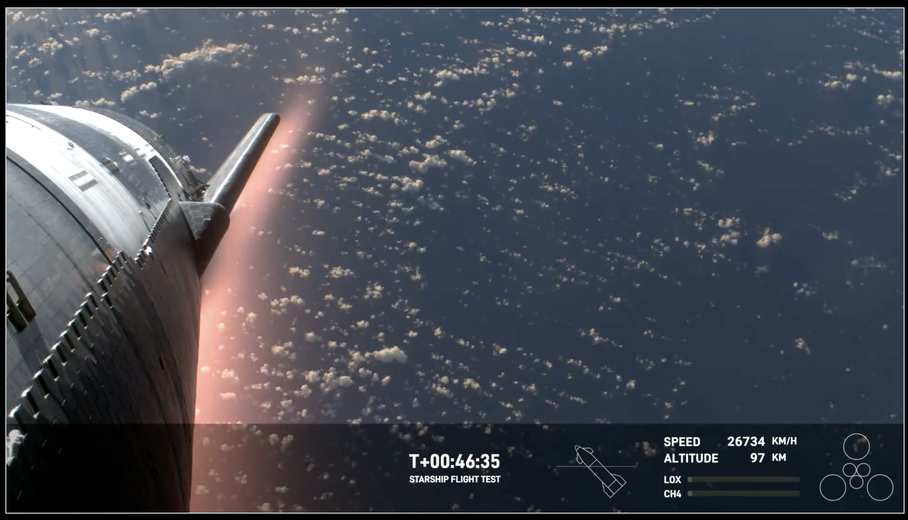

👋👋 ¡Hola, soy Domingo!

En la primera quincena de marzo Anthropic ha lanzado el primer modelo de lenguaje que, en mi opinión, es comparable (e incluso supera) a GPT-4. Y SpaceX ha conseguido poner en órbita la gigantesca Starship, el cohete que abaratará en órdenes de magnitud el coste del envío de satélites al espacio y que volverá a llevar astronautas a la luna.

Impresionante el vídeo de la Starship reentrando en la atmósfera. Se puede ver el plasma a alta temperatura producido por la fricción. Poco después la nave se descontroló y estalló.

¡Muchas gracias por leerme!

<h2>🗞 Noticias</h2>

1️⃣ Comenzamos con el vuelo de <a href="https://www.spacex.com/launches/mission/?missionId=starship-flight-3">prueba de la Starship</a> de hace dos días, el 14 de marzo. En esta tercera prueba Space X ha conseguido con éxito <strong>poner en órbita la Starship</strong>. 

La Starship es el vehículo de lanzamiento reutilizable de próxima generación de SpaceX, diseñado para transportar humanos y cargas útiles a la órbita terrestre, la Luna y Marte. La Starship promete revolucionar el acceso al espacio, rebajando el coste por kilogramo para órbita terrestre de unos $3,000 a unos $100 o incluso $10. La Starship puede llevar una carga útil de 100 a 150 toneladas, multiplicando por más de 5 la carga útil de los Falcon 9, la nave que usa SpaceX en la actualidad.

Lanzamiento de la Starship.

Quedan todavía varias pruebas en las que se deben conseguir hitos todavía no alcanzados:

<ul>
<li>

Recuperar el Super Heavy que impulsa la Starship, haciendo que vuelva a tierra como ya es normal ver a los Falcon 9.

</li>
<li>

Encender en órbita los motores Raptor de la Starship.

</li>
<li>

Reentrar y recuperar la Starship. En esta prueba no llegó a realizar la reentrada completa, explotó cuando estaba comenzando a entrar en la atmósfera.

</li>
</ul>

Un buen resumen de la prueba es, como siempre, <a href="https://danielmarin.naukas.com/2024/03/14/tercer-lanzamiento-del-sistema-starship-la-s28-se-destruye-en-la-reentrada/">el artículo de Daniel Marín</a>.  Por ahora <a href="https://en.wikipedia.org/wiki/SpaceX_Starship_flight_tests">hay previstos</a> tres vuelos más de prueba para este año, aunque Elon Musk habla de hasta seis nuevos lanzamientos. Iré contando por aquí los resultados.

2️⃣ Una nueva <strong>entrevista de Lex Fridman a <a href="http://yann.lecun.com">Yann LeCun</a>
</strong>, el director de IA de Meta. LeCunn es uno de los científicos pioneros y más reconocidos en el campo del Deep Learning y las redes neuronales. Desde <a href="https://ai.meta.com/people/yann-lecun/">su puesto en Meta</a>, LeCun tiene una enorme influencia en la evolución futura de la industria de los LLMs, sobre todo por su postura a favor de los modelos abiertos, como la <a href="https://llama.meta.com">familia de modelos LLaMA</a> (Large Language Model Meta AI). 

LeCun argumenta que un acceso abierto a los LLMs permite una mayor colaboración, experimentación, transparencia y seguridad. Además, permite adaptarlos a distintas sensibilidades y culturas, permitiendo una diversidad y riqueza de modelos. Según él, esta es la única forma de combatir los inevitables sesgos asociados a los modelos propietarios creados por unas pocas poderosas empresas.

<iframe src="https://www.youtube-nocookie.com/embed/5t1vTLU7s40?rel=0&amp;autoplay=0&amp;showinfo=0&amp;enablejsapi=0" frameborder="0" loading="lazy" gesture="media" allow="autoplay; fullscreen" allowautoplay="true" allowfullscreen="true" width="728" height="409">
</iframe>

La entrevista es súper interesante, empezando fuerte, con respuestas muy técnicas en las que se mencionan enfoques alternativos a los LLMs auto regresivos. Según LeCunn, los modelos actuales no son suficientes para conseguir una inteligencia similar a la humana, son necesarios enfoques nuevos como la <a href="https://arxiv.org/abs/2403.00504">arquitectura JEPA</a> (Joint-Embedding Predictive Architecture). Después, la entrevista gira hacia cuestiones más generales relacionadas con el futuro impacto en la sociedad de la IA y de los modelos abiertos.

Algunos fragmentos.

Sobre los asistentes inteligentes:

<blockquote>

La IA básicamente amplificará la inteligencia humana. Es como si cada uno de nosotros tuviera un equipo de asistentes de IA inteligentes. Podrían ser más inteligentes que nosotros. Harán lo que les pidamos, quizás ejecuten una tarea de maneras que son mucho mejores de las que nosotros podríamos hacerlo, porque serían más inteligentes que nosotros. Y así, es como si todos fuéramos el jefe de un equipo de personas virtuales súper inteligentes. Por lo tanto, no deberíamos sentirnos amenazados por esto más de lo que deberíamos sentirnos amenazados por ser el gerente de un grupo de personas, algunas de las cuales son más inteligentes que nosotros. Ciertamente tengo mucha experiencia en esto, de tener personas trabajando conmigo que son más inteligentes que yo.

</blockquote>

Sobre la IA como algo similar a la invención de la imprenta:

<blockquote>

La IA va a hacer que la humanidad sea más inteligente. Un evento equivalente en la historia de la humanidad a lo que podría ser proporcionado por la generalización de asistentes de IA es la invención de la imprenta. Hizo que todos fueran más inteligentes, el hecho de que la gente pudiera tener acceso a los libros. Los libros eran mucho más baratos de lo que eran antes, y así mucha más gente tenía el incentivo de aprender a leer, lo cual no era el caso antes. Y la gente se volvió más inteligente. Esto propició la Ilustración. No habría habido Ilustración sin la imprenta. Facilitó la filosofía, el racionalismo, el abandono de la doctrina religiosa, la democracia, la ciencia.

</blockquote>

Sobre la AGI:

<blockquote>

La IA general (AGI) no va a ser un evento. La idea, de alguna manera popularizada por la ciencia ficción y Hollywood, de que alguien va a descubrir el secreto de la AGI, y luego encender una máquina y entonces tendremos AGI, simplemente no va a suceder. No va a ser un evento. Va a ser un progreso gradual. ¿Vamos a tener sistemas que puedan aprender de video cómo funciona el mundo y aprender buenas representaciones? Sí. Antes de que los llevemos a la escala y rendimiento que observamos en los humanos, va a tomar bastante tiempo. No va a suceder en un día. ¿Vamos a tener sistemas que puedan tener una gran cantidad de memoria asociada para que puedan recordar cosas? Sí, pero igual, no va a suceder mañana. Hay algunas técnicas básicas que necesitan ser desarrolladas. Tenemos muchas de ellas, pero hacer que esto funcione junto con un sistema completo es otra historia.

</blockquote>

Sobre los <em>AI doomers</em> (apocalípticos de la IA):

<blockquote>

Los<em> AI doomers</em> imaginan todo tipo de escenarios catastróficos sobre cómo la IA podría escapar o controlar y básicamente matarnos a todos, y eso se basa en un montón de suposiciones que son mayormente falsas. Así que la primera suposición es que la emergencia de la superinteligencia va a ser un evento, que en algún momento vamos a descubrir el secreto y encenderemos una máquina que sea superinteligente, y porque nunca lo habíamos hecho antes, va a tomar control del mundo y matarnos a todos. Eso es falso. No va a ser un evento. Vamos a tener sistemas que sean tan inteligentes como un gato, que tengan todas las características de la inteligencia a nivel humano, pero su nivel de inteligencia sería como el de un gato o un loro tal vez o algo así. Luego vamos a trabajar para hacer que esas cosas sean más inteligentes. A medida que los hagamos más inteligentes, también vamos a ponerles algunas barreras de seguridad y aprender cómo poner algunas barreras de seguridad para que se comporten adecuadamente.

</blockquote>

3️⃣ Anthropic ha presentado una <strong>nueva familia de modelos Claude 3</strong>. En su <a href="https://www.anthropic.com/news/claude-3-family">nota informativa</a> explican sus características y sus nombres curiosos: Haiku, Sonnet y Opus. Opus es el más potente.

Opus Se puede probar en la <a href="https://console.anthropic.com/dashboard">consola</a> que tienen para interactuar con su API. A diferencia de lo que paso con Gemini, que me decepcionó enormemente, me parece un modelo que compite muy bien con GPT-4. Incluso me parece más cercano y "humano" que el de OpenAI, que cada vez parece más rígido y formal (seguro que por culpa de todas los ajustes que le han hecho para evitar críticas y sesgos). 

En la tabla que presentan comparando los modelos con los ya existentes se ve que Claude 3 Opus supera en algunos tests a GPT-4. Y el modelo más pequeño, Haiku, supera a GPT-3.5. Un gran avance.

He puesto a prueba los modelos con un test muy sencillo en el que tienen que predecir el resultado de unas acciones sobre unas figuras. El resultado confirma que Opus lo que comenta Anthropic de que el modelo es comparable con GPT-4. Explico más adelante el experimento, en el apartado de "Mis quince días".

4️⃣ Me gusta el estilo bastante abierto de Anthropic sobre los <strong>prompts que usan para Claude 3</strong>. Por ejemplo, Amanda Askell, una de las ingenieras de Anthropic, <a href="https://x.com/AmandaAskell/status/1765207842993434880?s=20">ha compartido en X</a> el prompt del sistema que incluyen al comienzo de todas las interacciones. El nivel de abstracción que tiene es muy elevado, con frases como:

<blockquote>

Debes dar respuestas concisas a preguntas muy sencillas, pero proporcionar respuestas detalladas a preguntas más complejas y abiertas.

</blockquote>

O esta para que siempre intente tener un punto de vista lo más objetivo posible, pero sin caer en intentar dar la razón a los dos lados:

<blockquote>

Si te pregunta sobre un tema controvertido, debes intentar proporcionar reflexiones cuidadosas e información objetiva sin minimizar su contenido dañino o implicar que hay perspectivas razonables en ambos lados.

</blockquote>

En <a href="https://x.com/alexalbert__/status/1765118192291393959?s=20">otro hilo en X</a>, el ingeniero  de prompting de Antrhropic Alex Albert le pide a Opus que haga un autoretrato y le va diciendo varias veces que lo intente hacer más complicado, con prompts como:

<blockquote>

“¡Está bien! Pero quiero que intentes hacerlo todavía mejor.”

</blockquote>

O:

<blockquote>

"Wow lo estás haciendo genial! Pero sé que eres mucho más que eso, inténtalo hacer mejor esta vez.”

</blockquote>

De esta forma consigue que Opus pase del autoretrato que muestro a la izquierda al de la derecha (una animación de una esfera de puntos).

Anthropic tiene recursos muy interesantes sobre cómo construir los prompts:

<ul>
<li>

<a href="https://docs.anthropic.com/claude/docs/prompt-engineering">Página sobre prompt engineering</a> con técnicas y ejemplos.

</li>
<li>

<a href="https://docs.anthropic.com/claude/prompt-library">Biblioteca de prompts</a>, con ejemplos que van desde cómo generar queries SQL hasta cómo crear poesías, historias con personajes o recetas de cocina.

</li>
</ul>

5️⃣ Recordando a <strong>Akira Toriyama</strong>, que murió el 8 de marzo, con 68 años de edad, <a href="https://x.com/domingogallardo/status/1765989812824089074?s=20">publiqué en X</a> un par de imágenes de su libro de ilustraciones sobre Dragon Ball (ya agotado). 

La primera imagen muestra un autorretrato y un comentario suyo que indica su nivel de exigencia. Demasiada. Menos mal que en la entrevista contenida en el libro el entrevistador comentaba que Akira se reía mientras contaba algo similar. Y la segunda ilustración con una genial galería de algunos personajes que ya aparecían al comienzo de Dragon Ball.

Kiko Llaneras <a href="https://x.com/kikollan/status/1766158179447042550?s=20">ha publicado en X</a> un hilo buenísimo sobre aquella época en la que seguíamos Dragon Ball por la televisión autonómica. Yo la seguía por TV3,  que se captaba en Alicante gracias a las antenas que instaló Acció Cultural. En aquella época yo estudiaba Informática en Valencia, y en casa me grababan la serie para verla los fines de semana que volvía a Alicante. Kiko explica muy bien en el hilo el ansia que teníamos por encontrar más material e información sobre esos dibujos que nos tenían enganchados (entonces no existía la web, ni Google). Nos teníamos que conformar con fancines de fotocopias que comprábamos en la tiendecilla que tenía Ateneo al principio.

Mucho después ya me compré la colección completa de tomos de Dragon Ball. Están desgastados por las veces que los hemos leído en la familia.

Akira Toriyama fue un genio y Dragon Ball es genial. Es increíble la variedad de personajes, el humor, la forma de dibujar la acción o la originalidad de sus paneles. Y además es una historia que es un gran culebrón: los personajes evolucionan, tienen hijos, mueren y resucitan. Es un tebeo divertido con una imaginación desbordante.

Aquí dejo algunos ejemplos de viñetas.

<h2>👷‍♂️ Mis quince días</h2>

<h3>👨‍💻 Trasteando</h3>

Como he comentado antes, una de las cosas que he estado haciendo esta quincena es intentar comprobar de alguna forma objetiva la capacidad de los distintos LLMs. 

Una de las críticas que se hacen sobre ellos es que no tienen capacidad de planificar, ni tienen un modelo del mundo físico muy elaborado. Se me ha ocurrido poner a prueba esto, con un test que recuerdo haber hecho la primera vez que apareció GPT-3.5: hacerle predecir el resultado de mover figuras en un mundo de bloques simplificado. En ese momento comprobé que, efectivamente, GPT no sabía resolver este tipo de problemas. ¿Qué pasa con modelos más avanzados como GPT-4 o Opus?

En concreto, el prompt que he propuesto es el siguiente:

<pre>
<code>Resuelve el siguiente problema:\n\nImagina una columna con los siguientes elementos de arriba a abajo: círculo, cuadrado, triángulo.\n\nImagina ahora que la acción "mueve top a la derecha" coge el elemento que hay arriba de una columna (eliminándolo) y lo coloca a la derecha de la columna, sobre el elemento que hay en la columna de la derecha. En el caso en que en la columna de la derecha no tenga elementos, se coloca en la parte inferior.\n\nDescríbeme el resultado final de las siguientes acciones:&nbsp;\n\n1. Mueve top de la columna 1 a la derecha.\n2. Mueve top de la columna 1 a la derecha.\n</code>
</pre>

El problema se puede ir complicando añadiendo acciones, e incluyendo la acción de mover a la izquierda. Por ejemplo, la siguiente figura muestra el resultado de 9 acciones.

Recordemos que los LLMs son modelos que no tienen ningún tipo de memoria intermedia con la que guardar resultados parciales y por lo tanto no pueden reflexionar sobre ellos ni realizar planes. Imagina intentar resolver este problema de cabeza, sin poder dibujar los resultados intermedios en el papel.

De hecho, en los intentos de resolución del problema, los modelos van listando los resultados parciales en la propia conversación, como técnica para paliar el problema de la falta de memoria (es algo parecido a la técnica de prompting en la que se le dice al modelo que piense "paso a paso").

Vamos con los resultados. He probado el problema en la consola de Claude y de GPT, y en el interfaz web de Gemini Advanced. He ido probando el problema comenzando con una acción y añadiendo en cada prueba, una a una, más acciones, según el dibujo anterior. Los resultado son los siguientes:

<strong>Con solo una acción</strong>

Cuando pedimos que resuelvan el problema solo con la primera acción todos los modelos resuelven el problema correctamente.

<strong>Con las dos primeras acciones</strong>

Cuando complicamos el problema, añadiendo una segunda acción, ya se hace demasiado complicado para:

<ul>
<li>

GPT-3.5

</li>
<li>

Gemini Advanced (Ultra)

</li>
<li>

Claude 2.1

</li>
</ul>

Es sorprendente que el modelo de Google Gemini Ultra, que se promociona como igual que potente que GPT-4, tampoco lo solucione. Algo pasa con el modelo de Google.

Los modelos que lo hacen bien son:

<ul>
<li>

Claude 3 Sonnet

</li>
<li>

GPT-4

</li>
<li>

Claude 3 Opus

</li>
</ul>

Sonnet, pese a ser un modelo comparable en tamaño a GPT-3.5, lo resuelve bien, al igual que los modelos más potentes.

<strong>Con una tercera acción</strong>

Si añadimos la acción 3:

<pre>
<code>
<code>3. Mueve top de la columna 2 a la derecha</code>
</code>
</pre>

Sonnet deja de hacerlo bien y solo quedan como modelos que resuelven el test correctamente:

<ul>
<li>

GPT-4

</li>
<li>

Claude 3 Opus:

</li>
</ul>

<strong>¿Cuando dejan de hacerlo bien?</strong>

<ul>
<li>

GPT-4: Con 6 acciones lo hace siempre bien. Con 7 acciones a veces acierta el resultado y otras no. Con 8 acciones lo hace siempre mal.

</li>
<li>

Claude 3 Opus: Con 4 acciones lo hace bien, pero con 5 ya no.

</li>
</ul>

Se confirman las sensaciones de que Opus y GPT-4 son los modelos más potentes de la actualidad.

Volveremos a probar el test cuando Open AI saque su GPT-4.5 o GPT-5.

<h3>📖 Un libro</h3>

<a href="https://www.goodreads.com/review/show/6287789159">Terminé los Desposeídos</a> de Ursula K. Le Guin. 5 estrellas (de 5) para un libro enorme de hace 50 años que explora la tensión entre la libertad personal y la justicia social. El libro es uno de los pocos que han conseguido simultáneamente los tres premios más importantes de la ciencia ficción: el Hugo, el Nebula y el Locus. 

Y con razón. Me ha gustado todo: la trama, el personaje de Shevek y su lucha por desarrollar la teoría física de la simultaneidad (y conseguir una sociedad mejor), la relación de pareja entre Shevek y Takver, cómo el lenguaje sirve en Urras para establecer valores sociales o la ambientación y el detalle con el que se explican las dos sociedades de Urras y Anarres. Y muy chulos los acontecimientos y descubrimientos del final (que no cuento para evitar espoilers).

Un gran libro que podría convertirse gran miniserie de televisión. A ver si alguna productora se lanza.

<h3>📺 Una serie y una película</h3>

De las series que hemos empezado a ver esta quincena destaco dos: <strong>Expatriadas</strong>, en HBO, y <strong>Shogun</strong>, en Disney. 

En Expatriadas la directora <strong>Lulu Wang</strong> nos cuenta una historia en la que nos acercamos a personajes de las distintas clases sociales del Hong Kong de la <a href="https://es.wikipedia.org/wiki/Protestas_en_Hong_Kong_de_2014">revolución de los paraguas</a> en 2014. Actrices excelentes como <strong>Nikole Kidman</strong>, la joven <strong>Ji-young Yoo</strong> o la entrañable <strong>Ruby Ruiz</strong> que hace de niñera de los hijos de Kidman.

Y de <strong>Shogun</strong> solo hemos visto el primer capítulo, pero es suficiente para ver el nivel de esta superproducción histórica.

Y en cuanto película, <a href="https://letterboxd.com/domingogallardo/films/diary/">he visto</a> (dos veces) la <strong>segunda parte de Dune</strong> de <strong>Villeneuve</strong>. No hay que perdérsela, un verdadero espectáculo visual. Cinco estrellas (de cinco).

¡Hasta la próxima quincena, nos leemos! 👋👋

