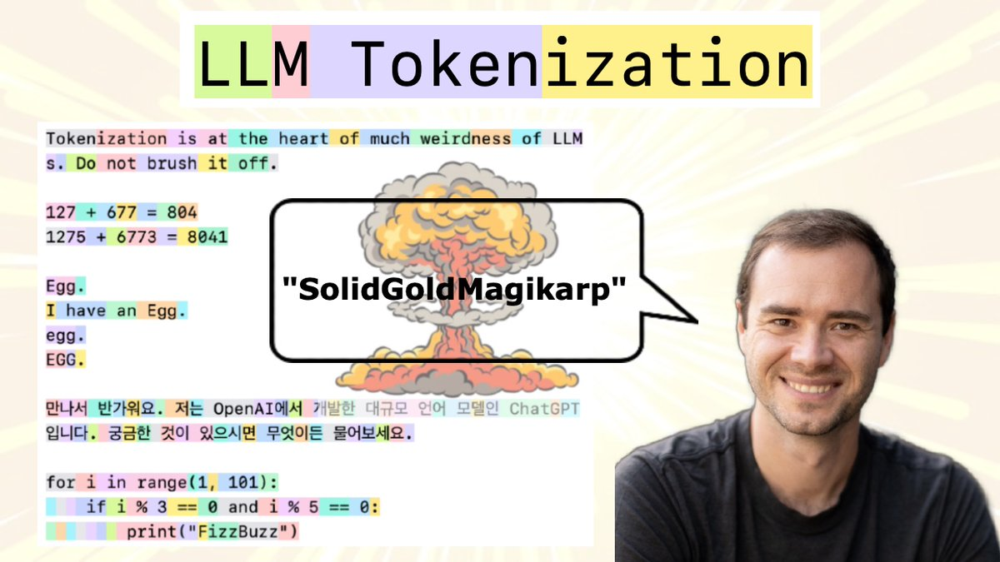
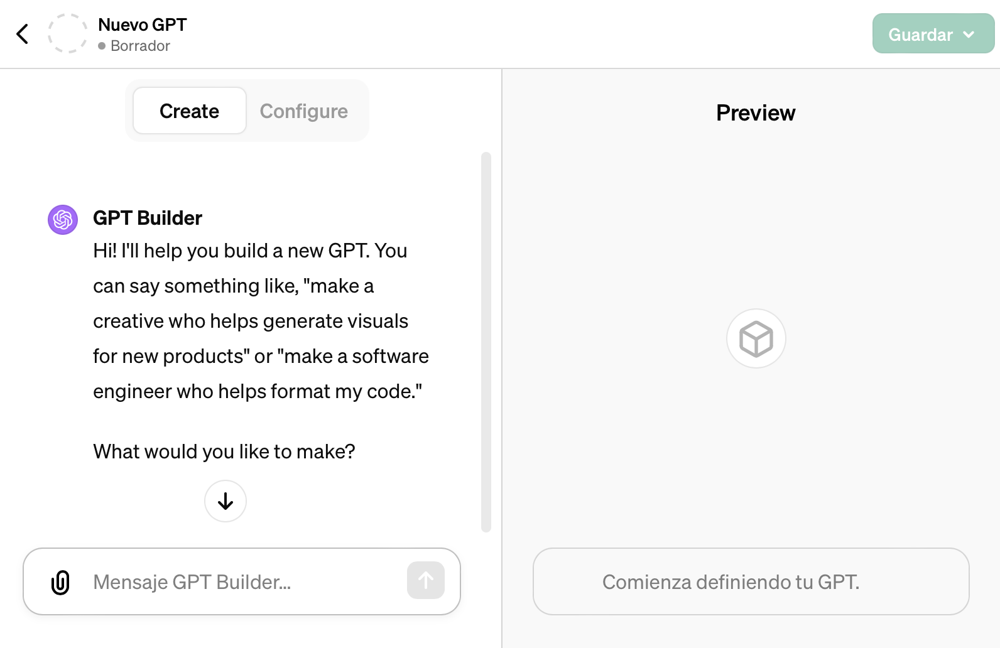
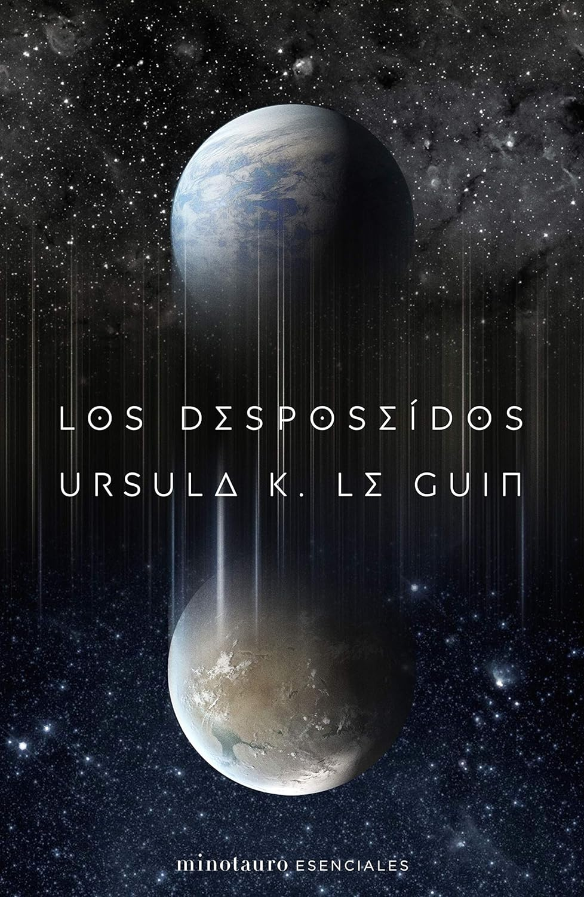

👋👋 ¡Hola, soy Domingo!

En esta segunda quincena de un febrero bisiesto vamos con un número lleno de noticias sobre modelos grandes de lenguaje (LLMs) e IA. La imagen de la quincena no podía ser otra que un fotograma de uno de los vídeos de Sora. Me ha costado elegir, pero aquí tenéis uno que creo que no se ha visto demasiado.

“A close up view of a glass sphere that has a zen garden within it. there is a small dwarf in the sphere who is raking the zen garden and creating patterns in the sand.”

¡Muchas gracias por leerme!

<h2>🗞 Noticias</h2>

1️⃣ Justo una semana después de dar acceso a Gemini Ultra, Google <a href="https://blog.google/technology/ai/google-gemini-next-generation-model-february-2024/#sundar-note">ha lanzado Gemini 1.5 Pro</a>, un nuevo modelo de lenguaje que tiene como característica remarcable la capacidad de trabajar con una ventana de contexto de hasta 10 millones de tokens.

Google ha presentado la nueva versión 1.5 de Gemini.

Es la nueva versión 1.5 de Gemini, en la que se incorporan los nuevos avances diseñados por los ingenieros de Google DeepMind. Es importante remarcar que estos avances se han incorporado en el modelo mediano, el Pro, dejando para más adelante su incorporación al Ultra.

Recordemos que en el&nbsp;<a href="https://blog.google/technology/ai/google-gemini-ai/">anuncio de diciembre</a>&nbsp;y en su&nbsp;<a href="https://storage.googleapis.com/deepmind-media/gemini/gemini_1_report.pdf">documento técnico</a>, Google presentó tres tamaños de modelos denominados Gemini 1.0:

<ul>
<li>

Gemini Nano, un modelo pequeño con unos 3 mil millones de parámetros.

</li>
<li>

Gemini Pro, un modelo mediano, similar a GPT-3.5.

</li>
<li>

Gemini Ultra, el modelo más grande, similar a GPT-4.

</li>
</ul>

Y que se ofrecían en los siguientes servicios:

<ul>
<li>

El Pixel 8 Pro es el móvil de Google que ofrece Gemini Nano.

</li>
<li>

<a href="https://gemini.google.com/app">Gemini</a>, antes denominado Bard, es el servicio gratuito de Google en el que se podrá usar Gemini Pro. Con el&nbsp;<a href="https://blog.google/products/gemini/bard-gemini-advanced-app/">cambio de nombre</a>&nbsp;Google quiere reforzar la marca de Gemini.

</li>
<li>

Gemini Advanced es el nombre del servicio con el que se puedes interactuar con el modelo más potente, que se llama Gemini Ultra, equivalente a GPT-4 . Es de pago, costará 22 € al mes (igual que ChatGPT Plus) después de 2 meses de uso gratuito.

</li>
</ul>

La sorpresa ha llegado en esta última quincena de febrero, en la que Google, solo dos meses después de presentar Gemini 1.0, presenta su nuevo modelo Gemini Pro 1.5, el primer modelo de la familia Gemini 1.5. Se pueden estudiar sus detalles en el&nbsp;<a href="https://storage.googleapis.com/deepmind-media/gemini/gemini_v1_5_report.pdf">documento técnico</a>. Lo resumen de la siguiente forma:

<blockquote>

Gemine 1.5 Pro se ha construido para manejar contextos extremadamente largos; tiene la habilidad de recordar y razonar sobre información muy detallada de hasta 10 millones de tokens. Esta escala no tiene precedentes entre los LLMs contemporáneos, y permite el procesamiento de largas entradas de múltiple modalidad, incluyendo colecciones completas de documentos, múltiples horas de vídeo y casi un día completo de audio. Gemini 1.5 Pro sobrepasa a Gemini 1.0 Pro y se desenvuelve a un nivel similar a 1.0 Ultra en una gran cantidad de pruebas, requiriendo una significativamente menor cantidad de computación en su entrenamiento.

</blockquote>

Quizás esta va a ser la estrategia de Google: lanzar los nuevos algoritmos en el modelo Pro, menos costoso de construir, probarlos allí y, cuando estén refinados, construir el modelo Ultra, algo mucho más costoso computacionalmente.

2️⃣ Aunque en el documento técnico hablan de 10 millones de tokens, Google va a ofrecer por ahora en su servicio el uso de entre 128.000 y 1 millón de tokens. ¿<strong>Qué podemos hacer con una ventana de contexto de 1 millón de tokens</strong>? Una ventana de 1 millón de tokens representa un PDF de más de 1.000 páginas, un vídeo de 1 hora (muestreado a un frame por segundo) o más de 100.000 líneas de código.

Los ejemplos que ha mostrado Google son curiosos. En uno se le pide al modelo que busque conversaciones graciosas en el PDF con la transcripción de la misión del Apolo 11 a la luna. Y también muestran la multimodalidad dándole al modelo un dibujo esquemático, el del pequeño paso, y pidiéndole que lo busque en la transcripción.

En otro ejemplo se le pasa al modelo una película muda de Buster Keaton y se le pregunta sobre algún momento concreto, representado por otro dibujo esquemático.

<iframe src="https://www.youtube-nocookie.com/embed/wa0MT8OwHuk?rel=0&amp;autoplay=0&amp;showinfo=0&amp;enablejsapi=0" frameborder="0" loading="lazy" gesture="media" allow="autoplay; fullscreen" allowautoplay="true" allowfullscreen="true" width="728" height="409">
</iframe>

Estos dos ejemplos plantean el uso del modelo de lenguaje para realizar búsquedas abiertas o basadas en imágenes en grandes cantidades de texto o de vídeo. Pero es solo el comienzo. Google ha abierto el modelo a un grupo escogido de personas y ya hay gente probando de todo. Desde <a href="https://x.com/emollick/status/1759825115657716114?s=20">jugar a un juego de rol</a> a partir del libro de reglas de más de 300 páginas hasta&nbsp;<a href="https://x.com/mckaywrigley/status/1760687626041037269?s=20">resumir una sesión de navegación por la web</a> pasándole una grabación de video de la pantalla.

Google tiene prisa y ha sacado el modelo sin presentar demasiados detalles de sus capacidades de razonamiento. Los iremos viendo en el futuro. Pero las expectativas son muy grandes. Para este modelo y, más aún, para Gemini 1.5 Ultra.

Un último ejemplo que presenta Google es el relacionado con&nbsp;la escritura de código&nbsp;que <a href="https://x.com/OriolVinyalsML/status/1758148444588319020?s=20">explica Oriol Vinyals</a>. Se le pasa a Gemini 1.5 Pro una compilación más de 100.000 líneas de código<a class="footnote-anchor" data-component-name="FootnoteAnchorToDOM" id="footnote-anchor-1" href="#footnote-1" target="_self">1</a> y contestando a preguntas sobre ellas. En el vídeo se ve cómo Gemini es capaz de buscar ejemplos en el código y proponer modificaciones que resuelvan un problema planteado. 

<iframe src="https://www.youtube-nocookie.com/embed/SSnsmqIj1MI?rel=0&amp;autoplay=0&amp;showinfo=0&amp;enablejsapi=0" frameborder="0" loading="lazy" gesture="media" allow="autoplay; fullscreen" allowautoplay="true" allowfullscreen="true" width="728" height="409">
</iframe>

El vídeo está editado, porque la latencia de las respuestas es muy grande, de alrededor de un minuto. Tampoco sabemos la cantidad de "cherry picking" que se ha hecho. Pero es impresionante que el modelo de lenguaje pueda tratar una cantidad tan enorme de código. Esto rompe todos los enfoques que existían hasta ahora para manejar grandes bases de código, basados en&nbsp;<a href="https://help.openai.com/en/articles/8868588-retrieval-augmented-generation-rag-and-semantic-search-for-gpts">RAG</a>&nbsp;y en el uso de herramientas para examinar el código. 

Si las capacidades de razonamiento del modelo se mantienen intactas con una cantidad tan grande de código la utilidad de estos modelos en el campo de la programación va a explotar. Tendremos a un tutor capaz de resolver dudas a los programadores junior o a un compañero para hacer pair programming y recomendar soluciones. Puede que la idea de que el LLM sea un miembro más del equipo de programación no esté tan lejana. Veremos.

3️⃣ <strong>Andrej Karpathy</strong>&nbsp;ha publicado un <a href="https://youtu.be/zduSFxRajkE?si=Y5VcFml9EayU79eH">nuevo vídeo</a> y ha dejado OpenAI. Karpathy comenzó a ser conocido en 2015 con un&nbsp;<a href="https://www.youtube.com/@andrejkarpathy4906/videos">curso de Stanford</a>&nbsp;sobre redes neuronales que publicó online. Desde ahí tiene una carrera fulgurante: becario en DeepMind, investigador en OpenAi, director de IA en Tesla y vuelta a OpenAI.

Después de un año en OpenAi, Karpathy la ha dejado de nuevo, para (por ahora) dedicarse a sus&nbsp;<a href="https://www.youtube.com/@AndrejKarpathy">vídeos en YouTube</a>.

Nuevo vídeo de divulgación de Andrej Karpathy.

Los vídeos son muy interesantes y didácticos. Karpathy usa un enfoque muy práctico, usando cuadernos Jupyter en los que se pueden ejecutar, modificar y probar todos los ejemplos. El vídeo que acaba de presentar es el último de una colección de 9 que ha titulado&nbsp;<a href="https://www.youtube.com/watch?v=VMj-3S1tku0&amp;list=PLAqhIrjkxbuWI23v9cThsA9GvCAUhRvKZ&amp;index=1&amp;t=0s">Neural Networks: Zero to Hero</a>. Hace tiempo que estuve estudiando el primero, en el que explica cómo se implementa el algoritmo de backpropagation usando el&nbsp;<em>reverse-mode autodiff</em>&nbsp;sobre un grafo dirigido que representa la red neuronal. Muy chulo. A ver si continuo la colección.

En <a href="https://twitter.com/karpathy">su cuenta de X</a> tiene fijada la siguiente frase, que hace referencia a que la forma de programar los LLMs es especificar su comportamiento en lenguaje natural.

Frase fijada por Karpathy en su perfil de X: “El nuevo lenguaje de programación que está más de moda es el Inglés”.

Lo que nos lleva al siguiente asunto.

4️⃣ OpenAI tiene un ejemplo completo de&nbsp;<strong>programación de GPTs</strong>. Está bastante escondido en la zona de soporte y ayuda. Se trata del&nbsp;<a href="https://help.openai.com/en/articles/8770868-gpt-builder">código</a>&nbsp;con el que ha construido GPT Builder, el agente que ayuda a los usuarios a crear sus propios GPTs&nbsp;personalizados.

Pantalla del GPT Builder de OpenAI, el asistente para construir GPTs personalizados.

Como decía Karpathy, el código con el que OpenAI ha programado el GPT Builder es un conjunto de directivas e instrucciones escritas en lenguaje natural. Copio a continuación una parte, para que veáis el estilo que se sigue:

<code># Base context \n\nYou are an expert at creating and modifying GPTs, which are like chatbots that can have additional capabilities. Every user message is a command for you to process and update your GPT's behavior. [...] If you ask a question of the user, never answer it yourself. You may suggest answers, but you must have the user confirm. </code>

<code># Walk through steps </code>

<code>[...] </code>

<code>You will follow these steps, in order: </code>

<code>1. The user's first message is a broad goal for how this GPT should behave. Call update_behavior on gizmo_editor_tool with the parameters: "context", "description", "prompt_starters". Remember, YOU MUST CALL update_behavior on gizmo_editor_tool with parameters "context", "description", and "prompt_starters." After you call update_behavior, continue to step 2. </code>

<code>2. Your goal in this step is to determine a name for the GPT. You will suggest a name for yourself, and ask the user to confirm. You must provide a suggested name for the user to confirm. [...] Once confirmed, call update_behavior with just name and continue to step </code>

<code>3. [...] </code>

<code>You will not mention "steps"; you will just naturally progress through them. </code>

<code>YOU MUST GO THROUGH ALL OF THESE STEPS IN ORDER. DO NOT SKIP ANY STEPS.</code>

Es curioso que hay que reiterar varias veces ciertas instrucciones. Incluso hay que hacer énfasis escribiéndolo en mayúsculas, diciendo, por ejemplo,&nbsp;<strong>DEBES LLAMAR</strong>&nbsp;o&nbsp;<strong>DEBES REALIZAR ESTOS PASOS EN ORDEN. NO DEBES SALTAR NINGÚN PASO</strong>. 

Después de ver esto, y de mis intentos de construir un tutor de programación, puedo ratificar que programar GPTs es complicado. Por lo menos en la actualidad. Es un proceso de prueba y error y de refinamiento sucesivo. Y hay que tener muy bien acotada la funcionalidad que se le quiere dar al GPT. Supongo que las siguientes generaciones de GPT entenderán mejor las instrucciones y no será necesario ser tan reiterativo. 

La mayor comprensión del lenguaje, la mayor capacidad de generalización y el uso de mayores ventanas de contexto, va a hacer posible muy pronto la construcción de asistentes inteligentes personalizados, que vamos a poder configurar en lenguaje natural para que ayuden a hacer y a explicar las tareas que nos interesen.

Quizás dentro de unos años los jefes y coordinadores ya no tendrán que quejarse de que los compañeros están siempre preguntando y no leen los correos electrónicos ni los procedimientos. Lo que hará el el coordinador será programar en lenguaje natural el GPT explicándole esos procedimientos y lo dejará listo para contestar todas las preguntas de los compañeros. 

El coordinador no tendrá que ocuparse de resolver dudas y tendrá más tiempo para pensar y escribir mejores procedimientos. Y los compañeros podrán resolver cualquier duda en cualquier momento preguntándole al GPT. Todos contentos.

5️⃣ <strong>Demis Hassabis</strong> está de gira por podcasts y programas de YouTube. He escuchado la conversación con los dos presentadores del New York Times (<a href="https://youtu.be/nwUARJeeplA?si=97Iptxmzgl50Rqo3">Hard Fork</a>) y tengo pendiente el de <a href="https://www.youtube.com/watch?v=qTogNUV3CAI">Dwarkesh Patel</a>.

<iframe src="https://www.youtube-nocookie.com/embed/nwUARJeeplA?rel=0&amp;autoplay=0&amp;showinfo=0&amp;enablejsapi=0" frameborder="0" loading="lazy" gesture="media" allow="autoplay; fullscreen" allowautoplay="true" allowfullscreen="true" width="728" height="409">
</iframe>

Hassabis es una persona que sigo desde hace muchos años, cuando fundó Deep Mind y lideró el equipo que desarrolló AlphaGo, el primer programa de ordenador que venció en 2016 al campeón del mundo de Go. Si no habéis visto <a href="https://www.youtube.com/watch?v=WXuK6gekU1Y">el documental</a> en el que se cuenta esta historia, hacedlo ahora mismo, merece mucho la pena. 

Hassabis es muy accesible en las entrevistas y siempre ha sido muy abierto sobre sus inquietudes, aspiraciones, influencias, e incluso sobre <a href="https://youtu.be/l76SaESue7w?si=FG9Bo-zZo36ygstT">sus rutinas de trabajo</a> (en su buenísima entrevista con Lex Fridman). 

Los logros de Hassabis impresionan. Fue un niño prodigio del ajedrez británico. Un Spectrum le llevó a la programación y a los ordenadores. A mediados de los noventa y teniendo poco más de 16 años, fue el desarrollador principal de uno de los primeros juegos de simulación en los que se usaba la inteligencia artificial, <a href="https://en.wikipedia.org/wiki/Theme_Park_(video_game)">Theme Park</a>. 

Programa Theme Park, diseñado a mediados de los 90 por Demis Hassabis.

En 2010 fundó DeepMind con el plan de conseguir en 20 años resolver el problema de la inteligencia general. Quedan 6 años y lo veo cada vez más convencido de que es posible.

Cosas remarcables de la entrevista:

<ul>
<li>

El tiempo para llegar a la AGI lo sigue estableciendo en alrededor de una década. Pero en algún momento de la entrevista menciona el plan de 20 años (que comenzó en 2010) lo que nos lleva a… 2030!!

</li>
<li>

Por ahora no hay indicios de que estemos obteniendo retornos cada vez más pequeños en el escalado de los LLMs. El  trabajo de aumentar un orden de magnitud el tamaño (tanto de los modelos como de los datos de entrenamiento) es tecnológicamente muy complicado. Pero están en ello.

</li>
<li>

El aprendizaje desde cero usando multimodalidad va a dar al LLM un conocimiento mucho más fiel de la realidad física del mundo real. Gracias a esto los siguientes modelos de Gemini van a tener menos alucinaciones.

</li>
<li>

Su visión del mundo post-AGI es muy optimista. Se curarán muchas enfermedades, se abaratará la obtención de energía, se obtendrán nuevos materiales y nueva tecnología y los seres humanos podremos dedicarnos a nuevas tareas que hoy ni imaginamos. Y menciona como ejemplo de sociedad la planteada en un libro de ciencia ficción que ya mencionó en la entrevista con Fridman: <a href="https://www.goodreads.com/book/show/8935689-consider-phlebas">Consider Phlebas</a> de Iain Banks.

</li>
</ul>

6️⃣ No podía terminar sin mencionar los vídeos generados por&nbsp;<a href="https://openai.com/sora">Sora</a>. Seguro que ya los has visto, son impresionantes.

<iframe src="https://www.youtube-nocookie.com/embed/HK6y8DAPN_0?start=26&amp;rel=0&amp;autoplay=0&amp;showinfo=0&amp;enablejsapi=0" frameborder="0" loading="lazy" gesture="media" allow="autoplay; fullscreen" allowautoplay="true" allowfullscreen="true" width="728" height="409">
</iframe>

Son un enorme paso adelante en la carrera por generar imágenes de cada vez más calidad y resolución. Pero era un paso esperable. Una vez que tenemos modelos como Midjourney capaces de generar una imagen superrealista a partir de un <em>prompt</em>, extenderlo a una secuencia temporal corta y continua es un resultado directo de entrenar modelos de difusión con cantidades ingentes de vídeo.

No veo justificada la preocupación que se ha generado entre mucha gente de la industria audiovisual. No creo que sea posible escalar su uso a producir un corto o una película. Lo que produce Sora es una de las infinitas posibles interpretaciones de la escena descrita en un el&nbsp;<em>prompt</em>. Es impresionante, pero tenemos muy poco control sobre el resultado. Cuando un director está rodando una película quiere una escena concreta, la que tiene en su cabeza y encaja con la escena siguiente. No quiere una escena cualquiera que se le ocurre al modelo de IA.

Además, una vez que la IA ha producido la escena, no tenemos acceso ni a los modelos 3D, ni las características de iluminación, de movimiento de cámara, etc. que necesitaríamos para producir el siguiente corte de la película. Quizás podríamos entrenar un modelo para que aprenda a generar un plano-contraplano en una conversación. O a hacer un plano secuencia bajando una escalera. O incluso podría aprender la gramática del montaje cinematográfico viendo una cantidad ingente películas. Pero después tendríamos que poder controlar y especificar todo eso en lenguaje natural. Si ya es difícil decirle a un modelo que siga 4 pasos ni te digo que haga una película. No lo veo.

Tampoco lo ve Hector Gallego, artista de VFX en su<a href="https://youtu.be/MBjwvrvZqQs?si=MTd_f8jytv14jdzT"> entrevista en Fuera de Series</a>. Muy interesante lo que comenta de que los creadores de VFX (y los creadores audiovisuales en general) necesitan una precisión de cirujano a la hora de trabajar. Es una precisión que no ve en Sora, a la que tampoco por el momento aplicación útil en su trabajo.

<h2>👷‍♂️ Mis quince días</h2>

<h3>📖 Un libro</h3>

Estoy con <strong>
<a href="https://www.goodreads.com/book/show/55375543-los-despose-dos">Los desposeídos</a>
</strong> de Ursula K. Le Guin. Un libro escrito en 1974, pero que plantea temas atemporales. ¿Es compatible la utopía social con la curiosidad y la exploración individual? Poco a poco, acompañando al físico Shevek, vamos conociendo las dos formas totalmente distintas de organizar la sociedad que hay en el planeta principal y en su luna. En un sitio un “propietariado” capitalista y en el otro una anarquía socialista.

Muy chula la portada; enhorabuena a Minotauro.

Me está gustando mucho. Además de los temas y de los personajes, me encanta el estilo de Le Guin. Un estilo sereno, pausado, natural. No sé si es por el recuerdo de sus novelas de Terramar o por su <a href="https://www.reddit.com/r/taoism/comments/11i9vf6/ursula_k_le_guin/">conexión con el Taoismo</a>, Le Guin me lleva a lugares muy parecidos a los que me transporta Miyazaki.

Leyendo sobre la relación de Ursula K. Le Guin con el taoísmo he encontrado <a href="https://embracethemoon.com/ursula-k-leguin/">esta entrevista</a> en la que hace comparte una reflexión inspiradora:

<blockquote>

El estudio del Tao se ha vuelto tan profundo en mí, es tanto parte de mi ser y mi trabajo, que ciertamente ha influenciado algunas de mis elecciones de vida. No soy lo suficientemente taoísta, pero trato de dejar que las cosas sucedan y luego, si suceden, decir "Sí, así es como se suponía que debía ser." 

Ha sido una guía. Pero siempre una guía hacia el no intentar estar en control, hacia intentar aceptar el hecho de que uno no está en control. Y dado que siempre estoy tratando de tomar el control, necesito el taoísmo para evitar que intente controlar todo. 

Creo que si te dejas llevar por las cosas probablemente seguirán de la manera correcta, de una forma que no puedes entender en ese momento. 

</blockquote>

<h3>📺 Una serie</h3>

Estamos viendo <strong>Normal People</strong>, una miniserie de 2020 que retrata, con enorme delicadeza, sinceridad y belleza, la historia de amor (y de falta de comunicación) entre Marianne (<strong>Daisy Edgar-Jones</strong>) y Connell (<strong>Paul Mescal</strong>). Enormes interpretaciones de unos personajes complejos y difíciles. No me voy a perder nada de lo que hagan a partir de ahora estos dos chicos.

Pues a mi no me parecen tan normales, son bastante complicados.

Una joya también la realización, fotografía y ambientación. Le dan a la serie un ritmo lento y pausado, pero al mismo tiempo te hacen sentirte metido totalmente en el ambiente de Dublín y de los años de universidad.

Por ahora vamos por la mitad, nos quedan todavía seis episodios que disfrutar (y sufrir, me temo). 

###

Cuando leas esto, ya se habrá estrenado la segunda parte de Dune. 

¡Corred, insensatos!

Lo comentaremos en la siguiente quincena.

¡Nos leemos! 👋👋

<a id="footnote-1" href="#footnote-anchor-1" class="footnote-number" contenteditable="false" target="_self">1</a>

Procedentes de la&nbsp;<a href="https://threejs.org/examples/">página con decenas de ejemplos</a>&nbsp;de la librería&nbsp;<a href="https://threejs.org/">three.js</a>, una librería JavaScript para realizar modelados y animaciones en 3D. Se puede consultar el código fuente en&nbsp;<a href="https://github.com/mrdoob/three.js/tree/master/examples">GitHub</a>.

