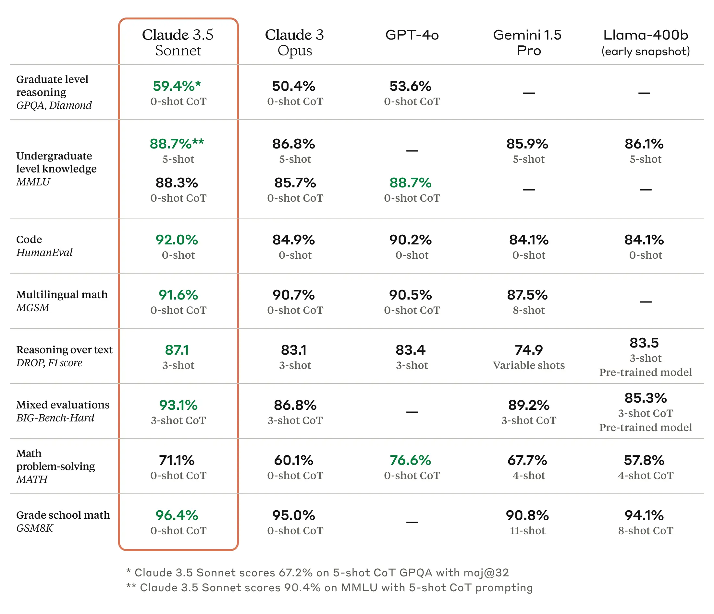
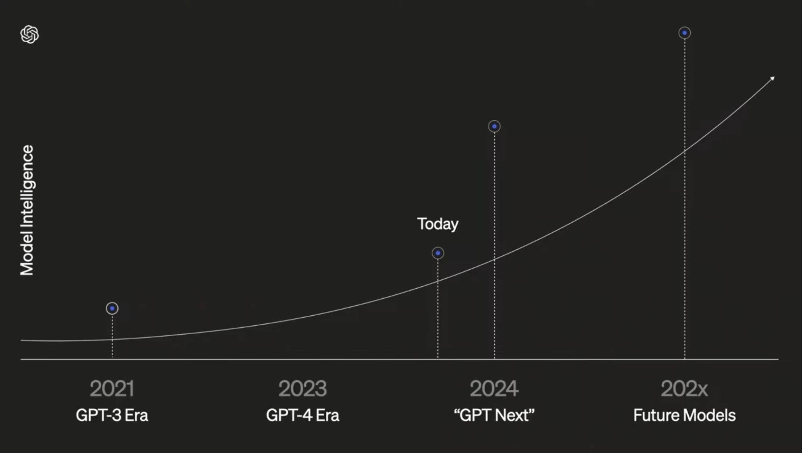

Another Friday, commenting on what happened in the previous fortnight, from June 16 to 30. It was a fortnight full of news and reflections about LLMs. Many developments, and also many uncertainties.

Thank you very much for reading.

## News

1. Now that summer has arrived, it is a good moment to review the **evolution of the planet's global temperature**, which we [talked about in April](/posts/del-1-al-15-de-abril-7-de-2024/). As in the previous post, all the data comes from the [Climate Reanalyzer](https://climatereanalyzer.org/) website of the Climate Change Institute at the University of Maine. Will we have a summer as hot as last year's?

The [air temperature in the Northern Hemisphere](https://climatereanalyzer.org/clim/t2_daily/?dm_id=nh) gives us some hope.

The thick black line shows this year's temperature. Is it starting to come down?

The orange line shows last year's temperature. At the beginning of July it was 21.7 C, 1.1 C above the average, and it ended the month at 22.7 C, 1.4 C above the average. The thick black line is this year's temperature. It seems to be starting to come down, but it is still too early to draw conclusions. Better to look again in a couple of weeks, when we are in the middle of the month.

The graph that cools us down the most is the [sea surface temperature in the Northern Hemisphere](https://climatereanalyzer.org/clim/sst_daily/), which is finally lower than last year's.

It seems to be getting cooler.

Could it be that [El Nino](https://www.climate.gov/enso) is already over? That the effects of the water vapor from the [Hunga Tonga eruption](/posts/del-1-al-15-de-abril-7-de-2024/) are beginning to fade? Let us keep our fingers crossed that **the black line keeps moving forward horizontally**.

2. On **June 17**, [Runway](https://runwayml.com/) introduced its **new video-generation model**, [Gen-3 Alpha](https://runwayml.com/blog/introducing-gen-3-alpha/). The videos are short sequences of just a few seconds, with very high quality and consistency, similar to the ones we [already saw](/posts/del-16-al-29-de-febrero-4-de-2024/) from OpenAI's model Sora.

Unlike OpenAI, Runway has already [opened access](https://app.runwayml.com/signup) to the tool. To generate videos with this latest model you have to subscribe to the paid plan, at $12 a month. I already spend enough paying OpenAI, and this month I had already exhausted my budget for little indulgences on Sonnet 3.5. But on X you can see many examples from people trying it out. For example, Javi Lopez's [dancing spaghetti](https://x.com/javilopen/status/1808140481232359736).

Someone has even [published on Reddit](https://www.reddit.com/r/OpenAI/comments/1dti3j3/sora_vs_runway_side_by_side_comparison/) a comparison between videos generated by Sora and those generated by Gen-3 Alpha, using the prompts from OpenAI's promotional video.

I still think what I already said in February. These seem to me to be impressive advances, but we have **very little control over the result**, and I do not think it will be possible to scale their use to produce a short film or a feature film. Nor does that interest me. When I go to the cinema I want to see something **created by people and performed by people**. And if it is an animated film, I want to see a consistent, coherent work that conveys feelings through sequences designed and directed by human authors who pour all their experience into a piece of work. I am not interested in what an AI generates at random within the framework of a text prompt.

3. **Francois Chollet** has appeared in several podcasts as a result of the attention surrounding his [ARC competition](https://arcprize.org/), which we discussed [in the previous fortnight](/en/posts/del-1-al-15-de-junio-11-de-2024/). After listening in full to the interviews conducted by **Dwarkesh Patel** and **Sean Carroll**, I have become a total fan. Chollet has been working with neural networks and deep learning since the middle of the last decade, and his neural-network library [Keras](https://keras.io/) is widely used in the community. He is a very technical person who knows what he is talking about.

I already mentioned the Dwarkesh Patel podcast in the previous fortnight. Below I include the links to the podcasts mentioned, their transcripts, and some comments and quotes from those transcripts.

The **Dwarkesh Patel** podcast:

<iframe class="apple-podcast " data-attrs="{&quot;url&quot;:&quot;https://embed.podcasts.apple.com/es/podcast/dwarkesh-podcast/id1516093381?i=1000658672649&quot;,&quot;isEpisode&quot;:true,&quot;imageUrl&quot;:&quot;podcast-episode_1000658672649.jpg&quot;,&quot;title&quot;-&quot;Francois Chollet, Mike Knoop - LLMs won’t lead to AGI - $1,000,000 Prize to find true solution&quot;,&quot;podcastTitle&quot;:&quot;Dwarkesh Podcast&quot;,&quot;podcastByline&quot;:&quot;&quot;,&quot;duration&quot;:5633000,&quot;numEpisodes&quot;:&quot;&quot;,&quot;targetUrl&quot;:&quot;https://podcasts.apple.com/es/podcast/francois-chollet-mike-knoop-llms-wont-lead-to-agi-%241/id1516093381?i=1000658672649&amp;uo=4&quot;,&quot;releaseDate&quot;:&quot;2024-06-11T17:03:59Z&quot;}" src="https://embed.podcasts.apple.com/es/podcast/dwarkesh-podcast/id1516093381?i=1000658672649" frameborder="0" allow="autoplay *; encrypted-media *;" allowfullscreen="true">
</iframe>

Its transcript can be found [on Substack](https://www.dwarkeshpatel.com/p/francois-chollet).

I found Chollet's idea of interpreting LLMs as a **"large interpolative memory"** extremely interesting, a huge collection of programs that implement patterns learned during training. When you query an LLM, it performs **an interpolation** among the patterns that best fit the answer.

> "The way LLMs work is that they are basically a big interpolative memory. The way you increase their capabilities is by trying to stuff as much knowledge and as many patterns into them as possible."

According to Chollet, that way of operating gives an LLM only very limited intelligence. It is not able to combine the programs it has learned and, through a search process, invent a new "program" that solves a novel situation not included in its training database. For Chollet, the ability to carry out **combinatorial searches** is a fundamental element of intelligence. For example, when we play chess or **Rummikub**, we must search through possible combinations and choose the best one. An LLM cannot do that:

> "To get novelty, you need search. LLMs cannot do search, they can only do interpolation."

For Chollet, LLMs are powerful tools for **memorization** and the application of known knowledge and patterns, but they lack the ability to adapt and create novel solutions, which is crucial for reaching true general intelligence.

Chollet is also **critical of the idea that scaling models leads to models that generalize better**. For him, what scaling does is increase the amount of skills and data, but that does not mean the models are more intelligent:

> "If you scale up your database and keep adding more knowledge and more program templates to it, then sure, it becomes more and more skilled. You can apply it to more and more tasks. But general intelligence is not task-specific skill scaled up to many skills, because there is an infinite space of possible skills."

Despite all that, Chollet argues that LLMs do have their usefulness and their applications. He says that LLMs, like other deep-learning systems, can recognize and apply patterns efficiently. That is why they are excellent for **"type 1" intelligence**, intelligence based on intuition, pattern recognition, and memorization. This kind of intelligence is fast and automatic, used for tasks that do not require deep or deliberate reasoning. But there is another form of human intelligence, slow and deliberate, based on reasoning, planning, and the synthesis of new programs or solutions.

Francois Chollet suggests that, in order to move toward true general intelligence, it will be necessary to develop hybrid systems that combine deep learning with search and exploration to generate new programs by combining those that have already been learned. In that way it would be possible to take advantage of the strengths of both kinds of intelligence.

The interview with **Sean Carroll** on his *Mindscape* podcast is available here:

<iframe class="apple-podcast " data-attrs="{&quot;url&quot;:&quot;https://embed.podcasts.apple.com/es/podcast/sean-carrolls-mindscape-science-society-philosophy/id1406534739?i=1000660048303&quot;,&quot;isEpisode&quot;:true,&quot;imageUrl&quot;:&quot;podcast-episode_1000660048303.jpg&quot;,&quot;title&quot;-&quot;Fran%C3%A7ois Chollet on Deep Learning and the Meaning of Intelligence&quot;,&quot;podcastTitle&quot;:&quot;Sean Carroll's Mindscape: Science, Society, Philosophy, Culture, Arts, and Ideas&quot;,&quot;podcastByline&quot;:&quot;&quot;,&quot;duration&quot;:6109000,&quot;numEpisodes&quot;:&quot;&quot;,&quot;targetUrl&quot;:&quot;https://podcasts.apple.com/es/podcast/fran%C3%A7ois-chollet-on-deep-learning-and-the/id1406534739?i=1000660048303&amp;uo=4&quot;,&quot;releaseDate&quot;:&quot;2024-06-24T11:45:38Z&quot;}" src="https://embed.podcasts.apple.com/es/podcast/sean-carrolls-mindscape-science-society-philosophy/id1406534739?i=1000660048303" frameborder="0" allow="autoplay *; encrypted-media *;" allowfullscreen="true">
</iframe>

And the transcript is available [on Sean Carroll's blog](https://www.preposterousuniverse.com/podcast/2024/06/24/280-francois-chollet-on-deep-learning-and-the-meaning-of-intelligence/).

The interview is very interesting, **more didactic** than the first one. Carroll asks more than once for clarification on aspects that the audience might not understand, genetic algorithms, transformers, vector spaces, and so on, and Chollet makes an effort to explain them.

In the interview, Chollet takes a fairly strong position and argues that we have reached a kind of **plateau** in LLM improvement due to the lack of training data:

> "The curve [that represents LLM improvement] has to fit something. The curve is literally just a representation of a training data set. If you have run out of data, then how do you improve the model? Well, one way is that you can try to curate your training data better. So you are not increasing the scale of the training data, but you can increase the quality. That is really a very promising way to improve large language models. It is actually the way large language models are still improving today. We have already run out of data. So the next stage is that we curate the data better. We are not training large language models on more data, we are actually curating it. Technically, we are still collecting new data from human evaluators. So there is a little bit of increase, but on balance it is actually decreasing. But you are not going to magically find a thousand times more new and non-redundant data to train these models. It just does not exist. You are not even going to find twice as much. And that is the cause of the plateau we have been seeing."

And that plateau is going to cause disappointment:

> "That is the cause of the plateau we have been seeing. And something like GPT-5 will probably be released later this year. It is going to be a big disappointment because it is not going to be significantly better than GPT-4."

Finally, on the problems AI may bring us and on existential risk, Chollet has a position very similar to the one we have already discussed here on other occasions. Even if AGI does arrive, **it will still be only a tool** that we can use. The problem will lie in how it is used, not in AGI itself wanting to exterminate us:

> "Intelligence itself is just a tool. It is just a way to achieve goals. If you do not connect it to the capacity to set autonomous goals, then it is fairly harmless. It is not completely harmless because it will be in the hands of humans and humans are dangerous. So it is dangerous in that sense, since people could potentially use it for bad purposes, but it is not dangerous in the sense that it competes with the human species."

4. In the second half of June, **two new LLMs** of interest were released: Anthropic launched [Claude 3.5 Sonnet](https://www.anthropic.com/news/claude-3-5-sonnet) and Google launched the 27B open-source model [Gemma-2](https://blog.google/technology/developers/google-gemma-2/).

Both releases continue the trend of recent weeks: smaller models trained better. Anthropic's model is the next version of the medium-sized model in the Claude family, and Google's model is the next version of its open Gemma model.

Just three months ago, in [issue 5 of 2024](/posts/del-1-al-15-de-marzo-5-de-2024/), we were talking about Anthropic releasing its 3.0 family of models: Haiku, Sonnet, and Opus. The last of these was the most powerful one, in GPT-4 territory. Sonnet and Haiku are smaller models, faster and cheaper at inference time.

Only three months later Anthropic published the following figure:

The smaller models are coming for the bigger ones.

Sonnet is now Anthropic's most powerful model, outperforming an older larger model. The same thing happened with Gemini 1.5 Pro, which we discussed in [issue 4 of 2024](/posts/del-16-al-29-de-febrero-4-de-2024/). Google released the next version of its medium model, the Pro, leaving the update of the largest one, Ultra, for the future.

Anthropic shows the following scores for Sonnet 3.5 on the most popular benchmarks, beating Opus 3 and, in many cases, GPT-4o, OpenAI's leading model at the moment.

Sonnet is also multimodal, capable of interpreting images. And Anthropic launched it together with the feature called *artifacts*, a side window next to the conversation in which the model can run code.

For example, the following clip is the result of a session in which I told Sonnet **how to create a game**. The initial idea was to move a blue square around the screen, and we ended up making **a loose version of Pong**. Sonnet generated the code, and I kept asking for new features, things like "Make a star appear that you have to avoid" or "The game is a bit boring, make the number of stars increase." The final result, and the whole process, is incredible.

5. I will end with a reflection on the **evolution of LLMs**. In [a post on X](https://x.com/DrJimFan/status/1805265388256837842), Jim Fan published the following image:

GPT-4 is no longer unique.

The image seems to answer one of the questions we were asking at the beginning of the year: **was GPT-4 replicable?** When GPT-4 [was presented](https://openai.com/index/gpt-4-research/) in March 2023, many of us wondered whether the enormous leap from GPT-3.5 was due to some exclusive OpenAI knowledge that would be hard for other companies to replicate. A year has passed, and the figure above seems to show that the answer is no, that OpenAI does not have a secret recipe for making LLMs and that other companies, Google, Anthropic, Meta, have already reached or are about to reach GPT-4, even with smaller models.

There was a second question still to answer: **will model intelligence keep scaling** as the models become larger? GPT-3.5 had 175 billion parameters, 175B in English notation. OpenAI has never disclosed the number of parameters in GPT-4, but Nvidia CEO Jensen Huang [let slip](https://www.youtube.com/live/Y2F8yisiS6E?si=qXrAgcOS7M9iW3za&amp;t=1245) that it was 1.8T, 1.8 trillion. Putting them in the same units, GPT-3.5 has 0.175T parameters and GPT-4 has 1.8T. In other words, GPT-4 is an order of magnitude larger than GPT-3.5.

We are all waiting for the launch of GPT-5, OpenAI's next large model. Presumably it will be another order of magnitude larger, with around 20T parameters. There are [some estimates](https://www.reddit.com/r/singularity/comments/1bi8rme/jensen_huang_just_gave_us_some_numbers_for_the/?utm_source=share&amp;utm_medium=web3x&amp;utm_name=web3xcss&amp;utm_term=1&amp;utm_content=share_button) of the time needed to train this model and of how that time will evolve with Nvidia's new GPUs:

- OpenAI began training GPT-5 at the end of December 2023 using H100 GPUs.
- The training was expected to last 3 months and finish by the end of March 2024.
- For GPT-5, the use of at least 50,000 H100 GPUs was predicted, compared with the 20,000 A100s used for GPT-4.
- The model would have around 20T parameters.
- The process of tuning and additional testing would take 3 to 5 months, with a possible release date in July or August 2024.
- Microsoft could have access to 500,000 H100 GPUs by the end of 2024.
- OpenAI could use up to 250,000 H100 GPUs to train a 50T-parameter model in the third quarter of 2024.
- There was the possibility of releasing an intermediate model, GPT-4.5, with 10T parameters and delaying GPT-5 until December 2024.
- The arrival of B200 GPUs by the end of 2024 would make it possible to train models with tens of trillions of parameters, 20T, 30T, 40T, and so on.

All the major tech companies are in this race and that is why Nvidia is currently the technology company with the largest market capitalization. They cannot keep up with GPU demand.

Before long, when the models that are being trained right now become public, we will see whether the leap in the number of parameters also represents a leap in "intelligence", and whether the [scaling law](https://www.aisnakeoil.com/p/ai-scaling-myths) of language models continues to hold.

There is already at least one slide that [is being used](https://www.youtube.com/live/vaIiNZoXymg?si=-sOVrgNN-Sc6G10Z&amp;t=26615) by people from OpenAI to suggest that the jump will be enormous:

And the latest statements by people who have surely had some contact with the first results of these new models, such as Bill Gates, Dario Amodei, or Demis Hassabis, also point in that direction.

For example, Gates talks about the next two generations of LLMs in the following clip, taken from a much longer conversation available on [YouTube](https://www.youtube.com/watch?v=jrTYdOEaiy0). It is an edited video published on X by [Tsarathustra](https://x.com/tsarnick), do not be fooled by the title, he posts very interesting videos and news.

Gates says two important things. First, there is going to be a significant jump in the next two generations of LLMs, let us call them GPT-5 and GPT-6. To make that jump, training data will also have to increase by orders of magnitude, and video will have to be used.[^1]

The second point he makes is very similar to what we were just saying about Chollet, and what [LeCun](https://time.com/6694432/yann-lecun-meta-ai-interview/) has always maintained: scaling LLMs will produce improvements, but it will not bring us AGI. For that, other algorithms and strategies will be needed, ones that allow the implementation of "metacognition" so that AI can reflect on the thoughts it is generating.

Will scaling allow us to get closer to AGI? Or are we already seeing its limits? I think it is still **too early to draw a definitive conclusion**. I think Chollet's idea that LLMs learn patterns of programs allows us to argue that larger, better-trained LLMs **may generalize those patterns better**, not simply increase their number. And the problems LeCun has always pointed out, that text is not enough to learn a physical model of the world, may be overcome when LLMs are trained directly on video sequences, perhaps within a couple of generations, GPT-6 or GPT-7. Or perhaps LeCun and Chollet are right and **we have already reached the ceiling** of what can be done with LLM and transformer technology.

As we always say around here, we will see. It is still too early to know; in three or four years we will be able to say something more definitive. In the meantime, we can always [place bets](https://manifold.markets/RemNi/will-we-get-agi-before-2030).

## My two weeks

### Movies

I was a little disappointed by [*A Quiet Place: Day One*](https://letterboxd.com/domingogallardo/film/a-quiet-place-day-one/). I found it a bit slow and boring, and I never really connected with it. Weaker than the previous ones. And I had a lot of fun with [*Under Paris*](https://letterboxd.com/domingogallardo/film/under-paris/) on Netflix. A shark movie, the kind **Claire and Phil** would enjoy.

Of all the films from the fortnight, the one I would highlight is [*The Greatest Hits*](https://letterboxd.com/domingogallardo/film/the-greatest-hits/), on Disney. A lovely story of love, music, and time jumps. It is the second film by director **Ned Benson** and it stars a trio of absurdly beautiful young actors: the wonderful **Lucy Boynton**, who also starred in another film I watched recently and loved, [*Sing Street*](https://letterboxd.com/domingogallardo/film/sing-street/), the future **Superman**, **David Corenswet**, and **Justin H. Min**, whom I recognized from *The Umbrella Academy*.

I need to make a Letterboxd list with all the films and series of this kind that I have loved: *Begin Again*, *Sing Street*, or *Daisy Jones* and, why not, *School of Rock*. Well, [I have already made it](https://letterboxd.com/domingogallardo/list/music-love/).

### TV

The Apple TV+ series **Dark Matter** was great fun. We liked it a lot.

As always with Apple, it is an excellent production. And regarding the subject matter, although the multiverse concept is already overused, I cannot think of many films or series that handle it especially well, sorry, I have not seen *Fringe*. But this story by **Blake Crouch** does handle it well. It is quite original, has good twists that genuinely surprise, and the multiverse is not an excuse but the central element of the story. Very good work from **Joel Edgerton** and **Jimmi Simpson**. And **Jennifer Connelly** and **Alice Braga** are solid too, although their characters did not really have much more room to offer.

---

See you in the next fortnight.

[^1]: Although the most advanced LLMs are multimodal, they have not really been trained on full video sequences, but on snapshots, still images extracted from video. Cinema has shown that we need at least 24 images per second to perceive movement as continuous. Surely that many FPS are not necessary to train LLMs on video. But even training at 5 or 10 FPS would require computational capacity two or three orders of magnitude greater than what is common today.
