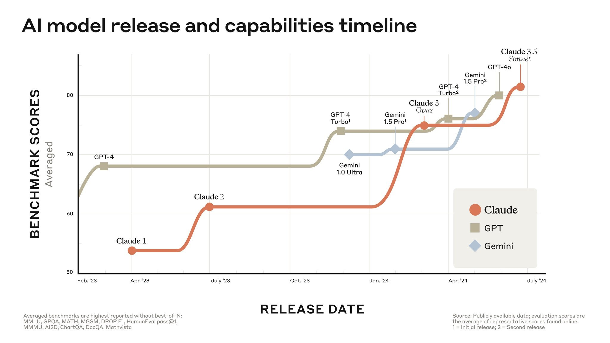
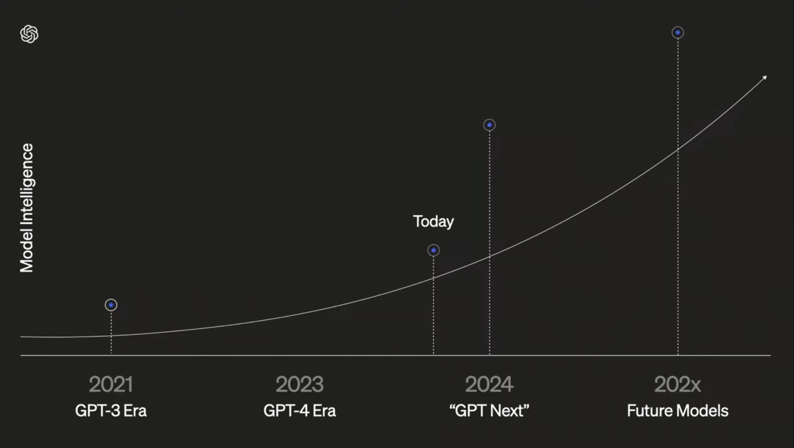
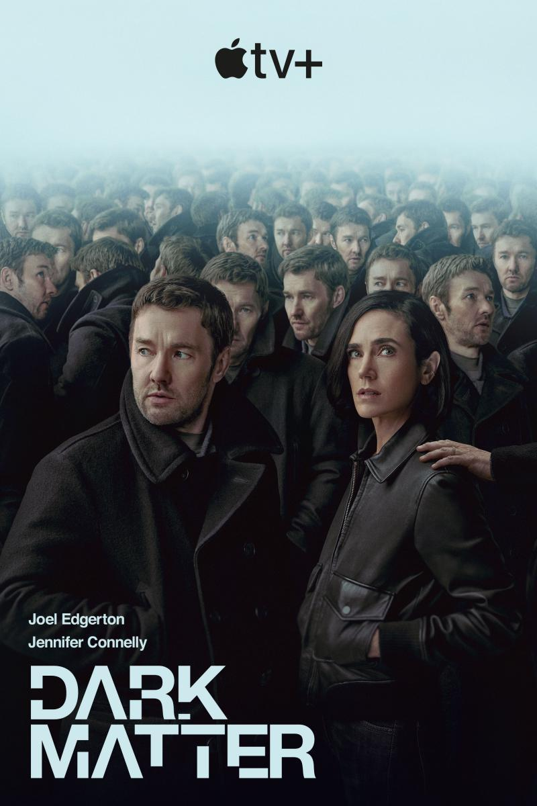

Un viernes más comentando lo sucedido en la quincena pasada, del 16 al 30 de junio. Una quincena con muchas novedades y reflexiones sobre los LLMs. Muchas novedades, y también muchas incertidumbres.

¡Gracias por leerme!

<h2>🗞 Noticias</h2>

1️⃣ Ahora que ha llegado el verano, es un buen momento de repasar la <strong>evolución de la temperatura global del planeta</strong> de la que <a href="/posts/del-1-al-15-de-abril-7-de-2024/">hablamos en abril</a>. Todos los datos están sacados, como en la anterior entrada, de la web <a href="https://climatereanalyzer.org/">https://climatereanalyzer.org/</a> del Climate Change Institute de la universidad de Maine. ¿Tendremos un verano tan caluroso como el del año pasado?

La&nbsp;<a href="https://climatereanalyzer.org/clim/t2_daily/?dm_id=nh">temperatura del aire en el hemisferio norte</a>&nbsp;nos da algo de esperanza. 

La línea negra gruesa es la evolución de la temperatura este año. ¿Empieza a bajar?

La línea naranja muestra la temperatura del año pasado. A comienzos de julio fue de 21,7 ºC (+1,1 ºC sobre la media) y terminó el mes siendo 22,7 ºC (+1,4 ºC). La línea negra gruesa es la temperatura de este año. Parece que empieza a bajar, pero todavía es pronto para sacar conclusiones. Mejor verlo en un par de semanas, cuando estemos a mitad de mes.

La gráfica que más nos refresca es la&nbsp;<a href="https://climatereanalyzer.org/clim/sst_daily/">temperatura del mar en el hemisferio norte</a>, que por fin está más baja que la del año pasado.

Parece que empieza a refrescar.

¿Puede ser que ya haya&nbsp;<a href="https://www.climate.gov/enso">terminado El Niño</a>? ¿Que ya estén empezando a desaparecer los efectos del vapor de agua de la&nbsp;<a href="/posts/del-1-al-15-de-abril-7-de-2024/">erupción del Hunga Tonga</a>? Crucemos los dedos para que <strong>la línea negra siga avanzando en horizantal</strong>.&nbsp;

2️⃣ El 17 de junio, la empresa&nbsp;<a href="https://runwayml.com/">Runway</a>&nbsp;presentó su <strong>nuevo modelo de generación de secuencias de vídeo</strong>&nbsp;<a href="https://runwayml.com/blog/introducing-gen-3-alpha/">Gen-3 Alpha</a>. Los vídeos son secuencias de unos pocos segundos, con una gran calidad y consistencia, similares a los que&nbsp;<a href="/posts/del-16-al-29-de-febrero-4-de-2024/">ya vimos</a>&nbsp;del modelo de OpenAI, Sora.

A diferencia de OpenAI, Runway ya&nbsp;<a href="https://app.runwayml.com/signup">ha abierto</a>&nbsp;el acceso a la herramienta. Para generar vídeos con este último modelo debes suscribirte al plan de pago, de $12 al mes. Yo ya tengo bastante con pagar a OpenAI y este mes ya me he gastado el presupuesto para caprichos en Sonnet 3.5. Pero en X se pueden ver un montón de ejemplos de gente que lo está probando. Por ejemplo, los espaghettis danzarines de&nbsp;<a href="https://x.com/javilopen/status/1808140481232359736">Javi López</a>.

Hay alguien que incluso&nbsp;<a href="https://www.reddit.com/r/OpenAI/comments/1dti3j3/sora_vs_runway_side_by_side_comparison/">ha publicado en Reddit</a> una comparativa entre los vídeos generados por Sora y los de Gen-3 Alpha, usando los prompts del vídeo de promoción de OpenAI.

Sigo diciendo lo que ya comenté en febrero. Me parecen avances impresionantes, pero tenemos <strong>muy poco control sobre el resultado</strong> y no creo que sea posible escalar su uso a producir un corto o una película. Ni tampoco me interesa. Cuando voy al cine quiero ver algo <strong>creado por personas e interpretado por personas</strong>. Y si es una película de animación, quiero ver una obra consistente, coherente, que me transmita sensaciones mediante secuencias diseñadas y dirigidas por autores humanos, que vuelcan toda su experiencia en una obra. No me interesa lo que genera una IA de forma aleatoria en el marco de un <em>prompt</em> de texto.

3️⃣ <strong>François Chollet</strong> ha aparecido en varios podcasts, como resultado de la repercusión de su <a href="https://arcprize.org">competición ARC</a> de la que hablamos <a href="/posts/del-1-al-15-de-junio-11-de-2024/">la quincena pasada</a>. Después de escuchar completas las entrevistas que le hacen <strong>Dwarkesh Patel</strong> y <strong>Sean Carroll</strong>, me he convertido en un fan total. Chollet lleva trabajando con redes neuronales y deep learning desde mediados de la década pasada y su librería <a href="https://keras.io">Keras</a> para redes neuronales es ampliamente usada en la comunidad. Se trata de una persona muy técnica, que sabe de lo que habla.

El podcast con Dwarkesh Patel ya lo referenciamos la quincena pasada. Pongo a continuación los enlaces a los podcasts mencionados, sus transcripciones y algunos comentarios y citas de sus transcripciones.

El podcast de <strong>Dwarkesh Patel</strong>:

<iframe class="apple-podcast " data-attrs="{&quot;url&quot;:&quot;https://embed.podcasts.apple.com/es/podcast/dwarkesh-podcast/id1516093381?i=1000658672649&quot;,&quot;isEpisode&quot;:true,&quot;imageUrl&quot;:&quot;podcast-episode_1000658672649.jpg&quot;,&quot;title&quot;-&quot;Francois Chollet, Mike Knoop - LLMs won’t lead to AGI - $1,000,000 Prize to find true solution&quot;,&quot;podcastTitle&quot;:&quot;Dwarkesh Podcast&quot;,&quot;podcastByline&quot;:&quot;&quot;,&quot;duration&quot;:5633000,&quot;numEpisodes&quot;:&quot;&quot;,&quot;targetUrl&quot;:&quot;https://podcasts.apple.com/es/podcast/francois-chollet-mike-knoop-llms-wont-lead-to-agi-%241/id1516093381?i=1000658672649&amp;uo=4&quot;,&quot;releaseDate&quot;:&quot;2024-06-11T17:03:59Z&quot;}" src="https://embed.podcasts.apple.com/es/podcast/dwarkesh-podcast/id1516093381?i=1000658672649" frameborder="0" allow="autoplay *; encrypted-media *;" allowfullscreen="true">
</iframe>

Su transcripción se puede encontrar <a href="https://www.dwarkeshpatel.com/p/francois-chollet">en substack</a>.

Me ha parecido interesantísima la idea de Chollet de interpretar los LLMs como una “<strong>gran memoria interpolativa</strong>”, una enorme colección de programas que implementan patrones aprendidos durante el aprendizaje. Cuando a un LLM se le hace una consulta, realiza <strong>una interpolación</strong> entre los patrones que se ajustan mejor a la respuesta.

<blockquote>

“La forma en que funcionan los LLM es que básicamente son una gran memoria interpolativa. La forma en que aumentas sus capacidades es tratando de meter la mayor cantidad posible de conocimiento y patrones en ellos.”

</blockquote>

Según Chollet, esta forma de funcionar de un LLM solo le permite una inteligencia muy limitada, no es capaz de combinar los programas que ha aprendido para, en un proceso de búsqueda, inventar un nuevo "programa" que resuelva una situación novedosa, no incluida en su base de datos de aprendizaje. Para Chollet, la posibilidad de realizar <strong>búsquedas combinatoriales</strong> es un elemento fundamental de la inteligencia. Por ejemplo, cuando jugamos al ajedrez o al <strong>Rummikub</strong>, debemos buscar posibles combinaciones y escoger la mejor. Esto no lo puede hacer un LLM:

<blockquote>

Para obtener novedades, necesitas búsqueda. Los LLMs no pueden realizar búsquedas, solo pueden realizar interpolación.

</blockquote>

Para Chollet los LLMs son herramientas poderosas para la <strong>memorización</strong> y la aplicación de conocimientos y patrones conocidos, pero carecen de la capacidad de adaptarse y crear soluciones novedosas, lo cual es crucial para alcanzar una verdadera inteligencia general.

Chollet también es <strong>crítico con que el escalado de los modelos lleve a modelos que generalizan mejor</strong>. Para él, lo que pasa es que aumentan la cantidad de habilidades y de datos, pero eso no significan que sean más inteligentes:

<blockquote>

“Si amplías tu base de datos y sigues añadiendo más conocimiento y plantillas de programas a ella, entonces, claro, se vuelve más y más hábil. Puedes aplicarlo a más y más tareas. Pero la inteligencia general no es una habilidad específica de tarea ampliada a muchas habilidades, porque existe un espacio infinito de posibles habilidades.”

</blockquote>

A pesar de todo esto, Chollet defiende que los LLMs tienen su utilidad y su aplicación. Dice que los LLMs, como otros sistemas de deep learning, pueden reconocer y aplicar patrones de manera eficiente. Por ello son excelentes para la <strong>inteligencia de "tipo 1"</strong>, inteligencia basada en la intuición, el reconocimiento de patrones y la memorización. Este tipo de inteligencia es rápido y automático, utilizado para tareas que no requieren un razonamiento profundo o deliberado. Sin embargo, existe otra forma de inteligencia humana, lenta y deliberada, basada en el razonamiento, la planificación y la síntesis de nuevos programas o soluciones.

François Chollet sugiere que, para avanzar hacia una verdadera inteligencia general, es necesario desarrollar sistemas híbridos que combinen el aprendizaje profundo con la búsqueda y exploración para generar nuevos programas, combinando los ya aprendidos. De esta forma se podría aprovechar las fortalezas de ambos tipos de inteligencia.

La entrevista con <strong>Sean Carroll</strong> en su Mindscape podcast está disponible en el siguiente enlace:

<iframe class="apple-podcast " data-attrs="{&quot;url&quot;:&quot;https://embed.podcasts.apple.com/es/podcast/sean-carrolls-mindscape-science-society-philosophy/id1406534739?i=1000660048303&quot;,&quot;isEpisode&quot;:true,&quot;imageUrl&quot;:&quot;podcast-episode_1000660048303.jpg&quot;,&quot;title&quot;-&quot;Fran%C3%A7ois Chollet on Deep Learning and the Meaning of Intelligence&quot;,&quot;podcastTitle&quot;:&quot;Sean Carroll's Mindscape: Science, Society, Philosophy, Culture, Arts, and Ideas&quot;,&quot;podcastByline&quot;:&quot;&quot;,&quot;duration&quot;:6109000,&quot;numEpisodes&quot;:&quot;&quot;,&quot;targetUrl&quot;:&quot;https://podcasts.apple.com/es/podcast/fran%C3%A7ois-chollet-on-deep-learning-and-the/id1406534739?i=1000660048303&amp;uo=4&quot;,&quot;releaseDate&quot;:&quot;2024-06-24T11:45:38Z&quot;}" src="https://embed.podcasts.apple.com/es/podcast/sean-carrolls-mindscape-science-society-philosophy/id1406534739?i=1000660048303" frameborder="0" allow="autoplay *; encrypted-media *;" allowfullscreen="true">
</iframe>

Y la transcripción está <a href="https://www.preposterousuniverse.com/podcast/2024/06/24/280-francois-chollet-on-deep-learning-and-the-meaning-of-intelligence/">el blog de Sean Carroll</a>.

La entrevista es muy interesante, <strong>más didáctica</strong> que la primera. Carroll pide más de una vez aclaraciones sobre aspectos que la audiencia puede que no entienda (algoritmos genéticos, transformers, espacios vectoriales, etc.) y Chollet se esfuerza en explicarlos.

Chollet se moja bastante en la entrevista y argumenta que hemos llegado a una especie de <strong>meseta</strong> en la mejora de los LLMs, debida a la falta de datos de entrenamiento:

<blockquote>

“La curva [que representa la mejora de los LLMs] necesita ajustarse a algo. La curva es literalmente solo una representación de un conjunto de datos de entrenamiento. Si te has quedado sin datos, entonces, ¿cómo mejoras el modelo? Bueno, una forma es que puedes intentar curar mejor tus datos de entrenamiento. Así que no aumentas la escala de los datos de entrenamiento, pero puedes aumentar la calidad. Esa es realmente una forma muy prometedora de mejorar los modelos de lenguaje grande. Es en realidad la forma en que los modelos de lenguaje grande siguen mejorando hoy en día. Ya nos hemos quedado sin datos. Así que la siguiente etapa es que curamos mejor los datos. No estamos entrenando los modelos de lenguaje grande con más datos, en realidad los estamos curando. Técnicamente, todavía estamos recolectando nuevos datos de evaluadores humanos. Así que hay un poco de aumento, pero en balance, en realidad está disminuyendo. Pero no vas a encontrar mágicamente mil veces más datos nuevos y no redundantes para entrenar estos modelos. Simplemente no existen. Ni siquiera vas a encontrar el doble. Y esa es la causa de la meseta que hemos estado viendo.”

</blockquote>

Y esta meseta va a causar una decepcion:

<blockquote>

“Esa es la causa de la meseta que hemos estado viendo. Y algo como GPT-5 probablemente será lanzado a finales de este año. Va a ser una gran decepción porque no va a ser significativamente mejor que GPT-4.”

</blockquote>

Por último, sobre los problemas que nos puede traer la IA, y sobre el riesgo existencial de la IA, Chollet tiene una postura muy similar a la que ya hemos comentado por aquí en otras ocasiones. Incluso en el caso de que llegue la AGI, <strong>no será más que una herramienta</strong> que podremos usar. El problema será en su uso, pero no en que la propia AGI nos quiera exterminar:

<blockquote>

"La inteligencia en sí misma es solo una herramienta. Es solo una forma de lograr objetivos. Si no la conectas con la capacidad de establecer objetivos autónomos, entonces es bastante inofensiva. No es completamente inofensiva porque estará en manos de humanos y los humanos son peligrosos. Así que es peligrosa en ese sentido, ya que las personas podrían usarla potencialmente con malos propósitos, pero no es peligrosa en el sentido de que compita con la especie humana."

</blockquote>

4️⃣ En la segunda quincena de junio se han<strong> lanzado dos nuevos LLMs</strong> interesantes: Anthropic ha lanzado&nbsp;<a href="https://www.anthropic.com/news/claude-3-5-sonnet">Claude Sonnet 3.5</a>&nbsp;y Google ha lanzado el modelo open source de 27B&nbsp;<a href="https://blog.google/technology/developers/google-gemma-2/">Gemma-2</a>.

Ambos lanzamientos siguen la tendencia de las últimas semanas de lanzar modelos pequeños mejor entrenados. El modelo de Anthropic es la siguiente versión del modelo mediano de la familia Claude y el modelo de Google es la siguiente versión de su modelo abierto Gemma.

Hace solo tres meses (<a href="/posts/del-1-al-15-de-marzo-5-de-2024/">numero 5 de 2024</a>) comentábamos que Anthropic había lanzado su familia 3.0 de modelos: Haiku, Sonnet y Opus. El último era el más potente, en la liga de GPT-4. Los modelos Sonnet y Haiku son modelos más pequeños, más rápidos y más baratos en coste de inferencia.

Solo tres meses después Anthropic publica la siguiente figura:

Los modelos pequeños a la caza de los mayores.

Sonnet ahora es el modelo más potente de Antrhopic, superando a un modelo de mayor. Pasó lo mismo con Gemini 1.5 Pro (del que hablamos en el&nbsp;<a href="/posts/del-16-al-29-de-febrero-4-de-2024/">número 4 de 2024</a>). Google sacó la siguiente versión del modelo mediano (el Pro), dejando para el futuro la del modelo más grande, el Ultra.

Anthropic muestra las siguientes puntuaciones de Sonnet 3.5 en los&nbsp;<em>benchmarks</em>&nbsp;más populares, superando a Opus 3 y, en muchos casos, a GPT-4o, el modelo líder de OpenAI en la actualidad.

Sonnet también es multimodal, capaz de interpretar imágenes. Y Anthropic lo ha lanzado junto con la funcionalidad llamada&nbsp;<em>artifacts</em>, una ventana junto a la conversación en la que el modelo puede ejecutar código. 

Por ejemplo, la siguiente película es el resultado de una sesión en la he ido indicando a Sonnet <strong>cómo crear un juego</strong>. El planteamiento inicial era mover un cuadrado azul por la pantalla y hemos terminado haciendo <strong>una versión libre de Pong</strong>. Sonnet generaba el código y yo iba comentándole funcionalidades a añadir, del tipo de "Haz que aparezca una estrella que hay que evitar". O "El juego es un poco aburrido, haz que vayan aumentando el número de estrellas". El resultado final (y todo el proceso) es increíble.

5️⃣ Termino con una reflexión sobre la <strong>evolución de los LLMs</strong>. En un&nbsp;<a href="https://x.com/DrJimFan/status/1805265388256837842">post en X</a>&nbsp;Jim Fan publica la siguiente imagen:

GPT-4 ya no es único.

Vemos que la imagen da respuesta a una de las preguntas que nos hacíamos a principios de año: <strong>¿era replicable GPT-4?</strong>. Cuando GPT-4&nbsp;<a href="https://openai.com/index/gpt-4-research/">se presentó</a>&nbsp;en marzo de 2023 muchos nos preguntamos si el enorme salto con GPT-3.5 era debido a algún conocimiento exclusivo de OpenAI que sería difícil de replicar por otras empresas. Ha pasado ya un año y la figura anterior nos muestra que la respuesta es que no, que OpenAI no tiene una receta exclusiva para hacer LLMs y que otras empresas (Google, Anthropic, Meta) han alcanzado o van a alcanzar pronto a GPT-4, incluso con modelos más pequeños.

Había una segunda pregunta por responder. ¿<strong>Seguirá escalando la inteligencia de los modelos</strong> cuando se hagan más grandes? El número de parámetros de GPT-3.5 era de 175 mil millones (175B, <em>billions</em> en inglés). OpenAI nunca ha desvelado el número de parámetros de GPT-4, pero al CEO de Nvidia, Jensen Huang,&nbsp;<a href="https://www.youtube.com/live/Y2F8yisiS6E?si=qXrAgcOS7M9iW3za&amp;t=1245">se le escapó</a>&nbsp;que era de 1,8T (1,8 billones en español). Poniéndolo en las mismas unidades, tenemos a GPT-3.5 con 0,175T parámetros y a GPT-4 1,8T parámetros. O sea, que GPT-4 es un orden de magnitud mayor que GPT-3.5.

Todos estamos esperando el lanzamiento de GPT-5, el próximo modelo grande de OpenAI. Presumiblemente, será un orden de magnitud mayor, con alrededor de 20T parámetros. Hay&nbsp;<a href="https://www.reddit.com/r/singularity/comments/1bi8rme/jensen_huang_just_gave_us_some_numbers_for_the/?utm_source=share&amp;utm_medium=web3x&amp;utm_name=web3xcss&amp;utm_term=1&amp;utm_content=share_button">algunas estimaciones</a>&nbsp;del tiempo necesario para realizar el entrenamiento de este modelo y de cómo va a evolucionar este tiempo con las nuevas GPUs de Nvidia:

<ul>
<li>

OpenAI comenzó a entrenar GPT-5 a finales de diciembre de 2023 usando GPUs H100.

</li>
<li>

Se espera que el entrenamiento dure 3 meses y que se complete para finales de marzo de 2024.

</li>
<li>

Para GPT-5, se predice el uso de al menos 50,000 GPUs H100, en comparación con las 20,000 A100 usadas para GPT-4.

</li>
<li>

El modelo tendrá alrededor de 20T de parámetros.

</li>
<li>

El proceso de afinamiento y pruebas adicionales tomaría de 3 a 5 meses, con una posible fecha de lanzamiento en julio o agosto de 2024.

</li>
<li>

Microsoft podría tener acceso a 500,000 GPUs H100 para finales de 2024

</li>
<li>

OpenAI podría usar hasta 250,000 GPUs H100 para entrenar un modelo de 50T de parámetros en el tercer trimestre de 2024.

</li>
<li>

Existe la posibilidad de lanzar un modelo intermedio (GPT-4.5) con 10T de parámetros y retrasar GPT-5 hasta diciembre de 2024.

</li>
<li>

La llegada de GPUs B200 para finales de 2024 permitirá entrenar modelos con decenas de billones de parámetros (20T, 30T, 40T, ... parámetros).

</li>
</ul>

Todas las grandes tecnológicas están en esta carrera y, por eso, Nvidia es actualmente la empresa tecnológica con mayor capitalización. No dan abasto vendiendo GPUs.

Dentro de poco, cuando se hagan públicos estos modelos que se están entrenando en la actualidad, veremos si el salto de magnitud en número de parámetros representa también un salto de magnitud en "inteligencia", y si se sigue cumpliendo la&nbsp;<a href="https://www.aisnakeoil.com/p/ai-scaling-myths">ley de escalado</a>&nbsp;de los modelos de lenguaje.

Ya hay alguna diapositiva que&nbsp;<a href="https://www.youtube.com/live/vaIiNZoXymg?si=-sOVrgNN-Sc6G10Z&amp;t=26615">está siendo usada</a>&nbsp;por gente de OpenAI que pronostica que el salto va a ser enorme:

Y también van en esta línea las últimas declaraciones de personas que seguro que ha tenido contacto con los primeros resultados de estos nuevos modelos, como Bill Gates, Dario Amodei o Demis Hassabis. 

Por ejemplo, Gates habla de las dos siguientes generaciones LLMs en el siguiente vídeo, sacado de una interesante conversación mucho más larga, disponible en&nbsp;<a href="https://www.youtube.com/watch?v=jrTYdOEaiy0">YouTube</a>. Es un vídeo editado y publicado en X por <a href="https://x.com/tsarnick">Tsarathustra</a> (no os dejéis engañar por el título, publica vídeos y noticias muy interesantes).

Gates dice dos cosas importantes: primero, va a haber un salto importante en las dos siguientes generaciones de LLMs (llamémoslas GPT-5 y GPT-6). Para este salto se va a necesitar aumentar también en órdenes de magnitud los datos de entrenamiento y se va a tener que usar vídeo<a class="footnote-anchor" data-component-name="FootnoteAnchorToDOM" id="footnote-anchor-1" href="#footnote-1" target="_self">1</a>. 

Lo segundo que comenta es muy similar a lo que comentamos antes de Chollet (y lo que siempre ha mantenido <a href="https://time.com/6694432/yann-lecun-meta-ai-interview/">LeCun</a>): escalar los LLMs va a producir mejoras, pero no nos va a traer la AGI. Para eso va a ser necesario desarrollar otros algoritmos y estrategias que permitan implementar “meta-cognición” que permita a la IA reflexionar sobre los pensamientos que está generando.

¿Permitirá el escalado acercarse a la AGI? ¿O estamos viendo ya sus límites? Yo creo que todavía <strong>es pronto para sacar una conclusión definitiva</strong>. Creo que la idea de Chollet de que los LLMs aprenden patrones de programas permite argumentar que LLMs más grandes y mejor entrenados <strong>pueden generalizar mejor</strong> esos patrones, no solo aumentar su número. Y los problemas que siempre ha comentado LeCun de que el texto no es suficiente para aprender un modelo físico del mundo puede que sean superados cuando se entrene a los LLMs directamente con secuencias de vídeo, quizás dentro de un par de generaciones (GPT-6 o GPT-7). O quizás tienen razón LeCun y Chollet y <strong>ya hemos llegado al tope</strong> de lo que se puede hacer con la tecnología de los LLMs y los transformers. 

Como siempre decimos por aquí, lo veremos. Todavía es pronto para saberlo, podremos decir algo más definitivo dentro de tres o cuatro años. Mientras tanto, siempre podemos <a href="https://manifold.markets/RemNi/will-we-get-agi-before-2030">hacer apuestas</a>.

<h2>👷‍♂️Mis quince días</h2>

<h3>🍿Cine</h3>

Me decepcionó un poco <em>
<a href="https://letterboxd.com/domingogallardo/film/a-quiet-place-day-one/">Un lugar tranquilo: Día 1</a>
</em>. La vi un poco lenta y aburrida y no terminé de conectar. Más floja que las anteriores. Y me divertí mucho con <em>
<a href="https://letterboxd.com/domingogallardo/film/under-paris/">En las profundidades del Sena</a>
</em> en Netflix. Una peli de tiburones, de las que les gustaría a <strong>Claire y Phil</strong>.

De todas las de la quincena, destaco <em>
<a href="https://letterboxd.com/domingogallardo/film/the-greatest-hits/">The Greatest Hits</a>
</em>, en Disney. Una bonita historia de amor, música y saltos temporales. Es la segunda película del director <strong>Ned Benson</strong> y tiene como intérpretes a un trío de chicos guapísimos: la estupenda <strong>Lucy Boynton</strong> (protagonista también de otra peli que vi hace poco y que también me encantó: <a href="https://letterboxd.com/domingogallardo/film/sing-street/">Sing Street</a>), el próximo <em>Superman</em>, <strong>David Corenswet</strong>, y <strong>Justin H. Min</strong>, que me sonaba de haberlo visto en <em>The Unmbrella Academy</em>.

Tengo que hacer una lista en Letterboxd con todas las películas y series de este tipo que me han encantado: <em>
<strong>Begin Again</strong>
</em>, <em>
<strong>Sing Street</strong>
</em> o<em>
<strong> Daisy Jones</strong>
</em> (y <em>
<strong>School of Rock</strong>
</em>, why not!). ¡Bueno, <a href="https://letterboxd.com/domingogallardo/list/music-love/">ya la he hecho</a>! 😄

<h3>📺 TV</h3>

Muy entretenida la serie de Apple TV+ <strong>Materia Oscura</strong>. Nos ha gustado mucho.

Como siempre con Apple, una producción excelente. Y sobre la temática, a pesar de que el concepto de multiverso está ya demasiado gastado, no recuerdo muchas películas ni series que lo traten demasiado bien (lo siento, no he visto <em>Fringe</em>). Pero esta historia de <strong>Blake Crouch</strong> sí lo hace de una forma solvente. Es bastante original, tiene buenos giros que sorprenden y el multiverso no es una excusa, sino que es el elemento principal de la historia. Muy bien <strong>Joel Edgerton</strong> y <strong>Jimmi Simpson</strong>. Y correctas <strong>Jennifer Connelly</strong> y <strong>Alice Braga</strong>, tampoco daban para mucho más sus personajes.

¡Hasta la próxima quincena, nos leemos! 👋👋

<a id="footnote-1" href="#footnote-anchor-1" class="footnote-number" contenteditable="false" target="_self">1</a>

Aunque los LLMs más avanzados son multimodales, no se han entrenado realmente con secuencias completas de vídeo, sino con instantáneas, imágenes estáticas extraídas del vídeo. El cine ha demostrado que necesitamos al menos 24 imágenes por segundo para percibir un movimiento como continuo. Seguro que no son necesarios tantos FPS (<em>frames por segundo</em>) para entrenar los LLM con vídeo. Pero incluso para un entrenamiento con 5 o 10 FPS se necesitaría una capacidad de cálculo dos o tres ordenes de magnitud mayor que en la actualidad.

