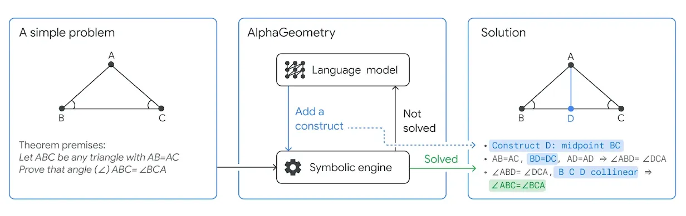
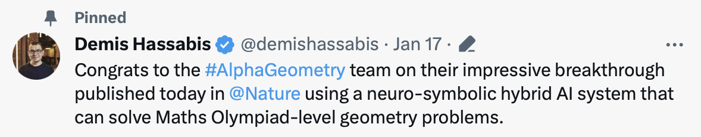
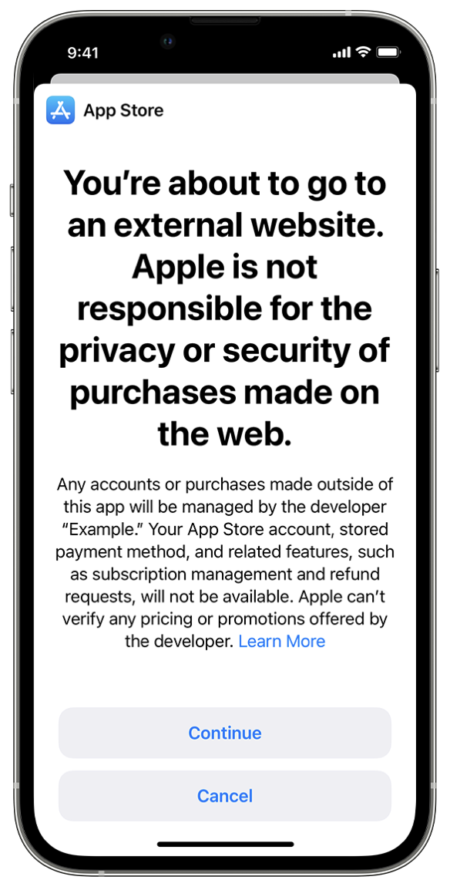

👋👋 ¡Hola, soy Domingo!

Segunda quincena del año, del 16 al 31 de enero y segundo número de la newsletter. Aquí estamos de nuevo, contando cosas que me han interesado en estos últimos quince días. 

¡Muchas gracias por leerme!

<h2>🗞 Noticias</h2>

1️⃣ Empezamos otra vez con <strong>DeepMind</strong>. El 17 de enero publicaron en <a href="https://www.nature.com/articles/s41586-023-06747-5">Nature</a> el artículo<em>
<a href="https://deepmind.google/discover/blog/alphageometry-an-olympiad-level-ai-system-for-geometry/">AlphaGeometry: An Olympiad-level AI system for geometry</a>
</em>, en el que presentan un modelo de lenguaje al que han enseñado a<strong> resolver problemas de geometría</strong>. El modelo consigue una tasa de éxito similar a la de los mejores humanos y supera por mucho a los mejores algoritmos existentes, basados en modelos simbólicos que realizan pruebas automáticas de teoremas.

El modelo se construye a partir de 100 millones de expresiones simbólicas generadas automáticamente que representan relaciones geométricas correctas. A partir de esos datos el modelo es capaz de generalizar y generar construcciones (sacarse conejos de la chistera, como dicen sus autores) que ayudan a la demostración del problema por parte de un motor simbólico. El motor simbólico termina de completar la solución usando la pista añadida por el modelo de lenguaje.

Aunque al principio <strong>Hassabis</strong> aplaudió el avance diciendo en X que era un “avance hacia la AGI”, después moderó su entusiasmo y borró esta frase, quedando un <a href="https://x.com/demishassabis/status/1747669767270306256?s=20">tweet</a> más aséptico.

No está claro cómo usar este trabajo para mejorar los LLMs actuales. El dominio sobre el que se aplica es muy restringido: problemas de geometría. Además, los problemas deben estar formulados en un lenguaje matemático específico y es el humano el que debe traducir el problema geométrico a este lenguaje.

Lo que sí comprobamos una vez más (la quincena pasada fue el ajedrez, esta la geometría) es que la arquitectura de los LLMs puede aprender y generalizar a partir de cualquier cosa, si tenemos un dataset lo suficientemente grande. 

Una de las cosas que se están investigando para acercarse a la AGI es conseguir que los LLMs sean capaces de trabajar con planes. Que aprendan a generarlos, analizarlos, ejecutarlos y modificarlos. 

Seguro que ya hay gente construyendo LLMs que han aprendido no con los programas finales que hay en GitHub, sino con el histórico de cambios que ha llevado a construir ese programa (el histórico de <em>commits,</em> también disponible en GitHub). Como <a href="https://x.com/karpathy/status/1748784260318990496?s=20"><strong>dice Karpathy</strong></a>:

<blockquote>

The ideal training data for an LLM is not what you wrote. It's the full sequence of your internal thoughts and all the individual edits while you wrote it.

</blockquote>

Si queréis echarle un vistazo a cómo funciona el sistema, aquí tenéis el vídeo de explicación de sus autores.

<iframe src="https://www.youtube-nocookie.com/embed/TuZhU1CiC0k?rel=0&amp;autoplay=0&amp;showinfo=0&amp;enablejsapi=0" frameborder="0" loading="lazy" gesture="media" allow="autoplay; fullscreen" allowautoplay="true" allowfullscreen="true" width="728" height="409">
</iframe>

2️⃣ La quincena pasada se me pasó comentar el curioso cacharro de <strong>Rabbit</strong>, el <a href="https://www.rabbit.tech">R1</a>.

Se trata de un interfaz que tiene una cámara, un micrófono, y una pantalla táctil. Es un simpático agente con el que puedes interactuar en lenguaje natural para que un LLM ejecute tus peticiones en un ordenador en la nube. Lo interesante del tema es que el LLM <a href="https://www.rabbit.tech/research">ha sido entrenado</a> con capturas de pantallas y acciones humanas y es capaz de navegar por aplicaciones y páginas web e interactuar con ellas. En la <a href="https://youtu.be/22wlLy7hKP4?si=wBYmdoiYQ_tF2SLF">demo</a> que presentó el CEO de Rabbit en el CES (que tiene más de 5 millones de reproducciones) se ve cómo se usa el aparato para pedir una pizza o reservar un vuelo.

El aparato nos recuerda dispositivos computacionales de ciencia ficción como los de <em>Star Trek</em> o <em>Her</em>. ¿Será esta la nueva forma de interactuar con los computadores?¿Será más fácil interactuar hablando con un computador que usando las interfaces de usuario, las apps, el dedo? Puede ser que para algunas cosas sí, pero en general creo que no, que las interfaces de usuario tradicionales no van a desaparecer. Estoy totalmente de acuerdo con todo lo dicho en el <a href="https://podcasts.apple.com/es/podcast/techmeme-ride-home/id1355212895?i=1000641535216">episodio</a> del podcast <a href="https://podcasts.apple.com/es/podcast/techmeme-ride-home/id1355212895">Techmeme Ride Home</a>, con <strong>John Gruber</strong>, <strong>Chris Messina</strong> y <strong>Brian McCullough</strong>. Muy recomendable.

3️⃣ <strong>Sam Altman</strong> se ha pasado por Davos y hemos escuchado sus intervenciones en varias reuniones públicas. De lo que he oído, lo que me ha parecido más interesante ha sido <a href="https://www.economist.com/subscriber-events/a-conversation-with-openais-sam-altman-and-microsofts-satya-nadella-hub">está entrevista</a> de The Economist junto a <strong>Satya Nadella</strong>, disponible bajo suscripción. Se puede escuchar un resumen y comentario de la entrevista en el <a href="https://www.economist.com/subscriber-events/a-conversation-with-openais-sam-altman-and-microsofts-satya-nadella-hub">episodio</a> del podcast <a href="https://podcasts.apple.com/es/podcast/babbage-from-the-economist/id508376907">Babbage</a> de The Economist.

Algunas frases de Altman en la entrevista:

<blockquote>

El modelo [que da soporte a ChatGPT] se va a hacer más y más inteligente, más capaz […]. El razonamiento es una de las capacidades en las que el modelo va a mejorar […]. Va mejorar en general. Es una de las características de estos modelos, que mejoran en las capacidades generales y eso da lugar a mejoras en características concretas, como escribir mejor código.

</blockquote>

<blockquote>

Supongamos que GPT-4 es capaz de hacer un 10% de las tareas de un ser humano. ¿Cómo va a mejorar GPT-5? ¿Va a ser capaz de hacer un 12%, un 15%, un 20%? Esa es la forma correcta de medir la mejora.

</blockquote>

<blockquote>

Vamos a inventar AGI más pronto de lo que la mayoría de la gente cree.

</blockquote>

<blockquote>

Cada año podremos en circulación un modelo mejor que el modelo del año anterior. Si pones juntos un iPhone 1 y un iPhone 15 te das cuenta de la enorme diferencia entre ambos, de lo malo que era el primero, a pesar de ser una revolución. Y nadie se ha quejado en el camino pidiendo un iPhone mejor. Algo así va a pasar con los modelos. GPT-2 era horrible, GPT-3 era bastante malo, GPT-4 es malo, GPT-5 estará bien [y así hasta llegar a AGI].

</blockquote>

4️⃣ Dos<strong> cambios regionales</strong> muy importantes en la <strong>App Store de Apple</strong>: enlaces a compras externas (en los EEUU) e introducción de App Stores alternativas (en la UE). Se trata de los primeros cambios relevantes en la plataforma de aplicaciones de Apple desde hace casi 15 años, cuando en 2009 se introdujeron las compras In-App.

El primer cambio ya está en vigor para la App Store de EEUU y es consecuencia de la sentencia final del juicio de Epic. La sentencia obliga a Apple a permitir introducir en las apps un enlace que lleve a una web en la que se pueda realizar una compra externa, independientemente de las compras In-App.

Apple ha cumplido la sentencia actualizando sus APIs introduciendo un<em>
<a href="https://developer.apple.com/support/storekit-external-entitlement-us">StoreKit External Purchase Link</a>,</em> pero mantiene su <a href="https://www.error500.net/p/apple-es-el-gran-parasito-de-la-economia">impuesto</a> en un 27% (un 12% para los pequeños desarrolladores) de las compras realizadas. Me ha resultado muy curioso como esto ha enfadado muchísimo a algunos desarrolladores americanos, que se han sentido decepcionados y defraudados con el ánimo recaudatorio del gigante de la manzana. Nunca había oído tan enfadado al bueno de <strong>Casey Liss</strong>, que se ha despachado bien, junto con <strong>Marco Arment</strong>, en el <a href="https://podcasts.apple.com/es/podcast/accidental-tech-podcast/id617416468?i=1000642153355">episodio</a> de <a href="https://podcasts.apple.com/es/podcast/accidental-tech-podcast/id617416468">Accidental Tech Podcast</a> en el que comentan el tema. Como siempre, <strong>John Siracusa</strong> daba el toque de analítico y racional necesario.

Yo no lo veo para tanto. Son negocios. Siempre he sido muy cumplidor con los impuestos, no me quejo de ellos. Ojalá pagara más, eso significa que gano más. Cuando consiga 10.000 € con una app (!), no me importará darle 3.000 a Apple. Son las reglas del juego. Ellos ponen la plataforma, las APIs, las herramientas de desarrollo y no veo mal que se lleven su porcentaje. Son mucho peores las empresas de videojuegos y nadie se queja.

El segundo cambio es mucho más profundo. El próximo 7 de marzo Apple debe cumplir con la <strong>ley de mercados digitales</strong> (DMA, <em>Digital Market Act</em>) de la UE. Y ya <a href="https://developer.apple.com/support/dma-and-apps-in-the-eu/">ha anunciado</a> todos los cambios que llegan a Europa y que lanzará con la próxima actualización de iOS 17.4.

Son más de 600 cambios en las APIs de iOS en las que los desarrolladores de Apple llevan trabajando más de un año. Lo comentan con todo detalle Jason Snell y Mike Hurley en <a href="https://podcasts.apple.com/es/podcast/upgrade/id918152703?i=1000643441406">este episodio</a> de <a href="https://podcasts.apple.com/es/podcast/upgrade/id918152703">Upgrade</a>. También hace un resumen muy bueno Javier Lacort en <a href="https://podcasts.apple.com/es/podcast/loop-infinito-by-applesfera/id1478761830?i=1000643320191">este episodio</a> de<a href="https://podcasts.apple.com/es/podcast/loop-infinito-by-applesfera/id1478761830"> Loop Infinito</a>. 

Lo más relevante será la posibilidad de usar App Stores alternativas (Apple las llama <em>alternative app marketplaces</em>) en las que los desarrolladores pueden distribuir apps sin necesidad de cumplir las guías de contenido ni pagar el canon de Apple. Todas las apps distribuidas deberán haber sido inspeccionadas y aprobadas por Apple (en un proceso denominado <em>notarization</em>) para comprobar que no contiene <em>malware</em>, que cumplan ciertos estándares de privacidad o que no supone un riesgo para el iPhone o para el sistema operativo.

Estas tiendas alternativas también van a tener un impuesto, por el uso de la propiedad intelectual de la plataforma iOS. Los desarrolladores deberán pagar a Apple 0,5 € por cada usuario activo anual por encima del millón de instalaciones. Todavía no se sabe si esto va a ser aceptado por las autoridades europeas. 

Este impuesto no será problema para desarrolladores pequeños (no llegan al millón de instalaciones y no deberán pagar nada), ni para desarrolladores grandes que tengan un buen modelo de negocio (cualquier negocio más o menos rentable le saca a un usuario bastante más de 0,5 € al año). Epic ya ha anunciado que creará su propia tienda. Pero otras empresas como Spotify ya se han quejado a la UE y están haciendo números para ver si les sale rentable. 

Hay muchos más cambios, pero no nos da tiempo a contarlos aquí. Podéis escuchar los podcasts que he comentado antes, o consultar el artículo de <a href="https://sixcolors.com/post/2024/01/apple-changes-app-store-rules-in-the-eu-and-the-world-watches/">Jason Snell</a> o el de <a href="https://daringfireball.net/2024/01/apples_plans_for_the_dma">John Gruber</a>.

5️⃣ ¡<strong>Ya llegan las Vision Pro</strong>! Mañana mismo, día 2 de febrero, ya estarán en las tiendas. Y ayer ya salieron del embargo las primeras <em>reviews</em> de las gafas. Por ejemplo, la de <a href="https://daringfireball.net/2024/01/the_vision_pro">John Gruber</a>, la de <a href="https://www.theverge.com/24054862/apple-vision-pro-review-vr-ar-headset-features-price">The Verge</a> (en el vídeo a continuación) o muchas otras más recopiladas en <a href="https://www.macstories.net/news/what-reviewers-have-learned-about-apple-vision-pro/">la noticia de MacStories</a>. 

<iframe src="https://www.youtube-nocookie.com/embed/hdwaWxY11jQ?rel=0&amp;autoplay=0&amp;showinfo=0&amp;enablejsapi=0" frameborder="0" loading="lazy" gesture="media" allow="autoplay; fullscreen" allowautoplay="true" allowfullscreen="true" width="728" height="409">
</iframe>

Como decíamos en la newsletter pasada, todos hablan de lo espectacular que es poder ver películas como si estuvieras en un cine (por fin se van a poder ver en condiciones las películas en 3D), de los escenarios de Disney y de los conciertos y espectáculos en los que parece que estás justo al lado del escenario. Por mi parte, yo estoy deseando que los desarrolladores se pongan a hacer cosas interactivas chulas, como esta app de un desarrollador independiente que <a href="https://developer.apple.com/news/?id=gvesi4wr">ha resaltado Apple</a> y de la que por ahora solo tenemos una foto.

También me gustaría que Apple explorara nuevas formas de interacción. Por ahora, como muy bien dice <strong>Siracusa</strong> en su artículo <em>
<a href="https://hypercritical.co/2024/01/30/spatial-computing">Spatial Computing</a>
</em>, Apple usa una interacción indirecta en las Vision Pro. Son los ojos los que hacen de puntero y las manos, escondidas, hacen los gestos para coger, desplazar o aumentar de tamaño. 

¿Por qué no se pueden señalar y coger los objetos virtuales en las Vision Pro? Quizás Apple no quiere defectos como el que aparece en un momento del <a href="https://www.wsj.com/video/series/joanna-stern-personal-technology/vision-pro-review-24-hours-in-apples-mixed-reality-headset/05CD2E77-897D-49A9-A87E-9B8A93E3E45F">reportaje de Joanna Stern</a> para el WSJ, en el que está cocinando y pone un temporizador sobre una de las ollas. Podemos ver en varios frames de la secuencia que las gafas no calculan correctamente la profundidad de la mano y el bote que sostiene y que su imagen se mezcla con la del temporizador. 

Tendremos que esperar a versiones futuras más avanzadas para poder jugar a juegos de mesas virtuales interactivos. Incluso parece que por ahora no se puede hacer algo tan aparentemente sencillo como compartir la misma app de cine entre dos personas que están en la misma habitación con las gafas puestas. 

Por ahora es una experiencia demasiado solitaria. Esperemos a versiones futuras, más avanzadas (y más asequibles).

<h2>👷‍♂️ Mis quince días</h2>

🧑‍💻 Mi web personal la tengo parada. Tristemente, no hay nada que contar sobre ello. La quincena que viene tengo que darle un empujón sí o sí.

Para no dejar esto vacío, comento dos herramientas que uso a diario. Las dos son de pago, pero me compensa totalmente el precio por el uso que les doy.

<ul>
<li>

<a href="https://apps.apple.com/es/app/unread-an-rss-reader/id1363637349">Unread</a> (en iPhone): un excelente lector de RSS en el que están todos los blogs, publicaciones, etc. que leo todos los días. Es muy fácil de añadir un RSS: cuando estás en una página en Safari en el iPhone, pulsas "compartir”, seleccionas Unread y la aplicación detecta la URL de la RSS y puedes suscribirte a ella. 

</li>
<li>

<a href="https://apps.apple.com/es/app/things-3/id904280696?mt=12">Things 3</a> (en Mac): para mi la mejor app para gestionar las listas de tareas pendientes. Yo la uso en el Mac y de una forma muy sencilla: tengo un solo proyecto, que llamo “Tareas” en el que guardo todas las tareas pendientes. Y cuando añado una tarea nueva siempre le pongo una fecha. O bien es “Hoy” si hay que hacerla ya mismo o una fecha concreta en el futuro, para que me aparezca en la pantalla de “Hoy” cuando llegue ese día. Y esta pantalla de “Hoy”, en las que aparecen las tareas que debo hacer hoy, es la que uso principalmente para ir tachando las tareas conforme las termino. 
 La app tienes muchísimas más funcionalidades: etiquetas, filtros, múltiples proyectos y sub proyectos. En todos los años que la estoy usando he probado todas estas cosas, pero al final me he quedado con lo más sencillo. Cuando tenga mi web en marcha igual escribo una entrada explicando con detalle todo esto.

</li>
</ul>

📺 Una serie más que recomendable que hemos visto esta quincena: <strong>El otro lado</strong>. Creada por Berto Romero y dirigida por Javier Ruiz Caldera y Alberto de Toro. Es una serie en la que Berto deja la comedia para entrar en el misterio y lo sobrenatural. Buenísimas las interpretaciones, los personajes, la historia y la ambientación. Qué buenas esas revistas de<em> Nueva Dimensión</em> de los 80 (yo también las tengo) o esas cintas VHS con grabaciones del programa en el que Buenafuente es un Jimenez del Oso total.

No había visto <strong>Modelo 77</strong> pero ya he corregido el error. También tiene una ambientación espectacular. En 1977 yo tenía 13 años y creo recordar que vi en las noticias lo de los presos de la Modelo subidos a los tejados de la cárcel. La película muestra perfectamente la situación del país en aquella época. Los abogados laboralistas, la gente de la calle, la ilusión con el cambio que estaba llegando. Frente a ellos los funcionarios de prisiones y jueces del antiguo régimen. Y en medio, los presos. Buenísima.

📖 El libro que estoy leyendo es <strong>Visión ciega</strong>, de Peter Watts. Voy por la mitad y tiene todo lo que me gusta: extraterrestres, naves, experimentos mentales, distopía. La historia te engancha, tiene muchos elementos muy interesantes y la estoy disfrutando un montón. Lo único que se me hace un poco cuesta arriba es ese estilo <em>cyberpunk</em> del autor. Pero bueno, terminas acostumbrándote.

¡Y esto es todo por esta quincena! ¡Nos leemos! 👋👋

