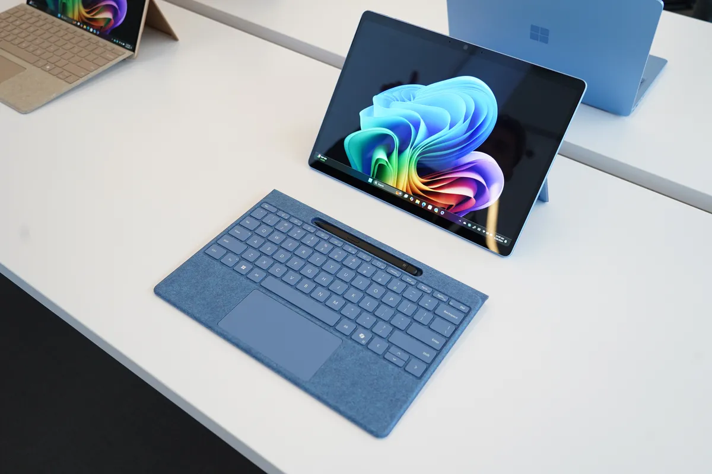
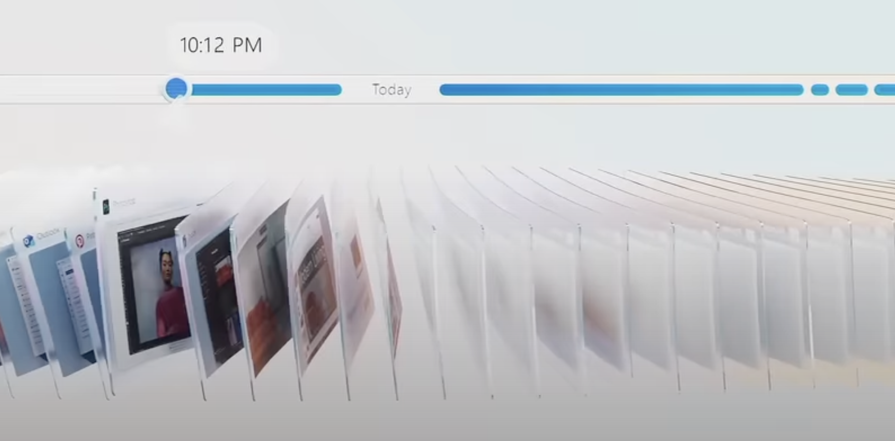
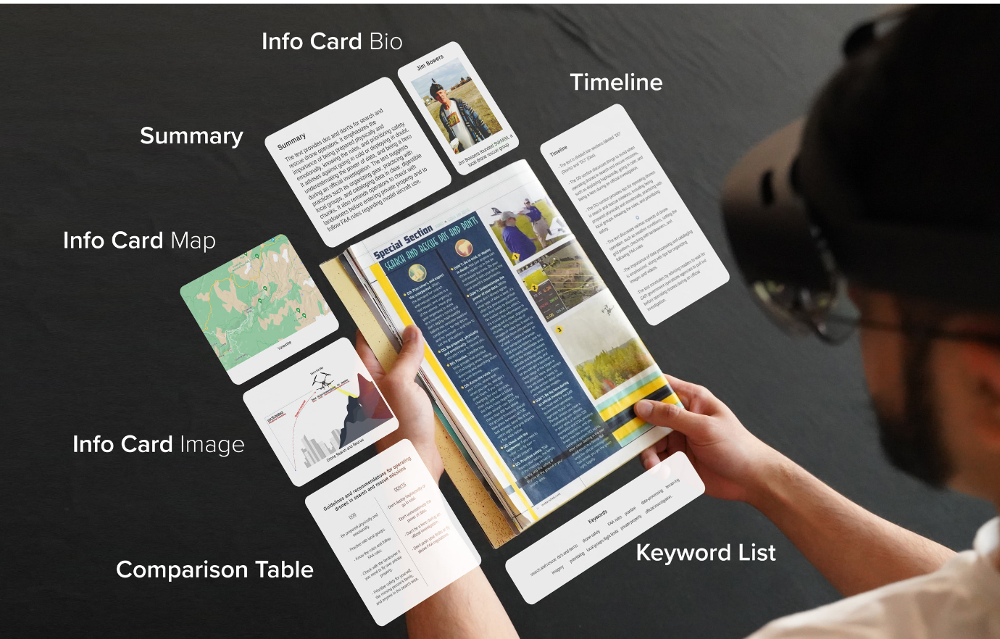
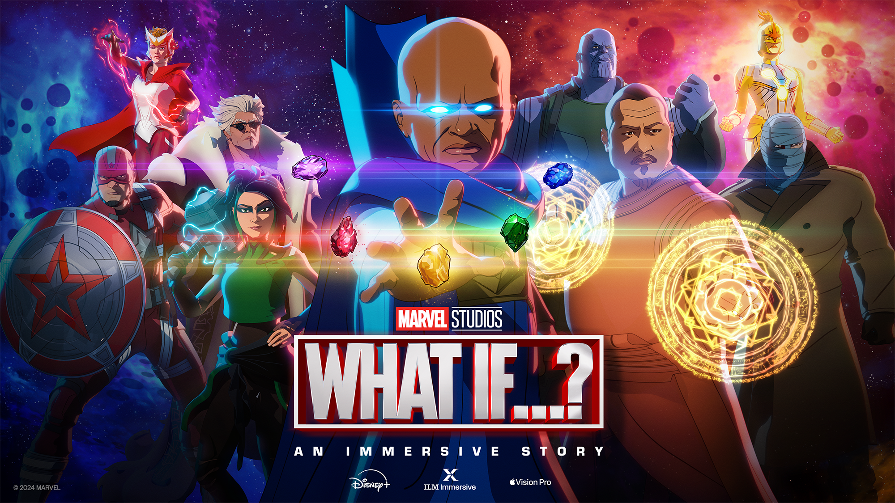
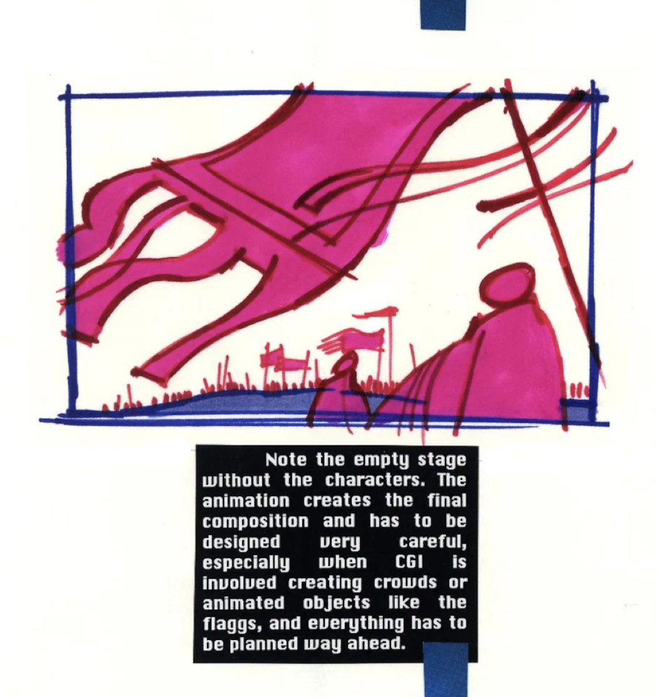
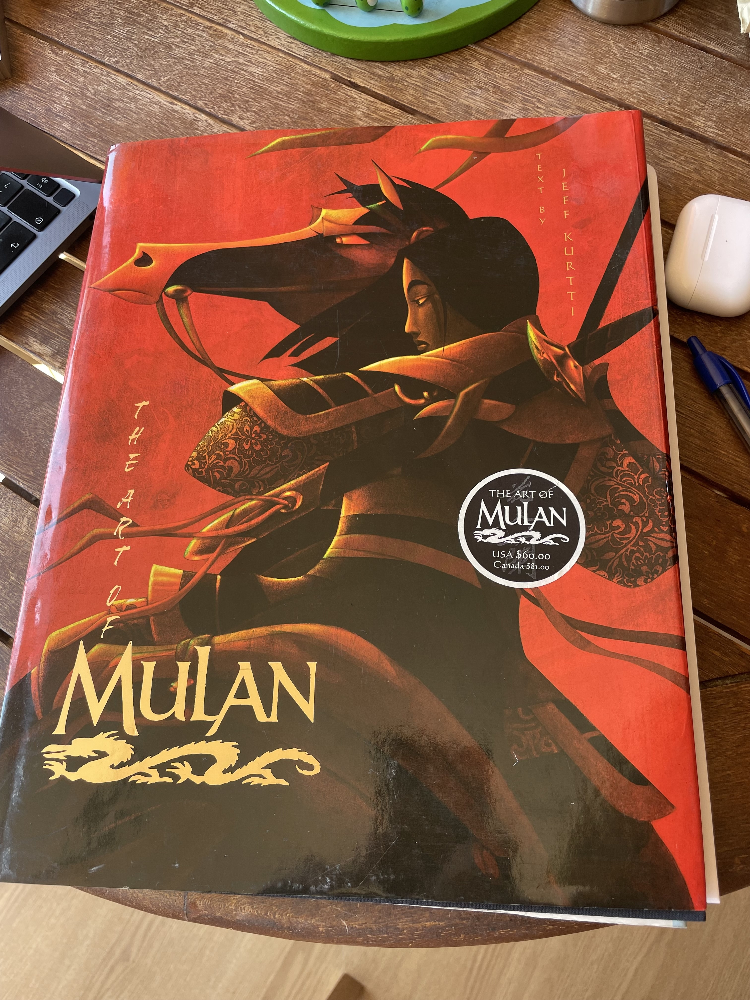
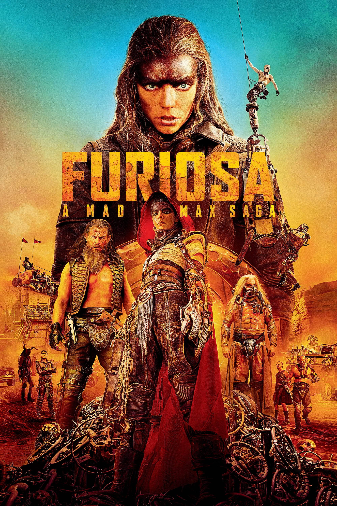
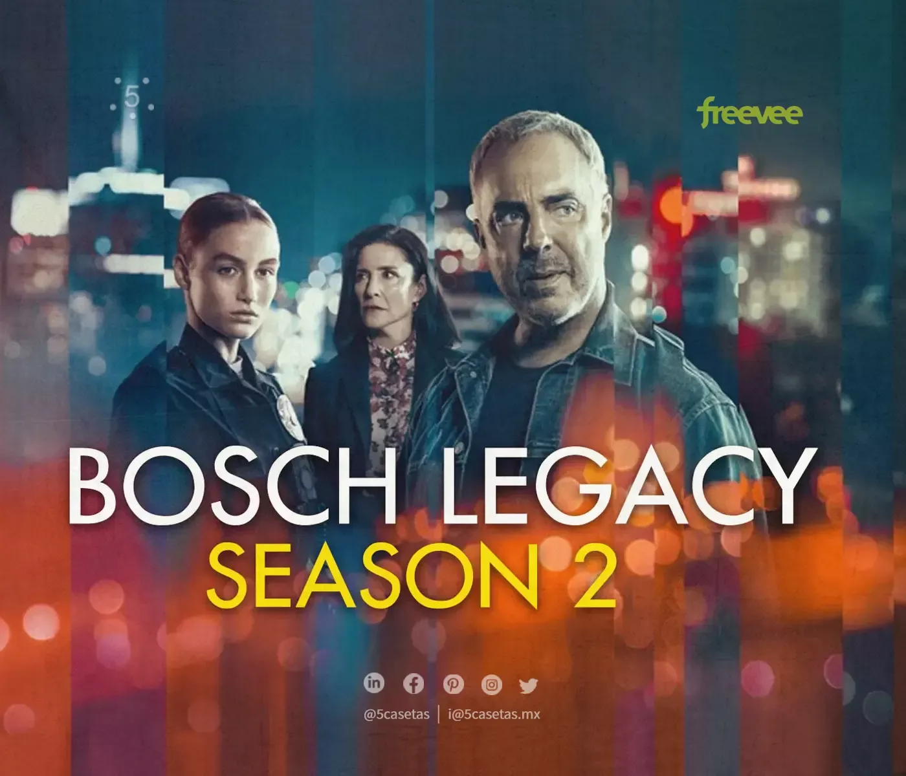

After the previous special issue, this Friday it is time to review what happened in the last fortnight, from May 16 to 31.

Let's get to it. Thank you very much for reading.

## News

1. [Jose Maria Fernandez Gil](https://x.com/jmfdz) is a star. He is a specialist in digital accessibility and an application developer. He has worked at the University of Alicante since 2009, first at the [CAE](https://web.ua.es/es/cae/centro-de-apoyo-al-estudiante.html) (Student Support Center) and later as head of the [Digital Accessibility Unit](https://web.ua.es/es/accesibilidad/). For fifteen years he has been developing applications that help people and promoting the accessibility of the university's websites and online services.

Jose Maria giving a demonstration at the University of Alicante's Digital Accessibility Unit.

On **May 21**, after more than a year of development, he introduced a **subtitling and transcription tool**, an internal application, [Subtitulado y transcripcion - ua.es](https://web.ua.es/es/accesibilidad/subtitulado/), that automatically generates subtitles for videos published on the university platform.

I got to know the application through a beta version that Jose Maria shared with me. I tried it and was surprised by how well it worked and how useful it was. In just a few minutes, after correcting a few transcription mistakes that had not come out right, usually a proper name or a reference the model did not know, I had fully subtitled a video more than 20 minutes long. Without the tool, that would have taken me several hours.

Screen of the subtitling tool.

According to [Jose Maria himself](https://x.com/jmfdz/status/1792825066406993971), the application uses the open speech-recognition model [Whisper](https://openai.com/index/whisper/) and, in the testing phase alone, had already subtitled more than 2,000 videos and 1,500 hours of video.

Now that it is in production and integrated into the university website, it will be a hugely valuable resource. It will make it possible for all videos created by University of Alicante staff to be accompanied by subtitles and thus be accessible to deaf and hard-of-hearing users. And not only to them, but to everyone. Accessibility options make interaction easier in many situations, and sooner or later all of us end up using them.

Congratulations on the great work.

2. On **May 20**, Microsoft presented, at a special event called *Introducing Copilot+ PCs* ([microsoft.com](https://blogs.microsoft.com/blog/2024/05/20/introducing-copilot-pcs/) and [youtube.com](https://youtu.be/aZbHd4suAnQ?si=jwxrJ0rAJbtcK_Ga)), a new version of its **Surface Pro** tablet-laptop with Qualcomm's new **ARM Snapdragon X Elite chip** ([The Verge](https://www.theverge.com/2024/5/20/24160707/microsoft-surface-pro-price-release-date-ai) and [another first look from The Verge](https://www.theverge.com/2024/5/20/24160769/microsoft-surface-pro-2024-hands-on-pictures)). This tablet is Microsoft's answer to Apple's laptops. Qualcomm's ARM chip, together with the ones announced by other manufacturers, is meant to compete with Apple's ARM chips, which have shown excellent performance in power use and computational efficiency. We will see whether this version of Windows for ARM finally becomes popular.[^1]

Microsoft's new Surface Pro, with a Qualcomm ARM chip (photo from The Verge).

A summary of the tablet's features can be seen in Microsoft's ad. Maybe it is because I am used to Apple's ads from the Jonny Ive era, but the style felt like a copy of those years.

<iframe src="https://www.youtube-nocookie.com/embed/jg1ZxdBFEYg?rel=0&amp;autoplay=0&amp;showinfo=0&amp;enablejsapi=0" frameborder="0" loading="lazy" gesture="media" allow="autoplay; fullscreen" allowautoplay="true" allowfullscreen="true" width="728" height="409">
</iframe>

AI may be crucial to the adoption of these ARM computers. **Satya Nadella** focused heavily on Windows features related to AI and introduced the new category of compatible machines called **Copilot+ PCs** ([The Verge](https://www.theverge.com/2024/5/20/24160486/microsoft-copilot-plus-ai-arm-chips-pc-surface-event)), also based on ARM architecture and Qualcomm's chip.

Satya Nadella presenting the new "Copilot+ PC" brand.

Nadella leaned hard into the idea of the "intelligent" computer, one that understands us and helps us through a conversational interface. Microsoft's idea is that of the intelligent "copilot" that watches what we are doing and to which we can ask for help at any moment. In his own words, at the start of the event:

> "The new user interface [enabled by AI] is multimodal and can support text, images, video, both as input and output. We are going to have that. We are going to have a memory that retains important context, that remembers our knowledge and personal data across apps and devices. And we are going to have new reasoning capabilities to help us complete complex tasks.
>
> We are entering this new era where computers not only understand us, but can also anticipate what we want and our intentions."

To be honest, watching the presentation, they did not reveal anything extraordinary related to these copilots. It felt more like a declaration of intent and of future ambitions. The "Copilot+ PC" brand, a rather bad name, is basically a marketing device to define a minimum set of hardware specifications, memory, storage, processor, that computers must have in order to support the new AI features that will be introduced in Windows 11.

Among those features, besides applications for translation and automatic transcription in video calls or for generating and retouching images in photos, the most notable one was the Windows feature they called **Recall**. They spent more than half of the presentation talking about it.

It is a utility that continuously records the user's interaction with the computer and then responds intelligently to any query. For example, imagine that during the last week you visited the page of a hotel while planning a trip, but you do not remember which page exactly. You can ask Recall and it will answer. And the same with anything else you want to recover from something you did on the computer: an email you answered, a video you watched, or a news article you read ([Ars Technica](https://arstechnica.com/gadgets/2024/05/microsofts-new-recall-feature-will-record-everything-you-do-on-your-pc/)).

The Recall feature in Windows 11 will make it possible to record everything you do on your computer and then search that history using AI.

The application has generated some controversy because of the privacy implications ([The Verge](https://www.theverge.com/2024/6/3/24170305/microsoft-windows-recall-ai-screenshots-security-privacy-issues) and [Ars Technica](https://arstechnica.com/ai/2024/06/windows-recall-demands-an-extraordinary-level-of-trust-that-microsoft-hasnt-earned/)).

Microsoft says that the entire process is local, happens on the computer itself, and that Microsoft has no access to anything the computer records. But many people find that difficult to trust. Can the same be guaranteed for the PC manufacturer? Who can assure me that Xiaomi or Dell, to name just two manufacturers, will not access my history? For now it is all still an announcement, and the feature has not yet gone into production. We will see whether it finally ships and under what restrictions.

I find the feature incredibly useful, and I would love Apple to incorporate it into macOS. Mac users have [Rewind](https://www.rewind.ai), which does something similar. But the truth is that I do not trust a startup with the security of my data. Apple, please buy it and integrate the product into macOS.

3. Speaking of **Apple** and AI-related features, next week a flood of news is expected at the opening event of its annual developers conference, **WWDC24**. Right now we still do not have any answers, only many questions.

WWDC24 is almost here.

In the **Upgrade** podcast, **Jason Snell** and **Mike Hurley** do [their draft of what the event might include](https://upgrade.cards/card/apple062024). Very entertaining.

<iframe class="apple-podcast " data-attrs="{&quot;url&quot;:&quot;https://embed.podcasts.apple.com/es/podcast/upgrade/id918152703?i=1000657720299&quot;,&quot;isEpisode&quot;:true,&quot;imageUrl&quot;:&quot;podcast-episode_1000657720299.jpg&quot;,&quot;title&quot;-&quot;The WWDC Keynote Draft 2024&quot;,&quot;podcastTitle&quot;:&quot;Upgrade&quot;,&quot;podcastByline&quot;:&quot;&quot;,&quot;duration&quot;:5090000,&quot;numEpisodes&quot;:&quot;&quot;,&quot;targetUrl&quot;:&quot;https://podcasts.apple.com/es/podcast/the-wwdc-keynote-draft-2024/id918152703?i=1000657720299&amp;uo=4&quot;,&quot;releaseDate&quot;:&quot;2024-06-03T21:00:00Z&quot;}" src="https://embed.podcasts.apple.com/es/podcast/upgrade/id918152703?i=1000657720299" frameborder="0" allow="autoplay *; encrypted-media *;" allowfullscreen="true">
</iframe>

My questions:

- Will they present a local LLM that runs on the phone? What will they use it for?
- Will the agreement with OpenAI be confirmed? What will it consist of, access to GPT-4 or to some other specific model built ad hoc for Apple? In which service will Apple integrate that access? Will it be some free feature of the new version of iOS or part of a paid service? Where will those model queries be integrated, in Siri, in one specific app, or diffused across many "intelligent" features of iOS?
- Will there be a copilot for Xcode, trained for Swift and SwiftUI? Will there be a copilot for Keynote, for example, that automatically creates slides from an existing text, in the way Microsoft is already showing?
- What will Siri's approach be? A conversational agent that can search the web and summarize the information it finds? That would amount to competing directly with OpenAI, and I do not think Apple will go that way. Or an agent that can use the different apps on the phone? I think that is more likely. At least that is what Gurman has been reporting. I think they will use all the infrastructure they already have with Shortcuts and integrate it into a language model that uses Siri.

We will know the answers very soon.

4. **Google** has started integrating AI-generated summaries, called **AI Overviews**, into search results. It has been doing so very cautiously, testing the feature. Several failed answers have gone viral, including the famous "put glue on the cheese for pizza" one ([Ars Technica](https://arstechnica.com/information-technology/2024/05/googles-ai-overview-can-give-false-misleading-and-dangerous-answers/)).

Image generated by DALL-E showing the incident in which an AI suggests using glue on pizza.

Google responded on **May 30**, apologizing, saying that these are exceptions, that the system is working, and that in any case everything will keep improving ([AI Overviews: About last week - blog.google](https://blog.google/products/search/ai-overviews-update-may-2024/)):

> "We have been carefully monitoring feedback and external reports, and taking action on the small number of AI Overviews that violate content policies. This means overviews that include potentially harmful, obscene, or otherwise policy-violating information.
>
> We found a content policy violation in less than one out of every seven million unique queries in which AI Overviews appeared.
>
> At web scale, with billions of queries every day, some oddities and errors are inevitable. We have learned a great deal over the past 25 years about how to build and maintain a high-quality search experience, including how to learn from these mistakes to improve Search for everyone. We will continue improving when and how we show AI Overviews and strengthening our protections, including for edge cases, and we are very grateful for the ongoing feedback."

We still do not know whether Google is definitely going to push in that direction. It is a very large strategic shift, and Google has to move carefully so as not to cannibalize its own web traffic and that of partner sites, which could hurt its business model and its relationship with content creators.

**Antonio Ortiz** has addressed the issue several times in Error500 ([La crisis de Google antes de su verdadera crisis](https://www.error500.net/p/la-crisis-de-google-antes-de-su-verdadera) and [Google tiene que decidir a quien va a perjudicar con su cambio en el buscador. Y rapido](https://www.error500.net/p/google-tiene-que-decidir-a-quien)) and it is also summarized very well in the latest episode of **Monos estocasticos**.

<iframe class="apple-podcast " data-attrs="{&quot;url&quot;:&quot;https://embed.podcasts.apple.com/es/podcast/monos-estoc%25C3%25A1sticos/id1665476262?i=1000657379436&quot;,&quot;isEpisode&quot;:true,&quot;imageUrl&quot;:&quot;podcast-episode_1000657379436.jpg&quot;,&quot;title&quot;-&quot;El peor momento para pagar por ChatGPT Plus, el mejor momento para ser de letras gracias a la IA&quot;,&quot;podcastTitle&quot;:&quot;monos estocásticos&quot;,&quot;podcastByline&quot;:&quot;&quot;,&quot;duration&quot;:4481000,&quot;numEpisodes&quot;:&quot;&quot;,&quot;targetUrl&quot;:&quot;https://podcasts.apple.com/es/podcast/el-peor-momento-para-pagar-por-chatgpt-plus-el/id1665476262?i=1000657379436&amp;uo=4&quot;,&quot;releaseDate&quot;:&quot;2024-05-31T06:56:00Z&quot;}" src="https://embed.podcasts.apple.com/es/podcast/monos-estoc%25C3%25A1sticos/id1665476262?i=1000657379436" frameborder="0" allow="autoplay *; encrypted-media *;" allowfullscreen="true">
</iframe>

> "I think Google still has not fully grasped the mess it is getting into.
>
> Media outlets that are going to come after you, content creators to whom you no longer send traffic, the disappearance of that traffic because you respond to the user and they no longer have any reason to come to my page.
>
> The underlying problem is that, with this leap, Google is making such a change of identity, such a change in its role with respect to information and content, it changes its role so much in economic terms, political terms, and in the responsibilities it assumes, that I think all the processes, culture, and technology you had for the previous role have to be rethought.
>
> This is such a huge leap, if you will allow the expression from the last century, that it will shake Google's foundations if they continue down this path."

As for the incident, to me it is a clear case of cherry-picking driven by the dynamics of social media, which favor making these small incidents, sometimes even invented ones, go viral rather than promoting an objective and unbiased analysis.

As a final element for thinking about Google's future, in the **Decoder** podcast, **Nilay Patel**, editor-in-chief of **The Verge**, interviews **Sundar Pichai**.

<iframe class="apple-podcast " data-attrs="{&quot;url&quot;:&quot;https://embed.podcasts.apple.com/es/podcast/decoder-with-nilay-patel/id1011668648?i=1000656123095&quot;,&quot;isEpisode&quot;:true,&quot;imageUrl&quot;:&quot;podcast-episode_1000656123095.jpg&quot;,&quot;title&quot;-&quot;Google's Sundar Pichai on AI-powered search and the future of the web&quot;,&quot;podcastTitle&quot;:&quot;Decoder with Nilay Patel&quot;,&quot;podcastByline&quot;:&quot;&quot;,&quot;duration&quot;:2680000,&quot;numEpisodes&quot;:&quot;&quot;,&quot;targetUrl&quot;:&quot;https://podcasts.apple.com/es/podcast/googles-sundar-pichai-on-ai-powered-search-and-the/id1011668648?i=1000656123095&amp;uo=4&quot;,&quot;releaseDate&quot;:&quot;2024-05-20T09:00:00Z&quot;}" src="https://embed.podcasts.apple.com/es/podcast/decoder-with-nilay-patel/id1011668648?i=1000656123095" frameborder="0" allow="autoplay *; encrypted-media *;" allowfullscreen="true">
</iframe>

Patel is quite inquisitive and it is obvious that he is not a neutral observer in the matter, he represents a media outlet whose revenue could be affected. But Pichai defends himself well and seems quite convinced that the future of Google's business model depends on integrating AI into search results:

> "People are responding very positively. It is one of the most positive changes I have seen in Search, based on the metrics we look at. People engage more when you give them context. It helps them understand better, and they also engage with the underlying content. In fact, if you include content and links inside AI-generated overviews, they get higher click-through rates than if you put them outside those overviews."

5. I am interested in the **Vision Pro** as a technological novelty because of the way it integrates advanced technologies and algorithms that Apple has developed and that developers can use in the form of APIs. We saw many details of that in last year's WWDC23 ([VisionOS videos from WWDC23 - apple.com](https://developer.apple.com/videos/all-videos/?q=visionOS)) and we will probably see much more in the upcoming WWDC24.

But I am especially interested in it because of the new kinds of experiences that can be created for it.

Simulated image of an augmented-reality application that provides additional information about an article being read.

Both computational and information experiences, such as the one shown above from the paper *RealitySummary: On-Demand Mixed Reality Document Enhancement using Large Language Models* ([paper on arXiv](https://arxiv.org/pdf/2405.18620) and [Andy Matuschak's post on X](https://x.com/andy_matuschak/status/1796933899131781582)), with an example of how augmented reality can be used to complement reading a document, and immersive entertainment experiences, like the ones we have already seen other times in this newsletter.

Along those lines of immersive experiences, on **May 30**, **Marvel released its first "immersive story" for the Vision Pro**: an episode of the **animated series *What If...?*** almost an hour long. Produced by [ILM Immersive](https://www.ilmimmersive.com/), a division of the famous Industrial Light & Magic, it is an experience that combines 3D film, immersive scenes, mixed-reality scenes, and first-person interactions.

Wes Davis from The Verge was not too impressed ([The Verge review](https://www.theverge.com/24166583/marvel-what-if-immersive-story-apple-vision-pro-interactive)), but Jason Snell was convinced by it ([Six Colors review](https://sixcolors.com/post/2024/05/review-what-if-shows-off-the-vision-pros-strengths/)):

> "It is not immersive video and it is not a game. It is something in between, a mixed-media experiment, about an hour long, that tries to use all the features of the Vision Pro to create a respectable entertainment experience. [...] It is difficult to judge *What If...?* in its entirety, because it really does seem like a sample of how this type of entertainment could evolve in the future. Is there room for something that is more interactive than watching television but less interactive than a full videogame? I have no idea. But I do know that the hour I spent with *What If...?* was maybe the best hour I have spent with the device since I got it. If Apple is looking for one app that demonstrates all the Vision Pro features at their best, *What If...?* might be the answer."

In [episode #1931](https://podcasts.apple.com/es/podcast/voices-of-vr/id874947046?i=1000657208339) of the Voices of VR podcast, executive producer Shereif Fattouh and art director Indira Guerrieri are interviewed about the process of creating the story:

> **Shereif Fattouh:**
>
> A lot of the textures for the assets were already done from the seasons, so basically we had to take all these assets and make sure they somehow existed in space, in a 3D space, which really forced us to think about how we were going to preserve the 2D look or how we were going to blend it with the immersive aspects. And we ended up with a kind of combination of being really faithful to the beautiful artwork, the beautiful work that had been done, and adding the spatial dimension by making some elements a bit more realistic, such as the immersive environments.
>
> **Indira Guerrieri:**
>
> Even though we are exploring a new medium, a lot of this already exists in traditional games, especially when you are making immersive or cinematic content for narrative-driven games. The balance lies in how interactive it is going to be, the level of agency you have in that interactivity, and how much of the story rests on the player's shoulders. In this case, we are not making a game but a new form: an immersive story, fully subjective, with certain interactive elements.

We can watch the full experience in videos that many users have uploaded to YouTube. For example, the complete gameplay by the YouTuber **Nathie**, [Marvel's: What If Experience On Apple Vision Pro Is A Blast! (Full Gameplay)](https://youtu.be/htF-_ZQnxpY?si=zVhdRSIAfYMizZh0), reached almost 40,000 views in three days. And user **iBrews** also presents it in full, [WHAT IF? in Apple Vision Pro - lots of commentary](https://youtu.be/AtiMKYbp0nE?si=cxD1PSkUG9hz77TF), with many more comments and exhaustive interaction tests, and the full end credits, which show just how many people took part in creating the story.

Below we can see a few short clips with examples of the different elements they use in the experience.

It starts in mixed reality, with the Watcher and Wong, characters who guide us through the story. Here we see Wong coming out of a portal and stepping into our reality:

3D films are one of the most interesting features of the Vision Pro. The crystal fragments are used very cleverly to project animated stories onto them in three dimensions.

Immersive experiences are static environments in which we watch a scene unfold in front of us. The settings extend around us and we can look to the sides and upward, depending on where the scene is happening. Sometimes the characters approach us and we see them right next to us. The sense of immersion must be incredible. That said, we cannot move forward or backward, only turn our heads.

In summary, it seems to me an enormously high-quality production that is going to set the standard for a long time for future experiences made for the Vision Pro. It has managed to do something very difficult, combining all the possibilities of the device into a unified experience almost an hour long.

I cannot wait for them to start selling it in Spain so I can drop by the Apple Store at La Condomina and try it.

6. On **May 20** I received the issue [*Setting the Stage for "Mulan"*](https://animationobsessive.substack.com/p/setting-the-stage-for-mulan) from the wonderful newsletter [Animation Obsessive](https://animationobsessive.substack.com). It explains the enormous contribution of production designer **Hans Bacher** to *Mulan* (1998). Without him, the film would have been completely different.

Bacher defined a unique visual style that evoked traditional Chinese paintings while preserving Disney's essence. His initial approach, called "poetic simplicity", emphasized minimalism and clarity, drawing on Chinese artistic traditions in which landscapes often represent simplified forms and leave details to the viewer's imagination.

One of Hans Bacher's early designs.

Concept design of the Hun attack.

The studio executives, however, considered the early designs too simple and asked for more detail and more work on the backgrounds. That led to a creative balancing act between artistic simplicity and the richer visual expectations of Disney animation.

Bacher's influence went beyond the conceptual vision. He actively guided the film's art direction through exhaustive style guides that set out fundamental principles for shot composition. Those principles included maintaining a balance between busy and quiet elements, straight and curved lines, and positive and negative space. A PDF version of those guides is available online ([Hans Bacher, 1995: Mulan Style Guide - archive.org](https://archive.org/details/mulan-style-guide-1995/mode/2up)). Bacher has also collected many scenes and early designs on his blog ([One1more2time3's Weblog](https://one1more2time3.wordpress.com/?s=mulan)).

Illustration from Bacher's style guide for *Mulan*.

His insistence on these stylistic rules ensured a cohesive look throughout the film, making every scene visually attractive and narratively clear. By correcting designs and backgrounds, and by leading the art team, Bacher's vision was crucial in shaping *Mulan* into a film that was not only a commercial success, but also a richly visual work of storytelling that resonated with audiences around the world.

A gallery with some scenes from the film:

*Mulan* is one of the Disney films that we have watched the most and that the whole family loves the most. I like everything about it: the designs, the colors, the backgrounds, the editing, the animation, the characters, the story. The combination of computer animation and traditional animation is also very interesting and works very well. The computer graphics are very subtle in some scenes and spectacular in others, like the Hun attack.

I was so fascinated by the film that when I saw its art book at Ateneo I rushed to buy it, despite the 10,000 pesetas and a bit that it cost, more than 60 euros, without even adjusting for inflation.

The *Mulan* art book.

It is a jewel, beautiful. It was one of the first art books for films that I bought. More came afterward, but this is still one of the ones I treasure most. In case you want to see what is inside, here is a video:

<iframe src="https://www.youtube-nocookie.com/embed/55PcKDWNt_w?rel=0&amp;autoplay=0&amp;showinfo=0&amp;enablejsapi=0" frameborder="0" loading="lazy" gesture="media" allow="autoplay; fullscreen" allowautoplay="true" allowfullscreen="true" width="728" height="409">
</iframe>

## My two weeks

Let's go straight to films and series. Nothing new as far as books or other projects are concerned.

### Movies

Looking back through my [Letterboxd](https://letterboxd.com/domingogallardo/), I would highlight from these two weeks [*Furiosa*](https://letterboxd.com/film/furiosa-a-mad-max-saga/), the continuation of the *Mad Max* saga and, above all, the prequel to *Fury Road*. Directed by **George Miller** at the age of 79 and starring **Anya Taylor-Joy** and an unrecognizable **Chris Hemsworth**, it seemed to me a hugely entertaining film, with spectacular photography and landscapes and excellent action sequences. Characters you empathize with, and a very rounded origin story that explains Furiosa's whole previous life until she becomes the heroine of *Fury Road*.

### TV

Of the series we watched during the fortnight, I would highlight **season 2** of *Bosch Legacy* on Prime. Starring the always reliable **Titus Welliver**, the young **Madison Lintz**, who does an excellent job as his daughter Maddie, and Bosch's ever-faithful allies, **Mimi Rogers** and **Chang**.

The series begins with a couple of opening episodes that are pure adrenaline, with Harry trying to find the missing Maddie. The rest of the season continues in line with the previous ones and gives us everything we like about the series. And it ends with a great twist in the last five minutes so that things do not lose momentum ahead of the already confirmed season 3.

---

See you in the next fortnight.

[^1]: Microsoft has been making ARM versions of Windows for more than a decade, since 2012, when Windows RT was launched. In 2017 it released Windows 10 on ARM and in 2021 Windows 11 on ARM. Both operating systems work on the Surface Pro and on other Lenovo and Samsung devices, but they have never been very popular.
