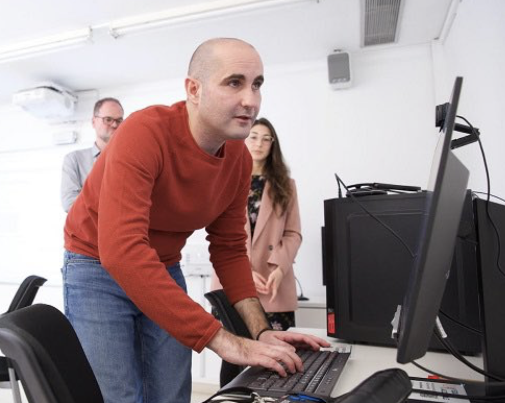
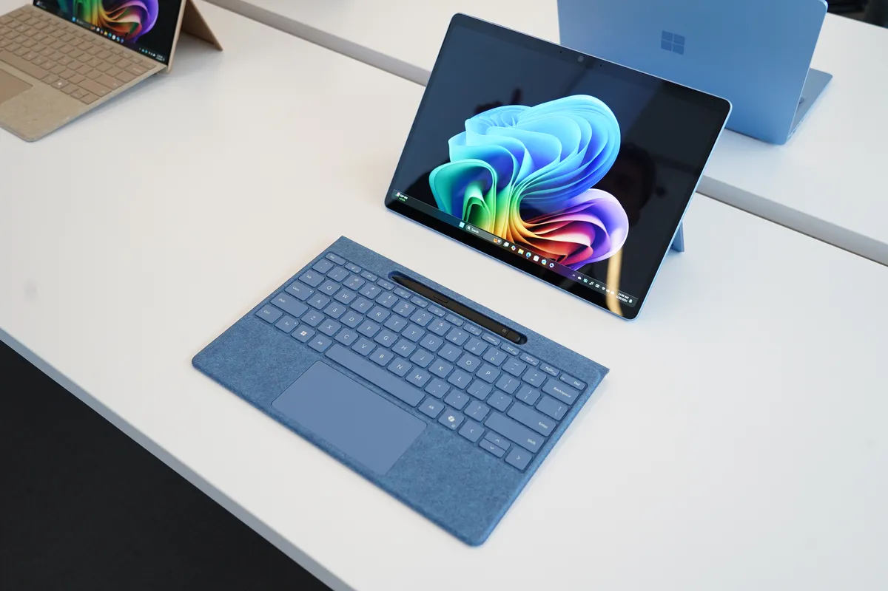
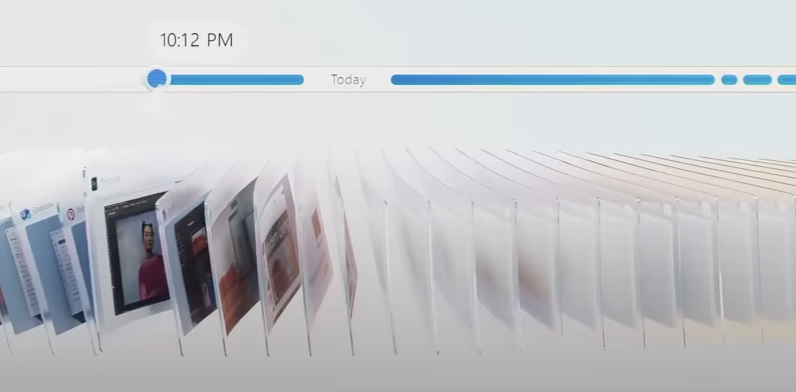
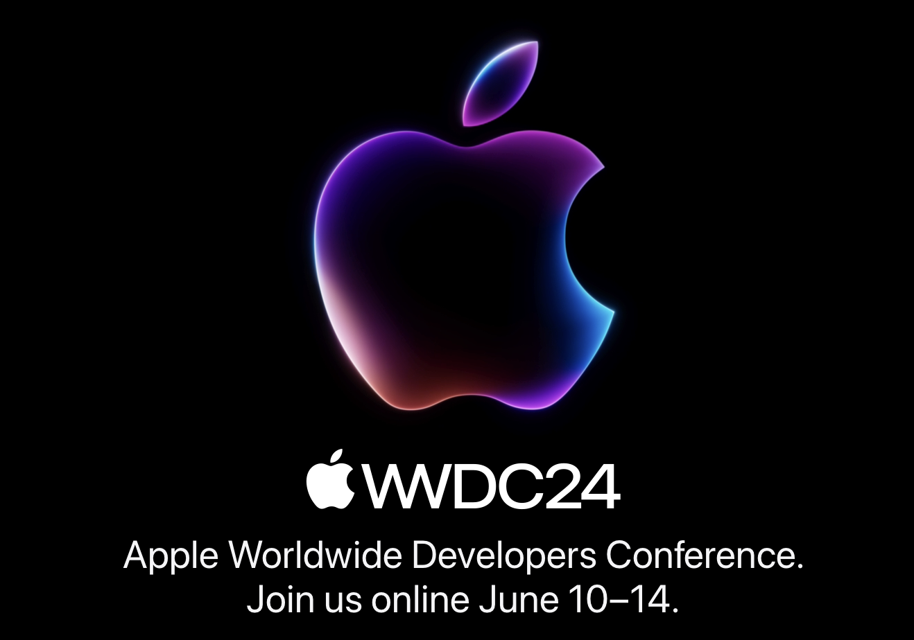
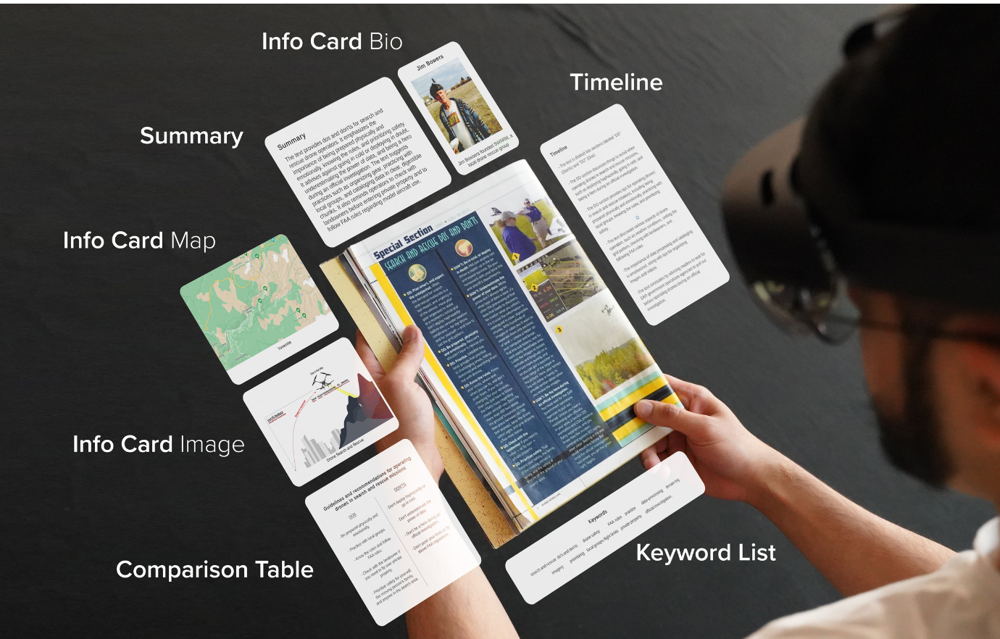
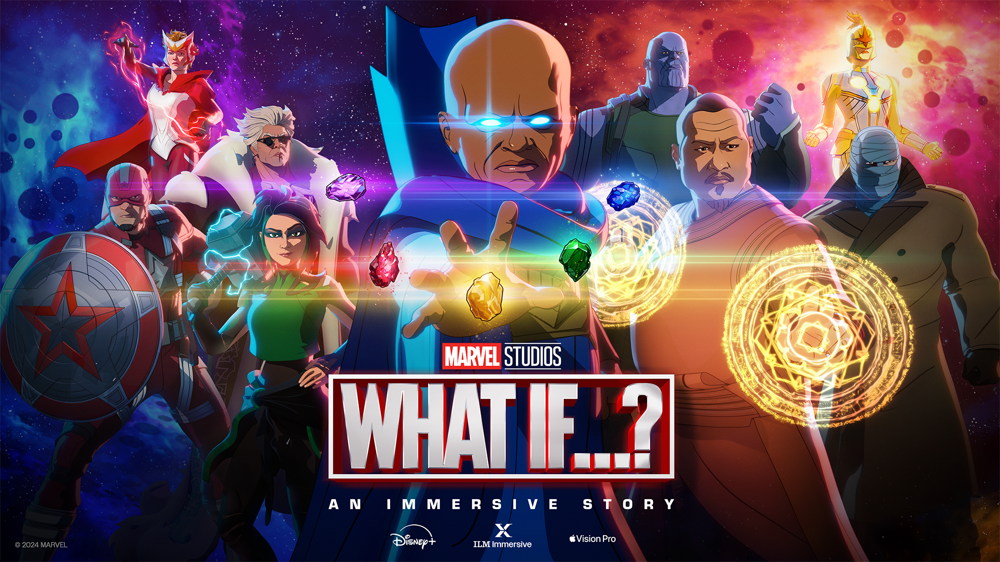
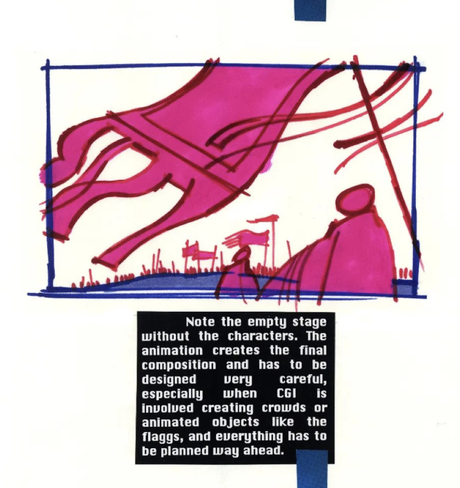
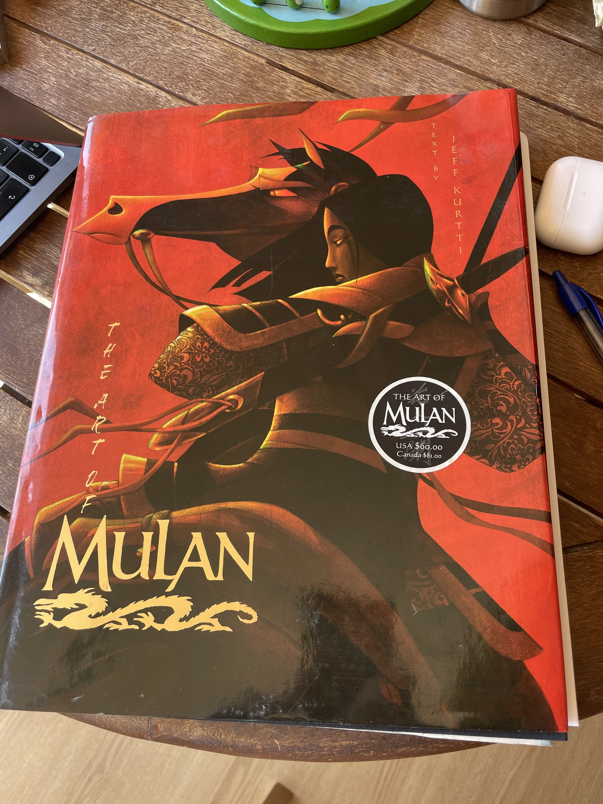
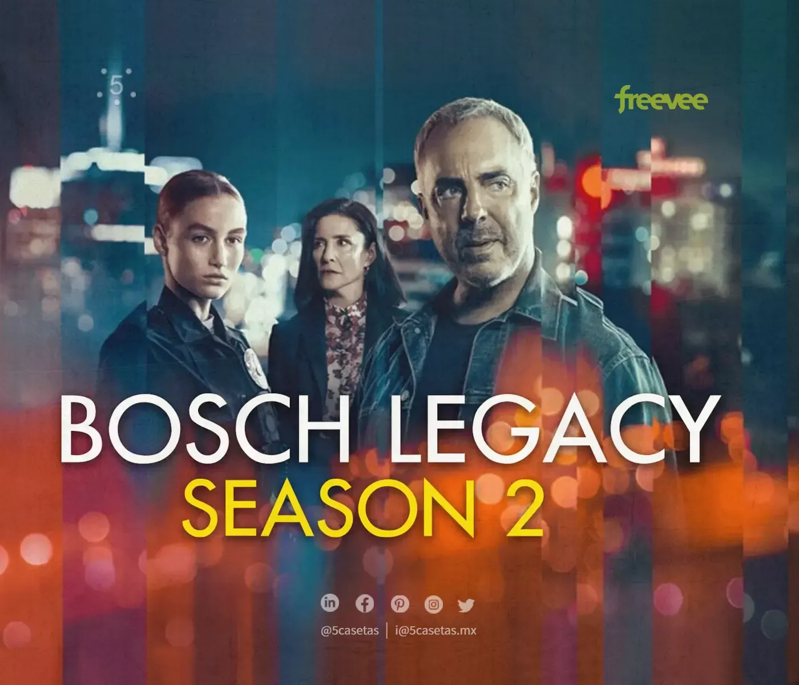

Después del pasado número especial, este viernes nos toca repasar lo sucedido en la quincena pasada, del 16 al 31 de mayo.

 ¡Vamos allá! ¡Muchas gracias por leerme!

<h2>🗞 Noticias</h2>

1️⃣ <a href="https://x.com/jmfdz">José María Fernández Gil</a> es un crack. Es especialista en accesibilidad digital y desarrollador de aplicaciones. Trabaja desde 2009 en la Universidad de Alicante, primero en el <a href="https://web.ua.es/es/cae/centro-de-apoyo-al-estudiante.html">CAE</a> (Centro de Apoyo al Estudiante) y después como responsable de la <a href="https://web.ua.es/es/accesibilidad/">Unidad de Accesibilidad Digital</a>. Lleva quince años desarrollando aplicaciones que ayudan a las personas y promoviendo la accesibilidad de las páginas y webs de la UA.

José María, haciendo una demostración en la Unidad de Accesibilidad Digital de la UA.

El <strong>21 de mayo</strong>, después de un desarrollo de más de un año, presentó una <strong>herramienta de subtitulado y transcripción</strong>, una aplicación interna [<a href="https://web.ua.es/es/accesibilidad/subtitulado/">Subtitulado y transcripción - ua.es</a>] que permite generar automáticamente subtítulos para los vídeos que se publican en la plataforma de la UA. 

Conocí la aplicación en una versión beta que me ofreció José María. La probé y me sorprendió lo bien que funcionaba y lo útil que era. En muy pocos minutos, después de retocar alguna transcripción que no había salido bien (algún nombre propio, o referencia que el modelo no conocía), tenía completamente subtitulado un vídeo de más de 20 minutos de duración. Un trabajo que, sin la herramienta, me hubiera llevado varias horas.

Pantalla de la herramienta de subtitulado.

Según <a href="https://x.com/jmfdz/status/1792825066406993971">comenta José María</a>, la aplicación utiliza el modelo abierto de reconocimiento del habla <a href="https://openai.com/index/whisper/">Whisper</a>, y ya ha subtitulado más de 2.000 vídeos y 1.500 horas de vídeo, en la fase de pruebas. 

Ahora que ya está en producción, integrada en la web de la UA, será un recurso de enorme valor. Hará posible que todos los vídeos creados por el personal de la UA vayan acompañados de subtítulos y, de esta forma, puedan ser accesibles a las personas sordas y con déficit auditivo. Y no solo a ellas, sino a todo el mundo. Las opciones de accesibilidad son algo que nos facilita la interacción en muchas situaciones y que, tarde o temprano, todos terminaremos usando.

¡Enhorabuena por el gran trabajo!

2️⃣ El <strong>20 de mayo</strong>, Microsoft presentó en un evento especial llamado <em>Introducing Copilot+ PCs</em> [<a href="https://blogs.microsoft.com/blog/2024/05/20/introducing-copilot-pcs/">microsoft.com</a> y <a href="https://youtu.be/aZbHd4suAnQ?si=jwxrJ0rAJbtcK_Ga">youtube.com</a>], una nueva versión de su tablet/portátil <strong>Surface Pro</strong> con el nuevo <strong>chip ARM Snapdragon X Elite de Qualcomm</strong> [<a href="https://www.theverge.com/2024/5/20/24160707/microsoft-surface-pro-price-release-date-ai">The new, faster Surface Pro is Microsoft’s all-purpose AI PC - theverge.com</a>]. Esta tablet es la respuesta de Microsoft a los portátiles de Apple [<a href="https://www.theverge.com/2024/5/20/24160769/microsoft-surface-pro-2024-hands-on-pictures">A first look at Microsoft’s new Surface Pro with Arm chips inside - theverge.com</a>]. El chip ARM de Qualcomm, junto con los anunciados de otros fabricantes, pretende competir con los chips ARM de Apple, que han demostrado unas buenísimas prestaciones a nivel de consumo y eficiencia computacional. Veremos si esta vez se populariza esta versión de Windows para ARM<a class="footnote-anchor" data-component-name="FootnoteAnchorToDOM" id="footnote-anchor-1" href="#footnote-1" target="_self">1</a>.

El nuevo Surface Pro de Microsoft, con un chip ARM de Qualcomm (fotografía de The Verge).

Un resumen de las características de esta tablet se puede ver en el anuncio de Microsoft. Quizás sea porque estoy acostumbrado a los anuncios de Apple de la época de Jonny Ive, pero el estilo me pareció una copia de esos tiempos.

<iframe src="https://www.youtube-nocookie.com/embed/jg1ZxdBFEYg?rel=0&amp;autoplay=0&amp;showinfo=0&amp;enablejsapi=0" frameborder="0" loading="lazy" gesture="media" allow="autoplay; fullscreen" allowautoplay="true" allowfullscreen="true" width="728" height="409">
</iframe>

Para la popularización de estos ordenadores con ARM puede ser fundamental la IA. <strong>Satya Nadella</strong> se volcó en las novedades de Windows relacionadas con IA y presentó la nueva gama de ordenadores compatibles llamados “Copilot+ PCs” [<a href="https://www.theverge.com/2024/5/20/24160486/microsoft-copilot-plus-ai-arm-chips-pc-surface-event">Microsoft announces Copilot Plus PCs with built-in AI hardware - theverge.com</a>], también basados en la arquitectura ARM y en el chip de Qualcomm.

Satya Nadella presentando la nueva marca “Copilot+ PC”.

Nadella se volcó en el concepto del ordenador “inteligente”, que nos entiende y nos ayuda usando una interfaz conversacional. La idea de Microsoft del “copiloto” inteligente que observa lo que estamos haciendo y al que podemos pedir ayuda en cualquier momento. En sus propias palabras, al principio del evento:

<blockquote>

“La nueva interfaz de usuario [facilitada por la IA] es multimodal y puede soportar texto, imágenes, video, tanto como entrada como salida. Vamos a tener eso. Vamos a tener una memoria que retiene el contexto importante, que recuerda nuestro conocimiento y datos personales en todas las aplicaciones y dispositivos. Y vamos a tener nuevas capacidades de razonamiento que nos ayuden a completar tareas complejas.

Estamos entrando en esta nueva era donde las computadoras no solo nos entienden, sino que también pueden anticipar lo que queremos y nuestras intenciones.”

</blockquote>

La verdad es que, viendo la presentación, no presentaron nada extraordinario relacionado con estos copilotos, sino fue más una declaración de intenciones y de aspiraciones futuras. La marca “Copilot+PC” (un nombre bastante malo) es un recurso de marketing para definir un conjunto mínimo de especificaciones de hardware (memoria, disco duro, procesador) que deben tener los ordenadores que vayan a soportar las nuevas características de IA que se van a introducir en Windows 11.

Entre estas características, además de algunas aplicaciones de traducción y transcripción automática en videollamadas o de generación y retoque de imágenes en fotos, lo más notable fue la presentación de la funcionalidad de Windows que han llamado Recall. Dedicaron más de la mitad de la presentación a hablar de esta funcionalidad.

Se trata de una utilidad que graba continuamente toda la interacción del usuario con el ordenador y responde de forma inteligente a cualquier consulta. Por ejemplo, imagina que en la última semana visitaste una página de un hotel preparando un viaje, pero no recuerdas qué página en concreto. Puedes preguntárselo a Recall y te responderá. Y así con cualquier cosa que quieras recuperar referida a algo que has hecho con el ordenador: un correo electrónico que respondiste, un vídeo que viste o una noticia que leíste [<a href="https://arstechnica.com/gadgets/2024/05/microsofts-new-recall-feature-will-record-everything-you-do-on-your-pc/">New Windows AI feature records everything you’ve done on your PC - arstechnica.com</a>].

La funcionalidad Recall de Windows 11 va a permitir grabar toda la interacción con el ordenador, y después buscar en esa historia usando una IA.

La aplicación ha generado alguna polémica, por las implicaciones que tiene en cuanto a privacidad [<a href="https://www.theverge.com/2024/6/3/24170305/microsoft-windows-recall-ai-screenshots-security-privacy-issues">Windows AI feature that screenshots everything labeled a security ‘disaster’ - theverge.com</a> y <a href="https://arstechnica.com/ai/2024/06/windows-recall-demands-an-extraordinary-level-of-trust-that-microsoft-hasnt-earned/">Windows Recall demands an extraordinary level of trust that Microsoft hasn’t earned - arstechnica.com</a>].

Microsoft asegura que todo el proceso es local, se realiza en el ordenador, y que ellos no tienen acceso a nada de lo que el ordenador graba. Pero muchos lo ven complicado. ¿Se podrá asegurar lo mismo con el fabricante del PC? ¿Quién me asegura que Xiaomi o Dell (por mencionar dos fabricantes) no accedan a mi historial? Por ahora todo es un anuncio y la funcionalidad todavía no se ha puesto en producción. Veremos si al final termina lanzándose y con qué restricciones.

A mi la funcionalidad me parece utilísima y me encantaría que Apple la incorporara en MacOS. Los usuarios de Mac tenemos la utilidad <a href="https://www.rewind.ai">Rewind</a>, que hace algo parecido. Pero la verdad es que no me fío de la seguridad de mis datos en mandos de una startup. ¡Apple, por favor, cómprala e integra el producto en MacOS!

3️⃣ Hablando de <strong>Apple</strong> y de funcionalidades relacionadas con la IA, la semana que viene se espera un aluvión de noticias en el evento inaugural de su conferencia anual de desarrolladores, la <strong>WWDC24</strong>. Ahora mismo no tenemos todavía noticias, pero sí muchas preguntas.

¡No falta nada para la WWDC24!

En el podcast <strong>Upgrade</strong>
<em>,</em>
<strong>Jason Snell</strong> y <strong>Mike Hurley</strong> hacen la<a href="https://upgrade.cards/card/apple062024"> quiniela del evento</a>. Muy entretenido.

<iframe class="apple-podcast " data-attrs="{&quot;url&quot;:&quot;https://embed.podcasts.apple.com/es/podcast/upgrade/id918152703?i=1000657720299&quot;,&quot;isEpisode&quot;:true,&quot;imageUrl&quot;:&quot;podcast-episode_1000657720299.jpg&quot;,&quot;title&quot;-&quot;The WWDC Keynote Draft 2024&quot;,&quot;podcastTitle&quot;:&quot;Upgrade&quot;,&quot;podcastByline&quot;:&quot;&quot;,&quot;duration&quot;:5090000,&quot;numEpisodes&quot;:&quot;&quot;,&quot;targetUrl&quot;:&quot;https://podcasts.apple.com/es/podcast/the-wwdc-keynote-draft-2024/id918152703?i=1000657720299&amp;uo=4&quot;,&quot;releaseDate&quot;:&quot;2024-06-03T21:00:00Z&quot;}" src="https://embed.podcasts.apple.com/es/podcast/upgrade/id918152703?i=1000657720299" frameborder="0" allow="autoplay *; encrypted-media *;" allowfullscreen="true">
</iframe>

Mis preguntas:

<ul>
<li>

¿Van a presentar algún LLM local, que funciona en el móvil? ¿Qué uso le van a dar?

</li>
<li>

¿Se va a confirmar el acuerdo con OpenAI? ¿En qué va a consistir, en acceso a GPT-4 o en otro modelo específico ad-hoc para Apple? ¿En qué servicio va a integrar Apple este acceso, va a ser algo gratuito de la nueva versión de iOS, o será parte de un servicio de pago? ¿Dónde se van a integrar las consultas a este modelo? ¿En Siri, en alguna aplicación específica o difuminado en múltiples funcionalidades “inteligentes” de iOS?

</li>
<li>

¿Va a haber un <em>copilot</em> para Xcode, entrenado para Swift y SwiftUI? ¿Va a haber un <em>copilot</em> para Keynote (por ejemplo), que haga automáticamente las diapositivas a partir de un texto previo, al estilo de lo que está haciendo Microsoft?

</li>
<li>

¿Cuál va a ser el enfoque de Siri? ¿Un agente conversacional que puede consultar la web y resumir la información que encuentra? Eso sería intentar competir con OpenAI y no creo que vayan por ahí. ¿O un agente que puede usar las distintas aplicaciones del móvil? Por ahí creo que irán los tiros. Al menos, es lo que anuncia Gurman. Creo que usarán toda la infraestructura que tienen ya montada con Atajos, para integrarla en un modelo de lenguaje que use Siri.

</li>
</ul>

Pronto conoceremos las respuestas.

4️⃣ <strong>Google</strong> ha empezado a integrar los resúmenes generados por IA (llamados <strong>AI Overviews</strong>) en los resultados de las búsquedas. Lo ha empezado a hacer de forma tímida, tanteando la funcionalidad. Se han hecho virales varias contestaciones fallidas (la famosa “ponle pegamento al queso para la pizza”) [<a href="https://arstechnica.com/information-technology/2024/05/googles-ai-overview-can-give-false-misleading-and-dangerous-answers/">Google’s “AI Overview” can give false, misleading, and dangerous answers - arstechnica.com</a>].

Imagen generada por DALL-E mostrando el incidente donde una IA sugiere usar pegamento en la pizza.

Google ha respondido, el <strong>30 de mayo</strong>, disculpándose, diciendo que son excepciones, que el sistema está funcionando y que, en cualquier caso, todo se va ir mejorando [<a href="https://blog.google/products/search/ai-overviews-update-may-2024/">AI Overviews: About last week - blog.google</a>]:

<blockquote>

“Hemos estado vigilando atentamente los comentarios y los informes externos, y tomando medidas sobre el pequeño número de resúmenes generados por IA que violan las políticas de contenido. Esto significa resúmenes que contienen información potencialmente dañina, obscena o de otro modo violatoria. Encontramos una violación de la política de contenido en menos de una por cada siete millones de consultas únicas en las que aparecieron resúmenes generados por IA. 
 A la escala de la web, con miles de millones de consultas cada día, es inevitable que haya algunas rarezas y errores. Hemos aprendido mucho en los últimos 25 años sobre cómo construir y mantener una experiencia de búsqueda de alta calidad, incluyendo cómo aprender de estos errores para mejorar la búsqueda para todos. Seguiremos mejorando cuándo y cómo mostramos los resúmenes generados por IA y fortaleciendo nuestras protecciones, incluyendo para casos excepcionales, y estamos muy agradecidos por los comentarios continuos.”

</blockquote>

Todavía no sabemos si Google va tirar por ahí definitivamente. Se trata de un cambio de estrategia muy grande, y Google debe ir con pies de plomo para no canibalizar su propio tráfico web y el de los sitios de sus socios, lo que podría perjudicar su modelo de negocio y las relaciones con los creadores de contenido.

<strong>Antonio Ortiz</strong> ha tocado el tema varias veces en Error500 [<a href="https://www.error500.net/p/la-crisis-de-google-antes-de-su-verdadera">La crisis de Google antes de su verdadera crisis</a>, <a href="https://www.error500.net/p/google-tiene-que-decidir-a-quien">Google tiene que decidir a quien va a perjudicar con su cambio en el buscador. Y rápido</a>] y lo resumen muy bien en el último episodio de <strong>Monos estocásticos</strong>.

<iframe class="apple-podcast " data-attrs="{&quot;url&quot;:&quot;https://embed.podcasts.apple.com/es/podcast/monos-estoc%25C3%25A1sticos/id1665476262?i=1000657379436&quot;,&quot;isEpisode&quot;:true,&quot;imageUrl&quot;:&quot;podcast-episode_1000657379436.jpg&quot;,&quot;title&quot;-&quot;El peor momento para pagar por ChatGPT Plus, el mejor momento para ser de letras gracias a la IA&quot;,&quot;podcastTitle&quot;:&quot;monos estocásticos&quot;,&quot;podcastByline&quot;:&quot;&quot;,&quot;duration&quot;:4481000,&quot;numEpisodes&quot;:&quot;&quot;,&quot;targetUrl&quot;:&quot;https://podcasts.apple.com/es/podcast/el-peor-momento-para-pagar-por-chatgpt-plus-el/id1665476262?i=1000657379436&amp;uo=4&quot;,&quot;releaseDate&quot;:&quot;2024-05-31T06:56:00Z&quot;}" src="https://embed.podcasts.apple.com/es/podcast/monos-estoc%25C3%25A1sticos/id1665476262?i=1000657379436" frameborder="0" allow="autoplay *; encrypted-media *;" allowfullscreen="true">
</iframe>

<blockquote>

“Google creo que todavía no ha asumido el jardín en el que se está metiendo.

Medios que se te van a echar encima, creadores de contenido a los que ya no envías tráfico, la desaparición de ese tráfico por culpa de que tú respondes al usuario y ya no tiene motivos para venir a mi página. 

El problema de fondo es que Google, en este salto, creo que realiza un cambio tal de identidad, un cambio tal de su rol respecto a la información y el contenido …, cambia tanto tu rol en términos económicos, términos políticos, en las responsabilidades que asumes, que creo que todos los procesos, cultura y tecnología que tienes para el rol anterior tienen que ser repensados. 

Este es un salto tan pistonudo, si me permita la expresión del siglo pasado, que hará que se tambaleen los cimientos de Google si siguen por este camino.”

</blockquote>

Con respecto al incidente, para mi es un claro “cherry-picking” provocado por la dinámica de las redes sociales, que favorece que se hagan virales estos pequeños incidentes (alguna vez incluso inventados) en lugar de promover un análisis objetivo y no sesgado.

Como último elemento para el análisis del futuro de Google, en el podcast <strong>Decoder</strong>, <strong>Nilay Patel</strong>, editor jefe de <strong>The Verge</strong> entrevista a su CEO <strong>Sunday Pichai</strong>. 

<iframe class="apple-podcast " data-attrs="{&quot;url&quot;:&quot;https://embed.podcasts.apple.com/es/podcast/decoder-with-nilay-patel/id1011668648?i=1000656123095&quot;,&quot;isEpisode&quot;:true,&quot;imageUrl&quot;:&quot;podcast-episode_1000656123095.jpg&quot;,&quot;title&quot;-&quot;Google's Sundar Pichai on AI-powered search and the future of the web&quot;,&quot;podcastTitle&quot;:&quot;Decoder with Nilay Patel&quot;,&quot;podcastByline&quot;:&quot;&quot;,&quot;duration&quot;:2680000,&quot;numEpisodes&quot;:&quot;&quot;,&quot;targetUrl&quot;:&quot;https://podcasts.apple.com/es/podcast/googles-sundar-pichai-on-ai-powered-search-and-the/id1011668648?i=1000656123095&amp;uo=4&quot;,&quot;releaseDate&quot;:&quot;2024-05-20T09:00:00Z&quot;}" src="https://embed.podcasts.apple.com/es/podcast/decoder-with-nilay-patel/id1011668648?i=1000656123095" frameborder="0" allow="autoplay *; encrypted-media *;" allowfullscreen="true">
</iframe>

Patel es bastante inquisitivo y se nota que es parte en el asunto (es representante de un medio de comunicación que puede verse afectado en sus ingresos). Pero Pichai se defiende bien y parece bastante convencido de que el futuro del modelo de negocio de Google pasa por la integración de la IA en los resultados de las búsquedas:

<blockquote>

"Las personas están respondiendo muy positivamente. Es uno de los cambios más positivos que he visto en las búsquedas, según las métricas que observamos. Las personas interactúan más cuando se les proporciona contexto. Esto les ayuda a entender mejor, y también se comprometen con el contenido subyacente. De hecho, si incluyes contenido y enlaces dentro de los resúmenes generados por IA, obtienen tasas de clics más altas que si los pones fuera de estos resúmenes."

</blockquote>

5️⃣ Las <strong>Vision Pro</strong> me interesan como una novedad tecnológica, por la integración de tecnologías y algoritmos avanzados que Apple ha desarrollado y pueden ser usados por los desarrolladores en forma de APIs (hemos visto muchos detalles de esto en la pasada WWDC23&nbsp;[<a href="https://developer.apple.com/videos/all-videos/?q=visionOS">Videos sobre VisionOS en WWDC23- apple.com</a>]&nbsp;y veremos mucho más todavía en la próxima WWDC24).

Pero también me interesan sobre todo por las nuevas experiencias que pueden crearse en ellas. 

Imagen simulada de una aplicación de realidad aumentada que proporciona información adicional a un artículo que se está leyendo.

Tanto experiencias computacionales y de interacción con la información, como la imagen anterior del artículo <em>RealitySummary: On-Demand Mixed Reality Document Enhancement using Large Language Models</em>&nbsp;[<a href="https://arxiv.org/pdf/2405.18620">paper - arxiv.org</a>&nbsp;y&nbsp;<a href="https://x.com/andy_matuschak/status/1796933899131781582">post de Andy Matuschak - x.com</a>]&nbsp;con un ejemplo de cómo se puede usar la realidad aumentada para complementar la lectura de un documento, como experiencias de entretenimiento inmersivas, como las que ya hemos visto otras veces en esta newsletter.

En la línea de estas experiencias inmersivas, <strong>el 30 de mayo</strong>, <strong>Marvel publicaba su primera "historia inmersiva" para las Vision Pro</strong>: un episodio de la <strong>serie animada "What If...?"</strong> de casi una hora de duración. Producido por el estudio&nbsp;<a href="https://www.ilmimmersive.com/">ILM Immersive</a>, una división de la famosa Industrial Light &amp; Magic, se trata de una experiencia que combina películas 3D, escenas inmersivas, escenas en realidad mixta e interacciones en primera persona.

A Wes Davis, de The Verge no le impresionó demasiado&nbsp;[<a href="https://www.theverge.com/24166583/marvel-what-if-immersive-story-apple-vision-pro-interactive">Marvel’s What If…? Vision Pro app is an awkward mix of video game and movie - theverge.com</a>], pero a Jason Snell sí que le convenció&nbsp;[<a href="https://sixcolors.com/post/2024/05/review-what-if-shows-off-the-vision-pros-strengths/">Review: “What If?” shows off the Vision Pro’s strengths - sixcolors.com</a>]:

<blockquote>

&nbsp;No es un vídeo inmersivo ni un juego. Es algo entre los dos, un experimento de medios-mixtos, de alrededor de una hora de duración, que intenta usar todas las características de las Vision Pro para conseguir una experiencia de entretenimiento respetable. &nbsp;[...] &nbsp;Es difícil juzgar "What If?" en su totalidad, porque realmente parece una muestra de cómo este tipo de entretenimiento podría evolucionar en el futuro. ¿Hay espacio para algo que sea más interactivo que ver televisión, pero menos interactivo que un videojuego completo? No tengo idea. Pero sí sé que la hora que pasé con "What If?" fue tal vez la mejor hora que he pasado con el dispositivo desde que lo obtuve. Si Apple está buscando una aplicación que demuestre todas las características del Vision Pro en su mejor forma, "What If?" podría ser la respuesta.

</blockquote>

En el&nbsp;<a href="https://podcasts.apple.com/es/podcast/voices-of-vr/id874947046?i=1000657208339">episodio #1931</a>&nbsp;del podcast Voices of VR, se entrevista al productor ejecutivo Shereif Fattouh y a la directora de arte Indira Guerrieri sobre el proceso de creación de esta historia:

<blockquote>

Shereif Fattouh:

Muchas de las texturas de los assets ya estaban hechas de las temporadas, así que básicamente tuvimos que tomar todos estos assets y asegurarnos de que de alguna manera existieran en el espacio, en un espacio 3D, lo cual realmente nos obligó a reflexionar sobre cómo íbamos a mantener el aspecto 2D o cómo íbamos a mezclarlo con los aspectos inmersivos. Y terminamos con una especie de combinación de ser realmente fieles a la hermosa obra de arte, al hermoso trabajo que se hizo, y agregar la dimensión espacial haciendo todo un poco más realista en algunos elementos, como los entornos inmersivos.

Indira Guerrieri:

Aunque estamos explorando un medio nuevo, mucho de esto ya está en los juegos tradicionales, especialmente cuando estás haciendo un contenido inmersivo o cinemático para juegos basados en narrativa. El balance está en cuánto va a ser interactivo, el nivel de agencia que tienes en la interactividad, y en cuánto de la historia va a estar en los hombros del jugador. En este caso, no estamos haciendo un juego, sino una nueva forma. Una historia inmmersiva, totalmente subjetiva, con ciertos elementos interactivos.

</blockquote>

Podemos ver la experiencia completa en vídeos que muchos usuarios han subido a YouTube. Por ejemplo, el gameplay completo del <em>youtuber</em>
<strong>Nathie</strong>&nbsp;[<a href="https://youtu.be/htF-_ZQnxpY?si=zVhdRSIAfYMizZh0">Marvel's: What If Experience On Apple Vision Pro Is A Blast! (Full Gameplay) - youtu.be</a> ]&nbsp;ha alcanzado en tres días casi 40.000 visualizaciones. Y el usuario <strong>iBrews</strong> la presenta también completa&nbsp;[<a href="https://youtu.be/AtiMKYbp0nE?si=cxD1PSkUG9hz77TF">WHAT IF? in Apple Vision Pro - lots of commentary - youtu.be</a>], con muchos más comentarios y pruebas exhaustivas de interacción (y los títulos de crédito completos al final, que muestran la cantidad de personas que han participado en la creación de la historia).

A continuación podemos ver algunos vídeos cortos con ejemplos de los distintos elementos que usan en la experiencia.

Empieza con realidad mixta, con el Vigilante y Wong, personajes que nos guían en la historia. Aquí vemos a Wong, saliendo de un portal y entrando en nuestra realidad:

Las películas en 3D son una de las características más interesantes de las Vision Pro. Los fragmentos de cristal se usan de forma muy inteligente para proyectar en ellos historias animadas en tres dimensiones.

Las experiencias inmersivas son escenarios estáticos en los que vemos una escena que se desarrolla frente a nosotros. Los escenarios se extienden alrededor nuestro y podemos mirar a los lados, y arriba, dependiendo de donde se esté desarrollando la escena. A veces los personajes se acercan y los vemos a nuestro lado. La sensación de inmersión debe ser buenísima. Eso sí, no podemos movernos hacia adelante ni hacia atrás, solo girar la cabeza. 

En resumen, a mi me ha parecido una producción de enorme calidad, que va a marcar el estándar durante mucho tiempo para las futuras experiencias que se realicen para las Vision Pro. Ha conseguido hacer algo muy complicado como es combinar todas las posibilidades del dispositivo en una experiencia unificada de casi una hora de duración.

Estoy deseando que las vendan en España, para pasarme por la tienda de la Condomina a probarlas.

6️⃣ El <strong>20 de mayo</strong> recibí el número <a href="https://animationobsessive.substack.com/p/setting-the-stage-for-mulan">Setting the Stage for 'Mulan'</a> de la estupenda newsletter <a href="https://animationobsessive.substack.com">Animation Obsessive</a>. En él se explica la enorme contribución del diseñador de producción <strong>Hans Bacher</strong> a <em>Mulán</em> (1998). Sin él, la película hubiera sido totalmente distinta.

Bacher definió un estilo visual único, que emulaba las pinturas tradicionales chinas, manteniendo al mismo tiempo la esencia de Disney. Su enfoque inicial, denominado "simplicidad poética", enfatizó el minimalismo y la claridad, inspirándose en las tradiciones artísticas chinas donde los paisajes a menudo representan formas simplificadas, dejando los detalles a la imaginación del espectador. 

Uno de los diseños iniciales de Hans Bacher.

Diseño conceptual del ataque de los hunos.

Los responsables del estudio, sin embargo, consideraron los diseños iniciales demasiado simples y pidieron más detalles y más trabajo en los fondos. Esto implicó un proceso creativo de equilibrar la simplicidad artística con las expectativas detalladas del estilo de animación de Disney. 

La influencia de Bacher se extendió más allá de su visión conceptual. Guió activamente la dirección artística de la película a través de guías de estilo exhaustivas que delineaban principios fundamentales para la composición de las tomas. Estos principios incluían mantener un equilibrio entre elementos ocupados y tranquilos, líneas rectas y curvas, y espacios positivos y negativos. Hay disponible en internet una versión en PDF de estas guías [<a href="https://archive.org/details/mulan-style-guide-1995/mode/2up">Hans Bacher, 1995: Mulan Style Guide - archive.org</a>]. También Bacher ha recopilado en su blog muchas escenas y diseños iniciales (<a href="https://one1more2time3.wordpress.com/?s=mulan">One1more2time3’s Weblog</a>).

Ilustración de la guía de estilo de Bacher para Mulán.

Su insistencia en estas reglas estilísticas aseguró una apariencia cohesiva a lo largo de la película, haciendo que cada escena fuera visualmente atractiva y narrativamente clara. Al corregir diseños y fondos, y liderar al equipo artístico, la visión de Bacher fue crucial para moldear <em>Mulán</em> en una película que no solo fue un éxito comercial, sino también una obra de narración visualmente rica que resonó con audiencias en todo el mundo.

Una galería con algunas de las escenas de la película:

<em>Mulán</em> es una de las películas de Disney que más hemos visto y que más nos gusta a toda la familia. Me gusta todo de ella: los diseños, los colores, los fondos, el montaje, la animación, los personajes, la historia. También es muy curiosa y funciona muy bien la mezcla de animación por ordenador y animación tradicional. Los gráficos por ordenador son muy sutiles en algunas escenas y muy espectaculares en otras, como el ataque de los hunos.

Me fascinó tanto la película, que cuando vi en Ateneo su libro de arte me lancé a comprarlo, a pesar de las 10.000 pesetas y pico que costaba (más de 60€, sin ajustar la inflación). 

El libro de arte de Mulán.

Es una joya, precioso. Fue uno de los primeros libros de arte de películas que compré. Después cayeron más, pero este sigue siendo uno de los que más aprecio. Por si queréis ver su contenido, aquí dejo un vídeo:

<iframe src="https://www.youtube-nocookie.com/embed/55PcKDWNt_w?rel=0&amp;autoplay=0&amp;showinfo=0&amp;enablejsapi=0" frameborder="0" loading="lazy" gesture="media" allow="autoplay; fullscreen" allowautoplay="true" allowfullscreen="true" width="728" height="409">
</iframe>

<h2>👷‍♂️ Mis quince días</h2>

Vamos directamente a las películas y las series. Nada nuevo en cuanto a libros ni a otros proyectos.

<h3>🍿 Cine</h3>

Repasando mi <a href="https://letterboxd.com/domingogallardo/">letterboxd</a> (cada vez me fio menos de mi memoria), destaco de estos quince días la película <em>
<strong>
<a href="https://letterboxd.com/film/furiosa-a-mad-max-saga/">Furiosa</a>
</strong>
</em>, la continuación de la saga <em>Mad Max</em> (y, sobre todo, precuela de <em>Fury Road</em>). Dirigida por <strong>George Miller</strong> (79 años) y protagonizada por <strong>Anya Taylor-Joy</strong> y un irreconocible <strong>Chris Hemsworth</strong>. Me pareció una película súper entretenida, con una fotografía y unos paisajes espectaculares y con unas secuencias de acción buenísimas. Personajes con los que empatizas y una “origin story” muy redonda, que explica muy bien toda la vida previa de Furiosa, hasta convertirse en la heroína de Fury Road.

<h3>📺 TV</h3>

De las series que hemos visto en la quincena, destaco la <strong>temporada 2</strong> de <em>
<strong>Bosch Legacy</strong>
</em> en Prime. Protagonizada por el bueno de <strong>Titus Welliver</strong>, la joven <strong>Madison Lintz</strong> (que hace estupendamente el papel de su hija Maddie) y los siempre fieles amigos de Bosh, <strong>Mimi Rogers</strong> y <strong>Chang</strong>.

La serie comienza con un par de episodios iniciales que son pura adrenalina, con Harry intentando encontrar a la desaparecida Maddie. Sigue un resto de temporada en la línea de las anteriores, que nos da todo lo que nos gusta de la serie. Y termina con un gran giro final, en los últimos cinco minutos, para que no decaiga la cosa de cara a la ya confirmada temporada 3.

¡Hasta la próxima quincena, nos leemos! 👋👋

<a id="footnote-1" href="#footnote-anchor-1" class="footnote-number" contenteditable="false" target="_self">1</a>

Microsoft lleva más de una década (desde 2012, con el lanzamiento de Windows RT) haciendo versiones ARM para windows. En 2017 lanzó Windows 10 on ARM y en 2021 Windows 11 on ARM. Ambos sistemas operativos funcionan en la Surface Pro y otros dispositivos de Lenovo y Samsung, pero nunca han sido muy populares.

