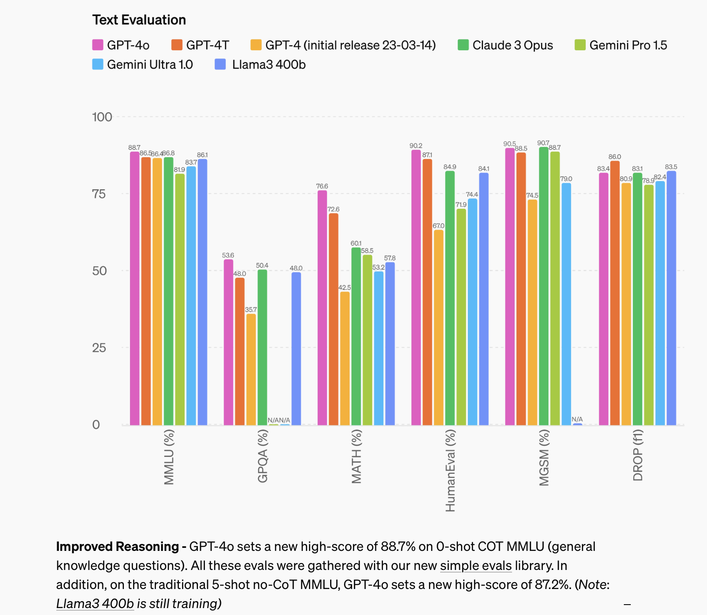
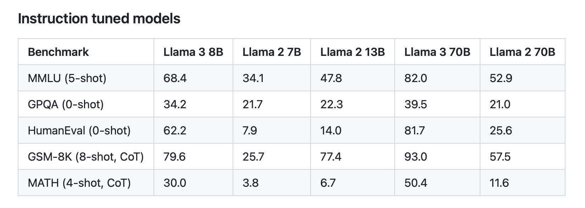
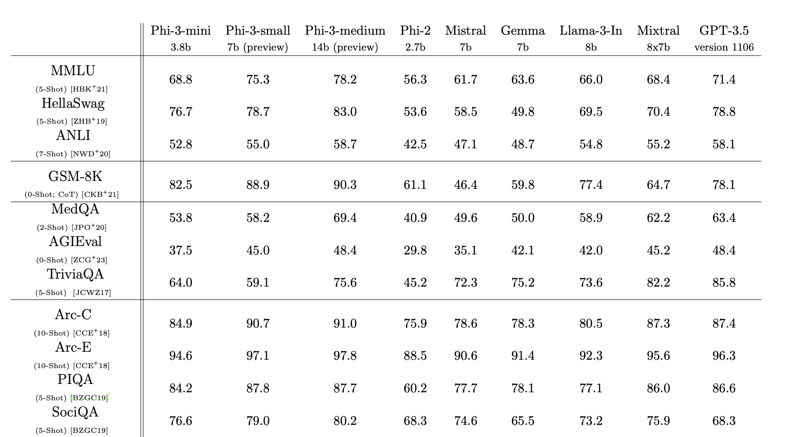
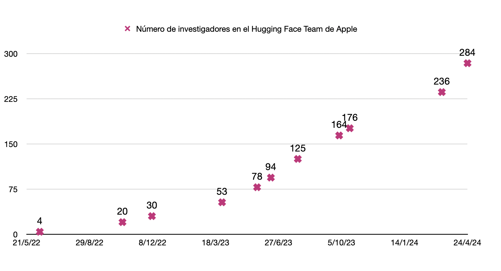
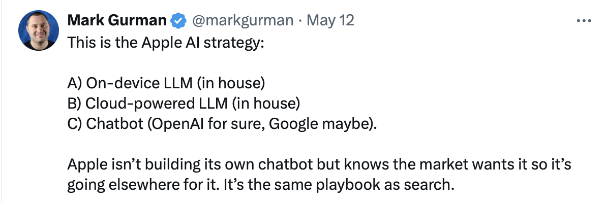
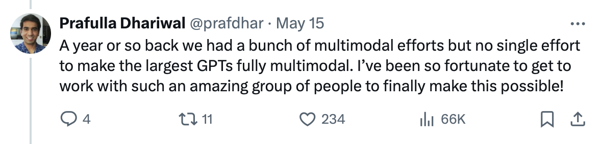
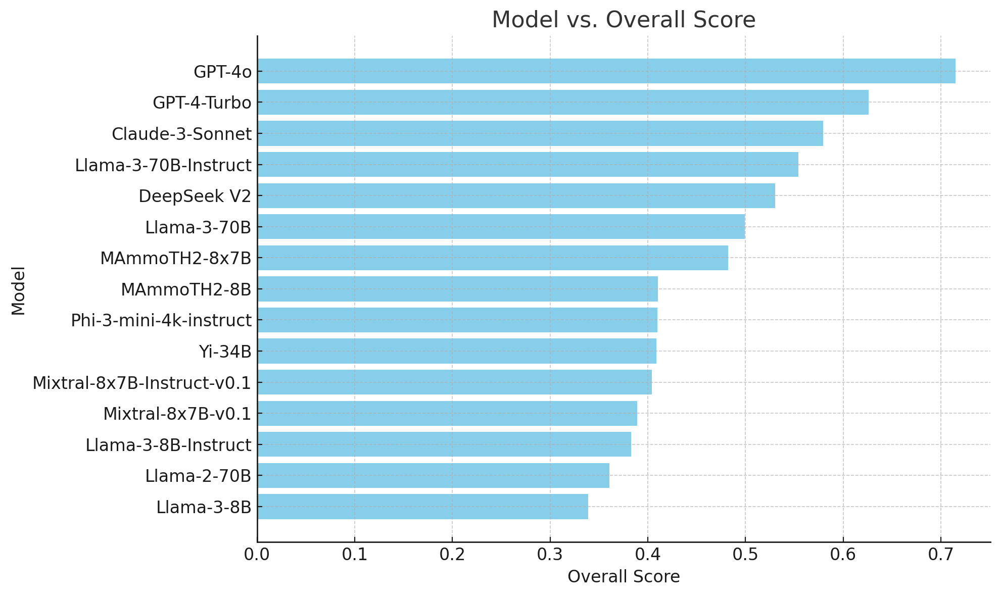
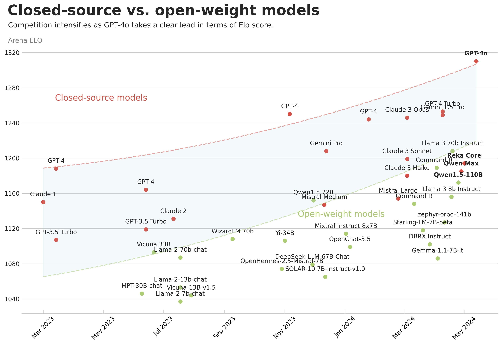

👋👋 ¡Hola, soy Domingo!

Después de una quincena de retraso y una vez resueltos (más o menos) los problemas de organización, gestión del tiempo y procrastinación, aquí estoy con un nuevo número. Hoy toca repasar no una, sino dos quincenas.

Un anuncio: a partir de ahora, tengo la intención de publicar siempre los viernes, después de la primera o la segunda quincena del mes. La mayoría de las newsletters que leo se publican en un día fijo de la semana, y me parece una buena idea probarlo. Así, ya sabréis que un viernes sí y otro no llegaré a vuestro correo electrónico. Y algunos viernes en los que no toque, habrá alguna sorpresa. Ya veréis la semana que viene.

Muchas noticias en un mes. Sobre todo muchos nuevos modelos. ¡Vamos allá! ¡Muchas gracias por leerme!

<h2>🗞 Noticias</h2>

1️⃣ El<strong> 18 de abril</strong>, <strong>Meta</strong> lanzó sus<strong> nuevas versiones de Llama</strong>, los modelos Meta Llama 3 [<a href="https://llama.meta.com/llama3/">Build the future of AI with Meta Llama 3 - meta.com</a> y <a href="https://ai.meta.com/blog/meta-llama-3/">Introducing Meta Llama 3: The most capable openly available LLM to date - meta.com</a>]. 

Recordemos que los modelos Llama son LLMs abiertos, disponibles para descargarlos, refinarlos y usarlos en cualquier aplicación. Eso sí, si usamos estos modelos o creamos modelos nuevos basados en ellos, tendremos que incluir la frase “Built with Meta Llama 3” o incluir el nombre “Llama 3” al principio del nombre del modelo [<a href="https://llama.meta.com/llama3/license/#">META LLAMA 3 COMMUNITY LICENSE AGREEMENT - meta.com</a>].

En concreto, Meta ha publicado dos modelos, uno de 8 mil millones y otro de 70 mil millones de parámetros: Llama 3 8B y Llama 3 70B. Según los benchmarks publicados por la propia Meta, estos modelos son los mejores en comparación con los de tamaños similares.

Todavía están entrenando el modelo más grande, de más de 400 mil millones de parámetros (llamado Meta Llama 3 400B+). Sin embargo, adelantan unos resultados iniciales que lo sitúan por delante de GPT-4 y a la par de Claude 3 Opus.

Rendimiento de los últimos LLMs presentados en los benchmarks más importantes [<a href="https://openai.com/index/hello-gpt-4o/">Hello GPT-4o - openai.com</a>]

Es muy interesante que estos modelos han sido construidos con procesos muy cuidadosos (por ejemplo, utilizando datasets y textos de alta calidad) que les han permitido obtener mejores resultados que modelos previos mucho más grandes. Por ejemplo, el modelo más pequeño, Llama 3 8B, alcanza puntuaciones bastante mejores que el modelo de 70B de hace un año (Llama 2 70B). De forma similar, Llama 3 70B obtiene mejores puntuaciones que GPT-3.5, con 175B parámetros.

Puntuación en los benchmarks más importantes de los modelos de Meta [<a href="https://github.com/meta-llama/llama3/blob/main/MODEL_CARD.md">Llama 3 Model Card - github.com</a>].

El tamaño del modelo no solo es importante para su rendimiento, sino que también determina el espacio que ocupa. El modelo Llama 3 7B tiene un tamaño de poco más de 13 GB. En su versión cuantizada, que reduce la precisión de los parámetros para ahorrar espacio, ocupa aproximadamente 4,21 GB. Este tamaño permitiría ejecutarlo en un dispositivo móvil de altas prestaciones. Aunque existen técnicas avanzadas que permiten usar los modelos desde la memoria de almacenamiento SSD [<a href="https://www.macrumors.com/2023/12/21/apple-ai-researchers-run-llms-iphones/">Apple Develops Breakthrough Method for Running LLMs on iPhones - macrumors.com</a>], lo más habitual es que todos los pesos del modelo deban estar cargados en la memoria del dispositivo para poder ejecutarlos. Por ejemplo, mi iPhone 12 tiene 4 GB de memoria RAM y no podría ejecutarlo. Los últimos modelos (iPhone 15) tienen 6 GB en sus configuraciones básicas (iPhone 15 y 15 Plus) y 8 GB en sus configuraciones avanzadas (15 Pro y 15 Pro Max). Los modelos básicos se quedarían muy escasos, mientras que los Pro sí que podrían ejecutarlo. La posibilidad de uso de un LLM local seguro que se va a convertir en un factor diferenciador de los móviles a partir de ahora.

Si queréis trastear los modelos, podéis encontrarlos en Hugging Face [<a href="https://huggingface.co/meta-llama">Meta Llama - hagglingface.co</a>] y leer el post que han publicado en el propio Hugging Face [<a href="https://huggingface.co/blog/llama3">Welcome Llama 3 - Meta’s new open LLM - huggingface.co</a>].

2️⃣ El <strong>23 de abril</strong>,<strong> Microsoft</strong> lanzó sus <strong>modelos Phi-3</strong> [<a href="https://azure.microsoft.com/en-us/blog/introducing-phi-3-redefining-whats-possible-with-slms/">Introducing Phi-3: Redefining what’s possible with SLMs - microsoft.com</a> y <a href="https://arstechnica.com/information-technology/2024/04/microsofts-phi-3-shows-the-surprising-power-of-small-locally-run-ai-language-models/">Microsoft’s Phi-3 shows the surprising power of small, locally run AI language models - arstechnica.com</a>]. Se trata de modelos pequeños:

<ul>
<li>

Phi-3-mini, con 3.8 mil millones de parámetros y una ventana de contexto de 4 mil tokens (aunque Microsoft también ha introducido una versión de 128K tokens llamada “phi-3-mini-128K”).

</li>
<li>

Phi-3-small, con 7 mil millones (7B) de parámetros.

</li>
<li>

Phi-3-medium, con 14 mil millones (14B) de parámetros.

</li>
</ul>

Los modelos se describen con detalle en el artículo publicado en arXiv [<a href="https://arxiv.org/abs/2404.14219">Phi-3 Technical Report: A Highly Capable Language Model Locally on Your Phone</a>], en el que demuestran que el modelo más pequeño (cuantizado a 4 bits) se puede ejecutar en un iPhone 14 Pro (curioso que Microsoft pruebe sus modelos de lenguaje en dispositivos de Apple).

En el artículo se presenta la evaluación de estos modelos, demostrándose que obtienen en los benchmarks resultados similares o incluso algo mejores que otros modelos pequeños y comparables en algunos casos a GPT-3.5.

Resultados de los modelos pequeños de Microsoft en benchmarks seleccionados, comparados con otros modelos pequeños y GPT-3.5.

Los modelos también son abiertos y están disponibles en Hugging Face [<a href="https://huggingface.co/collections/microsoft/phi-3-6626e15e9585a200d2d761e3">Phi-3 family of models - huggingface.co</a>].

Se avecina una competición importante en los modelos pequeños, en los que Apple ya está haciendo sus primeros pinitos (ver la siguiente noticia).

3️⃣ El <strong>22 de abril</strong>, <strong>Apple</strong> publicó varios <strong>modelos pequeños</strong> llamados OpenELM [<a href="https://arstechnica.com/information-technology/2024/04/apple-releases-eight-small-ai-language-models-aimed-at-on-device-use/">Apple releases eight small AI language models aimed at on-device use - arstechnica.com</a> y <a href="https://arxiv.org/abs/2404.14619v1">OpenELM: An Efficient Language Model Family with Open-source Training and Inference Framework - arxiv.org</a>]. En el número anterior, mencionamos que el departamento de investigación de Apple estaba publicando resultados sobre sus primeros modelos de lenguaje. Pues bien, algunos modelos ya están disponibles en abierto en Hugging Face [<a href="https://huggingface.co/apple/OpenELM-3B-Instruct">OpenELM - huggingface.co</a>] y pueden ser probados por la comunidad. 

Se trata de modelos muy básicos, con resultados bastante bajos comparados con modelos del mismo tamaño. Aunque Apple se está poniendo las pilas en el último año, todavía está muy lejos de grupos de investigación como los de Meta y Microsoft (que, a su vez, están lejos de los de Google, Anthropic y OpenAI).

He hecho una pequeña investigación, usando Wayback Machine, de la evolución del número de investigadores en la organización de Apple de Hugging Face con el resultado que se muestra en la siguiente gráfica:

Evolución del número de investigadores en la organización de Apple en Hugging Face [<a href="https://web.archive.org/web/20030315000000*/https://huggingface.co/apple">Wayback Machine - archive.org</a>].

El número de investigadores de Apple en Hugging Face ha pasado de solo 4 hace dos años a 308 en la fecha en que estoy escribiendo esto. La gráfica la hice hace una semana, cuando había 284 investigadores. ¡En una semana han añadido a 24 investigadores más!

Ahora la duda está en qué modelos va a usar Apple en sus nuevos iPhone 16, que se lanzarán el próximo septiembre y que, esta vez sí, seguro que vendrán cargados de novedades relacionadas con la IA. Según Mark Gurman, la estrategia de Apple es usar modelos propios para las APIs, tanto en el dispositivo como en la nube, y presentar un asistente (chat bot) resultado de un acuerdo con OpenAI.

<a href="https://x.com/markgurman/status/1789460505150792030">Post de Mark Gurman en X</a> sobre los modelos de lenguaje que va a anunciar Apple en la próxima WWDC.

Lo sabremos pronto, en la conferencia de desarrolladores de Apple que se celebrará en menos de un mes [<a href="https://developer.apple.com/wwdc24/">WWDC24 - apple.com</a>] en la que se presentará iOS 18 y todas las novedades de IA que incluirá.

4️⃣ Y llegamos al punto álgido del mes: el <strong>13 de mayo</strong>,<strong> OpenAI</strong> realizó un evento especial en el que presentaron su nuevo modelo: <strong>GPT-4o</strong> [<a href="https://www.youtube.com/watch?v=DQacCB9tDaw">Introducing GPT-4o - youtube.com</a>]. Después del 4 va la letra “o”, de “omni” (total), no es el número cero. 

Se trata de un modelo multimodal desde el principio. Es un proyecto que empezó hace más de un año, como comenta Prafulla Dhariwal, su director.

<a href="https://x.com/prafdhar/status/1790790264178774351">Post en X</a> del director del proyecto GPT-4o en OpenAI.

El hecho de que el modelo sea multimodal significa que ha sido entrenado desde cero con texto, audio e imágenes. Aunque trabaja con vídeo no ha sido entrenado con secuencias de vídeos<a class="footnote-anchor" data-component-name="FootnoteAnchorToDOM" id="footnote-anchor-1" href="#footnote-1" target="_self">1</a>, sino que descompone el vídeo que está viendo en instantáneas y analiza cada una de ellas. También es capaz de producir los mismos elementos con los que ha sido entrenado: texto, audio o vídeo.

La versión que han puesto en producción es la que produce texto. En la demo que hicieron en el evento, mostraron cómo el modelo era capaz de generar audio. Y están terminando de probar la generación de imágenes (por el propio modelo, no por modelos externos como DALL-E) antes de ponerla en producción.

En el evento de OpenAI se mostró el funcionamiento del modelo en forma de asistente. Es capaz de entender lo que le decimos, el tono en el que se lo decimos, lo que le enseñamos, y es capaz de responder con voz. Una voz súper natural, que expresa emociones y que nos felicita y anima. Evidentemente, ha sido entrenado para que se parezca a la Scarlett Johansson en “Her”. 

Mirad qué impresionante:

Tal y como hace notar Antonio Ortiz [<a href="https://cuonda.com/monos-estocasticos/el-lenguaje-de-programacion-del-futuro-es-seducir-a-scarlett-johansson">Monos estocásticos 2x17 - cuonda.com</a>], hay que fijarse en el momento en el que la IA se equivoca al principio y dice que “ve la imagen” antes de que se la enseñen. Lo apabullante viene después, cuando pide disculpas y lo hace con una entonación específica, totalmente humana, que transmite algo de vergüenza por el error. 

Si vemos el vídeo con cuidado, podemos notar que la IA produce varias entonaciones muy distintas a lo largo de la conversación. Es increíble que esto sea el resultado de un modelo entrenado solo para generar el siguiente token más probable. Ya hemos visto que esto funciona con el texto. Ahora, OpenAI ha demostrado que la idea también funciona cuando el siguiente token puede ser tanto un trozo de palabra como un fragmento de imagen o de audio. Y también es muy importante el “fine-tuning” posterior, en el que se adapta la respuesta producida por el modelo a las preferencias que interesan, en lo que se denomina RLHF (Reinforcement Learning with Human Feedback).

Dejadme recalcar una cosa muy importante, porque se ha producido mucha confusión al respecto. En la aplicación actual de ChatGPT es posible realizar una conversación. Pero no es lo mismo en absoluto que lo que hace GPT-4o. Lo que tenemos ahora en nuestros dispositivos son tres modelos distintos unidos por una aplicación: un modelo que reconoce el habla y la transcribe a texto, otro modelo (GPT-4) que responde con una entrada de texto y devuelve otro texto, y otro modelo que transforma el texto de respuesta en habla. En GPT-4o es totalmente diferente. Hay solo un único modelo, una única red neuronal que recibe tokens en cualquiera de las modalidades y devuelve como respuesta otros tokens (que pueden ser texto, audio o incluso una imagen). La propia red neuronal, el propio modelo, es el que produce las entonaciones (y también las entiende). No hay un postproceso ni un algoritmo específico que convierta el texto en audio. Es alucinante.

Otra de las características más importantes del nuevo asistente presentado es su pequeñísima latencia (responde de forma casi instantánea) y la posibilidad de ser interrumpido en cualquier momento, hablándole. La IA nos está escuchando continuamente y deja de hablar en ese momento para escucharnos y volver a contestar.

En cuanto a rendimiento en generación de texto, el modelo resultante es mejor que la última versión de GPT-4 y se ha colocado directamente en primer lugar en todos los benchmarks y rankings. No es el salto que se esperaba con GPT-5, pero todavía queda mucho año por delante y seguro que OpenAI nos da más sorpresas.

5️⃣ Al día siguiente del evento de OpenAI, el <strong>14 de mayo</strong>, se celebró el <strong>Google I/O</strong>, el evento de Google orientado a desarrolladores. Estaba claro que OpenAI había contraprogramado a Google. Y con mucho éxito, dada la repercusión de las referencias a “Her” y la frescura del evento, comparado con un evento de Google mucho más pesado, largo y falto de foco.

En su <em>keynote</em>, los de Google presentaron muchos proyectos en marcha [<a href="https://arstechnica.com/information-technology/2024/05/google-strikes-back-at-openai-with-project-astra-ai-agent-prototype/">Google strikes back at OpenAI with “Project Astra” AI agent prototype - arstechnica.com</a> y <a href="https://blog.google/technology/ai/google-gemini-update-flash-ai-assistant-io-2024/?utm_source=gdm&amp;utm_medium=referral&amp;utm_campaign=io24#gemini-model-updates">Gemini breaks new ground with a faster model, longer context, AI agents and more - blog.google</a>], pero pocos productos terminados. Entre las cosas más interesantes se encuentra Veo, un generador de vídeos del estilo de Sora, una nueva versión del modelo generador de imágenes, Imagen 3, y el proyecto Astra, un asistente controlado por la voz muy similar al de OpenAI.

El asistente de Google también es multimodal y puede ver el entorno a través del móvil. Todavía no lo han lanzado como producto, pero presentaron un vídeo grabado (no en vivo cómo hizo OpenAI) mostrando su funcionamiento.

Aunque lo que vemos es bastante espectacular (con el giro final de “¿dónde me he dejado mis gafas?”), la interacción y la voz del asistente no están tan logradas como las del de OpenAI.

No han desvelado demasiadas características del modelo de lenguaje en el que está basada esta nueva IA. Lo único que han dicho es que se trata de un modelo multimodal (como GPT-4o), pero no han dado demasiadas especificaciones ni se ha podido probar. 

También han presentado una pequeña actualización del modelo ya existente, el Gemini 1.5 Pro, con el que van a permitir trabajar con contextos de hasta 2 millones de tokens (texto, imágenes y vídeo). Una barbaridad. Ahora que ya está disponible en Europa, es el momento de probarlo y comprobar qué cosas puede hacer. Es verdad que no se le presta demasiada atención (se habla mucho más, por ejemplo, de Claude), pero en los rankings está situado muy arriba y es uno de los modelos más avanzados.

Aunque no presentaron demasiados productos reales, el Google I/O estuvo lleno de menciones a la IA. Muy gracioso el vídeo que han montado los de TechCrunch y que <a href="https://x.com/TechCrunch/status/1790504691945898300">han publicado en X</a>:

5️⃣ Hablando de <strong>rankings</strong> y de <strong>benchmarks</strong>, últimamente se han actualizado muchos de ellos. Vamos a repasarlos.

El primero, uno de los más usados, es el MMLU, que acaba de lanzar una nueva versión más avanzada denominada MMLU-pro [<a href="https://huggingface.co/datasets/TIGER-Lab/MMLU-Pro">MMLU-Pro - huggingface.co</a>]. Se trata de una colección de 12.000 preguntas de distintos campos (biología, matemáticas, economía, informática, etc.). En la última versión han aumentado el número de opciones de cada pregunta a 10. Está realizado por el laboratorio TIGER-Lab en la Universidad de Waterloo.

La siguiente figura muestra los resultados de la última evaluación de modelos, con GPT-4o claramente en primer lugar.

<a href="https://x.com/WenhuChen/status/1790597967319007564">Post en X de Wenhu Chen</a> con los resultados de la evaluación más reciente del benchmark MMLU-Pro.

Otro estilo de ranking es el LMSys arena [<a href="https://chat.lmsys.org/?leaderboard">LMSYS Chatbot Arena Leaderboard - lmsys.org</a>], en el que la puntuación se obtiene a partir de los enfrentamientos entre parejas de modelos, a los que los usuarios les proporcionan preguntas, leen sus contestaciones y después escogen el ganador. Vemos que el ganador claro es también GPT-4o (con el nombre clave que había usado durante algunos días de im-also-a-good-gpt2-chatbot) a cierta distancia de otro grupo en cabeza formado por versiones de GPT-4, Gemini-1.5-pro y Claude-3-opus.

Otro gráfico muy interesante es el que publica periódicamente Maxime Labonne en X, en el que se puede apreciar cómo evolucionan los modelos en el tiempo. En el eje vertical coloca el nivel obtenido en LMSys-Arena y en el eje horizontal la fecha en que el modelo se ha lanzado. También marca en rojo los modelos cerrados y en verde los abiertos. De esta forma, podemos analizar cómo progresan los distintos tipos de modelos.

Podemos ver cosas muy curiosas, como que el modelo más potente actual de Meta, Llama-3 70B, está al nivel del GPT-4 de hace un año. Un año es el tiempo que tardan en difundirse los avances de OpenAI a los modelos abiertos. Supongo que seguirá pasando lo mismo en el futuro, y que en junio de 2025 veremos modelos abiertos similares al actual GPT-4o. Otra cosa interesante que podemos notar es cómo la curva superior sigue creciendo, lo que nos lleva a la siguiente noticia.

6️⃣ Toda la industria sigue convencida de que <strong>la hipótesis del escalado</strong> [<a href="https://gwern.net/scaling-hypothesis">The scaling hipothesis - gwern.net</a>] es cierta y que modelos más grandes entrenados con más cantidad y variedad de datos obtendrán resultados considerablemente mejores. Hay muchas inversiones en marcha (de Microsoft, OpenAI, Meta, etc.) en la construcción de enormes centros de procesamiento de datos, e incluso en la construcción de centrales de energía para alimentar estos centros.

Por ejemplo, en la interesante entrevista a Dario Amodei [<a href="https://podcasts.apple.com/es/podcast/the-ezra-klein-show/id1548604447?i=1000652234981">What if Dario Amodei Is Right About A.I. - apple.com</a>] del podcast del New York Times The Ezra Klein Show, el CEO de Anthropic se manifiesta totalmente convencido de esta hipótesis de escalado y habla de cifras de 10.000 millones de dólares para entrenar los modelos futuros:

<blockquote>

"Vamos a tener que hacer modelos más grandes que utilicen más capacidad de cómputo por iteración. Vamos a tener que ejecutarlos durante más tiempo alimentándolos con más datos. Y esa cantidad de chips por el tiempo que ejecutamos cosas en ellos se traduce esencialmente en un valor monetario porque estos chips se alquilan por hora. Ese es el modelo más común para ello. Así que los modelos actuales cuestan del orden de 100 millones de dólares para entrenar, más o menos, un factor de dos o tres. Los modelos que están en entrenamiento ahora, y que saldrán en varios momentos más tarde este año o a principios del próximo, están más cerca de costar mil millones de dólares. Así que eso ya está ocurriendo. Y luego creo que en 2025 y 2026, nos acercaremos más a cinco o diez mil millones.

¿Entonces va a ser de 100 mil millones de dólares? Quiero decir, muy rápidamente, la artillería financiera que necesitas para crear uno de estos va a excluir a cualquiera excepto a los jugadores más grandes."

</blockquote>

Mark Zuckerberg, CEO de Meta, es algo más cauto en la entrevista realizada en el podcast de Dwarkesh Patel [<a href="https://www.dwarkeshpatel.com/p/mark-zuckerberg">Mark Zuckerberg - Llama 3, Open Sourcing $10b Models, &amp; Caesar Augustus - dwarkeshpatel.com</a>]

<iframe src="https://www.youtube-nocookie.com/embed/bc6uFV9CJGg?rel=0&amp;autoplay=0&amp;showinfo=0&amp;enablejsapi=0" frameborder="0" loading="lazy" gesture="media" allow="autoplay; fullscreen" allowautoplay="true" allowfullscreen="true" width="728" height="409">
</iframe>

<blockquote>

"Esta es una de las grandes preguntas, ¿verdad? [el crecimiento exponencial de los resultados obtenidos por los modelos] Creo que nadie lo sabe. Una de las cosas más complicadas de planificar es una curva exponencial. ¿Cuánto tiempo seguirá así? Creo que es lo suficientemente probable que sigamos avanzando. Creo que vale la pena invertir los 10 mil millones o más de 100 mil millones de dólares en construir la infraestructura y asumir que, si sigue adelante, obtendrás cosas realmente asombrosas que harán productos increíbles. No creo que nadie en la industria pueda decirte con certeza que continuará escalando a ese ritmo. En general, en la historia, te encuentras con cuellos de botella en ciertos puntos. Ahora hay tanta energía en esto que tal vez esos cuellos de botella se superen bastante rápido. Creo que esa es una pregunta interesante."

</blockquote>

Y sobre el tamaño de los modelos futuros y si también los harán abiertos:

<blockquote>

"Tenemos una hoja de ruta de nuevos lanzamientos que van a traer multimodalidad, más multilingüismo y ventanas de contexto más grandes también. Con suerte, en algún momento más adelante en el año podremos lanzar el modelo de 405 mil millones de parámetros."

</blockquote>

<blockquote>

"Obviamente estamos muy a favor del código abierto, pero no me he comprometido a liberar absolutamente todo lo que hacemos. Básicamente estoy muy inclinado a pensar que el código abierto va a ser bueno para la comunidad y también para nosotros porque nos beneficiaremos de las innovaciones. Sin embargo, si en algún momento hay un cambio cualitativo en lo que la cosa es capaz de hacer, y sentimos que no es responsable hacerlo de código abierto, entonces no lo haremos. Es muy difícil de predecir."

</blockquote>

<h2>👷‍♂️ Mis treinta días</h2>

A pesar de que ha pasado un mes desde la última vez, no tengo muchas novedades que contar. Ni en libros (sigo con “El bosque oscuro”; no he avanzado demasiado), ni en cosas que estoy trasteando. 

Voy a destacar las dos películas que más me han gustado de las que hemos visto.

<h3>📺 Dos películas</h3>

Dos películas muy distintas pero que me han gustado un montón<a class="footnote-anchor" data-component-name="FootnoteAnchorToDOM" id="footnote-anchor-2" href="#footnote-2" target="_self">2</a>.

La primera <strong>Desconocidos</strong>, de <strong>Andrew Haigh</strong>, con unas enormes interpretaciones de <strong>Andrew Scott</strong> y <strong>Paul Mescal</strong>. Una película muy personal y profunda, que emociona y da que pensar. Y con una banda sonora llena de canciones evocadoras para los que fuimos jóvenes en los 80.

Y la segunda, el <strong>Reino del Planeta de los Simios</strong>, de <strong>Wes Ball</strong>. Una vuelta a la aventura y los temas que me parecen más interesantes de la saga: la formación de la sociedad de los simios, las relaciones con los humanos, las relaciones de poder invertidas entre simios y humanos o la reescritura de la historia por los ganadores. 

Algunas escenas me han recordado la película original de Charlton Heston y me ha dado la sensación de que la historia se va moviendo en esa dirección. ¡Quiero más!

Y con esto terminamos por este mes. ¡Hasta la próxima quincena, nos leemos! 👋👋

<a id="footnote-1" href="#footnote-anchor-1" class="footnote-number" contenteditable="false" target="_self">1</a>

No existe en la actualidad ningún modelo de lenguaje que haya sido entrenado con secuencias de vídeo. No existe en la actualidad potencia computacional para llevar a cabo tal entrenamiento. Quizás se hará con GPT-6 o GPT-7 y eso sí que será revolucionario, porque un modelo de este tipo podrá aprender y generalizar el funcionamiento del mundo real, la física implícita en los movimientos de los objetos. Y, a su vez, podrá aplicar estos conceptos a las otras modalidades (por ejemplo, podrá entender mejor las relaciones espaciales cuando hablamos de lejos/cerca o izquierda/derecha).

<a id="footnote-2" href="#footnote-anchor-2" class="footnote-number" contenteditable="false" target="_self">2</a>

Mi hija Lucía me va dar un tirón de orejas por no poner <strong>Rivales</strong>, pero ella ya sabe por qué es 😂. Prometo comentar la película la próxima vez que la vea ❤️.

