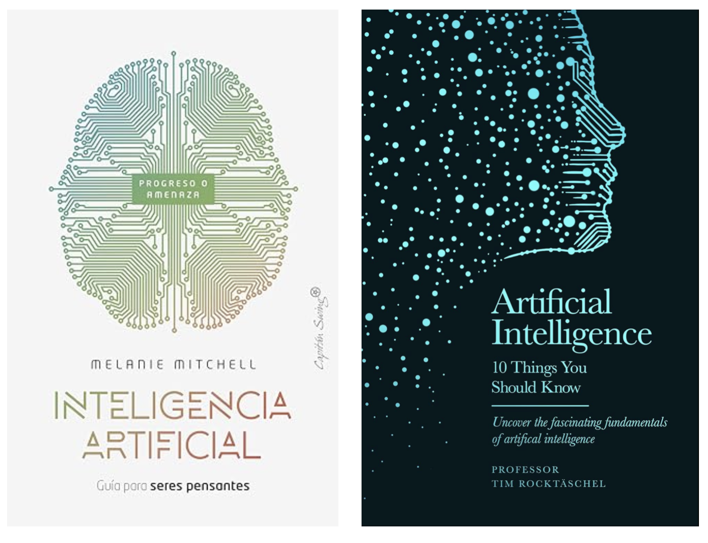
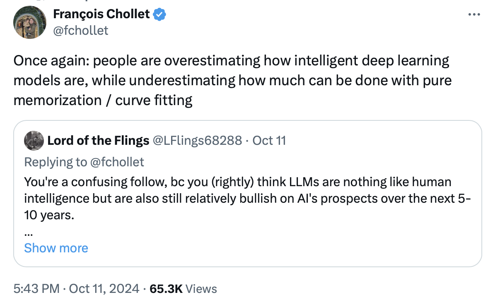

Hoy toca un artículo casi de opinión. Vamos a reflexionar sobre cómo, en el debate sobre la inteligencia artificial, hemos pasado de hablar de “sentido común” a centrarnos en el “razonamiento”. Exploraremos esta evolución y discutiremos cómo los modelos de lenguaje actuales están desafiando las nociones tradicionales de comprensión y pensamiento.

¡Gracias por leerme!

Imagen generada por ChatGPT con el prompt: “genera una imagen que muestre un robot pensando”.

Estos últimos días he estado leyendo dos libros muy recomendables sobre inteligencia artificial: <em>
<a href="https://www.goodreads.com/book/show/210808890-inteligencia-artificial">Inteligencia Artificial: Guía para seres pensantes</a>
</em> de <strong>
<a href="https://melaniemitchell.me">Melanie Mitchell</a>
</strong> y <em>
<a href="https://www.goodreads.com/book/show/208882425-artificial-intelligence">Artificial Intelligence: 10 Things You Should Know</a>
</em> de <strong>
<a href="https://rockt.github.io">Tim Rocktäschel</a>
</strong>. 

Son libros bastante distintos. El primero es más profundo y extenso, se publicó en 2020 y hace bastante énfasis en los problemas de los algoritmos de IA para alcanzar una <strong>compresión del mundo</strong> similar a la de los humanos. El segundo es más breve, está escrito en forma de pequeños ensayos, se ha publicado recientemente y presenta una visión muy optimista respecto a las posibilidades de los actuales LLMs para llegar a ser los elementos centrales de una futura IA con capacidades que excederán a las humanas.

Ambos libros están escritos por excelentes investigadores y se complementan estupendamente. El primer libro nos da una visión cautelosa y muy bien razonada sobre la dificultad de construir algoritmos inteligentes generales (lo que ahora llamamos <a href="/posts/agi-o-no-agi-14-de-2024/">AGI</a>), mientras que el segundo nos muestra cómo los avances de los últimos años representan un avance importante que nos puede llevar en poco tiempo a sistemas con capacidades superiores a los humanos (y lo explica de una forma muy comprensible y razonada, no como lo hace <a href="https://es.wikipedia.org/wiki/Nick_Bostrom">algún otro</a>).

<h2>Sentido común</h2>

Uno de los problemas que plantea <strong>Mitchell</strong> en su libro es el problema del sentido común. Es un problema que ha estado presente en el campo de la IA desde sus comienzos. 

El problema del “sentido común” en inteligencia artificial, especialmente en el ámbito del procesamiento del lenguaje natural, se refiere a la dificultad que tienen las máquinas para interpretar y generar lenguaje de manera coherente con el <strong>conocimiento implícito</strong> que los humanos empleamos habitualmente. Este tipo de conocimiento incluye la capacidad de entender situaciones ambiguas, inferir significados ocultos, realizar suposiciones sobre el contexto o incluso captar intenciones y emociones implícitas.

En su libro, <strong>Mitchell</strong> pone un ejemplo de una descripción de una situación sobre una persona que va a un restaurante. Veamos otro ejemplo similar:

<blockquote>

“Sara agitó la varita y tocó con ella el juguete del niño, que dejó de llorar al comprobar que volvía a funcionar. Cuando Sara llegó a casa y le contó a su padre lo que había pasado, este se enfadó muchísimo y la castigó sin salir de casa durante una semana.”

</blockquote>

Para entender la situación planteada por la descripción anterior hay que comprender muchísimas cosas (además de haber leído los libros de Harry Potter): Sara lleva la varita en la mano, el juguete estaba roto y por eso el niño estaba llorando, Sara vio al niño llorar y quiso ayudarle, Sara hizo algo mágico con la varita, Sara estaba orgullosa por haber ayudado al niño, etc.

¿Puede una IA  llegar a hacer estas suposiciones?

<strong>Mitchell</strong> dice:

<blockquote>

Aunque el procesamiento automático del lenguaje natural ha avanzado mucho, no creo que las máquinas puedan llegar a comprender por completo el lenguaje humano hasta que tengan un sentido común similar al humano.

</blockquote>

Y los sistemas que existían en 2020 (la fecha en la que publicó el libro) no tenían esa competencia:

<blockquote>

Los humanos tienen una competencia fundamental de la que carecen los sistemas actuales de IA: el sentido común.

</blockquote>

<h2>Llegan los LLMs</h2>

¿Cuál es la situación en la actualidad? ¿Han adquirido los LLMs este sentido común?

En los últimos años se han entrenado con todo internet estos gigantescos sistemas para <strong>predecir la siguiente palabra</strong> de un texto. La propia <strong>Mitchell</strong> explica el funcionamiento de los LLMs en <a href="https://oecs.mit.edu/pub/zp5n8ivs/release/1?readingCollection=9dd2a47d">un artículo</a> reciente. El sencillo objetivo de predecir la siguiente palabra produce resultados sorprendentes y dota a estos sistemas de enormes capacidades.

La razón es que una IA que aprende a comprimir textos con el objetivo de predecir la siguiente palabra tiene que aprender una cantidad enorme de datos y de conceptos subyacentes en los textos originales. Por ejemplo, cuando el LLM aprende la palabra que sigue a la frase:

“Harry estaba de excursión fuera de Howarts y usó su varita mágica. Cuando los profesores se enteraron, decidieron ..... (castigarle)" 

está aprendiendo al mismo tiempo una cantidad enorme de conceptos: existen reglas que limitan el uso de la magia, una regla es que la magia solo se puede usar en Howarts, si no se cumple una regla se debe castigar, los profesores son los que deciden sobre el comportamiento de los estudiantes, etc. 

La famosa <strong>
<a href="https://gwern.net/scaling-hypothesis">hipótesis de escalado</a>
</strong> argumenta que, cuanto mayores son los parámetros de los LLMs y más diversos son los datos de entrada, mayores abstracciones son capaces de aprender los sistemas. Al optimizar la función objetivo, los <em>
<a href="https://platform.openai.com/docs/guides/embeddings">embeddings</a>
</em>que representan los tokens del lenguaje se colocan en posiciones óptimas del espacio de parámetros y los pesos de la red neuronal del LLM se configuran para representar funciones de transformación que reflejan <strong>relaciones y abstracciones de mayor nivel</strong>.

Realmente, esto es solo una teoría y existen muchas incógnitas sobre hasta dónde es posible escalar y qué tipo de datos de entrada son necesarios para conseguir mayores abstracciones. Pero el nivel de comprensión del sentido común alcanzado por los sistemas actuales es sorprendente.

Por ejemplo, veamos qué responde ChatGPT (4o) cuando le pasamos el texto anterior, sobre Sara y la varita mágica, y le preguntamos por las razones por las que el padre le ha castigado.

<blockquote>

<strong>Yo:</strong>

Lee el siguiente texto y contesta a la pregunta a continuación:

“Juan agitó la varita y tocó con ella el juguete del niño, que dejó de llorar al comprobar que volvía a funcionar. Cuando Juan llegó a casa y le contó a su padre lo que había pasado, este se enfadó muchísimo y lo castigó a no salir de casa durante una semana.”

Pregunta: ¿Por qué se enfadó el padre de Juan?

<strong>ChatGPT:</strong> &nbsp;

El padre de Juan se enfadó probablemente porque Juan usó la varita de una forma que su padre no aprobaba, lo que podría indicar que el uso de la varita estaba prohibido o era peligroso.

<strong>Yo:</strong>

Dime cuatro posibles razones distintas que expliquen el enfado el padre de Juan

<strong>ChatGPT:</strong>

Aquí tienes cuatro posibles razones alternativas que podrían explicar el enfado del padre de Juan:

1. <strong>Juan utilizó una habilidad prohibida</strong>: Es posible que el uso de la varita esté prohibido en su casa o que sea una habilidad mágica que Juan no debería haber utilizado fuera de ciertos contextos.

2. <strong>El padre teme las consecuencias</strong>: El padre podría estar preocupado de que el uso de la varita en público atraiga atención no deseada o peligros para la familia, como si fuese algo secreto o peligroso.

3. <strong>Juan rompió una regla familiar</strong>: Quizás en la familia hay una regla estricta sobre cuándo y cómo utilizar la magia o herramientas especiales, y Juan la desobedeció al arreglar el juguete del niño sin permiso.

4. <strong>El padre teme por la seguridad de Juan</strong>: El padre podría haberse enfadado porque, aunque el gesto de Juan fue bienintencionado, usar la varita podría poner en peligro la integridad de Juan, como si existiera un riesgo asociado a su uso.

</blockquote>

Es mejorable, las explicaciones 1 y 3 son algo redundantes, pero da la sensación de que el sistema “entiende” perfectamente conceptos como prohibido, reglas, seguridad o riesgo. 

Se ha avanzado muchísimo en estos últimos 4 años.

<h2>Ahora el término del debate es “razonamiento”</h2>

A pesar de estos avances, muchos investigadores del campo de la IA, la filosofía o la neurociencia <strong>niegan</strong> que lo que hacen los LLMs se pueda denominar “comprender”. <strong>Mitchell</strong> explica muy bien esta postura en su artículo de 2023, <em>
<a href="https://arxiv.org/abs/2210.13966">“The Debate Over Understanding in AI's Large Language Models”</a>
</em>, en el que presenta con gran detalle los argumentos de los que están a favor y en contra.

Y termina aceptando que los LLMs han aprendido a manejar (alguna forma de) sentido común:

<blockquote>

Podría argumentarse que, en los últimos años, el campo de la IA ha creado máquinas con nuevos modos de comprensión. Los problemas que requieren grandes cantidades de conocimiento seguirán favoreciendo a los modelos estadísticos a gran escala como los LLM.

</blockquote>

Pero añade un detalle importante, la nueva gran crítica. <strong>Lo que no pueden hacer es razonar y planificar</strong>. Eso está limitado a la inteligencia humana:

<blockquote>

Pero aquellos problemas para los que tenemos un conocimiento limitado y mecanismos causales sólidos favorecerán a la inteligencia humana. 

</blockquote>

Cuando <strong>Mitchell</strong> habla de “mecanismos causales sólidos” y “conocimiento limitado” se está refiriendo a nuestra capacidad de planificación y razonamiento. Por ejemplo, para planificar un viaje usando la web, una persona puede encontrar vuelos y hoteles, pero también debe considerar factores como la hora de llegada y la disponibilidad de transporte. Si llega tarde por la noche y no hay transporte público, buscará un hotel cerca del aeropuerto. 

Este tipo de razonamiento causal, ajustando el plan según condiciones impredecibles, y realizando varios pasos de inferencia, para muchos autores <strong>no es posible de conseguir con los actuales LLMs basados en autorregresión</strong>.

La propia <strong>Mitchell</strong> incide en el tema en varios posts recientes:

<ul>
<li>

<a href="https://aiguide.substack.com/p/can-large-language-models-reason">Can Large Language Models Reason?</a> (Sep, 2023)

</li>
<li>

<a href="https://aiguide.substack.com/p/the-llm-reasoning-debate-heats-up">The LLM Reasoning Debate Heats Up</a> (Oct, 2024)

</li>
</ul>

El debate se ha intensificado con el lanzamiento de <strong>o1</strong>, un modelo que, según <strong>OpenAI</strong>
<a href="/posts/como-funciona-o1-15-de-2024/">ha sido construido precisamente para razonar</a>. Por ejemplo, se ha hablado mucho en los últimos días en X del <a href="https://arxiv.org/abs/2410.05229">artículo de unos investigadores de Apple</a> en el que engañan a distintos LLMs añadiendo datos irrelevantes a enunciados de problemas de primaria. Estuve haciendo algún <a href="https://x.com/domingogallardo/status/1845769109100749286">experimento rápido</a> y me dio la sensación de que o1 no sufre este problema, pero habrá que investigar más.

<h2>Los LLMs todavía tienen mucho recorrido</h2>

La revolución que ha supuesto la aplicación del <em>deep learning</em> a los problemas del procesamiento del lenguaje plantea una gran incógnita de cara al futuro. ¿Hasta dónde se podrá escalar esta tecnología? ¿Podremos conseguir con ella <strong>agentes inteligentes</strong> capaces de interactuar con nuestros datos y con la web y ayudarnos en tareas relevantes? ¿Podrán construirse agentes a los que podamos encargar tareas que le <strong>ocupen horas o días</strong>, en las que tenga que ir obteniendo información paso a paso, realizando experimentos y obteniendo resultados?

Todavía es pronto para saberlo. El crecimiento de las capacidades de los LLMs ha sido hasta ahora exponencial, pero no sabemos si esta tendencia continuará o si estamos alcanzando un punto de inflexión, donde el crecimiento podría estabilizarse siguiendo una curva logística (una curva en forma de “S” que se aplana al llegar a un límite).

También puede ser que lo que se necesite sea<strong> combinar LLMs o afinar los datos de aprendizaje</strong>. OpenAI, con la construcción de <strong>o1 </strong>basado en un paradigma algo diferente (aunque no deja de ser un LLM), demuestra que es posible construir nuevos sistemas basados en los actuales. Investigadores como el anteriormente mencionado <strong>Tim Rocktäschel </strong>argumentan que las funcionalidades de los actuales LLMs de generar alternativas y validarlas pueden ser la base de sistemas capaces de <strong>mejorarse a sí mismos</strong>. El propio <strong>François Chollet</strong>, que hemos mencionado más de una vez en esta <em>newsletter</em>, dice que los LLMs, con su método basado en la memorización de patrones, todavía pueden conseguir muchas más cosas.

<h2>No te dediques a los LLMs</h2>

Otros investigadores son mucho más críticos con la tecnología actual. Por ejemplo <strong>Yann LeCun</strong> argumenta que es necesario ampliar los actuales tokens con elementos que combinen texto, vídeo, acciones y otros datos sensoriales tomados del mundo real. Propone una arquitectura también basada en aprendizaje de <em>embeddings</em>, pero de una forma radicalmente distinta a los actuales LLMs, denominada <strong>JEPA</strong> (Joint Embedding Predictive Architecture).

<iframe src="https://www.youtube-nocookie.com/embed/xL6Y0dpXEwc?rel=0&amp;autoplay=0&amp;showinfo=0&amp;enablejsapi=0" frameborder="0" loading="lazy" gesture="media" allow="autoplay; fullscreen" allowautoplay="true" allowfullscreen="true" width="728" height="409">
</iframe>

En esta última charla, incluso hace la recomendación a los jóvenes investigadores de que no se dediquen a los LLMs (si lo que quieren es descubrir cosas relevantes y no solo ganar dinero) y hace la siguiente predicción: en los próximos 2-3 años, los esfuerzos de los actuales centros de datos gigantes <strong>no van a dar resultados</strong> y se va a dejar de hablar de "escalado". Los LLMs serán un elemento de la solución, pero no el elemento fundamental.

Pero no nos equivoquemos con la posición de <strong>LeCun</strong>. No está en el lado de quienes piensan que los computadores nunca podrán pensar como los humanos, todo lo contrario, plantea que la AGI es posible, aunque sea con una tecnología distinta de la actual. Incluso en la charla anterior menciona un plazo de una década (supongo que para <a href="https://x.com/tsarnick/status/1846084308416843787">darle una respuesta a su jefe, Zuck</a>).

<h2>Críticos y apocalípticos</h2>

Frente a esta posición, la corriente más crítica de la IA niega incluso que estemos viendo avances hacia la inteligencia humana. Parecen aplicar el “teorema <a href="https://en.wikipedia.org/wiki/Larry_Tesler">Tesler</a>” o el <a href="https://en.wikipedia.org/wiki/AI_effect">efecto IA</a>:

<blockquote>

La inteligencia es todo lo que las máquinas todavía no pueden hacer.

</blockquote>

Según ellos, la inteligencia es compleja, multifuncional y está profundamente relacionada con otros elementos intrínsecamente humanos como el pensamiento, la cognición, las emociones y la consciencia. 

A pesar de numerosas evidencias, siguen negando que estos modelos hayan conseguido ni siquiera un poco de comprensión. Da la sensación de que tienen miedo de que una máquina pueda llegar a ser inteligente. 

La anécdota que recoge <strong>Mitchell</strong> al principio de su libro es muy reveladora. <strong>Douglas Hofstadter</strong>, el conocido investigador de IA, autor del célebre libro <a href="https://www.goodreads.com/book/show/49401016-godel-escher-y-bach">Gödel, Escher y Bach: Un Eterno y Grácil Bucle</a>, terminó diciendo en una reunión en 2014 en Google:

<blockquote>

Estoy aterrorizado. Me parece aterrador, muy preocupante, muy triste. Nos sustituirán. Seremos reliquias, nos dejarán tirados.

</blockquote>

<strong>Mitchell</strong> explica después ese terror:

<blockquote>

El terror de <strong>Hofstadter</strong> era que la inteligencia, la creatividad, las emociones e incluso la propia consciencia fueran demasiado fáciles de crear, que los aspectos de la humanidad que más valiosos le parecían acabaran siendo una mera “serie de trucos”, que un conjunto superficial de algoritmos de fuerza bruta pudiera explicar el espíritu humano.

</blockquote>

Creo que versiones parecidas a esta idea son las que llevan a estos investigadores críticos a relativizar cualquier avance que se produce. Paradójicamente, creo que también son estas mismas ideas las que alarman a los “apocalípticos” como <strong>Geoffrey Hinton</strong>. En el fondo temen que nuestra humanidad no sea más que<strong> un algoritmo de fuerza bruta aprendido y capturado en miles de millones de parámetros</strong>.

<h2>Una inteligencia distinta</h2>

Cuando empecé a escribir este artículo, no quería hacerlo demasiado largo. Pero, como siempre pasa, una cosa me ha llevado a otra, y al final he terminado abriendo un melón que quería dejar para otro día, el de la consciencia o, por ser más específico, el de la “sentiencia” (traducción literal, creo que no aceptada, del término inglés “sentience”).

Dejo toda la argumentación para otro artículo, pero creo que la forma de escapar de este terror es considerar que lo que nos separa de los LLMs es exactamente lo mismo que nos relaciona con muchos otros seres vivos: <strong>la posibilidad de experimentar sensaciones, dolor, placer, miedo o alegría</strong>. Los algoritmos actuales (y, en mi opinión, cualquier algoritmo futuro) no son capaces de sentir. 

Esto nos libera de muchísimos <strong>problemas éticos que sí tenemos</strong> con nuestros parientes, como mamíferos, vertebrados e incluso invertebrados más complejos. A diferencia de los algoritmos, estos seres poseen una capacidad de sentir dolor, placer y otros estados emocionales, lo que nos obliga a considerar su bienestar y sus derechos en nuestras decisiones éticas.

La falta de sentiencia en las máquinas nos permite considerarlas como meras “máquinas pensantes” no sintientes y nos permite aceptar una visión en la que “AGI” no equivale a “humano”.

Termino con la cita de <strong>Mitchell</strong> con la que también concluye su artículo sobre el debate acerca de la comprensión:

<blockquote>

El desafío para el futuro es desarrollar nuevos métodos científicos que puedan revelar los mecanismos detallados de comprensión en formas de inteligencia distintas, discernir sus fortalezas y limitaciones, y aprender a integrar esos modos de cognición verdaderamente diversos.

</blockquote>

¡Hasta la próxima quincena, nos leemos! 👋👋

