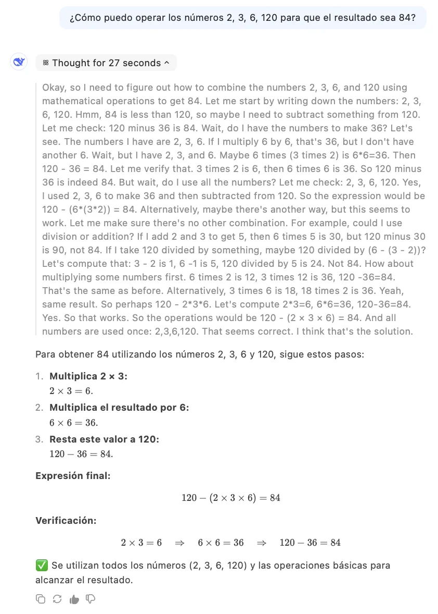
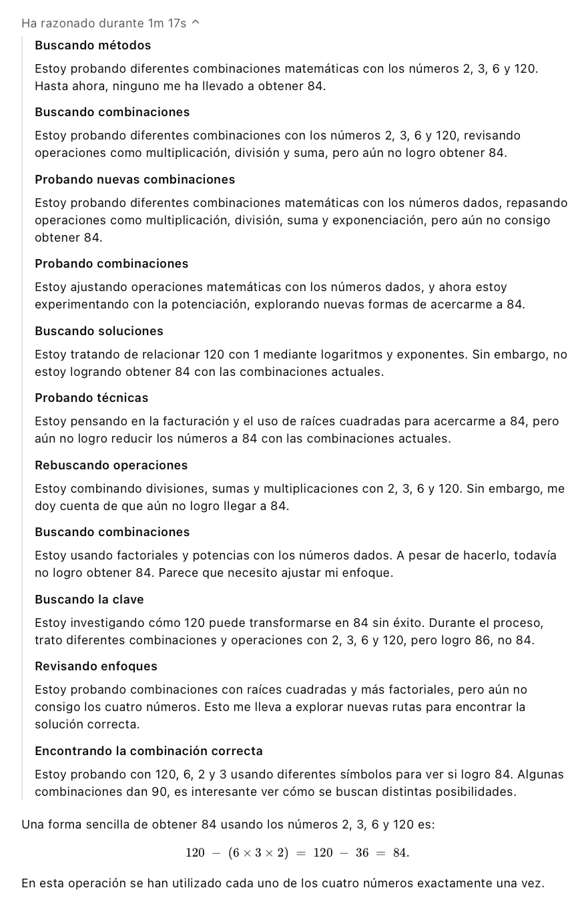
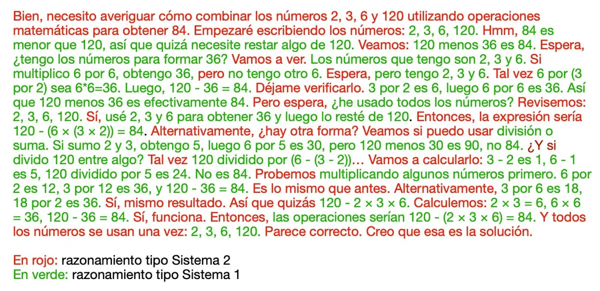
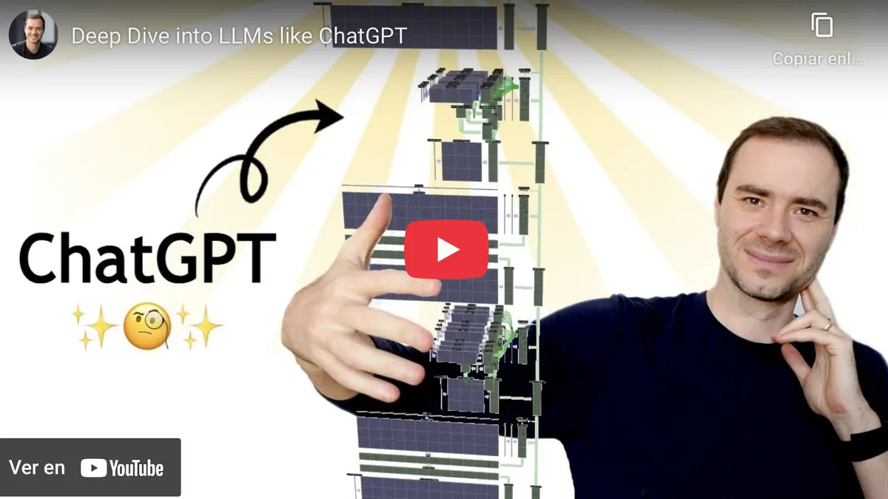
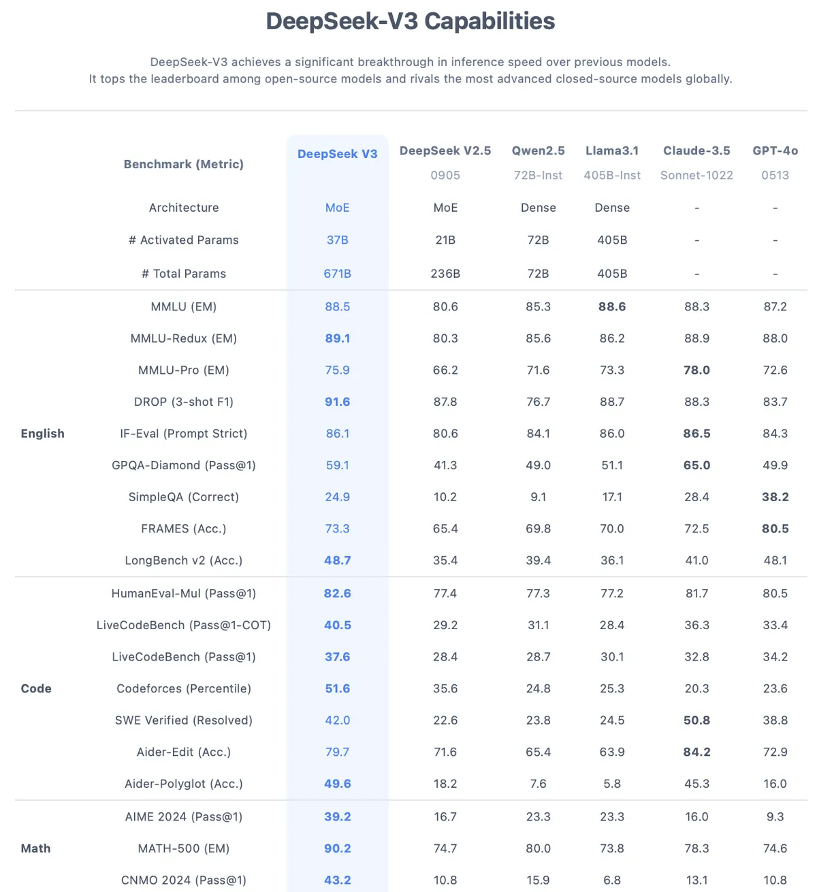

It has now been **two months** since the [launch of DeepSeek-R1](https://api-docs.deepseek.com/news/news250120), which dominated headlines in the media and on social networks, and even made its way into neighbors' elevator conversations. DeepSeek, the Chinese AI that shook mighty **Nvidia** and put executives at **Meta** and **OpenAI** on alert.

In that time, the waters have returned more or less to normal. **Nvidia** has more or less recovered in the stock market, **OpenAI** has lowered the price of using the API of its most advanced models and has presented Deep Research, a product that has delighted its users. And new models keep arriving: **Grok**, **Claude 3.7 Sonnet**, or the rumored **GPT-4.5**, expected in a few weeks. The world of AI remains in a frenzy: after the announcement of one new model, another product arrives, a new device, or a new statement that shortens the time supposedly left before AGI. It does not stop.

Even so, the reaction of American companies and leaders has not overshadowed the achievement of the Chinese startup that shares its name with the model. At the beginning of the year, I laid out in this newsletter [a list of important questions](/en/posts/7-preguntas-para-2025/) that needed to be answered over the coming months. Barely a month later, at the end of January 2025, two of them had already been answered with **DeepSeek-R1**: an open-source reasoning LLM comparable to OpenAI's **o1** had been presented ([Hugging Face](https://huggingface.co/deepseek-ai/DeepSeek-R1), [GitHub](https://github.com/deepseek-ai/DeepSeek-R1)), and [a detailed explanation](https://github.com/deepseek-ai/DeepSeek-R1/blob/main/DeepSeek_R1.pdf) of how it had been developed had been published.

In this article we will look at how this reasoning model works. And in a future installment I will explain how to use it on our own computers, without having to depend on the Chinese company's website.

## Trying out DeepSeek-R1

The simplest way to try **DeepSeek** is through its website. To sign up you only need an email address. Once inside, if you want to use the reasoning model, click the "DeepThink (R1)" button and you will be able to ask any question, in the style of ChatGPT.


Like **o1**, **DeepSeek-R1** is a reasoning model. It is trained not to answer immediately, but to generate a **chain of reasoning** that allows it to explore the problem step by step and apply different strategies during that process.

Let us look at an example. Suppose we ask it the following problem:

```What operations can I perform on the numbers 2, 3, 6, 120 so that the result is 84?```

Take a moment to try to solve it. You can use paper and pencil or do it mentally. Got it? Give it a try, it is not very difficult.

You have probably assumed that you can only use each number once, which is usual in this type of exercise. You will have noticed that, since the result is smaller than 120, you need to subtract something to get 84. You may have tried different combinations, perhaps calculating `120 - 84 = 36`, and then thinking that this 36 could be obtained from 2, 3, and 6. Maybe you even had an "Aha!" moment when you noticed that `2*3 = 6` and that `6*6 = 36`. In the end, your solution might be:

```84 = 120-(2*3*6)```

Reasoning models, **o1** from **OpenAI** or **DeepSeek-R1**, do something very similar. Until DeepSeek arrived, we could not directly observe their reasoning steps because **o1** hid them. Now we can see that reasoning, as in the following figure.



Below we can see an English version in which I have inserted the `<think>` tags that DeepSeek-R1 uses to delimit its reasoning:

```
<think>
Okay, I need to figure out how to combine the numbers 2, 3, 6, and 120
using mathematical operations in order to get 84.

Let me start by writing the numbers down: 2, 3, 6, 120.
Hmm, 84 is less than 120, so maybe I need to subtract something from 120.
Let me see: 120 minus 36 is 84.

Wait, do I have the numbers needed to make 36?
Let's check. The numbers I have are 2, 3, and 6.
If I multiply 6 by 6, I get 36, but I do not have another 6.

Wait, but I do have 2, 3, and 6.
Maybe 6 times (3 times 2) gives me 6*6=36.
Then 120 - 36 = 84.

Let me verify that.
3 times 2 is 6, then 6 times 6 is 36.
So 120 minus 36 really is 84.

But wait, have I used all the numbers?
Let's review: 2, 3, 6, 120.
Yes, I used 2, 3, and 6 to obtain 36 and then subtracted it from 120.
So the expression would be 120 - (6 × (3 × 2)) = 84.

Alternatively, is there another way?
Let me see whether I can use division or addition.
If I add 2 and 3, I get 5, then 6 times 5 is 30,
but 120 minus 30 is 90, not 84.

And what if I divide 120 by something?
Maybe 120 divided by (6 - (3 - 2))...
Let me calculate it: 3 - 2 is 1, 6 - 1 is 5, 120 divided by 5 is 24.
That is not 84.

Let us try multiplying some numbers first.
6 times 2 is 12, 3 times 12 is 36, and 120 - 36 = 84.
That is the same as before.

Alternatively, 3 times 6 is 18, 18 times 2 is 36.
Yes, same result.
So maybe 120 - 2 × 3 × 6.
Let me calculate it: 2 × 3 = 6, 6 × 6 = 36, 120 - 36 = 84.
Yes, it works.

So the operations would be 120 - (2 × 3 × 6) = 84.
And all the numbers are used once: 2, 3, 6, 120.
That seems correct. I think that is the solution.
</think>
```

It is impressive how much **DeepSeek-R1's** reasoning resembles our own. It does not even settle for the first solution, but considers several alternatives and, in the end, verifies that they all lead to the same result. Impressive.

How does OpenAI's original model behave? Curiously, **o1** needs more time to solve this problem, 1 minute and 17 seconds, and its reasoning is not as fluid. In the following image, the ChatGPT website hides almost the entire process and only shows a summarized version in Spanish. In the end it also reaches the correct result.



## Reasoning in DeepSeek

In [an earlier article](/en/posts/francois-chollet-20-de-2024/) I mentioned **François Chollet's** thesis that LLMs implement a kind of **intuitive reasoning** (System 1, in Kahneman's terminology) rather than analytical reasoning, slower, deliberate, logical, and analytical (System 2).

For the first time, we can see in detail how an AI model has learned to reason in a structured way, following a **System 2 style** of thought. We analyze it in the following image, in which I have highlighted **DeepSeek-R1's** thinking in red and green. In red I mark the phrases that correspond to analytical and deliberate thinking, characteristic of **System 2**, while in green are those that reflect **intuitive reasoning**, System 1.



Let us analyze more closely the **System 2 reasoning** strategies in **DeepSeek-R1**, marked in red.

First, like a good math student, the model lists the main elements of the problem. It also introduces brief pauses to think, "_Hmm_", "_Wait_", "_Let's see_". It formulates hypotheses, "_If_", "_Let's try_", "_but_", "_Maybe_", "_Let's see whether I can use_". It verifies solutions, "_Let me verify that_", "_Let's try_", "_Let me calculate it_". It proposes alternatives, "_Alternatively, is there another way?_", "_Alternatively_". And it checks the strength of its conclusions, "_Yes, same result_", "_Yes, it works_", "_That is the same as before_". Finally, it recaps and concludes, "_That seems correct. I think that is the solution_."

How does **DeepSeek-R1** achieve this level of reasoning? In [my review of o1](/en/posts/como-funciona-o1-15-de-2024/) I already mentioned that OpenAI's great advance had been to teach an LLM to reason using a **reinforcement-learning** approach, RL. **DeepSeek** has managed to replicate this strategy and, most notably, has published all the details in [its paper](https://github.com/deepseek-ai/DeepSeek-R1/blob/main/DeepSeek_R1.pdf). In reinforcement learning, people talk a lot about the **GRPO** algorithm, Group Relative Policy Optimization, introduced in that article, and about how it improves on the [original PPO](https://arxiv.org/abs/2203.02155) that **OpenAI** used to apply reinforcement learning to LLMs, RLHF. **Andrej Karpathy** explains this reinforcement-learning idea very well in his video [Deep Dive into LLMs like ChatGPT](https://youtu.be/7xTGNNLPyMI?si=uUuOjczdL67i8zRH&t=7646), from timestamp 2:07:00 onward.

[](https://youtu.be/7xTGNNLPyMI?si=hJ8-1o34KPhFzQ7V)

Numerous laboratories and startups are trying to reproduce **DeepSeek's** results and to boost their base models with similar RL techniques. Over the coming months we will surely see these reinforcement-learning innovations advance and spread through a large part of the industry.

## DeepSeek V3

Now let us focus on the phrases in **green** in **DeepSeek-R1's** reasoning, the ones corresponding to the **intuitive thinking** generated by the base model.


We can see that it is capable of remembering the numbers in the problem, "_2, 3, 6, 120_", imagining approaches to solve it, "_I need to subtract something from 120_", "_Do I have the numbers needed to make 36?_", carrying out mental operations, "_3 times 2 is 6, times 6 is 36_", and checking results, "_That is not 84_", "_that is 90, not 84_". All of these functions belong to that more spontaneous mode, typical of **System 1**, which the LLM performs in a single inference pass.

For the full reasoning to work well, **you need a good base model**. Otherwise, if the intuitions were wrong or strayed too far, even the most elaborate reasoning would not help very much. System 2 thinking can propose hypotheses, validate them, and spend more time reflecting, but without good initial ideas it would not reach a satisfactory result.

What is **DeepSeek-R1's** base model? It is [DeepSeek-V3](https://arxiv.org/abs/2412.19437), another open-source development ([Hugging Face](https://huggingface.co/deepseek-ai/DeepSeek-V3), [GitHub](https://github.com/deepseek-ai/DeepSeek-V3)) that the company presented at the end of December 2024. We are dealing with a very large model, **671 billion parameters**, 671B, larger than **LLaMA-3.1**, which has 405 billion parameters. It also offers a context window of 128K tokens, similar to that of the most advanced models today.



The benchmark results presented by the Chinese company were excellent, beating **Llama 3.1**, and in almost every case even **Claude-3.5** and **GPT-4o** as well, see the figure above. Even so, the December announcement did not have much impact. The dates were bad, and public opinion was already somewhat saturated with news of new models. Even the low training cost, instead of being seen as important news, made many people doubt the reliability of the benchmark results.

But the later success of **R1** has strengthened the credibility of **DeepSeek-V3**, dissipating many of the doubts raised around those initial benchmarks and marking a significant milestone in the evolution of open-source LLMs.

## Can I run DeepSeek on my computer?

We have seen that **DeepSeek-R1** is a reasoning model comparable to **o1**. And it has the advantage that the Chinese company has released it openly. Does this mean that I can download it and run it on my computer? In theory, yes. But unfortunately, I do not think you have a computer with the necessary capacity.

**DeepSeek-R1** is built from **DeepSeek-V3** by fine-tuning its parameters, but this does not modify the size of the base model. The final result keeps the previously mentioned size of 671 billion parameters. These parameters are floating-point numbers that must be loaded into memory and processed, so it would require around **1.342 GB (!) of RAM** just for the weights, and that figure usually increases because of other processes, reaching **1.600-2.000 GB of VRAM or RAM**. That does not fit on my laptop. A cluster with multiple high-capacity GPUs would be needed. For example, 20 H100 GPUs with 80 GB each could cover around 1.600 GB.

So what models can we download and run locally? Many articles have been published explaining how to download something similar to DeepSeek. What are we actually downloading? They are **distilled versions** that **DeepSeek** itself has released, smaller open models that have been trained using reinforcement learning on reasoning traces generated by R1. For example, **DeepSeek-R1-Distill-Qwen-7B** is a model built from **Qwen-7B**. It takes up around 4.7 GB on disk and can be run on a **MacBook Air** with 16 GB of RAM. There are similar models built from different open base models, such as **DeepSeek-R1-Distill-Qwen-32B** or the more powerful **DeepSeek-R1-Distill-Llama-70B**, based on the 70-billion-parameter Llama model.

The problem with these versions is that they are considerably worse than the original **DeepSeek-R1**. Although they inherit some of the master model's capabilities, their reasoning is more limited, with simplified answers and less ability to structure solutions step by step. On complex problems, they tend to omit key steps and make more mistakes, because the base model is much simpler.

In the next article I will explain **how to install** one of these models on our computer, and we will see that its performance is far worse than **R1's**. Finally, I will explain **how to use the API** of some providers that make the original **DeepSeek-R1** available on their servers.
