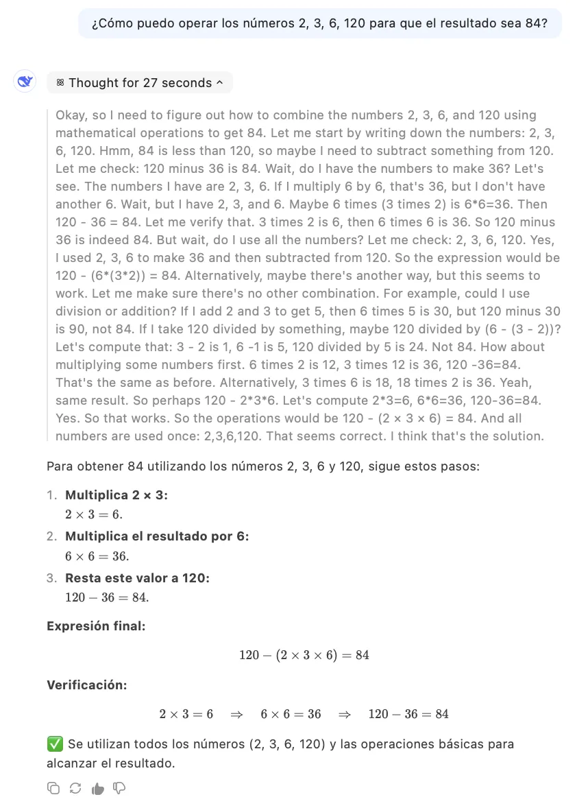
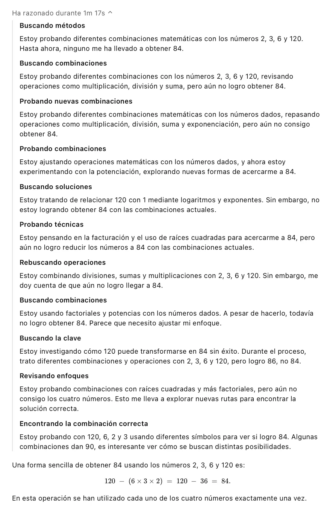
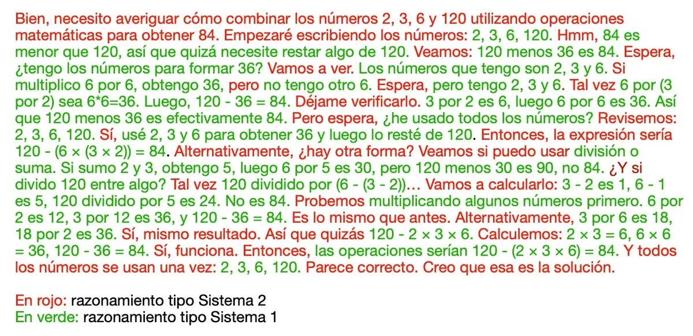
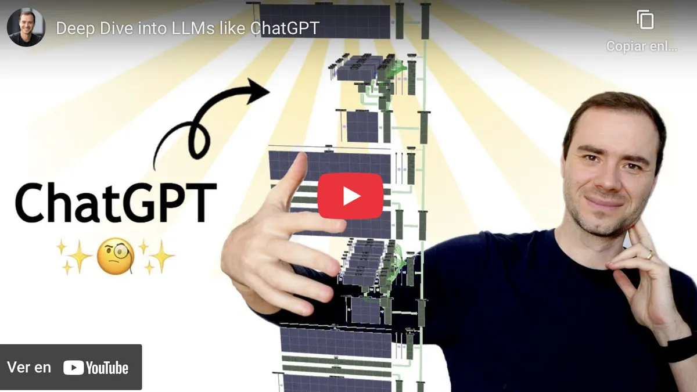
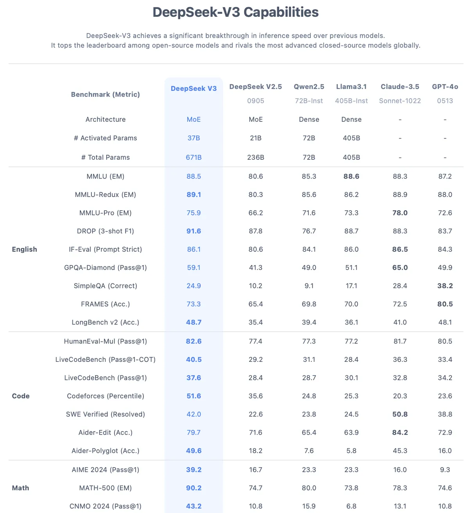

Han transcurrido ya dos meses desde el [lanzamiento de DeepSeek-R1](https://api-docs.deepseek.com/news/news250120), que dominó los titulares en medios de comunicación y redes sociales, e incluso se coló en las conversaciones de vecinos en el ascensor. DeepSeek, la IA china que hizo temblar a la mismísima Nvidia y puso en alerta a los directivos de Meta y OpenAI.

En este tiempo, las aguas han vuelto a la normalidad. Nvidia se ha recuperado más o menos en bolsa, OpenAI ha abaratado el uso del API de sus modelos más avanzados y ha presentado Deep Research, un producto que ha encantado a sus usuarios. Y no paran de llegar nuevos modelos: Grok, Claude 3.7 Sonnet o el rumoreado GPT-4.5, que se espera en pocas semanas. El mundo de la IA sigue en un sinvivir: tras el anuncio de un nuevo modelo, llega otro producto, un nuevo dispositivo, o una nueva declaración que reduce el tiempo que falta para alcanzar la AGI. Esto no para.

Sin embargo, la reacción de las empresas y líderes estadounidenses no ha empañado el logro de la startup china que comparte nombre con el modelo. A principios de año, planteé en esta newsletter [una lista de preguntas importantes](/posts/7-preguntas-para-2025/) que debían responderse en los próximos meses. Apenas un mes después, a finales de enero de 2025, dos de ellas ya habían sido respondidas con DeepSeek-R1: se ha presentado un LLM razonador de código abierto ([Huggingface](https://huggingface.co/deepseek-ai/DeepSeek-R1), [GitHub](https://github.com/deepseek-ai/DeepSeek-R1)) comparable al modelo o1 de OpenAI, y se ha explicado [en detalle](https://github.com/deepseek-ai/DeepSeek-R1/blob/main/DeepSeek_R1.pdf) cómo ha sido desarrollado.

En este artículo comprobaremos el funcionamiento de este modelo razonador. Y en una futura entrega explicaré cómo utilizarlo en nuestros propios ordenadores, sin tener que depender de la web de la empresa china.


## Probando DeepSeek-R1

LLa forma más sencilla de probar DeepSeek es a través de su página web. Para registrarte solo necesitas un correo electrónico. Una vez dentro, si quieres usar el modelo razonador, haz clic en el botón "DeepThink (R1)" y podrás formular cualquier pregunta, al estilo ChatGPT.


Al igual que o1, DeepSeek-R1 es un modelo razonador, que está entrenado para no responder inmediatamente, sino para generar una cadena de razonamiento que le permite explorar paso a paso el problema que le planteamos y aplicar distintas estrategias durante ese proceso.

Veamos un ejemplo. Supongamos que le formulamos el siguiente problema:

```¿Cómo puedo operar los números 2, 3, 6, 120 para que el resultado sea 84?```

Tómate un momento para tratar de resolverlo. Puedes usar papel y lápiz o hacerlo mentalmente. ¿Lo tienes? Inténtalo, no es muy complicado.

Seguramente has supuesto que solo puedes usar los números una vez, algo habitual en este tipo de ejercicios. Te habrás fijado en que, como el resultado es menor que 120, tienes que restar algo para obtener 84. Habrás probado distintas combinaciones, tal vez calculando 120 - 84 = 36, y luego pensando que ese 36 se podría conseguir a partir de 2, 3 y 6. Quizás llegaste a un “momento Ahá” al notar que `2*3 = 6` y que `6*6 = 36`. Finalmente, tu solución podría ser:

```84 = 120-(2*3*6)```

Los modelos razonadores (o1 de OpenAI o DeepSeek-R1) hacen algo muy parecido. Hasta la llegada de DeepSeek, no podíamos observar directamente sus pasos de razonamiento porque o1 los ocultaba. Ahora sí que podemos ver este razonamiento, en la siguiente figura.



En la siguiente figura podemos ver la versión en español, en la que he introducido las etiquetas `<think>` con las que DeepSeek-R1 delimita su razonamiento:

```
<think>Bien, necesito averiguar cómo combinar los números 2, 3, 6 y 120 utilizando operaciones matemáticas para obtener 84. Empezaré escribiendo los números: 2, 3, 6, 120. Hmm, 84 es menor que 120, así que quizá necesite restar algo de 120. Veamos: 120 menos 36 es 84. Espera, ¿tengo los números para formar 36? Vamos a ver. Los números que tengo son 2, 3 y 6. Si multiplico 6 por 6, obtengo 36, pero no tengo otro 6. Espera, pero tengo 2, 3 y 6. Tal vez 6 por (3 por 2) sea 6*6=36. Luego, 120 - 36 = 84. Déjame verificarlo. 3 por 2 es 6, luego 6 por 6 es 36. Así que 120 menos 36 es efectivamente 84. Pero espera, ¿he usado todos los números? Revisemos: 2, 3, 6, 120. Sí, usé 2, 3 y 6 para obtener 36 y luego lo resté de 120. Entonces, la expresión sería 120 - (6 × (3 × 2)) = 84. Alternativamente, ¿hay otra forma? Veamos si puedo usar división o suma. Si sumo 2 y 3, obtengo 5, luego 6 por 5 es 30, pero 120 menos 30 es 90, no 84. ¿Y si divido 120 entre algo? Tal vez 120 dividido por (6 - (3 - 2))… Vamos a calcularlo: 3 - 2 es 1, 6 - 1 es 5, 120 dividido por 5 es 24. No es 84. Probemos multiplicando algunos números primero. 6 por 2 es 12, 3 por 12 es 36, y 120 - 36 = 84. Es lo mismo que antes. Alternativamente, 3 por 6 es 18, 18 por 2 es 36. Sí, mismo resultado. Así que quizás 120 - 2 × 3 × 6. Calculemos: 2 × 3 = 6, 6 × 6 = 36, 120 - 36 = 84. Sí, funciona. Entonces, las operaciones serían 120 - (2 × 3 × 6) = 84. Y todos los números se usan una vez: 2, 3, 6, 120. Parece correcto. Creo que esa es la solución.
</think>
```

Es impresionante lo mucho que el razonamiento de DeepSeek-R1 se parece al nuestro. Incluso no se conforma con la primera solución, sino que considera varias alternativas y, al final, verifica que todas arrojan el mismo resultado. Impresionante.

¿Cómo se comporta el modelo original de OpenAI? Curiosamente, o1 necesita más tiempo para resolver este problema (1 minuto y 17 segundos) y su razonamiento no es tan fluido. En la siguiente imagen, la web de ChatGPT oculta casi todo el proceso y muestra únicamente una versión resumida en español. Al final llega también al resultado correcto.



## Razonamiento en DeepSeek

En un [artículo anterior](https://domingogallardo.substack.com/p/francois-chollet-20-de-2024) mencioné la tesis de François Chollet de que los LLMs implementan un tipo de razonamiento intuitivo (Sistema 1, en la nomenclatura de Kahneman) frente al razonamiento analítico, más lento, deliberativo, lógico y analítico (Sistema 2).

Por primera vez, podemos ver en detalle cómo un modelo de IA ha aprendido a razonar de manera estructurada, siguiendo un pensamiento de tipo 2. Lo analizamos en la siguiente imagen, en la que he pintado en rojo y verde el pensamiento de DeepSeek-R1. Destaco en rojo las frases que corresponden al pensamiento analítico y deliberado propio del Sistema 2, mientras que en verde aparecen aquellas que reflejan un razonamiento intuitivo (Sistema 1).



Analicemos más a fondo las estrategias de razonamiento tipo 2 en DeepSeek-R1, marcadas en rojo.

Primero, como un buen estudiante de matemáticas, el modelo lista los elementos principales del problema. También introduce breves pausas para pensar (_"Hmm"_, _"Espera"_, _"Vamos a ver"_). Formula hipótesis (_"Si"_, _"Probemos"_, _"pero"_, _"Tal vez"_, _"Veamos si puedo usar"_). Verifica soluciones (_"Déjame verificarlo"_, _"Probemos"_, _"Vamos a calcularlo"_). Plantea alternativas (_"Alternativamente, ¿hay otra forma?"_, _"Alternativamente"_). Y comprueba la solidez de las conclusiones (_"Sí, mismo resultado"_, _"Sí, funciona"_, _"Es lo mismo que antes"_). Finalmente, recapitula y concluye (_"Parece correcto. Creo que esa es la solución"_).

¿Cómo logra DeepSeek-R1 este nivel de razonamiento? En [mi reseña sobre o1](/posts/como-funciona-o1-15-de-2024/) ya comenté que el gran avance de OpenAI había sido enseñar a un LLM a razonar usando un enfoque de aprendizaje por refuerzo (RL). DeepSeek ha logrado replicar esta estrategia y, lo más destacado, ha publicado todos los detalles en [su paper](https://github.com/deepseek-ai/DeepSeek-R1/blob/main/DeepSeek_R1.pdf). En el ámbito del aprendizaje por refuerzo se habla mucho del algoritmo GRPO (Group Relative Policy Optimization), presentado en dicho artículo, y de cómo mejora al [PPO original](https://arxiv.org/abs/2203.02155) que OpenAI utilizó para aplicar aprendizaje por refuerzo a los LLMs (RLHF). Andrej Karpathy explica muy bien esta idea del aprendizaje por refuerzo en su vídeo [Deep Dive into LLMs like ChatGPT](https://youtu.be/7xTGNNLPyMI?si=uUuOjczdL67i8zRH&t=7646), a partir de la marca de tiempo 2:07:00.

[](https://youtu.be/7xTGNNLPyMI?si=hJ8-1o34KPhFzQ7V)

Numerosos laboratorios y startups están tratando de reproducir los resultados de DeepSeek y de potenciar sus modelos base con técnicas de RL similares. En los próximos meses seguro que veremos cómo estas innovaciones en el aprendizaje por refuerzo avanzan y se extienden a gran parte de la industria.

## DeepSeek V3

Fijémonos ahora en las frases en verde del razonamiento de DeepSeek-R1, las correspondientes al pensamiento intuitivo generado por el modelo base.


Observamos que es capaz de recordar los números del problema (_"2, 3, 6, 120"_), imaginar enfoques para resolverlo (_"necesito restar algo a 120"_, _"¿tengo los números para formar 36?"_), realizar operaciones mentales (_"3 por 2 es 6, por 6 es 36"_) y contrastar resultados (_"No es 84", "es 90, no 84"_). Todas estas funciones responden a ese modo más espontáneo, típico del Sistema 1, que el LLM realiza en un paso de inferencia.

Para que el razonamiento completo funcione bien, se necesita un buen modelo base. De lo contrario, si las intuiciones fueran incorrectas o se desviaran demasiado, ni el razonamiento más elaborado serviría de mucho. El pensamiento de tipo 2 puede proponer hipótesis, validar y disponer de más tiempo de reflexión, pero sin buenas ideas iniciales, no se alcanzaría un resultado satisfactorio.

¿Cuál es el modelo base de DeepSeek-R1? Es [DeepSeek-V3](https://arxiv.org/abs/2412.19437), otro desarrollo de código abierto ([Huggingface](https://huggingface.co/deepseek-ai/DeepSeek-V3), [GitHub](https://github.com/deepseek-ai/DeepSeek-V3)) que la empresa presentó a finales de diciembre de 2024. Estamos ante un modelo muy grande, de 671 mil millones de parámetros(671B), mayor que LLaMA-3.1, que cuenta con 405 mil millones de parámetros. Además, ofrece un contexto de 128K tokens, similar al de los modelos más avanzados en la actualidad.



Los resultados de los benchmarks que presentó la empresa china fueron excelentes, superando en casi todos los casos a Llama 3.1, e incluso a Claude-3.5 y a GPT-4o (ver figura anterior). Sin embargo el anuncio de diciembre no tuvo demasiado impacto. Eran malas fechas, y la opinión pública estaba algo saturada de noticias de nuevos modelos. Incluso el bajo coste de entrenamiento, en lugar de ser una noticia relevante, hizo dudar a muchos de la fiabilidad de los resultados de los benchmarks.

Pero el posterior éxito de R1 ha reforzado la credibilidad de DeepSeek-V3, disipando muchas de las dudas que se planteaban en torno a los benchmarks iniciales y marcando un hito significativo en la evolución de los LLM de código abierto.

## ¿Puedo ejecutar DeepSeek en mi ordenador?

Hemos visto que DeepSeek-R1 es un modelo razonador comparable a o1. Y que tiene la ventaja de que la empresa china lo ha publicado en abierto. ¿Significa esto que lo puedo descargar y ejecutar en mi ordenador? En teoría, sí. Pero, desgraciadamente, no creo que tengas un ordenador con la capacidad necesaria.

DeepSeek-R1 se construye a partir de DeepSeek-V3 ajustando sus parámetros, pero no modifica el tamaño del modelo base. El resultado final conserva el tamaño mencionado antes de 671 mil millones de parámetros. Estos parámetros son números en coma flotante que deben cargarse en memoria y procesarse, por lo que se requeriría alrededor de 1.342 GB (!) de RAM solo para los pesos, y esa cifra suele aumentar para otros procesos, alcanzando los 1.600–2.000 GB de VRAM o RAM. Eso no cabe en mi portátil. Se necesita un clúster de múltiples GPUs de alta capacidad (por ejemplo, 20 GPUs H100 de 80 GB cada una podrían cubrir ~1.600 GB).

Entonces, ¿qué modelos podemos descargar y ejecutar en local? Se han publicado muchos artículos explicando cómo descargarse algo parecido a DeepSeek. ¿Qué es lo que realmente estamos descargando? Se trata de versiones destiladas que la propia empresa DeepSeek ha lanzado, modelos abiertos más pequeños que han sido enseñados usando aprendizaje por refuerzo sobre “trazas de razonamiento” generadas por R1. Por ejemplo, DeepSeek-R1-Distill-Qwen-7B es un modelo que se a creado a partir de Qwen-7B, que ocupa unos 4.7 GB en disco y puede ejecutarse en un MacBook Air con 16 GB de RAM. Existen modelos similares creados con distintos modelos abiertos base, como el DeepSeek-R1-Distill-Qwen-32B o el más potente DeepSeek-R1-Distill-Llama-70B, basado en el modelo Llama de 70 mil millones de parámetros.

El problema de estas versiones es que son considerablemente peores que el DeepSeek-R1 original. Aunque heredan ciertas capacidades del modelo maestro, su razonamiento es más limitado, con respuestas simplificadas y menos capacidad para estructurar soluciones paso a paso. En problemas complejos, suelen omitir pasos clave y cometer más errores, debido a la excesiva simplicidad del modelo base.

En el próximo artículo explicaré cómo instalar uno de estos modelos en nuestro ordenador y comprobaremos cómo su rendimiento es mucho peor que el de R1. Por último, comentaré cómo usar el API de algunos proveedores que ofrecen la posibilidad de emplear el modelo original DeepSeek-R1 en sus servidores.
