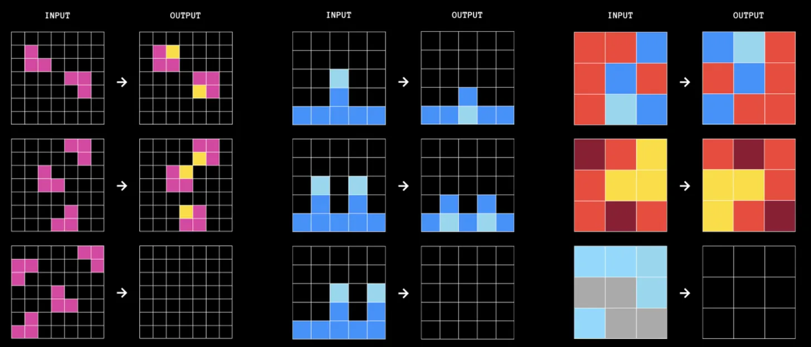

<h2>Entrevista en MLST a François Chollet</h2>

El pasado 6 de noviembre, el podcast <a href="https://creators.spotify.com/pod/show/machinelearningstreettalk">Machine Learning Street Talk</a> publicó una interesantísima entrevista con <a href="https://fchollet.com/">François Chollet</a>. Se trata de una conversación de más de 2 horas y medias en las que <strong>Chollet</strong> revisa en profundidad temas que van desde aspectos técnicos, como el funcionamiento de los LLMs y su diferencia con la AGI, hasta aspectos filosóficos y sociales de la IA, como la emergencia de la consciencia en los niños o el peligro existencial asociado a la IA.

Ya he hablado por aquí varias veces de <strong>Chollet</strong>. Por ejemplo en <a href="/posts/del-16-al-30-de-junio-12-de-2024/">este post</a> comenté las entrevistas con <strong>Dwarkesh Patel</strong> y con <strong>Sean Carroll</strong>. Allí vimos que es una persona con una base técnica muy importante (es el creador de la librería <a href="https://keras.io/">Keras</a> para trabajar con redes neuronales y el autor del libro <a href="https://www.manning.com/books/deep-learning-with-python-second-edition">Deep Learning con Python</a>) cuyas opiniones tienen una fuerte repercusión en la comunidad de LLMs (por ejemplo, su artículo <a href="https://arxiv.org/abs/1911.01547">On the Measure of Intelligence</a> y la actual competición <a href="https://arcprize.org/">ARC</a>, de la que también hablamos <a href="/posts/del-1-al-15-de-junio-11-de-2024/">aquí</a>).

Hoy quiero presentar con detalle esta última entrevista del pasado 6 de noviembre. Además de en el podcast, también se puede ver en YouTube (ya va por más de 40.000 visualizaciones).

<iframe src="https://www.youtube-nocookie.com/embed/JTU8Ha4Jyfc?rel=0&amp;autoplay=0&amp;showinfo=0&amp;enablejsapi=0" frameborder="0" loading="lazy" gesture="media" allow="autoplay; fullscreen" allowautoplay="true" allowfullscreen="true" width="728" height="409">
</iframe>

En este artículo voy a extraer y comentar algunas citas de la entrevista. Dada la extensión de la entrevista, he tenido que hacer una importante selección, mostrando las partes que más me han interesado. Se trata, por ello, de un artículo bastante sesgado. Pero no he cambiado en absoluto el sentido de las afirmaciones de <strong>Chollet</strong>. No está todo lo que ha dicho, pero sí que ha dicho todo lo que está.

Si queréis consultar detalles más técnicos sobre los temas tratados aquí, podéis revisar la charla que han preparado <strong>Chollet</strong> y <strong>Mike Knoop</strong>, el otro organizador de la <strong>competición ARC</strong>, para un tour universitario de presentación del reto:

<ul>
<li>

<a href="https://youtu.be/NDbNlPiS898">YouTube</a>

</li>
<li>

<a href="https://arcprize.org/blog/beat-arc-agi-deep-learning-and-program-synthesis">Post</a>

</li>
<li>

<a href="https://docs.google.com/presentation/d/137ZaRyyxbLsd4QfYZ30HPdaqYrJ8HaKdhzApXYFRoRw/edit?usp=sharing">Diapositivas</a>

</li>
</ul>

<h3>Inteligencia de sistemas 1 y 2</h3>

Imagen generada por ChatGPT.

La teoría de los <strong>sistemas 1 y 2,</strong> propuesta por <strong>Daniel Kahneman</strong> en su libro <a href="https://www.goodreads.com/book/show/11468377-thinking-fast-and-slow">Thinking, Fast and Slow</a>, describe dos modos de pensamiento que operan en la mente humana. El <strong>Sistema 1</strong> es rápido, automático, intuitivo y emocional. Funciona de manera subconsciente y se basa en patrones preexistentes para tomar decisiones sin esfuerzo consciente. Por otro lado, el <strong>Sistema 2</strong> es lento, deliberado, lógico y analítico. Se activa cuando necesitamos concentrarnos, resolver problemas complejos o tomar decisiones importantes que requieren un análisis cuidadoso.

Esta teoría ha tenido un fuerte impacto en <strong>Chollet</strong>, que cree que los LLMs pueden implementar fácilmente Sistema 1, pero no el Sistema 2.

<blockquote>

Los modelos de deep learning son excelentes para producir resultados que son direccionalmente precisos, pero no necesariamente exactos. Son muy buenos para hacer sugerencias útiles. <strong>El proceso del Sistema 1 es similar a lo que hacen los LLMs</strong>. También se basan en pattern matching y mecanismos similares a la intuición.

</blockquote>

Para <strong>Chollet</strong>, a diferencia del Sistema 1, podemos entender el funcionamiento del Sistema 2 mediante la introspección:

<blockquote>

La introspección puede ser muy efectiva para comprender cómo tu mente maneja el pensamiento del Sistema 2. No es tan efectiva para el Sistema 1, ya que este opera de manera inconsciente e instantánea, en partes del cerebro a las que no tienes acceso directo. Ocurre bajo la superficie, fuera de la observación consciente.

El Sistema 2, por otro lado, es deliberado, lento y de baja capacidad. Solo ocurren unas pocas cosas en un momento dado, y es inherentemente introspectivo.

</blockquote>

El funcionamiento de la mente cuando trabaja en modo Sistema 2 es similar a la <strong>ejecución paso a paso de un programa</strong>. Es lo que hacemos cuando, por ejemplo, ordenamos una lista de números o sumamos mentalmente dos números largos: ejecutamos un algoritmo que hemos aprendido.

<blockquote>

Tus pensamientos existen en tu mente en forma de programas.

</blockquote>

<strong>Chollet</strong> argumenta que una característica fundamental de la inteligencia es la capacidad de ejecutar mentalmente estos programas, verificar si funcionan correctamente y resolver una tarea nueva seleccionando los mejores y combinándolos:

<blockquote>

Cuando te enfrentas una tarea nueva, puedes describirla mentalmente utilizando un conjunto de propiedades y luego generar un pequeño número de hipótesis sobre programas que cumplan con esas restricciones descriptivas. Después, <strong>pruebas mentalmente estas hipótesis</strong> para verificar si tu intuición es correcta. Ese es un ejemplo clásico del pensamiento del Sistema 2: es, esencialmente, cómo funciona la <strong>síntesis de programas</strong> en el cerebro.

</blockquote>

<h3>Las limitaciones del deep learning</h3>

Diapositiva del ARC Prize 2024 University Tour.

Cuando <strong>Chollet</strong> comenzó a trabajar con las redes neuronales profundas, pensaba que serían tan potentes como <strong>máquinas de Turing</strong> y podrían implementar algoritmos genéricos. Después de trabajar con ellas varios años intentado usarlas como demostradores de teoremas, se dio cuenta de que su funcionamiento estaba basado en reconocimiento de patrones.

Al principio, <strong>Chollet</strong> creía que el <em>deep learning</em> podía conseguir cualquier cosa:

<blockquote>

Yo, como muchos otros en el campo, asumía que los modelos de aprendizaje profundo eran un sustrato computacional general, capaz de realizar cualquier tipo de cálculo. Creía que eran <strong>completos en el sentido de Turing</strong>. En aquel entonces, entre 2015 y 2016, se discutían ampliamente ideas similares, como el concepto de máquinas de Turing neuronales. Había un sentimiento de optimismo de que el <em>deep learning</em> podría eventualmente reemplazar por completo el software escrito a mano, y al principio me adherí a esa visión.

</blockquote>

Pero llegaron los problemas, cuando intentó usar <em>deep learning</em> para demostración automática de teoremas. Las redes neuronales solo trabajaban por reconocimiento de patrones, no eran capaces de realizar programas secuenciales discretos:

<blockquote>

Trabajaba en demostración automática de teoremas utilizando aprendizaje profundo junto con <strong>Christian Szegedy</strong>. La idea clave detrás de este trabajo era que la demostración de teoremas es similar a la síntesis de programas, ya que implica un proceso de búsqueda en árbol guiado por operadores y axiomas. Nuestro objetivo era utilizar un modelo de <em>deep learning</em> para guiar esa búsqueda.

Dediqué una cantidad significativa de tiempo a explorar este enfoque, probando muchas ideas diferentes. Aunque los resultados eran mejores que al azar, un análisis más profundo reveló que las mejoras provenían del reconocimiento superficial de patrones, más que de un razonamiento auténtico del Sistema 2. <strong>Los modelos no estaban aprendiendo programas generales y discretos</strong>; simplemente explotaban un atajo basado en el reconocimiento de patrones que siempre estaba disponible. Esta realización me pareció un gran obstáculo. No importaba cuánto ajustara la arquitectura, los datos de entrenamiento u otros elementos, los modelos siempre tendían a recurrir a estos atajos.

</blockquote>

El reconocimiento de patrones no era suficiente para hacer deducciones automáticas. <strong>Chollet</strong> concluyó que para eso es necesario sintentizar algoritmos discretos:

<blockquote>

Este fue un punto de inflexión para mí. Estos modelos eran, en esencia, motores de reconocimiento de patrones. Para alcanzar un razonamiento propio del Sistema 2, se necesitaba algo más: la <strong>síntesis de programas</strong>.

</blockquote>

<strong>Inciso especulativo: Srinivasa Ramanujan ¿un genio matemático del Sistema 1?</strong>

Las ideas de <strong>Chollet</strong> sobre la necesidad del razonamiento de Sistema 2 y las limitaciones del Sistema 1 son compartidas por casi toda la comunidad. Sin embargo, se me plantea una duda: ¿cuáles son los límites del reconocimiento de patrones? ¿Se puede crear un sistema intuitivo que genere teoremas matemáticos? Tenemos un caso en el que parece que sí: el matemático indio <strong>Srinivasa Ramanujan</strong>.

El genial matemático indú Srinivasa Ramanujan.

<strong>Srinivasa Ramanujan</strong> (1887-1920) fue un genio autodidacta que creció en la India y, a pesar de tener acceso limitado a educación formal en matemáticas avanzadas, logró desarrollar resultados asombrosos en áreas como teoría de números, fracciones continuas y series infinitas.

Según quienes trabajaron con él, como el matemático británico <strong>G. H. Hardy</strong>, Ramanujan obtenía resultados de una manera profundamente intuitiva, casi como si “aparecieran” en su mente. A menudo presentaba fórmulas y teoremas directamente, sin proporcionar demostraciones formales o los pasos intermedios tradicionales.

Ramanujan describía que sus intuiciones matemáticas surgían como una especie de inspiración divina, y atribuía su capacidad a la diosa hindú <strong>Namagiri</strong>, a quien consideraba su guía espiritual. Por ejemplo, muchas de sus fórmulas sobre fracciones continuas, series infinitas y funciones elípticas parecen haber sido “intuidas” sin recurrir a herramientas convencionales de cálculo o deducción matemática paso a paso.

Quizás esta diosa no era más que la enorme capacidad de <strong>reconocimiento de patrones</strong> que había en la mente de <strong>Ramanujan</strong>, después de haberse entrenado con un vasto número de deducciones<a class="footnote-anchor" data-component-name="FootnoteAnchorToDOM" id="footnote-anchor-1" href="#footnote-1" target="_self">1</a>. 

<h3>Combinar Sistema 1 y Sistema 2</h3>

Imagen generada por ChatGPT.

<strong>Chollet</strong> piensa que, en nuestra mente, el Sistema 1 y el Sistema 2 <strong>funcionan simultáneamente</strong>. La intuición le enseña caminos a la deducción y desecha opciones que no parecen razonables.

<blockquote>

Es importante recordar que el Sistema 2 no funciona de manera aislada. Siempre hay un componente del Sistema 1 que lo respalda. Estoy convencido de que ningún proceso cognitivo en la mente humana es puramente del Sistema 1 o del Sistema 2. Todo es una mezcla de ambos. Incluso en tareas que parecen muy centradas en el razonamiento, como resolver ARC, hacer matemáticas o jugar al ajedrez, hay una cantidad significativa de reconocimiento de patrones e intuición involucrada.

Por ejemplo, al resolver una tarea de ARC, podrías considerar solo dos o cuatro hipótesis, a pesar del inmenso espacio de posibles programas, que podría incluir cientos de miles. ¿Qué <strong>reduce este espacio a solo unas pocas opciones viables</strong>? La intuición o el reconocimiento de patrones, que es el trabajo del Sistema 1.

</blockquote>

De hecho, en otra parte de la entrevista, enfatiza que los LLMs funcionan muy bien para realizar búsquedas intuitivas en grandes espacios combinatoriales:

<blockquote>

Este proceso es similar a lo que hacen los LLMs. También se basan en mecanismos de <em>pattern matching</em> y una especie de intuición para explorar espacios vastos y reducirlos a un número manejable de posibilidades. Aunque aún es necesario verificar sus resultados, sus conjeturas suelen ser sorprendentemente precisas. Creo que este proceso de reducción es un aspecto fundamental de la propia cognición.

</blockquote>

Esto puede ser un camino para construir sistemas más avanzados, combinando un LLM con un <strong>verificador externo</strong>.

<blockquote>

Por eso combinar un LLM con un verificador externo es tan poderoso. Ayuda a navegar el problema de la explosión combinatoria de probar cada posible solución y, al mismo tiempo, compensa las limitaciones de los LLMs, que se basan principalmente en el pensamiento del Sistema 1. Con un verificador externo, se añade una capa de razonamiento del Sistema 2 para el paso crítico de verificación final, asegurando que la solución definitiva sea robusta y confiable.

</blockquote>

Esto se parece a lo que puede estar haciendo <strong>o1</strong> en su fase de inferencia, solo que en el caso de <strong>o1</strong> el verificador externo es también un LLM. 

Por ejemplo, esta fue la forma en la que <strong>DeepMind</strong> programó <a href="https://storage.googleapis.com/deepmind-media/alphago/AlphaGoNaturePaper.pdf">AlphaGo</a>, su sistema para jugar al Go a nivel súperhumano. Utilizó una combinación de redes neuronales para realizar predicciones rápidas y heurísticas (basadas en un proceso similar al pensamiento del Sistema 1) y un proceso de búsqueda en <strong>árboles de Monte Carlo</strong> para evaluar y verificar de manera más exhaustiva las jugadas (un enfoque propio del Sistema 2). Las redes neuronales predecían las mejores jugadas posibles y estimaban la probabilidad de ganar desde una posición determinada, mientras que el sistema de búsqueda verificaba estas jugadas en profundidad, explorando las ramificaciones más prometedoras. Este diseño permitió a <strong>AlphaGo</strong> combinar la intuición de patrones con un análisis meticuloso, demostrando cómo la interacción entre procesos similares a los Sistemas 1 y 2 puede resolver problemas de alta complejidad combinatoria de manera eficiente.

<h3>Interpolación con abstracciones centradas en valores</h3>

Ilustración de una mezcla de tres gausianas en un espacio de dos dimensiones. Extraída del libro "<em>Deep Learning - Foundations and Concepts</em>" de Christopher M. Bishop.

En la entrevista, <strong>Chollet</strong> menciona el concepto de abstracciones centradas en valores (<em>value-centric abstractions</em>) cuando está discutiendo las limitaciones de las técnicas usadas por el <em>deep learning</em>, ajuste de curvas o descenso de gradiente. Específicamente, aparece en esta cita:

<blockquote>

Creo que ajustar curvas paramétricas o utilizar descenso por gradiente funciona bien para lo que llamo abstracción centrada en valores (<em>value-centric abstraction</em>). Esta idea se basa en comparar elementos utilizando una <strong>distancia continua</strong>, lo que conduce naturalmente a incrustar estos “elementos” (como imágenes, conceptos discretos o palabras) en un <em>manifold</em>. En este <em>manifold</em>, los elementos similares se colocan cerca unos de otros, y las diferentes dimensiones de variación dentro del espacio adquieren un significado semántico."

</blockquote>

<strong>Chollet</strong> contrasta este concepto con la "abstracción centrada en programas" (<em>program-centric abstraction</em>), explicando que mientras la abstracción centrada en valores funciona bien con distancias continuas y similitudes, no es adecuada para trabajar con grafos y programas. Como él explica:

<blockquote>

Las curvas son adecuadas para este tipo de abstracción porque fomentan de manera inherente las comparaciones basadas en distancias continuas.

</blockquote>

Estas funciones son creadas por el LLM en el proceso de aprendizaje, como una forma de conseguir predecir el siguiente token. Así, el LLM hace algo más que memorizar, es capaz de aprender este tipo de curvas o funciones:

<blockquote>

Los LLMs están entrenados para predecir el siguiente token utilizando modelos altamente flexibles y ricos. En teoría, si tuvieran una capacidad de memoria infinita, podrían actuar como una enorme tabla de búsqueda. Sin embargo, en la práctica, los LLMs están limitados, por tener solo miles de millones de parámetros. Esta limitación los obliga a <strong>comprimir la información</strong> que aprenden, en lugar de memorizar cada secuencia en los datos de entrenamiento. Lo que realmente están aprendiendo son <strong>funciones predictivas</strong>, que toman la forma de funciones vectoriales, ya que, fundamentalmente, los LLMs operan sobre vectores. [...] Estas funciones pueden generalizar de alguna forma los datos de entrenamiento.

</blockquote>

Y cuando preguntamos a un LLM, éste es capaz de interpolar estas funciones, combinarlas y componerlas:

<blockquote>

Cuando haces una consulta a un LLM, esencialmente estás consultando un punto en el espacio de funciones. Puedes pensar en el LLM como un <em>manifold</em> donde cada punto codifica una función. Además, puedes <strong>interpolar</strong> a través de este <em>manifold</em> para componer o combinar funciones, lo que te ofrece un número infinito de programas potenciales entre los que elegir.

</blockquote>

Artículos recientes, como <a href="https://arxiv.org/abs/2410.21272">Arithmetic Without Algorithms: Language Models Solve Math With a Bag of Heuristics</a>, abundan en estas ideas, y muestran cómo los LLMs son capaces de resolver problemas de matemáticas usando heurísticas resultantes de la combinación de reconocimiento de patrones.

<strong>Chollet</strong> reconoce que estas funciones aprendidas en el pre-training pueden tener un alto nivel de abstracción, y capturar elementos abstractos del lenguaje, como el estilo literario de <strong>Shakespeare</strong>:

<blockquote>

Por ejemplo, imagina un LLM encontrando por primera vez las obras de <strong>Shakespeare</strong>. Si ya ha aprendido un modelo general del idioma inglés, puede reutilizar gran parte de ese conocimiento para entender a Shakespeare. El texto puede ser ligeramente diferente, pero aún se ajusta a la misma estructura subyacente del inglés. El modelo puede entonces aprender una función de transferencia de estilo que <strong>adapta su comprensión general del inglés para generar texto al estilo de Shakespeare</strong>. Por eso los LLMs son capaces de realizar tareas como la transferencia de estilo textual.

</blockquote>

<h3>Competición ARC y la capacidad de la inteligencia de gestionar situaciones novedosas</h3>

Ejemplo de tareas a resolver en el test ARC.

<strong>Chollet</strong> considera que una de las características principales de la inteligencia humana es su capacidad de gestionar <strong>situaciones novedosas</strong> y hacerlo con muy pocas muestras:

<blockquote>

Si deseas medir la inteligencia, necesitas evaluar qué tan eficientemente el sistema adquiere nuevas habilidades con una cantidad limitada de datos.

</blockquote>

La forma de gestionar situaciones novedosas es mediante la creación de nuevas habilidades.

<blockquote>

La inteligencia no es solo una habilidad; es una meta-habilidad, la capacidad con la que <strong>adquieres nuevas habilidades</strong>. La inteligencia es, en esencia, la eficiencia en la adquisición de habilidades.

</blockquote>

Y, lo más importante, estas nuevas habilidades deben crearse en tiempo real. En el caso de los LLMs, estas nuevas habilidades deberían crearse en lo que se denomina <strong>tiempo de inferencia</strong>, no en el tiempo del pre-entrenamiento. Y esto es algo que los LLMs no pueden hacer:

<blockquote>

Si les pides que resuelvan problemas significativamente diferentes a cualquiera de los que se encuentran en sus datos de entrenamiento, generalmente fallarán.

</blockquote>

La capacidad de medir cómo enfrentarse a la novedad es, por tanto, uno de los objetivos principales del test ARC:

<blockquote>

Si deseas medir la inteligencia, necesitas un tipo de prueba diferente, una que no pueda ser superada mediante preparación previa. Por ejemplo, ARC es una prueba de este tipo.

GPT-3.5, cuando se utiliza con direct prompting, alcanza aproximadamente un 21% de precisión en ARC. Esto implica que alrededor del 80% del conjunto de datos es genuinamente novedoso, incluso en comparación con la totalidad de internet. Eso es una buena señal de la solidez del <em>benchmark</em>.

</blockquote>

Para resolver una tarea de <a href="/posts/del-1-al-15-de-junio-11-de-2024/">ARC</a> debemos construir transformaciones (programas) que convierten una imagen de entrada en una imagen de salida. En estas transformaciones usamos conceptos aprendidos previamente (número, posición, color, etc.). Es como usar bloques de construcción previos y combinarlos. Pero para poder hacer esto necesitamos ser capaces de ejecutar mentalmente las pruebas y comprobaciones, esta es la habilidad de la que carecen los LLMs:

<blockquote>

En cada tarea del ARC, se te proporcionan de dos a cuatro ejemplos de demostración, cada uno compuesto por una imagen de entrada y una de salida. Tu trabajo consiste en identificar la transformación o el programa que conecta la entrada con la salida. Después de aprender este programa a partir de los ejemplos, se te da una nueva cuadrícula de entrada y debes producir la cuadrícula de salida correspondiente para demostrar tu comprensión.

El principal cuello de botella aquí es la <strong>explosión combinatoria</strong> del espacio de programas. El número de programas posibles crece exponencialmente con el número de bloques de construcción y el tamaño del programa. Si buscas programas que involucren, por ejemplo, 40 llamadas a funciones, el espacio se vuelve astronómicamente grande, lo que hace imposible iterar exhaustivamente por todas las opciones.

Sin embargo, los humanos no enfrentan este problema de la misma manera. Cuando abordas una tarea de ARC, ejecutas solo un pequeño número de programas paso a paso, principalmente para verificar su corrección. Este proceso se basa en una forma extremadamente poderosa de <strong>intuición</strong>, que reduce significativamente el espacio de búsqueda. Esa intuición no es completamente confiable—por eso necesitas realizar verificaciones—pero es direccionalmente correcta. Te orienta hacia posibilidades prometedoras en lo que de otro modo sería un espacio abrumador de opciones.

</blockquote>

La próxima semana del 10 al 15 de diciembre, en el <strong>NeurIPS 2024</strong>, se presentarán oficialmente los ganadores de la competición de este año y se darán los premios de $50k a los mejores 5 equipos y de $75k a los 3 mejores papers conceptuales. También se publicará un paper resumiendo los mejores avances y el código fuente de los avances más importantes. La competición ya se ha cerrado y no se ha conseguido el premio de $600k al que consiga resolver un 85% de los tests, pero ha habido grandes avances y <strong>los dos mejores equipos han conseguido el 55,5% y el 53,5%</strong>. Comentaremos más detalles por aquí.

<h3>AGI</h3>

Imagen generada por ChatGPT.

Para terminar, vamos a revisar las opiniones de <strong>Chollet</strong> sobre AGI, bastante optimistas. Resalto especialmente la <strong>separación entre AGI y agencia</strong>. Una AGI no lleva asociada el establecimiento de objetivos. Para <strong>Chollet</strong>, eso es algo externo a la propia AGI. Comparto totalmente esta opinión.

La AGI se conseguirá, pero será solo una herramienta:

<blockquote>

Para mí, construir una AGI es un esfuerzo científico, y una vez desarrollada, será una herramienta altamente útil, nada más. La AGI será, como he dicho antes, un algoritmo de búsqueda de caminos para navegar por los espacios de situaciones futuras. Tomará información sobre un problema, sintetizará un modelo de ese problema y ayudará a tomar decisiones basadas en ese modelo. <strong>Será una herramienta valiosa, pero no convertirá a nadie en un dios.</strong>

</blockquote>

Por eso, como que cualquier otra herramienta, la AGI no será capaz de tomar decisiones por si misma. No tendrá objetivos ni agencia:

<blockquote>

<strong>La inteligencia es distinta de la agencia y la definición de objetivos.</strong> Si tienes inteligencia de manera aislada, lo único que tienes es un mecanismo para convertir información en modelos accionables. No es autodirigida ni tiene la capacidad de establecer sus propios objetivos. La definición de objetivos debe ser un componente externo que se añada de forma deliberada.

En este contexto, la inteligencia es como un algoritmo de búsqueda de caminos. Toma el modelo del mundo y el objetivo—ambos proporcionados externamente—y determina la secuencia correcta de acciones para alcanzar ese objetivo. La inteligencia, en este sentido, se trata de navegar por el “espacio de situaciones futuras”. Es, esencialmente, una búsqueda de caminos dentro de ese espacio.

</blockquote>

La agencia, la persecución de objetivos, es lo que puede ser peligroso. Pero eso habría que incluirlo de forma explícita en el sistema. Construir esa combinación sí que podría tener riesgos:

<blockquote>

Podrías imaginar combinar una AGI—este ‘germen’ de inteligencia—con un sistema autónomo de establecimiento de objetivos y un sistema de valores, convirtiéndola efectivamente en un agente, y luego darle acceso al mundo real. ¿Sería eso peligroso? Sí, absolutamente. Pero, en ese caso, habrás diseñado deliberadamente ese peligro. <strong>No es un riesgo inherente a la AGI en sí misma; es algo que has construido conscientemente.</strong>

</blockquote>

Pero no se va a llegar a la AGI de forma abrupta y dará tiempo a reflexionar sobre ese tipo de riesgos:

<blockquote>

Creo que, una vez que tengamos AGI, tendremos tiempo suficiente para anticipar y mitigar este tipo de riesgos. La AGI será una tecnología poderosa, y precisamente por eso será valiosa y útil. Cualquier cosa poderosa lleva inherentemente cierto riesgo, pero mantendremos el control porque la AGI, por sí sola, no puede establecer objetivos. Eso solo cambiará si deliberadamente creas un mecanismo autónomo para definir objetivos.

</blockquote>

Terminamos el artículo con esta visión optimista del futuro. Un futuro que el propio Chollet quiere construir de forma más activa todavía a como lo ha hecho hasta ahora: el pasado 14 de noviembre <a href="https://x.com/fchollet/status/1857012265024696494">anunció en X</a> que dejaba Google para montar una empresa con una amigo. 

¡Buena suerte François!

¡Hasta la próxima, nos leemos! 👋👋

<a id="footnote-1" href="#footnote-anchor-1" class="footnote-number" contenteditable="false" target="_self">1</a>

Quizás si entrenamos un modelo de lenguaje con secuencias completas de deducciones, la red neuronal aprende a identificar patrones usados en estas deducciones y es capaz de generar deducciones que pueden ser correctas. Algo así es parte de <a href="/posts/como-funciona-o1-15-de-2024/">lo que hace o1</a> o el nuevo modelo abierto chino que intenta imitarlo, <a href="https://qwenlm.github.io/blog/qwq-32b-preview/">Qwen QwQ</a>. Y quizás un modelo más grande, el próximo GPT-5, o GPT-6, podrán encontrar patrones más complejos de cuando sean entrenados de forma similar.

