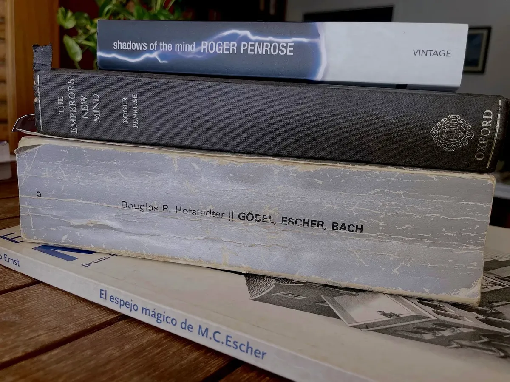
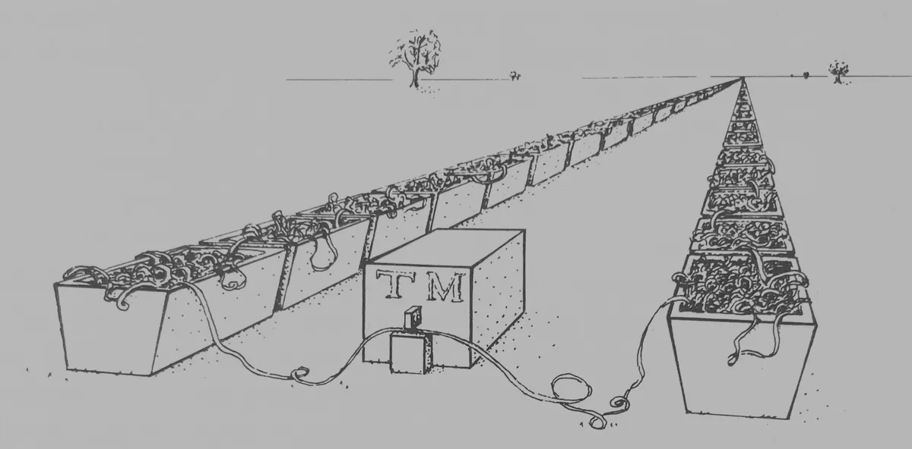
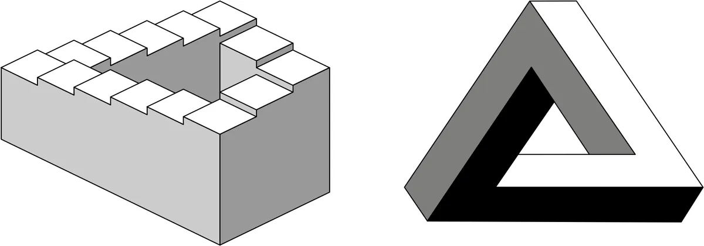
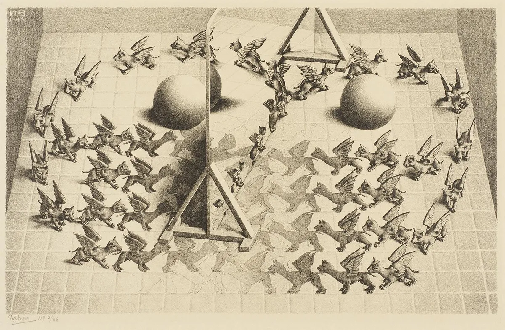

[Post en esta web](/posts/hofstadter-penrose-y-el-sentimiento-de-conciencia-consciente/)

_Penrose, Hofstadter y Escher: tres autores que han moldeado mis opiniones sobre el tema de la conciencia._

Hace cuarenta años leí dos libros que me marcaron: _**Gödel, Escher, Bach**_ de **Douglas R. Hofstadter** y _**The Emperor’s New Mind**_ de **Roger Penrose**. Durante décadas los vi como visiones casi opuestas: Hofstadter se posicionaba a favor de que la IA terminaría construyendo mentes artificiales gracias al dominio de la **estructura**, símbolos, bucles y de los distintos niveles del lenguaje. Penrose, por otro lado, argumentaba que un algoritmo nunca podrá simular **lo que se siente** al estar consciente.

Cuatro décadas después ha ocurrido algo que me obliga a releerlos: la irrupción de los **modelos de lenguaje** entrenados exclusivamente con texto. Sin cámaras ni sensores, estas máquinas aprenden sintaxis y capturan regularidades semánticas de uso: hablan, resumen, programan, argumentan. No resuelven la conciencia, pero sí reencuadran el mapa: muestran que buena parte del “intelecto lingüístico” puede ponerse en pie solo con lenguaje.

## Douglas R. Hofstadter

En 1987, cuando estudiaba tercero de Informática en Alicante, vi en la librería 80 Mundos un libro gris, enorme, de un autor que conocía por los artículos matemáticos de la revista Investigación y Ciencia, **Douglas R. Hofstadter**. Lo hojeé y, al momento, me asombraron las extraordinarias ilustraciones de Escher, la maquetación de un texto complejísimo —con diálogos, deducciones lógicas, largas citas, juegos tipográficos, programas de ordenador, etc.— y la cantidad de temas interesantísimos que recorrían sus casi 900 páginas. Era la traducción al español de **Gödel, Escher, Bach** (GEB), publicada por Tusquets.

Leyendo el libro, parecía que Hofstadter se alineaba con lo que entonces se llamaba **IA fuerte** **(Strong AI)**, la idea de que podremos crear un programa que simule completamente la mente humana, incluida la conciencia. Alan Turing, en su famoso artículo **Computing Machinery and Intelligence** (1950), fue uno de los primeros en defender algo así.

Intenté entender sus argumentos; sin embargo, había cosas que no me convencían. ¿Simular la sensación de conciencia? ¿La sensación de _yo_? ¿La sensación de estar viendo algo _rojo_? ¿Puede un programa de ordenador generar eso? 

Recordemos que el propio Hofstadter explica en el libro la idea, importante y heredera de Turing, de que la ejecución de un programa no es más que aplicar un conjunto de reglas discretas. No habría diferencia conceptual entre un microprocesador ejecutando instrucciones y unos monjes que copian ceros y unos en una cinta de papel. No entendía cómo a Hofstadter (o incluso a Turing) no les parecía absurda esta idea. ¿Cómo pueden creer posible que surja "conciencia" del proceso de borrar y escribir ceros y unos en un papel? ¿Qué ven ellos que yo no veo?

## Roger Penrose

Esta duda aumentó un par de años después, en 1989, cuando el físico **Roger Penrose**, publicó su famoso libro **The Emperors New Mind**. Me compré la edición en inglés el año siguiente, en 1990. Leí ávidamente sus argumentos contrarios a la IA fuerte, intenté leer (sin éxito) toda su explicación sobre la mecánica cuántica y cosmología; y me maravillé con sus magníficas ilustraciones a tinta (Penrose es un excelente dibujante y admirador también de Escher).

_Interpretación de Penrose de una máquina de Turing procesando una cinta infinita._

La tesis de Penrose —que me convenció y en la que sigo creyendo— es que la conciencia humana no es algorítmica: no puede capturarse con una máquina de Turing convencional. En el libro utiliza, entre otras cosas, el teorema de incompletitud de Gödel. Más allá de los detalles, me quedé sobre todo con sus críticas a la posibilidad de simular mediante un algoritmo los aspectos más profundos de la conciencia como la _awareness_ o la _sentience_(sensación de estar consciente, advertir, percibir).

## M. C. Escher como punto de conexión

Penrose y Hofstadter coinciden en algo: la admiración por Escher. Pero cada uno destaca aspectos distintos.

Penrose destaca las paradojas visuales de Escher, la consistencia local que se vuelve imposibilidad global: cada peldaño tiene sentido, pero el conjunto viola la geometría física. Los Penrose (Roger y su padre, Lionel) popularizaron el triángulo imposible y la escalera infinita que Escher convirtió en arte visual en **[Ascending and Descending](https://escherinhetpaleis.nl/en/about-escher/escher-today/ascending-and-descending)** y **[Waterfall](https://escherinhetpaleis.nl/en/about-escher/masterpieces/waterfall)**: metáforas de cómo reglas discretas, aparentemente inocuas, pueden producir paradojas y límites a lo computable.

_La escalera infinita y el triángulo imposible: dos figuras ideadas por Roger y su padre Lionel Penrose._

Hofstadter, por su parte, resalta obras como **[Drawing Hands](https://escherinhetpaleis.nl/en/about-escher/masterpieces/drawing-hands)**, **[Relativity](https://escherinhetpaleis.nl/en/about-escher/masterpieces/relativity)** o **[Print Gallery](https://escherinhetpaleis.nl/en/about-escher/masterpieces/print-gallery)** en las que se visualiza la idea de “bucle extraño” (_strange loop_): niveles que se referencian unos a otros sin comienzo ni final claros. Círculos recursivos y autorreferentes que, para Hofstadter, son esenciales para entender la conciencia y el "yo".

Un dibujo que me gusta especialmente es **Magic Mirror**, que combina muchos de esos elementos: espejos, realidad e ilusión, bucles extraños y teselaciones. Es un buen resumen de todos los conceptos anteriores.

_Grabado de Escher Magical mirror (1946), en el [Museum Escher in Het Paleis](https://escherinhetpaleis.nl/en/about-escher/masterpieces)._

## Crítica a la IA fuerte: el “Libro de Einstein”

Un ejemplo de Penrose que siempre me ha acompañado es su crítica de la idea de Hofstadter de un libro que contenga la mente de Einstein y con el que podemos interactuar haciéndole preguntas. Si la IA fuerte es posible, **podría simularse la mente de Einstein**. Penrose planteaba preguntas que, para mi, vuelven absurda la idea:

> Would Einstein’s awareness be enacted only when the book is being so examined? Would he be aware twice over if two people chose to ask the book the same question at two completely different times? Or would that entail two separate and temporally distinct instances of the same state of Einstein’s awareness? Perhaps his awareness would be enacted only if the book is changed? [...] Or would the book-Einstein remain completely self-aware even if it were never examined or disturbed by anyone or anything? [...] What does it mean to activate an algorithm, or to embody it in physical form? Would changing an algorithm be different in any sense from merely discarding one algorithm and replacing it with another? What on earth does any of this have to do with our feelings of conscious awareness?

Traducción (mía):

> ¿La consciencia (_awareness_) de Einstein se manifestaría solo cuando el libro estuviera siendo examinado? ¿Sería consciente dos veces si dos personas eligieran hacerle al libro la misma pregunta en dos momentos completamente distintos? ¿O eso implicaría dos instancias separadas y temporalmente distintas del mismo estado de consciencia de Einstein? ¿Quizá su consciencia se pondría en acto únicamente si el libro cambia? […] ¿O permanecería el libro-Einstein completamente autoconsciente (_self-aware_) incluso si nunca fuera examinado o perturbado por nadie o por nada? […] ¿Qué significa activar un algoritmo, o encarnarlo en forma física? ¿Sería distinto cambiar un algoritmo en algún sentido de simplemente descartar uno y sustituirlo por otro? ¿Qué tiene que ver todo esto con nuestros sentimientos de conciencia consciente?

Hofstadter no llega a responder estas preguntas: las esquiva, sin entrar en el problema fundamental de la conciencia consciente (_conscious awareness_).

## Cuatro puntos de vista (según Penrose)

En **Shadows of the Mind (1994)** Penrose concreta su posición y, antes, delimita cuidadosamente a qué llama “conciencia”:

> How do our feelings of conscious awareness -of happiness, pain, love, aesthetic sensibility, will, understanding, etc.- fit into such a computational picture? [...]

Traducción:

> ¿Cómo encajan nuestras sensaciones de conciencia consciente (*conscious awareness*)—de felicidad, dolor, amor, sensibilidad estética, voluntad, comprensión, etc.—en un marco computacional como ese?

Penrose subraya ***feelings of conscious awareness***: no le basta con simular conductas; se está refiriendo al problema más fundamental de la conciencia, a la sensación de estar despierto, sintiendo sensaciones, experimentando la realidad.

Luego plantea cuatro posiciones alternativas:

> Me parece que hay al menos cuatro posturas —o extremos de postura— que razonablemente se pueden sostener sobre el asunto:
>
> 1. **Todo pensamiento es computación**; en particular, las sensaciones de conciencia consciente (*conscious awareness*) se suscitan simplemente mediante la realización de las computaciones adecuadas.
> 2. La consciencia (*awareness*) es una característica de la acción física del cerebro; y aunque cualquier acción física puede simularse computacionalmente, **la simulación computacional por sí sola no puede suscitar consciencia** (*awareness*).
> 3. Una acción física apropiada del cerebro suscita consciencia (*awareness*), pero esa acción física **ni siquiera puede simularse adecuadamente por medios computacionales**.
> 4. La consciencia (*awareness*) **no puede explicarse en términos físicos**, computacionales ni de ningún otro tipo científico.
>
> El punto de vista 3 es el que considero más cercano a la verdad.

La opción 1 suele asociarse a computacionalismo/**funcionalismo**; la 2, al **naturalismo biológico**; la 3 podría denominarse **fisicalismo no computacional** (hay procesos físicos no computables implicados en la conciencia); y la 4 se alinea con idealismo o con ciertas variantes de **misterianismo** (lo consciente como intrínsecamente inaccesible a la ciencia).

Penrose se alinea con la **opción 3**. Poniendo las cartas sobre la mesa, yo voto por la **opción 4**. Creo las sensaciones conscientes son algo misterioso cuya explicación está, por su carácter personal e [inefable](https://seantrott.substack.com/p/language-models-and-the-ineffable?r=hbwh&utm_medium=ios&triedRedirect=true), fuera del alcance de la explicación científica objetiva. ¿Tú que opinas?

## ¿Y qué hacía Hofstadter con los sentimientos?

Volvamos a la pregunta de Penrose:

> How do our **feelings of conscious awareness** -of happiness, pain, love, aesthetic sensibility, will, understanding, etc.- fit into such a computational picture? [...]

Es notable el cuidado con el que escoge _feelings of conscious awareness_. Podría haber dicho _feelings_, _consciousnes_ o _awareness_ por separado; las reúne y, después, enumera sensaciones concretas: sensaciones de consciencia consciente de felicidad; sensaciones de consciencia consciente de dolor; sensaciones de consciencia consciente de voluntad, sensibilidad, entendimiento, etc.

Penrose no se conforma con una perspectiva funcional (el “que se comporte como si” del test de Turing). Busca la vivencia, la experiencia fenoménica. Si decimos que una IA puede igualar a un ser humano, Penrose exige que sienta como sentimos los humanos: un _sentimiento de conciencia consciente_.

¿Y Hofstadter? Releyendo GEB, no encuentro una posición nítida sobre los sentimientos. Hacia el final, en "Inteligencia y emociones", intenta desligar ambos conceptos. Abre con la escena de un niño que llora porque ha explotado su globo, y concluye:

> Se podría objetar que, aun cuando el programa **“entienda” lo que se dice, en un sentido intelectual**, jamás lo comprenderá realmente, hasta que no haya llorado y llorado. ¿Y cuándo conseguirá semejante cosa una computadora? Esta es la clase de planteamiento humanístico al que se aboca Joseph Weizenbaum en su libro _Computer Power and Human Reason_; pienso, por mi parte, que es un tema importante: en realidad, un tema verdaderamente muy profundo. Por desdicha, **muchos investigadores de IA se muestran poco dispuestos, en la actualidad, a considerar seriamente este problema**. En alguna medida, con todo, los asiste la razón, pues es un poco prematuro dedicarse ahora al llanto de las computadoras: **primero, es necesario ocuparse de las reglas que permitan a las computadoras habérselas con el lenguaje** y con otras cosas; en su oportunidad, nos enfrentaremos en cuestiones de mayor profundidad.

Los resaltados son míos. Me parece revelador: Hofstadter separa lo "intelectual" —las reglas para tratar con el lenguaje— de los sentimientos. Y esto incluiría, en mi opinión, el "sentimiento de ser consciente" del que habla Penrose.

GEB habla de símbolos, significados, estructuras formales: el **intelecto**. Hofstadter considera que ahí está lo fundamental de nuestra mente. Tal vez por eso [se horrorizó cuando se dio cuenta de que una IA había dominado esta vertiente de nuestra conducta](https://domingogallardo.substack.com/i/150656851/criticos-y-apocalipticos).

## El _plot twist_ de los modelos de lenguaje

En la última década hemos visto algo sorprendente: **modelos de lenguaje** (LLMs) entrenados exclusivamente con texto, sin entradas sensoriales ni motoras, aprenden a manipular estructuras sintácticas y a manejar regularidades semánticas de uso: mantienen la referencia en un diálogo, siguen instrucciones complejas, resumen, traducen, argumentan, programan. Todo ello sin haber “tocado” el mundo más allá de lo que está implícito en los corpus escritos.

No prueba nada definitivo sobre la conciencia, pero sí reencuadra el mapa: muestra que una gran parte de la competencia lingüística y del razonamiento textual puede **emerger del propio lenguaje**. Mucho de lo que asociábamos al “intelecto lingüístico” puede aprenderse solo con texto. 

Eso no resuelve el enigma de sentir, pero sí aclara que hablar, razonar y mantener coherencia referencial no implican por sí mismos haber sentido nada.

## Una nueva perspectiva

Con esta lente actual, vuelvo a Hofstadter y Penrose para entender mejor qué discutían realmente —y por qué, quizá, no estaban tan en desacuerdo.

A ojos de Hofstadter, los modelos de lenguaje podrían verse como la confirmación de que los patrones simbólicos y los bucles de referencia son suficientes para el razonamiento. A ojos de Penrose, confirmarían que el dominio del lenguaje no necesita la experiencia vivida.

Casi cuarenta años después de mi primera lectura de _GEB_, releerlo con esta perspectiva resulta muy sugerente. Hofstadter no aborda el sentimiento de ser consciente; habla de símbolos y lenguaje. Penrose, en cambio, habla de sensación de ser consciente. Quizá no estaban tan enfrentados: discutían sobre palabras ambiguas. Cada uno entendía de modo distinto “mente” y “conciencia”.

En el próximo artículo quiero desambiguar la palabra “conciencia” (_consciousness_) con un divertido juego tipológico: **conciencia tipo-1, tipo-2 y tipo-3**. 

Lo cuento en un par de semanas.

---

¡Hasta la próxima, nos leemos! 👋👋
