
👋👋 ¡Hola, soy Domingo!

Aquí estamos, un nuevo viernes, con la novedad que prometí en mi última entrega: un número especial.

¿Por qué un número especial? Pues por mi habitual tendencia a escarbar y acumular pestañas en el navegador. En este caso, empecé con el tema de los papiros de Herculano para incluirlo como noticia en el número de finales de abril. Pero una web me llevó a otra, y a otra, y a otra, y al final el tema se descontroló. 

¡Vamos allá! ¡Muchas gracias por leerme!

El 25 de abril leí una noticia curiosa: “Un papiro de Herculano revela el lugar preciso de la tumba de Platón” [<a href="https://arstechnica.com/science/2024/04/deciphered-herculaneum-papyrus-reveals-precise-burial-place-of-plato/https://arstechnica.com/science/2024/04/deciphered-herculaneum-papyrus-reveals-precise-burial-place-of-plato/">Deciphered Herculaneum papyrus reveals precise burial place of Plato - arstechnica.com</a>]. Ya había leído o oído hablar sobre estos papiros, por ejemplo, en la explicación de <a href="https://x.com/Neferchitty">María Ribes</a> en el <a href="https://www.museosdetenerife.org/coffeebreak/?p=2891">episodio 451 de Coffee Break</a>. Pero no lo había mirado en profundidad. Quise enterarme bien, me puse a buscar en la web y al final me encontré con una historia fascinante que tenía que compartir: cómo una competición de Inteligencia Artificial ha permitido desvelar escritos contenidos en papiros carbonizados por la erupción del Vesubio hace más de 2.000 años.

Y, por cierto, al final resultó que la noticia original no tenía que ver con los papiros de los que vamos a hablar.

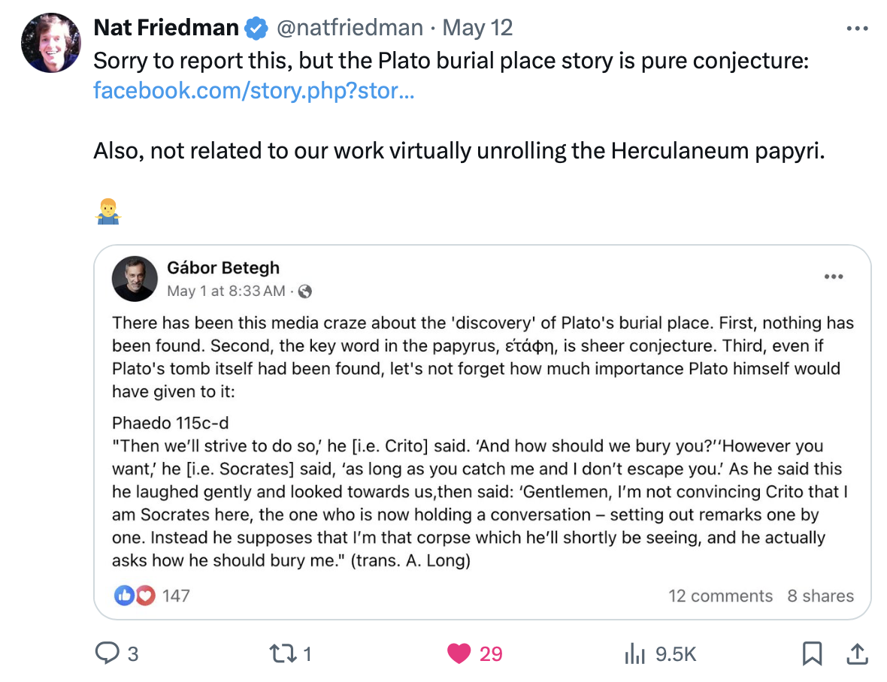

<a href="https://x.com/natfriedman/status/1789707763347583186">Post en X de Nat Friedman</a> sobre la noticia de la tumba de Platón y los papiros de Herculano.

<h3>Origen</h3>

¿Qué son estos papiros? ¿Qué pasó en Herculano? 

La historia comienza en el siglo I a.C., en la ciudad romana de Herculano. Un rico noble romano, <strong>Lucio Calpurnio Pisón Cesonino</strong>, que sería suegro de <strong>Julio César</strong>, construye en las afueras de la ciudad una lujosa villa (la denominada Villa de los Papiros [<a href="https://es.wikipedia.org/wiki/Villa_de_los_Papiros">Villa de los Papiros - wikipedia.org</a>]).

Era una gran residencia, llena de elementos artísticos (frescos, mosaicos, esculturas) y dotada de una gran biblioteca con una vasta colección de textos clásicos, en griego y en latín, que abarcaban una amplia gama de temas filosóficos y literarios. Estos textos estaban escritos en papiros enrollados, apilados horizontalmente en estanterías.

Toda esta riqueza habría desaparecido de no haber sido por la erupción del Monte Vesubio en el año 79 d.C. La erupción cubrió Pompeya de cenizas, y también Herculano. Esta ceniza, paradójicamente, actuó tanto como destructor como conservador. La lava y las cenizas que sepultaron la villa crearon una cápsula del tiempo que preservó los papiros junto con otros objetos valiosos. Este fenómeno permitió que, casi dos milenios más tarde, arqueólogos y expertos pudieran redescubrir estos tesoros.

En el siguiente vídeo se muestra cómo la inundación de cenizas y material caliente del volcán cubrió los rollos y los carbonizó.

<h3>Descubrimiento y primeros intentos de leer los papiros</h3>

El libro de 1908 de la arqueóloga <strong>Ethel Ross Barker</strong>, “Buried Herculaneum” [<a href="https://archive.org/details/buriedherculaneu00barkuoft/page/108/mode/2up">Buried Herculaneum - archive.org</a>], describe con detalle la historia de las excavaciones de Herculano y del descubrimiento de los tesoros enterrados y de los papiros. A mediados del siglo XVIII se comenzó a excavar la villa y sus alrededores, y en el otoño de 1752 se encontraron los primeros hallazgos: 21 rollos y fragmentos contenidos en dos estanterías de madera. Parecían troncos quemados de carbón vegetal y algunos se habían confundido como tales y se habían desechado. En años sucesivos se fueron encontrando muchos más, hasta un total de 1.806. De ellos, 341 eran rollos completos, 500 eran fragmentos y los restantes 965 estaban en un estado intermedio de conservación.

Las siguientes fotografías muestran distintos ejemplos de estos rollos y fragmentos.

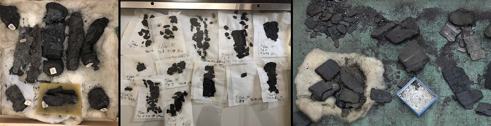

En muchos de los restos se podía ver la escritura contenida en los papiros, como el que se muestra en la siguiente fotografía.

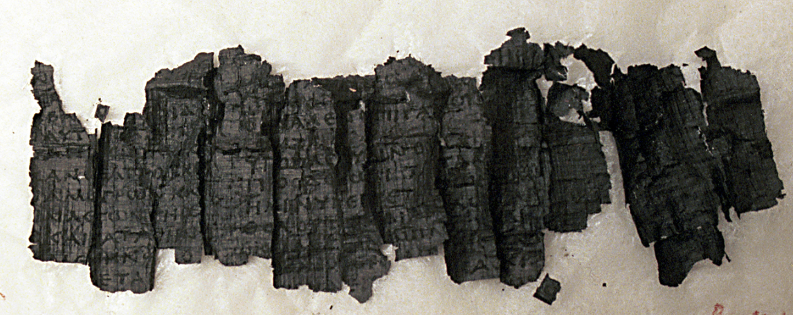

Otros rollos completos se intentaron separar cortándolos por la mitad o desplegándolos cuidadosamente, terminando en fragmentos que se intentaban clasificar y ordenar como el papiro nº 10.

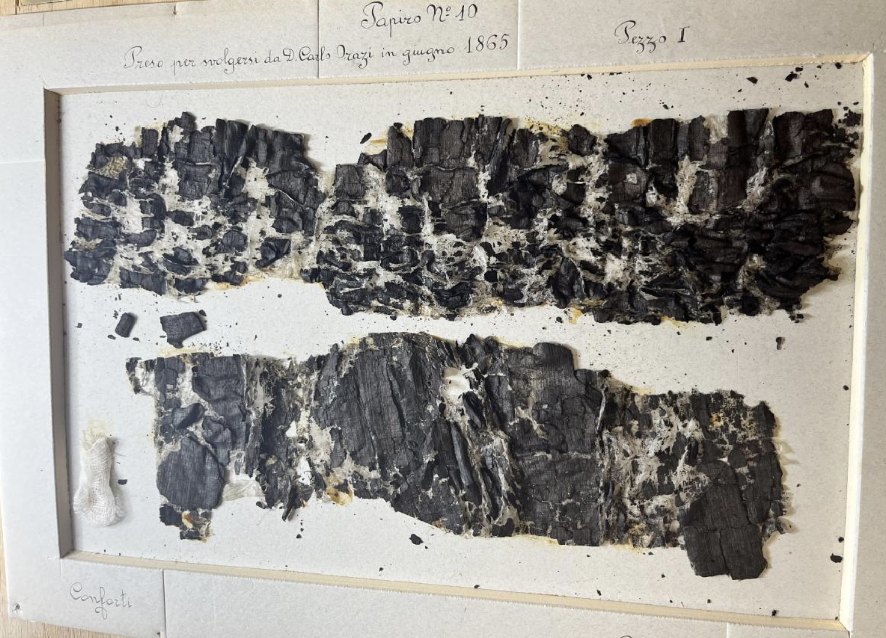

Como resultado del análisis de todos estos restos, se pudo determinar que la gran mayoría de los papiros son textos en griego que pertenecen al filósofo epicúreo <strong>Filodemo de Gadara</strong>, un filósofo del siglo I a.C. que vivió en la región. En las obras se tratan extensamente temáticas relacionadas con la ética, poesía, música y lógica. También forman parte de los rollos una veintena de papiros latinos que aún no han sido descifrados.

<h3>Rollos pendientes de descifrar</h3>

Más de 1.000 rollos y fragmentos están todavía por descifrar. Muchos de ellos son rollos completamente carbonizados, que parecen carbón vegetal. Es el caso del PHerc 1667, una parte intacta del interior de un rollo, con un diámetro aproximado de 3 cm. y una longitud de 8,5 cm. Las partes exteriores del rollo fueron separadas del mismo, en un intento de “desenrollarlo”.

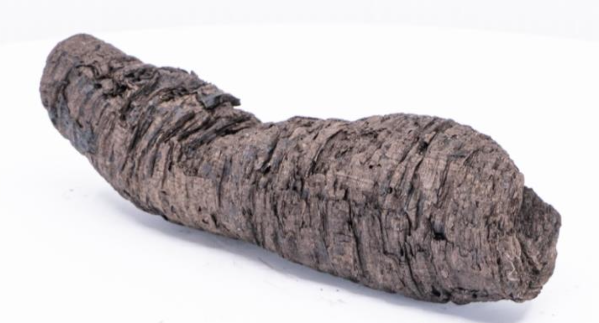

Papiro PHerc 1667, imagen extraída de las <a href="https://drive.google.com/file/d/1I6JNrR6A9pMdANbn6uAuXbcDNwjk8qZ2/view">notas técnicas de la captura de datos 2023</a>.

Otro ejemplo es el rollo PHerc 332, en el que se pueden apreciar las capas individuales enrolladas que lo forman. Este papiro tiene unas dimensiones de 7,7 cm. de largo y 2,6 cm. de diámetro.

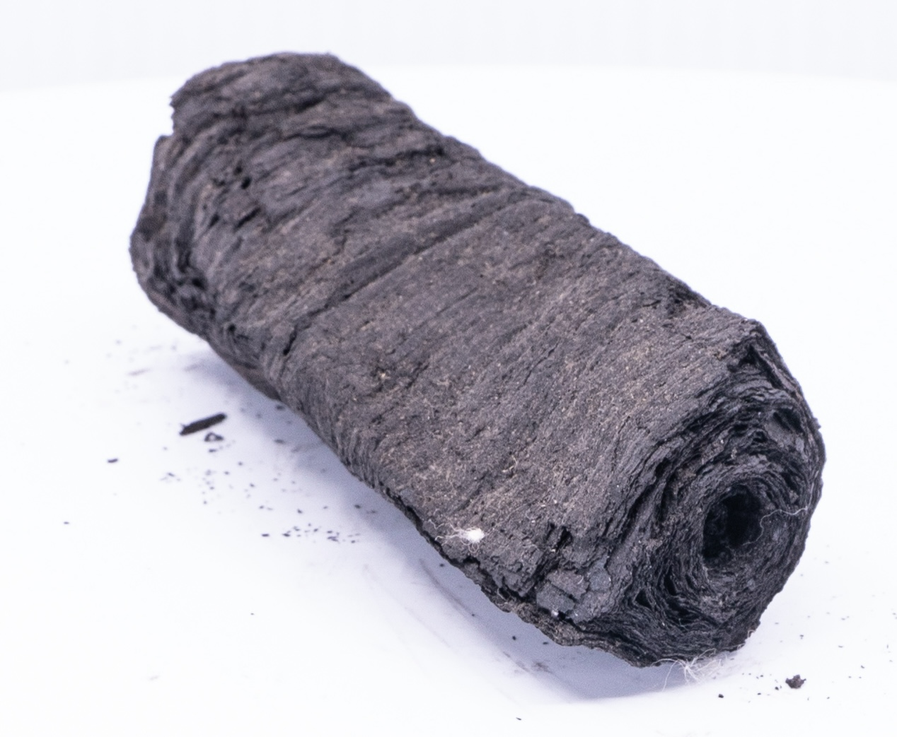

Papiro PHerc 332, imagen extraída de las <a href="https://drive.google.com/file/d/1I6JNrR6A9pMdANbn6uAuXbcDNwjk8qZ2/view">notas técnicas de la captura de datos 2023</a>.

Y un último ejemplo de otro rollo, deformado y solidificado por la carbonización.

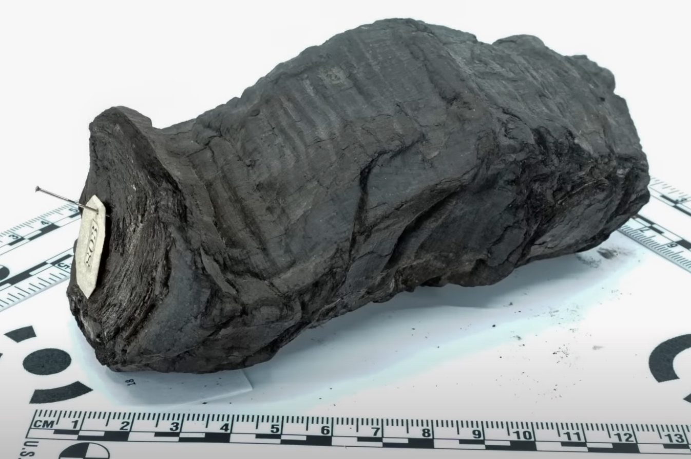

Imagen extraída del vídeo de Brent Seales: <a href="https://youtu.be/Z_L1oN8y7Bs?si=bcFdgIBm3hVUESuK">Herculaneum scrolls: A 20-year journey to read the unreadable</a>.

En principio parece imposible obtener la mínima información de estos bloques carbonizados. No parece posible que la tinta se haya conservado después de esa carbonización. Pero, ¿y si hacemos una tomografía del papiro? ¿Podríamos reconstruir su interior y examinarlo sin dañarlo? ¿Podríamos encontrar los restos de tinta y descifrar su escritura?

<h3>Primera tomografía de uno de los papiros</h3>

<strong>Brent Seales</strong>, profesor de ciencia de la computación de la Universidad de Kentucky [<a href="https://www2.cs.uky.edu/dri/w-brent-seales/">Brent Seales - uky.edu</a>], intentó en 2009 resolver el problema. Junto con su equipo, viajó al Institut de France para realizar la primera microtomografía computarizada de uno de los rollos. El resultado es una secuencia de imágenes escaneadas como la siguiente, obtenidas a partir de una resolución de 14 micrómetros (0,014 mm.).

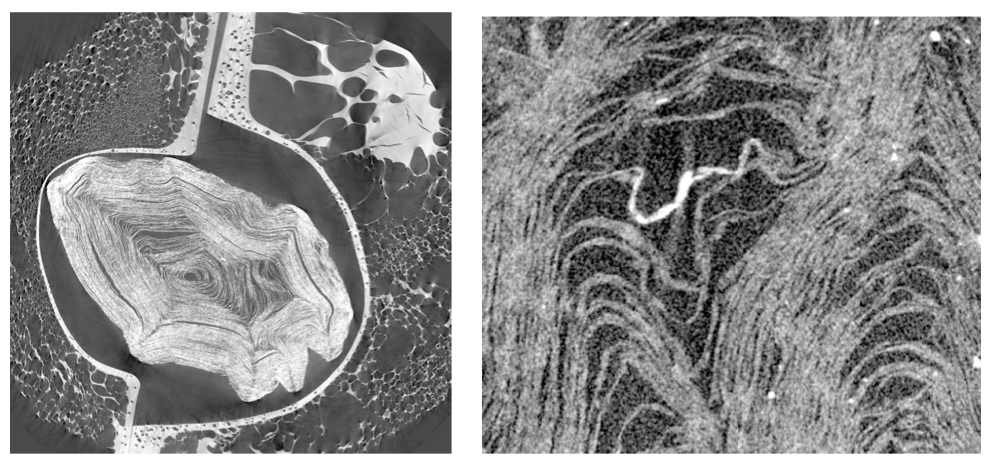

El interior del rollo parece que se ha preservado y se pueden observar las capas del papiro enrollado, pero no con una definición suficiente para poder separarlas de forma automática y encontrar tinta. El problema era demasiado complejo. Concluyen su artículo de 2011 [<a href="https://scholar.google.com/citations?view_op=view_citation&amp;hl=en&amp;user=jk09W8sAAAAJ&amp;cstart=20&amp;pagesize=80&amp;sortby=pubdate&amp;citation_for_view=jk09W8sAAAAJ:eJXPG6dFmWUC">Analysis of Herculaneum papyri with x-ray computed tomography - scholar.google.com</a>] diciendo:

<blockquote>

Hemos tenido problemas en el análisis de los datos por la naturaleza compleja de la estructura interna del papiro. La separación automática de las capas del papiro ha sido virtualmente imposible. Se ha intentado una reconstrucción manual de una pequeña región, pero no se ha conseguido hacer visible la tinta.

</blockquote>

Pero Seales no se desanima y está convencido de que el enfoque es correcto y que dará resultado. Se necesita más resolución y mejores algoritmos. Y se necesita validar el enfoque con un problema más sencillo.

<h3>Brent Seales descifra el pergamino En-Gedi</h3>

En el año 2015 Brent Seales y su equipo demostraron que la respuesta es afirmativa en el caso del pergamino En-Gedi [<a href="https://en.wikipedia.org/wiki/En-Gedi_Scroll">En-Gedi scroll - wikipedia.org</a>]. El pergamino está hecho de piel animal, específicamente de cuero (a diferencia de los rollos de Herculano que son de papiro). Fue descubierto en 1970 en una sinagoga en En-Gedi, Israel, y data del siglo III o IV d.C. 

El pergamino En-Gedi también fue carbonizado y se encontró en un estado muy frágil. Sin embargo, el equipo del profesor Seales consiguió aplicar su método, demostrando que era posible desenrollarlo virtualmente a partir de su imagen tridimensional tomográfica. 

El profesor Seales lo explica muy bien en el siguiente vídeo.

<iframe src="https://www.youtube-nocookie.com/embed/Z_L1oN8y7Bs?rel=0&amp;autoplay=0&amp;showinfo=0&amp;enablejsapi=0" frameborder="0" loading="lazy" gesture="media" allow="autoplay; fullscreen" allowautoplay="true" allowfullscreen="true" width="728" height="409">
</iframe>

Hemos extraído unos fragmentos del vídeo, para detallar las fases del proceso.

<ol>
<li>

Primero, se realiza un escaneado tridimensional usando una técnica de microtomografía computarizada con rayos X, con una resolución de micrómetros. Con esto se obtiene un volumen tridimensional del pergamino y de su interior.

</li>
</ol>

<ol start="2">
<li>

Después, se selecciona una línea de la imagen tridimensional, que corresponde a una sección con una hoja del pergamino, y se reconstruye un parche del pergamino. En esa reconstrucción ya se puede ver la escritura.

</li>
<li>

Se hace el mismo proceso con todos los parches posibles. Una vez obtenidos todos, se comprueban las zonas de solape y se encajan, completando una especie de rompecabezas que reconstruye la mayor parte posible del pergamino.

</li>
</ol>

El éxito del proyecto desembocó en la publicación de varios artículos científicos [<a href="https://www.science.org/doi/full/10.1126/sciadv.1601247?width=921.6&amp;height=921.6&amp;TB_iframe=true">From damage to discovery via virtual unwrapping: Reading the scroll from En-Gedi - science.org</a>] y en la obtención de una ayuda de 14 millones de dólares de la National Science Foundation [<a href="http://uknow.uky.edu/campus-news/uk-awarded-14-million-nsf-grant-launch-world-class-cultural-heritage-lab">UK Awarded $14 Million NSF Grant to Launch World-Class Cultural Heritage Lab - uky.edu</a>] para la formación del centro <a href="https://www2.cs.uky.edu/dri/">EduceLab</a>, dirigido por el propio Seales, con el objetivo fundamental de reconstruir y preservar textos de la antigüedad y, en concreto, los papiros de Herculano.

<h3>Detección de la tinta en un fragmento de papiro</h3>

Las técnicas que funcionaban en el pergamino En-Gedi, sin embargo, no obtenían buenos resultados en los papiros de Herculano. Por una parte, el tipo de material era distinto. El papiro es un tejido y hasta entonces nadie había tenido éxito en recuperar la tinta a partir de un tejido carbonizado. Además, los papiros estaban mucho más enrollados que el pergamino y las capas a desenvolver eran mucho más intrincadas.

En 2016 se unieron dos estudiantes de informática recién graduados, <strong>Seth Parker</strong> y <strong>Stephen Parsons</strong>, quienes terminaron siendo determinantes para el éxito del proyecto. El primero se especializó en el procesamiento de los datos obtenidos por la tomografía de rayos X, y el segundo se centró en la reconstrucción 3D y en el aprendizaje automático con redes neuronales.

El objetivo de Parsons era obtener una red neuronal convolucional que fuera capaz de obtener la tinta preservada en el papiro a partir de los datos volumétricos de un escaneo 3D. Para realizar el entrenamiento de la red neuronal, se utilizaron fragmentos separados del papiro en los que la tinta era visible, así como sus escaneos 3D volumétricos.

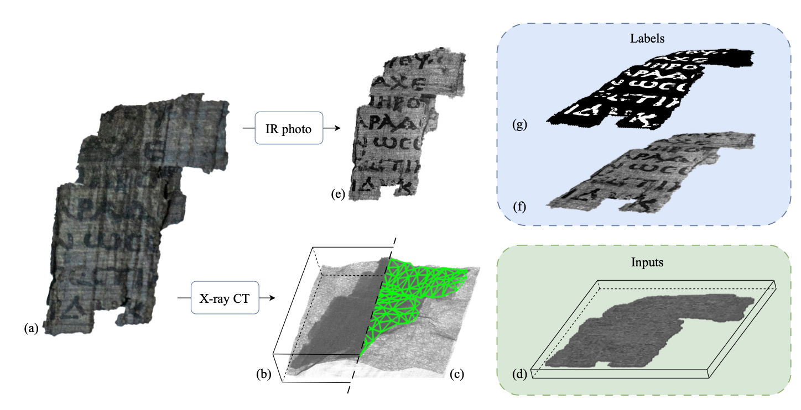

Datos de aprendizaje de la red neuronal que reconoce tinta en un papiro. <a href="https://uknowledge.uky.edu/cs_etds/138/">Tesis doctoral de Stephen Parsons</a>.

Después de numerosos intentos, Parsons logra desarrollar un modelo que, utilizando estos fragmentos de papiros, produce resultados iniciales prometedores. En la siguiente figura se muestra el resultado final de la salida de la red neuronal (a la izquierda), en la que los puntos blancos representan tinta. Vemos que hay bastante ruido, pero que se identifican correctamente algunas letras.

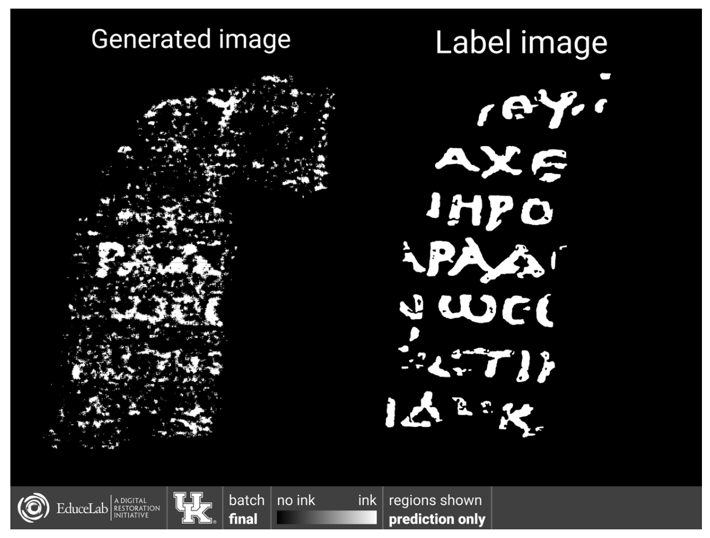

En 2019 se realiza un nuevo escaneo de un rollo completo en el acelerador de partículas del Reino Unido <a href="https://www.diamond.ac.uk/Home.html">Diamond Light Source</a>. Utilizando rayos X más energéticos, se obtiene un escaneo con una resolución de 8 micrómetros (0,008 mm.), casi el doble de resolución que el primer escaneo.

Con el software de Parker, se mejoran las herramientas para procesar los datos y el equipo elabora un posible esquema de trabajo que permita reconstruir parte del rollo. Es muy similar al que se usó para el pergamino de En-Gedi.

<ol>
<li>

Se selecciona manualmente la capa del rollo que se va a desenrollar virtualmente:

</li>
<li>

Después de seleccionar la capa en cortes consecutivos, se obtiene una superficie correspondiente a un fragmento del papiro:

</li>
<li>

Por último, se amplía esa superficie, engrosándola con los datos de arriba y abajo del escaneado original, para obtener un superficie con cierto volumen:

</li>
<li>

Y es en este volumen donde se aplica el modelo de red neuronal, esperando detectar los puntos de tinta:

</li>
</ol>

El problema fue que, a pesar de todo el trabajo y la gran resolución de los datos, el modelo no funcionaba lo suficiente bien como para obtener una palabra completa. Sin embargo, representaba un punto de partida robusto a partir del cual conseguirlo. Como decían Parker y Parsons al final del artículo publicado en 2019 [<a href="https://journals.plos.org/plosone/article/file?id=10.1371/journal.pone.0215775&amp;type=printable">From invisibility to readability: Recovering the ink of Herculaneum - plos.org</a>]:

<blockquote>

Con la capacidad comprobada de nuestra cadena de aprendizaje automático para detectar la señal de la tinta de carbono y representarla de manera fotorrealista, la comunidad académica puede estar un paso más cerca de presenciar “un estallido de genialidad desde el polvo”<a class="footnote-anchor" data-component-name="FootnoteAnchorToDOM" id="footnote-anchor-1" href="#footnote-1" target="_self">1</a> de Herculano.

</blockquote>

Aunque no llegaron a descifrar ninguna palabra del rollo, Parsons y Parker establecieron las bases para los siguientes avances. Y además, lo más importante, terminaron sus tesis doctorales: en 2023 [<a href="https://uknowledge.uky.edu/cs_etds/138/">Parsons - Hard-Hearted Scrolls: A Noninvasive Method for Reading the Herculaneum Papyri</a>] y en 2024 [<a href="https://uknowledge.uky.edu/cs_etds/143/">Parker - Flexible Attenuation Fields: Tomographic Reconstruction From Heterogeneous Datasets</a>].

<h3>La competición Vesuvius Challenge</h3>

A finales del 2022, el informático y emprendedor <strong>Nat Friedman</strong> [<a href="https://en.wikipedia.org/wiki/Nat_Friedman">Nat Friedman - wikipedia.org</a>, <a href="https://nat.org">nat.org</a>], conoció el proyecto, se puso en contacto con Seales, y le propuso la idea de hacer públicos todos los datasets y organizar una competición para mejorar el modelo de red neuronal (y, eventualmente, conseguir leer rollos completos).

Primer <a href="https://x.com/natfriedman/status/1585422037614415873">post en X de Nat Fridman</a> en el que hace referencia (sin nombrarlo) al Vesubius Challenge.

La idea de organizar una competición para obtener o mejorar un modelo de IA es algo habitual en el campo. Por ejemplo, la web <a href="https://www.kaggle.com">Kaggle</a>, fundada en 2010 [<a href="https://en.wikipedia.org/wiki/Kaggle">Kaggle - wikipedia.org</a>], ha organizado cientos de competiciones en las que han participado decenas de miles de aficionados y especialistas.

Friedman, que había liderado grandes proyectos y empresas de software como Ximian, Xamarin y GitHub, sabía que era necesario organizar la competición de forma muy cuidadosa, vigilando su desarrollo y estructurándola de forma que se favoreciera la colaboración entre los participantes y la compartición de resultados. No era suficiente proporcionar un premio jugoso (inicialmente $500.000: $250.000 suyos y $250.000 del emprendedor <strong>Daniel Gross</strong> [<a href="https://dcgross.com">dcgross.com</a>]), sino que había que gestionarla meticulosamente y supervisar cada detalle de cerca.

En noviembre, Fridman lanzó una convocatoria buscando un líder técnico para el proyecto [<a href="https://nat.org/puzzle">Hiring tech lead to help solve major archaeological puzzle - nat.org</a>] y terminó contratando a <strong>JP Posma</strong> [<a href="https://x.com/JanPaul123/status/1604555746489663490">I can announce it now - x.com</a>], quien organizó la web de la competición y preparó su funcionamiento en las distintas redes sociales en las que se va a presentar.

Finalmente, el 15 de marzo de 2023 se lanzó la web <a href="https://scrollprize.org">Vesuvius Challenge</a>.

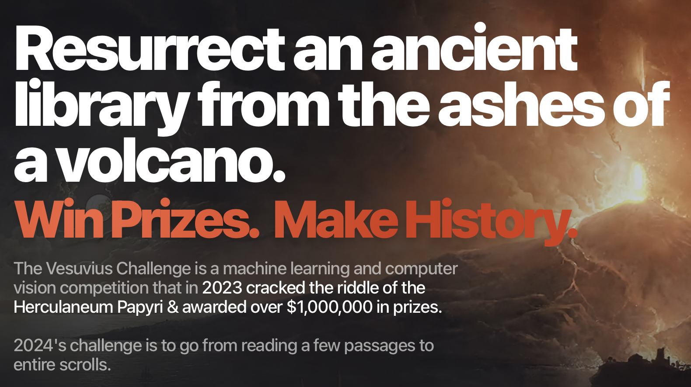

Portada de la web de la competición Vesuvius Challenge en la actualidad.

Y también en esa fecha se presenta la competición en distintas redes sociales (<a href="https://discord.com/invite/V4fJhvtaQn">discord</a>, <a href="https://x.com/scrollprize">X</a>), se lanza una <a href="https://scrollprize.substack.com">newsletter</a> y se abre la competición en <a href="https://www.kaggle.com/competitions/vesuvius-challenge-ink-detection">Kaggle</a>.

En muy poco tiempo, la competición se hace muy popular, aumentan los donativos hasta superar el millón de dólares y atrayendo a muchos participantes que se lanzan a trabajar con las herramientas y los datos facilitados. 

Para conseguir el premio final de $700.000, se debía descifrar, antes del 31 de diciembre de 2023, cuatro pasajes separados de texto, cada uno de ellos conteniendo al menos 140 caracteres de texto continuo. Pero, para fomentar la cooperación, también se proponían “premios de progreso” (entre $1.000-10.000) cada dos meses. Para ganar estos premios, los participantes debían publicar en abierto su código o investigación, beneficiando así el progreso de toda la comunidad.

<ul>
<li>

El 15 de abril se otorgan los primeros <a href="https://scrollprize.substack.com/p/first-prizes-awarded-open-source">cuatro premios open source</a>, de $2.500 cada uno, por la creación y mejora de herramientas y la aportación a la comunidad.

</li>
<li>

El 27 de junio se entregan premios de progreso por <a href="https://scrollprize.substack.com/p/segmentation-tooling-winners-new">contribuciones a la segmentación</a> y la obtención automática de parches del papiro, uno de los problemas más complicados. Se decide contratar a “segmentadores” para extraer distintos parches que se dejan a disposición de la comunidad. 

</li>
<li>

En los meses posteriores se otorgan bastantes premios de progreso, pero no parece que se avance de forma clara. Hasta que, el 13 de octubre, el estudiante de 21 años<strong> Luke Farritor</strong>
<a href="https://scrollprize.org/firstletters">encuentra la primera palabra</a> en uno de los trozos del papiro: ΠΟΡΦΥΡΑϹ (porphyras). Significa “púrpura” y es una palabra bastante rara en los textos antiguos.

Primera palabra encontrada en uno de los rollos de los papiros de Herculano.

El propio Luke cuenta la emoción del descubrimiento en este vídeo.

<iframe src="https://www.youtube-nocookie.com/embed/zpflT8XuSyg?rel=0&amp;autoplay=0&amp;showinfo=0&amp;enablejsapi=0" frameborder="0" loading="lazy" gesture="media" allow="autoplay; fullscreen" allowautoplay="true" allowfullscreen="true" width="728" height="409">
</iframe>

</li>
<li>

Tras el éxito de Luke, <strong>Youseff Nader</strong>, un estudiante de doctorado egipcio en Berlín, probó un nuevo modelo de red neuronal sobre el mismo parche en el que Luke había encontrado la palabra. Usó los resultados de Luke para reforzar el aprendizaje del modelo y obtuvo un resultado sorprendente: una imagen en la que la palabra encontrada anteriormente aparecía con mucha más claridad, y además se podían leer dos palabras más, una arriba y otra debajo.

Imagen resultado de aplicar la red neuronal de Youssef sobre el mismo fragmento en el que Luke encontró la primera palabra.

</li>
<li>

El 5 de febrero de 2024 se anuncian los ganadores de los $700.000 del premio principal: un súper equipo formado por los anteriores ganadores Youseff y Luke, junto con el joven suizo <strong>Julian Schilliger</strong>, logró obtener 15 columnas (¡11 más de las requeridas!) y más de 2.000 caracteres en total. Esto representa solo un 5% del contenido total que debe haber en el papiro.

</li>
</ul>

Se había conseguido el reto. Dos mil años después de ser sepultados por la erupción del Vesubio, tres jóvenes habían leído por primera vez uno de los rollos de papiro carbonizados. Habían demostrado que el proyecto que había comenzado hacía más de quince años Brent Seales era viable. Que los papiros carbonizados podían desenrollarse de forma virtual y leerse con una red neuronal.

La siguiente figura es la imagen presentada por el equipo ganador.

Imagen con la reconstrucción del texto del papiro proporcionada por el equipo ganador.

Un equipo de expertos reunidos por el Vesuvius Challenge estudió el texto, lo transcribió y realizó su traducción, validando que su contenido tiene relación con la colección de textos epicúreos encontrados en la Villa. En la <a href="https://scrollprize.org/grandprize">página de la competición</a> se pueden encontrar los fragmentos transcritos al griego y traducidos.

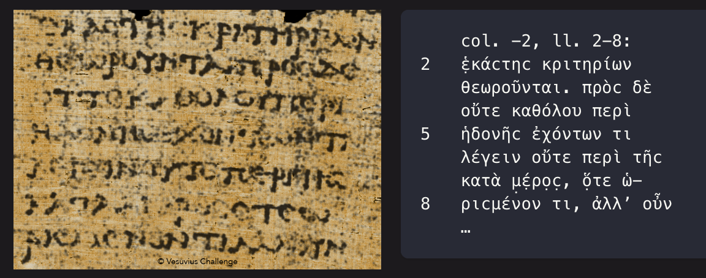

Columna de la imagen reconstruida, con el texto resaltado después de un procesado, con su transcripción al griego a la derecha.

Los tres ganadores del reto son los que han recibido el premio mayor, pero ha habido muchos premios adicionales, tanto para los premios “open source” y “de progreso” como para otros tres equipos finalistas, que recibieron $50.000 cada uno.

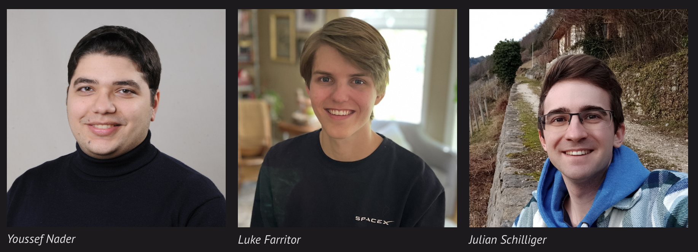

Equipo ganador del premio final de 2023 de la competición.

El listado completo de premios concedidos hasta ahora (abril de 2024) asciende a $1,236,500. En la <a href="https://scrollprize.org/winners">página web </a>de la competición se puede encontrar un listado completo, con enlaces a las páginas en GitHub correspondientes a cada premio.

<h3>Celebración y futuro</h3>

El 16 de marzo de 2024 se celebró <a href="https://www.getty.edu/visit/cal/events/ev_4074.html">un evento</a> en la Villa Getty en Malibú [<a href="https://en.wikipedia.org/wiki/Getty_Villa">Getty Villa - wikipedia.org</a>] en el que se realizó la entrega de premios del concurso Vesuvius Challenge. La villa, diseñada por el millonario Paul Getty e inspirada en la Villa de los Papiros, es un museo dedicado al estudio de antigüedades griegas, romanas y etruscas. El museo es también uno de los colaboradores del proyecto EduceLab de Brent Seales.

En el evento participaron historiadores especialistas en los papiros de Herculano, así como Nat Friedman y el propio Brent Seales. Fue una celebración del éxito obtenido gracias a la combinación de métodos tradicionales y enfoques innovadores: por un lado, la colaboración entre instituciones académicas y la financiación pública, y por otro, una idea bastante radical promovida por un tecnólogo emprendedor, y apoyada por donativos de Sillicon Valley, la comunidad de código abierto y el entusiasmo de jóvenes especialistas aficionados conectados en línea.

<iframe src="https://www.youtube-nocookie.com/embed/uPefxeXfssA?rel=0&amp;autoplay=0&amp;showinfo=0&amp;enablejsapi=0" frameborder="0" loading="lazy" gesture="media" allow="autoplay; fullscreen" allowautoplay="true" allowfullscreen="true" width="728" height="409">
</iframe>

En cuanto al futuro, el Vesuvius Challenge sigue en marcha, dirigido por Nat Friedman y ahora con la dirección técnica de Stephen Parsons. La newsletter del reto sigue funcionando y puedes suscribirte para recibir sus actualizaciones.

<a class="embedded-publication-link-part" native="true" href="https://scrollprize.substack.com?utm_source=substack&amp;utm_campaign=publication_embed&amp;utm_medium=web">
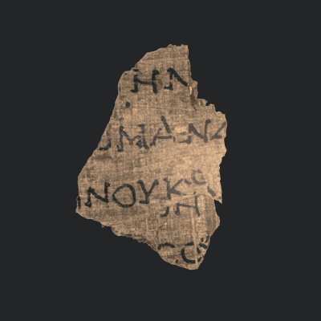
Vesuvius Challenge

Mailing list for scrollprize.org

By Stephen

</a>
<form class="embedded-publication-subscribe" method="GET" action="https://scrollprize.substack.com/subscribe?">
<input type="hidden" name="source" value="publication-embed">
<input type="hidden" name="autoSubmit" value="true">
<input type="email" class="email-input" name="email" placeholder="Type your email...">
<input type="submit" class="button primary" value="Subscribe">

Siguen otorgando premios de progreso cada dos meses y han definido un gran reto para el 2024: $100.000 para el primer equipo que sea capaz de leer el 90% de los rollos. También hay, como en 2023, $30.000 para las primeras letras de los rollos 2, 3 y 4. 

La fecha tope para el envío es el 31 de diciembre de 2024. Igual que el año pasado, parece que los resultados están tardando y todavía nadie ha conseguido ninguno de estos premios. Empieza a notarse una cierta sensación de pesimismo, pero todavía queda mucho tiempo hasta final de año. Si se consigue el gran premio, será un éxito histórico y un paso de gigante para el gran plan de escanear los 300 papiros restantes, la mayoría en Nápoles.

Nat Friedman tiene una visión a largo plazo, a la que llama <a href="https://scrollprize.org/master_plan">“El Plan Maestro”</a>. Su parte final (fase cuatro) es volver a excavar la Villa de los Papiros para recuperar la totalidad de la biblioteca con los miles de papiros que podrían estar enterrados.

Una visión muy ambiciosa. Veremos qué se consigue, y pase lo que pase, lo iremos contando por aquí.

¡Hasta la próxima, nos leemos! 👋👋

<a id="footnote-1" href="#footnote-anchor-1" class="footnote-number" contenteditable="false" target="_self">1</a>

La cita "a bursting forth of genius from the dust" proviene del poema "September, 1819" del famoso poeta romántico inglés William Wordsworth (1770-1850). En este poema, Wordsworth reflexiona sobre la naturaleza y el paso del tiempo, evocando imágenes poéticas de resurgimiento y descubrimiento. La frase en cuestión se encuentra en un pasaje donde el poeta habla sobre la emoción de descubrir fragmentos literarios antiguos, específicamente los sepultados por la erupción del Vesubio en Herculano.

