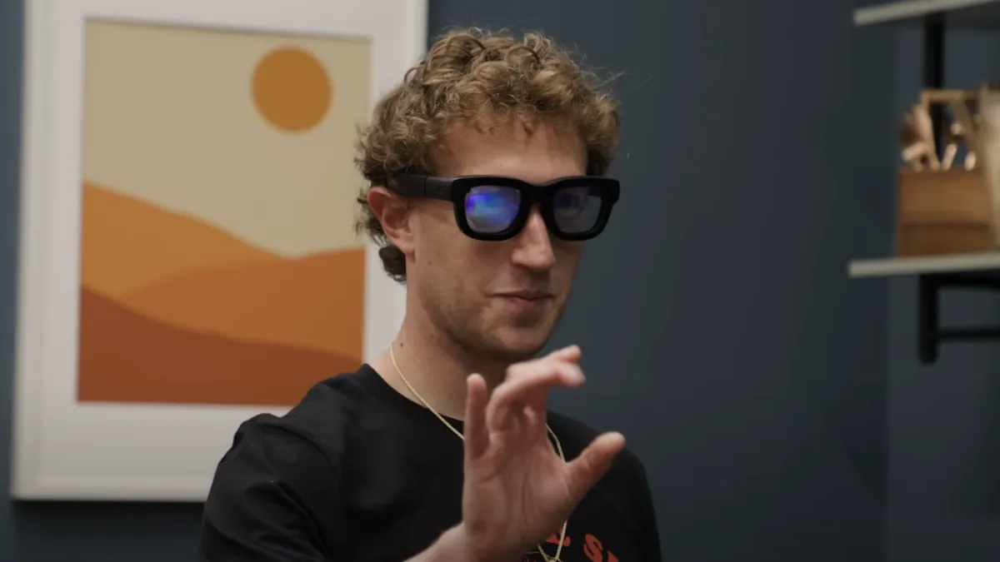
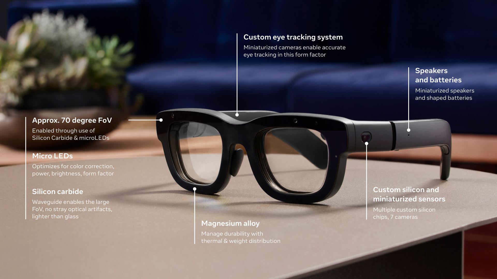
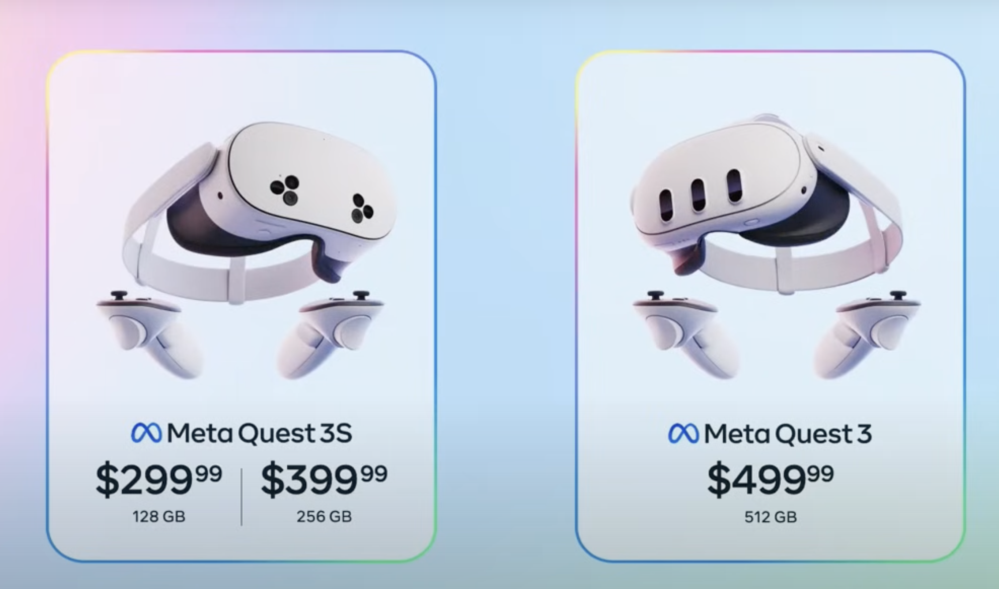
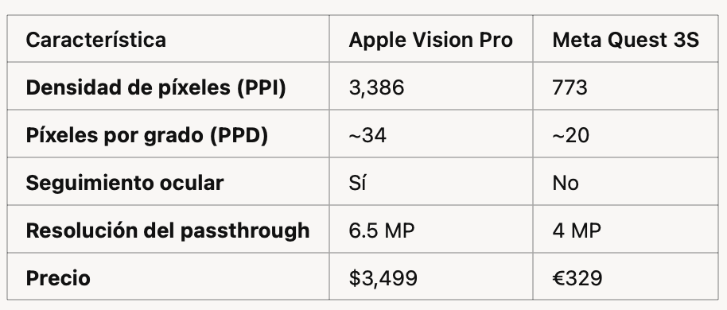
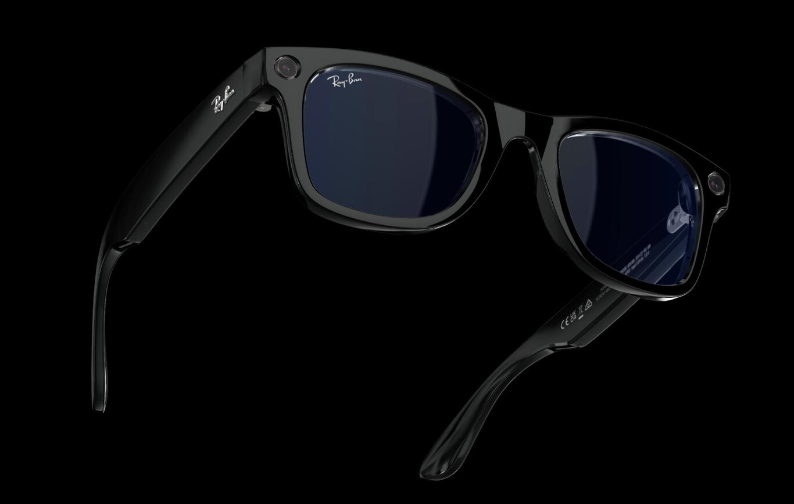

Vamos esta quincena con otro artículo monotemático. Esta vez sobre el proyecto Orion de Meta, las gafas de realidad aumentada que proyectan hologramas sobre el mundo real, que cuestan más de $10.000, que han cautivado a parte de la prensa tecnológica y que probablemente nunca veremos en el mercado.

¡Gracias por leerme!

Mark Zuckerberg en una demo de las gafas Orion.

<h2>El proyecto Orion</h2>

El pasado 25 de septiembre Meta presentó en su conferencia anual <a href="https://www.meta.com/en-gb/blog/quest/connect-2024-keynote-recap-quest-3s-llama-3-2-ai-wearables-mixed-reality/">Meta Connect 2024</a> un dispositivo que ha despertado la curiosidad y los comentarios positivos entre algunos medios especializados: <strong>las gafas de realidad aumentadas Orion</strong>. Unas gafas de realidad aumentada que, a diferencia del visor de Apple, parecen unas gafas normales y podría llevar cualquiera por la calle.

Pero no nos engañemos, aunque Meta titula <a href="https://www.meta.com/en-gb/blog/quest/orion-ar-glasses-augmented-reality/">su anuncio</a> como “<em>Orion: Las verdaderas gafas AR han llegado</em>”, en el contenido puntualizan que no, que no llegarán a las manos de los consumidores. Al menos tal y como se enseñan ahora. De lo que se trata es de de <strong>probar tecnología</strong> que se integrará en futuros productos.

<blockquote>

Aunque Orion <strong>no llegará a las manos de los consumidores</strong>, no se equivoque: No se trata de un prototipo de investigación. Es el prototipo de producto más pulido que hemos desarrollado nunca, y es realmente representativo de algo que podría llegar a los consumidores. En lugar de apresurarnos a ponerlo en las estanterías, decidimos centrarnos primero en el desarrollo interno, lo que significa que podemos seguir construyendo rápidamente y seguir ampliando los límites de la tecnología. 
 Y eso significa que llegaremos antes a un producto de consumo aún mejor.

</blockquote>

De hecho, el prototipo tiene muchas carencias y, si fuera un producto de verdad, costaría alrededor de $10.000. Tiene muchas cosas por pulir y el propio <strong>Zuckerberg</strong>, en la <a href="https://www.theverge.com/24253908/meta-orion-ar-glasses-demo-mark-zuckerberg-interview"><strong>entrevista con Alex Heath de The Verge</strong></a> dice que:

<blockquote>

Todavía queremos que sea un poco más pequeño, un poco más brillante, un poco de mayor resolución, y mucho más asequible antes de lanzarlo como producto.

</blockquote>

<h2>Algunos medios están convencidos</h2>

Aunque no se vayan a poner a la venta en un tiempo cercano, Zuck  quiere mostrar las gafas y quiere que algunos periodistas las prueben. Ha aprendido. Se ha dado cuenta de que es necesario ir más allá de los vídeos y <a href="https://www.error500.net/p/en-el-metaverso-de-zuckerberg-parecer">los avatares de juguete</a> (<strong>Antonio Ortiz</strong> dixit) de hace apenas tres años y que hay que abrir las puertas de sus laboratorios para enseñar un <strong>algo que se puede tocar y experimentar</strong>.

Es curioso cómo ha cambiado la imagen de Zuckerberg en solo un par de años. Y cómo parece que está triunfando esta nueva versión de un joven tiktokero campechano, seguro de si mismo y preocupado por las experiencias reales, olvidando toda su etapa del fallido Metaverso. Él mismo se ha encargado de presentar <a href="https://youtu.be/I7JyydkqDeI?si=6MtREPiI2gD_xalt">toda la Keynote</a> del Meta Connect, vistiendo una camiseta negra con la frase en latín “aut Zuck aut nihil”. “<strong>O Zuck o nada</strong>”, una frase original del imperio romano (“O César o nada”) que le da un aire entre gracioso e irreverente.

Volviendo al tema de Orion, Zuck ha preparado un par de demos que han convencido totalmente a algunos medios y analistas. A gente muy metida en el mundo de Apple, como <strong>Ben Thomson</strong> o <strong>Marco Arment</strong>, que hablan de que este es el verdadero camino que debería haber tomado Apple, y no lo que han hecho con las Vision Pro. Parece que estamos ante una nueva versión del famoso “campo de distorsión de la realidad” de Jobs.

Por ejemplo, <strong>Ben Thomson </strong>dice <a href="https://stratechery.com/2024/an-interview-with-meta-cto-andrew-bosworth-about-orion-and-reality-labs/">en su artículo</a> cosas tan contundentes como:

<blockquote>

Orion hace que todos los demás dispositivos de realidad virtual o aumentada que he probado parezcan un error, incluido el Apple Vision Pro.

</blockquote>

En cuanto a los aspectos técnicos, a pesar de que la calidad de la imagen no es tan buena como en las Vision Pro, por alguna razón (no las explica demasiado) la propuesta de Meta le ha gustado mucho más:

<blockquote>

Las limitaciones obvias, especialmente la baja resolución, parecen irrelevantes. La diferencia con el Quest o el Vision Pro es que, al mirar realmente la realidad, es tan dramáticamente diferente de incluso las mejores capacidades de passthrough del Vision Pro, que la calidad del video holográfico no importa tanto.

</blockquote>

Incluso se puede imaginar cambiando el iPhone por las gafas Orion:

<blockquote>

La calidad de imagen de Orion es lo suficientemente buena. En realidad, es impresionante. De hecho —y no lo digo a la ligera— es tan buena que, por primera vez, <strong>me hizo imaginar un mundo en el que no llevo un smartphone</strong>.

</blockquote>

En resumen, estas gafas son a lo que Apple debería intentar llegar:

<blockquote>

Con todo esto, la gran pregunta en los próximos años será la carrera entre Apple para construir algo tan bueno, y Meta para averiguar cómo fabricar algo que ya es excelente a gran escala y a un precio accesible.

</blockquote>

A <strong>Arment</strong> también le gustan las gafas de Meta y, en el <a href="https://atp.fm/607">último episodio de ATP</a>, aprovecha la ocasión para volver a criticar a Apple por su visor, por su falta de apoyo a los desarrolladores y su falta de interés en el producto, que considera abiertamente un fracaso.

<h2>Otros, no tanto</h2>

Otros medios resaltan más las limitaciones de las demos o están más convencidos de que el enfoque correcto es el de Apple.

Por ejemplo, Adam Savage menciona en <a href="https://youtu.be/ynLm-QvsW0Q?si=WckLouLHHxesBU39">su review en YouTube</a> algunos elementos negativos:

<ul>
<li>

Para conseguir el tracking de ojos había que adaptar las gafas a la cara y las gafas debían estar fijas a las orejas y a la nariz. Si se movían ligeramente, se perdía esa calibración y dejaba de funcionar el seguimiento de los hologramas.

</li>
<li>

La habitación donde se hace la demo es una habitación sin luces brillantes, con muchos ángulos que ayudan al SLAM y al mapeado del mundo.

</li>
<li>

Las imágenes proyectadas tienen algo de latencia y todavía no funciona del todo la persistencia y el anclaje de los objetos virtuales. Las ventanas y mensajes no quedan totalmente fijas en el mundo real y desaparecen cuando miramos a otro lado y volvemos después a la dirección original.

</li>
</ul>

En las siguientes imágenes podemos ver la habitación donde se hizo la demo y un ejemplo de los rótulos virtuales que se ven posicionados sobre los objetos reales.

Más críticas negativas de las pantallas:

<blockquote>

Tiene una densidad de 13 píxeles por grado. Puedes leer algo de texto, mirar una página web, pero no es nítido. Hay otras versiones con el doble de resolución, pero las imágenes no son tan opacas como las de esta resolución. Están buscando un equilibrio. Saben que tienen que llegar a 30 píxeles por grado para poder lanzar esto. Los objetos se ven difusos y no vas a confundir un holograma con un objeto real.

</blockquote>

Por ejemplo, una de las demos es un videojuego estilo ochentero.

Hacen la demo con el usuario mirando a la pared gris. La verdad, dudo que una demo así funcione en una habitación normalmente iluminada, con paredes y objetos claros.

Y una última crítica es para la idea de quitarle peso a las gafas poniendo todo el procesamiento en una unidad externa (una especie de petaca pequeña) que envía de forma inalámbrica las imágenes a las gafas:

<blockquote>

El enfoque de poner el procesador fuera de las gafas y enviar la imagen por una conexión inalámbrica también puede ser discutible. ¿Cuál es el <em>frame rate</em> que puedes conseguir con esto? ¿Cuál es la resolución máxima que puedes conseguir? Tengo mis dudas de que esto pueda ser escalable a cosas como ver una película o tener una video llamada nítida.

</blockquote>

Analistas como Jason Snell, en su artículo en <a href="https://sixcolors.com/post/2024/09/meta-and-apple-same-game-different-rules/">sixcolors</a>, o John Siracusa, en el mismo episodio de ATP mencionado antes, argumentan que el enfoque correcto es el de Apple. 

Estoy de acuerdo con ellos. Apple <strong>mantiene en secreto</strong> lo que está desarrollando hasta que el producto está verdaderamente terminado. Este enfoque evita crear expectativas que no puedan cumplirse y protege su reputación de posibles decepciones. Aunque esta estrategia a veces da la impresión de que Apple está “rezagada”, en realidad puede estar trabajando en tecnologías avanzadas detrás de escena.

A diferencia de Meta con Orion, Apple ya tiene un producto terminado y en el mercado, y está construyendo <strong>una plataforma software</strong> y un ecosistema de aplicaciones y experiencias. Apple ha sabido reconocer cuándo la tecnología no está lista para ciertas innovaciones. El objetivo inicial de Tim Cook siempre fue unas gafas como las de Orion, pero en el momento en que se han dado cuenta de que no son factibles han cambiado su enfoque hacia las Vision Pro. De hecho podríamos considerar las Vision Pro, con elementos como la pantalla externa con los ojos, como una “simulación” de unas futuras gafas de realidad aumentada. Pero es una simulación “real”, usable y que proporciona experiencias reales y no de juguete.

<h2>La verdadera estrategia de Meta</h2>

Si estamos de acuerdo en que Orion no va a ser un producto real (al menos en los próximos 10 años) ¿por qué presentarlo ahora? ¿Cuál es su verdadera estrategia?Para contestar estas preguntas debemos estudiar los productos reales que tiene Meta a la venta ahora mismo.

<h3>Un visor 10 veces más barato que el de Apple</h3>

El único producto real que ha presentado Meta en el Connect es su <strong>visor Quest 3S</strong>, una versión mejorada del Quest 2, con un <em>passthrough</em> similar al del Quest 3. De hecho, son prácticamente el mismo modelo, con una resolución de pantalla un poco menor (773 PPI el Quest 3S frente a las 1.218 PPI del Quest 3).

El vídeo de promoción del Quest 3S muestra claramente aplicaciones que son una <strong>clara copia de las de las Vision Pro</strong>: entornos inmersivos, una pantalla de cine enorme o pantallas que flotan con las que podemos interactuar.

Sin embargo, las especificaciones de las Quest 3S son muchísimos peores que las de las Vision Pro.

Por ejemplo, las Quest no tienen seguimiento ocular, la resolución de la pantalla es muchísimo menor y dudo mucho que tengan un SLAM y un anclaje de objetos que te permitan levantarte, moverte y mirar a los objetos y ventanas desde distintas perspectivas. Veremos lo que dicen las <em>reviews</em> cuando se pongan a la venta. Tiene pinta de ser un buen dispositivo de entrada a juegos y a experiencias de realidad virtual, pero da la sensación de que se quedará muy corto para trabajar o ver experiencias inmersivas. Pero bueno, cuesta diez veces menos que las Vision Pro.

Meta va a intentar con este visor llegar a una gran cantidad de gente y <strong>construir una base de usuarios</strong> que Apple no está consiguiendo. Va a ser bueno para Apple, porque le va a obligar a moverse, a lanzar algún visor más económico y a producir más experiencias. Es muy bueno que haya otro competidor fuerte jugando en el mismo espacio. Quizás se está configurando otra vez un duopolio similar al de iOS vs. Android, pero esta vez en el campo de la realidad virtual/extendida: <strong>Vision OS vs. Horizon OS</strong>.

<h3>Las gafas como asistente inteligente</h3>

La otra gran apuesta de Meta en la actualidad es la IA, con todos modelos opensource Llama, que hemos mencionado bastantes veces en esta newsletter. Esta apuesta se está materializando por ahora en la integración de la IA en aplicaciones como WhatsApp e Instagram (que por ahora no tenemos disponible en la UE).

Meta quiere ir más allá y jugar un papel importante en la nueva tendencia que en la que todo el mundo está ahora embarcado: <strong>dispositivos con asistentes inteligentes</strong>. Por ahora ha desarrollado las gafas Rayband con cámara, micrófono y audio, que están conectadas a la red y permiten hacer fotos y charlar con un asistente inteligente remoto.

<strong>Antonio Ortiz </strong>las ha probado, se ha quedado encantado y ha hecho <a href="https://www.error500.net/p/los-que-nunca-iban-a-tener-movil">estupendo análisis</a> en error500. Antonio comenta que el campo está ya suficientemente maduro como para ser una tecnología de consumo:

<blockquote>

La posibilidad de que una IA pueda asistirte en lo que estás viendo y escuchando, gracias a los nuevos modelos multimodales y utilizando un lenguaje natural, es algo que tenemos al alcance de la mano en los próximos meses.

</blockquote>

Pero Meta se enfrenta al problema de la privacidad y de la aceptación social:

<blockquote>

Cuánto aceptaremos que en cada momento <strong>nos apunten con una cámara</strong>, por mucho que avise cuando esté grabando con un piloto; cómo escudriñaremos que la persona con la que hablamos no nos esté prestando atención porque tiene superpuesto en sus gafas un contenido que le interese más; cómo de alienados nos sentiremos incapaces de escapar del <strong>hackeo de nuestro ciclo de dopamina</strong> que han conseguido las plataformas de contenidos actuales.

</blockquote>

Las <strong>Google Glass</strong> se quedaron fuera del tablero <a href="https://www.xataka.com/analisis/repugnancia-y-fascinacion-con-google-glass">hace más de 10 años</a>, dejando una cicatriz en esta tecnología emergente. El proyecto Orion se apoya en la promesa del Metaverso y en la realidad de las Vision Pro para <strong>intentar borrar esa marca</strong>. Como dice Antonio, intenta conseguir que la adopción de las gafas no queden ligadas a <a href="https://www.google.com/search?client=safari&amp;sca_esv=bbdbd4e0040378b7&amp;rls=en&amp;biw=1470&amp;bih=734&amp;sxsrf=ADLYWIKWX56kgPRBNBc8y6Hkvc9pv34twg:1728577291710&amp;q=Photo+Of+A+Man+Showering+With+Google+Glass&amp;udm=2&amp;fbs=AEQNm0CbCVgAZ5mWEJDg6aoPVcBgWizR0-0aFOH11Sb5tlNhdzTfxpAVBoexMFZnKJBpl_MmNp6ZDxgDPl6t2hVOzXMPRpBwkP9IY-13MTKHtUfMndUp-9U0YiMRcTf6ha0_e7i3oahCI9g8YNm9iXj4SeKEtGR8R3838esijNftuqyafY2KJ7R-8Cdp4Z32jG_0zbAUQsi5&amp;sa=X&amp;ved=2ahUKEwjXucGbnISJAxUE2QIHHYH7NaQQtKgLegQIEhAB">Scoble en la ducha</a>. 

Las gafas Orion nos plantean una <strong>utopía tecnológica socialmente aceptable</strong>, en donde las interacciones virtuales aumentan la realidad y nos permiten estar más conectados con otras personas. El objetivo es que, una vez cambiada la narrativa, se puedan introducir algunos de sus elementos más sencillos (por ejemplo paneles flotantes o videollamadas) en nuevas versiones de las gafas inteligentes sin que se vean como características negativas que invaden nuestra privacidad.

Creo que lo tienen bastante complicado. Noticias como <a href="https://www.404media.co/someone-put-facial-recognition-tech-onto-metas-smart-glasses-to-instantly-dox-strangers/">la reciente</a> de estudiantes que usando solo las gafas de Meta han sacado un montón de información de desconocidos con los que se cruzan por la calle no van a ayudar en absoluto.

Además, Apple no se va a quedar quieta y ya ha anunciado funcionalidades similares en el iPhone, con su <a href="https://www.apple.com/apple-intelligence/">Apple Intelligence</a>. Por ahora están solo empezando, pero seguro que van a apostar muy fuerte, y van a intentar que sea el iPhone el dispositivo inteligente que nos ayude. Y el que usemos para capturar el entorno cuando queramos preguntar algo, como se muestra en este vídeo de Apple en el que promocionan una característica llamada <strong>Visual Intelligence</strong> (todavía no disponible)

¿Va a ser socialmente más aceptable llevar unas gafas que sacar el móvil y preguntarle? Los relojes inteligentes nos han acostumbrado a llevar algo encima que nos evita sacar el móvil. Nos hacen sentir mejor, porque nos permiten desconectarnos del móvil. ¿Pasará lo mismo con las gafas? No lo sé. Creo que no, que va a ser muy complicado convencer a la gente gastarse más de 1.000 € en unas gafas que van a hacer cosas muy parecidas a las que podemos hacer con el móvil junto con unos AirPods.

<h2>En 2030</h2>

Otras veces he terminado los artículos con preguntas sobre el futuro. Me gusta ver esta <em>newsletter</em> como un sitio que seguiré visitando dentro de algunos años para releerla, revisar las cuestiones y comprobar qué se ha respondido y qué ha cambiado.

Esta vez voy a mojarme y dar <strong>5 predicciones para principios de 2030</strong>:

1️⃣ El proyecto Orion tal cual se presenta ahora <strong>seguirá en el laboratorio</strong>. Meta no conseguirá tener unas gafas que hagan realidad aumentada de una forma similar a las de las VisionPro. Por ejemplo, no será posible tener elementos virtuales anclados en el mundo real, ni pantallas virtuales que compitan con un monitor, ni juegos virtuales en los que los que se interactúe con personas remotas compartiendo elementos virtuales fijos y persistentes mientras te estás moviendo.

2️⃣ Algunos elementos del proyecto Orion, como la presentación de paneles flotantes en forma de notificaciones o letreros sí que <strong>se habrán incorporada en unas gafas inteligentes</strong>, una versión avanzada de las Meta Rayband actuales. Constarán algo más de 1.000 € y las llevarán algunos influencers del momento, pero no serán demasiado populares. Su uso será bastante limitado por los problemas de privacidad y mucha gente preferirá usar el móvil para apuntar y consultar. O algún nuevo dispositivo que saque OpenAI resultado de la colaboración con Jonny Ive.

3️⃣ Apple habrá <strong>consolidado su plataforma de Vision Pro</strong>. Se venderán un par de modelos, uno más económico (alrededor de 1.500 €) y otro más caro (de alrededor de 2.300€). Meta habrá subido el precio de sus visores de realidad virtual y los venderá a 600€ y 1.000€. Meta tendrá muchos más usuarios que Apple, pero <strong>ambas plataformas estarán en crecimiento continuo</strong> y no se cuestionará su futuro.

4️⃣ Las cámaras para filmar <strong>experiencias inmersivas</strong> serán comunes en la industria y habrá productoras especializadas en filmar este tipo de experiencias, con películas, obras de teatro, etc. Se publicarán tanto en la plataforma de Apple como en la de Meta.

5️⃣ Se comenzarán a hacer pruebas con los primeros <strong>eventos deportivos </strong>y espectáculos emitidos en directo en formato inmersivo. YouTube y Netflix terminarán apostando por estos nuevos formatos y tendrán aplicaciones nativas en las plataformas de Apple y Meta.

En 5 años repasaremos las predicciones 😜

¡Hasta la próxima quincena, nos leemos! 👋👋

