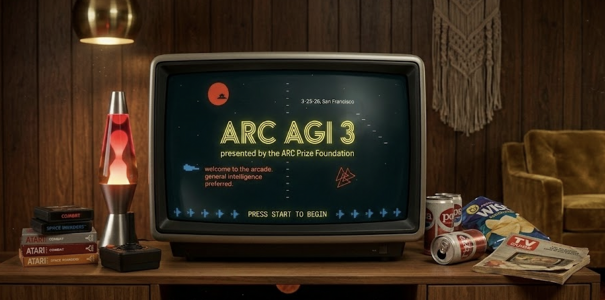
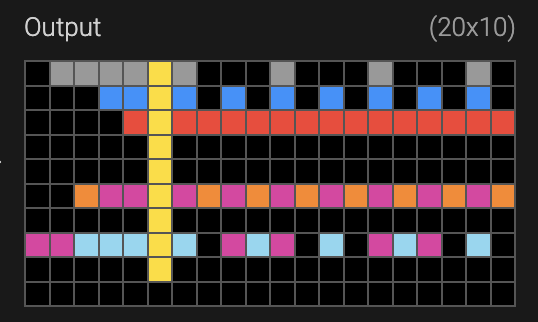

> ARC-AGI has worked as a diagnostic instrument for the real evolution of LLMs.

I have a particular fixation on the ARC-AGI benchmark and on its author, François Chollet. During 2024 I published [a review of the ARC Prize](/en/posts/del-1-al-15-de-junio-11-de-2024/), an [extended summary of an interview](/en/posts/francois-chollet-20-de-2024/), and one of the pieces of news that has impressed me most since ChatGPT appeared: [o3 solving ARC-AGI-1](/en/posts/o3-soluciona-arc-agi/). More than a year has passed since then and, coinciding with [this week's launch event](https://events.ycombinator.com/ARC-AGI-3-Launch) for [**ARC-AGI-3**](https://arcprize.org/arc-agi/3/), this feels like a good moment to revisit ARC and reflect on what it has really taught us about language models.

My impression is that ARC-AGI has not been just an especially difficult benchmark. It has also been a very useful way of observing qualitative changes in LLMs. Not every test is good for that. Many benchmarks let us measure gradual improvements in efficiency or performance across successive versions. ARC-AGI seems to point to something else: when a model starts solving a substantial share of its tasks, what appears is not just a quantitative gain, but **a new way of approaching problems**.

## What ARC is trying to measure

The original ARC idea, [formulated by François Chollet in 2019](https://arxiv.org/abs/1911.01547), was ambitious. It was not meant to measure accumulated knowledge or skill on heavily rehearsed tasks, but something closer to **efficiency in the acquisition of new skills**. This is what Chollet himself has called [_fluid intelligence_](https://x.com/fchollet/status/1999504459341459843): the ability to face new problems by constructing a solution or model on the fly, rather than limiting oneself to applying memorized skills or learned patterns.

In other words, not how much a system knows, but to what extent it can infer a new rule that generalizes well from a very limited experience. That is why ARC puzzles force you to induce a rule from very few examples and then apply it to a new case.

For example, the following tasks are part of ARC-AGI-1. Try to find the rule that transforms each input grid into its output grid. You can see the solution in footnote [^1].

<figure>
  
  <figcaption>Examples of ARC-AGI-1 tasks. You have to find the rule that transforms each input grid into its output grid.</figcaption>
</figure>

## What ARC-AGI-1 revealed about LLMs

The [ARC-AGI-1 dataset](https://github.com/fchollet/arc-agi) was built for ARC Prize 2024. It consisted of 1,000 tasks, 200 of which were kept secret to evaluate participants. The official competition launched on Kaggle on June 11, 2024 and ended on November 10, 2024. Solutions had to run locally on NVIDIA P100 cards with 16 GB of VRAM. The winning [competition](https://arcprize.org/competitions/2024/) team, the ARChitects, reached 53.5%, far from the 85% needed to win the $600,000 prize.

As soon as the prize launched, we all wondered **how frontier LLMs** of that moment, such as GPT-4o or Claude 3.5 Sonnet, would perform. Given the competition rules, it was not possible to test them directly on Kaggle. But [soon afterwards](https://arcprize.org/blog/introducing-arc-agi-public-leaderboard) the ARC Prize team ran official evaluations on a semi-private set of 100 tasks. **The results were disastrous**: Claude 3.5 Sonnet solved 14% of the tasks and GPT-4o only 5% ([ARC Prize 2024: Technical Report](https://arxiv.org/abs/2412.04604)).

What is most striking is that, even as models have become larger and more capable, the results of **non-reasoning LLMs** have not improved very much. Not even in today's models. For example, [task 2072aba6](https://arcprize.org/tasks/2072aba6/) could only be solved by non-reasoning models starting in December 2025 (`gpt-5-2-2025-12-11-thinking-none` was the first). By contrast, [task 3391f8c0](https://arcprize.org/tasks/3391f8c0/), which looks very simple, still cannot be solved today by any non-reasoning model.

<figure>
  
  <figcaption>ARC-AGI-1 task 2072aba6 could only be solved by non-reasoning models starting in December 2025.</figcaption>
</figure>

<figure>
  
  <figcaption>ARC-AGI-1 task 3391f8c0 still cannot be solved today by any non-reasoning model.</figcaption>
</figure>

In fact, [only 13% of the 400 public ARC-AGI-1 tasks](https://arcprize.org/tasks/?dataset=arc-agi-1&provider=OpenAI%2CGoogle&type=Base+LLM) have been solved by an advanced non-reasoning LLM such as GPT-5.2.

That explains well why ARC drew so much attention. At a time when models were beginning to impress through breadth and versatility, ARC pointed to something else. It asked for something much closer to what we usually mean by intelligence: identifying which regularities matter, proposing a plausible rule, and applying it consistently from very few examples. **ARC-AGI-1 shows the limit of non-reasoning LLMs.**

When did models begin to conquer ARC-AGI-1? When, at the end of 2024, the first paradigm shift arrived: reasoning LLMs. Using what came to be called CoT (*Chain-of-Thought*), these models could generate [**reasoning traces**](https://openai.com/index/learning-to-reason-with-llms/) instead of an instant answer. The longer those traces were, that is, the more time they were allowed to run, the better their results. This opened a new paradigm, often called *inference-time computing*, based on training LLMs with RL (*Reinforcement Learning*) so that they learn to generate chains of reasoning that explore and evaluate different strategies and keep the best outcomes.

At the end of 2024, OpenAI's reasoning model [o3 managed to solve ARC-AGI-1](https://arcprize.org/blog/oai-o3-pub-breakthrough): it reached 87.5%, although at the enormous cost of $4.5k per task. One year later, GPT-5.2 Pro (X-High) [reached 90.5% at a cost of $11.64 per task](https://x.com/arcprize/status/1999182732845547795?s=20), an efficiency improvement of roughly 390x in one year. Today, the [best results on the ARC-AGI-1 leaderboard](https://arcprize.org/leaderboard) belong to Gemini 3.1 Pro, [with 98% accuracy at a cost of $0.522 per task](https://x.com/arcprize/status/2024522812728496470?s=20). **ARC-AGI-1 had stopped being a barrier for reasoning models.**

## What changes with ARC-AGI-2?

When ARC-AGI-1 began to give way, what appeared was not just a model that "knew more", but a phase shift in the way models reason. We moved from systems that were mostly good at producing an immediate response ([System 1 intelligence](/en/posts/francois-chollet-20-de-2024/)) to systems that combine initial intuitions with **inference-time exploration**, hypothesis checking, and deliberate search (System 2 intelligence). ARC-AGI-2 was designed precisely to test that kind of system.

While ARC Prize 2024 was still underway, Chollet's team was already designing the next task set for the following edition. ARC-AGI-2 [was introduced on May 20, 2025](https://arcprize.org/blog/arc-agi-2-technical-report) ([technical report](https://arxiv.org/abs/2505.11831)) with 240 new tasks: 120 for semi-private evaluation ([you can try them here](https://arcprize.org/tasks/?dataset=arc-agi-2)) and 120 for the final private evaluation. The goal was to harden the benchmark by looking for signs of **deeper reasoning**, especially **concept composition and multiple-rule composition**, **symbolic interpretation**, and **contextual rule application**, while also making it less vulnerable to brute-force search.

A good example is [task 1ae2feb7](https://arcprize.org/tasks/1ae2feb7/). It took me more than 10 minutes and seems to me an excellent example of rule composition. How long does it take you? [^2]

<figure>
  
  <figcaption>ARC-AGI-2 task 1ae2feb7 is an example of rule composition. How long does it take you to solve it?</figcaption>
</figure>

And it worked, at least at first. Right after the dataset was released, it was tested on the models that had the best ARC-AGI-1 results and they could only solve a tiny number of tasks. For example, at that moment o3 (Medium) solved 53% of ARC-AGI-1, but **only 3% of ARC-AGI-2**. The official competition, ARC Prize 2025, reinforced that impression. It opened on March 26, 2025 under conditions similar to those of 2024, although in a somewhat more powerful environment: 4 NVIDIA GPUs with a total of 24 GB of memory. There were 1,455 teams and more than 15,000 submissions. When the competition closed on November 3, 2025, the [final results](https://arcprize.org/blog/arc-prize-2025-results-analysis) showed how hard the new benchmark was: the winning teams, relying mainly on advanced iterative refinement loops, solved only between 12% and 24% of the tasks.

The next question was whether frontier commercial models would also start to overcome it. Commercial LLMs did begin to perform somewhat better in the autumn of 2025, although still modestly. For example, [in October GPT-5 Pro reached](https://x.com/arcprize/status/1976329182893441209?s=20) 18.3% on ARC-AGI-2 ($7.41/task).

But at the end of 2025 the landscape changed quickly. One after another, new models from Anthropic, OpenAI, and Google climbed the public leaderboard, solving more and more tasks with lower cost per solved task. On [November 24, Opus 4.5](https://x.com/arcprize/status/1993036393841672624?s=20) reached 37.64% ($2.40/task), and on [December 17, Gemini 3 Flash](https://x.com/arcprize/status/2001330153902023157?s=20) got to 33.6% ($0.23/task). The high point came on March 5, 2026, when [GPT-5.4 Pro reached 83.3% ($16.41/task)](https://x.com/arcprize/status/2029624001350488495?s=20). **ARC-AGI-2 had also been conquered by LLMs.**

It is hard not to connect these dates with another qualitative shift that shook the programming world starting in December 2025. Tools such as Claude Code or Codex CLI, guided by new LLMs, began for the first time to show a sustained ability to **reason for tens of minutes and manage projects with thousands of lines of code**. The temporal coincidence does not seem accidental. A particularly interesting clue is Johan Land's [beetree/ARC-AGI project](https://github.com/beetree/ARC-AGI), which on January 5, 2026 reached 76.11% on ARC-AGI-2 using what he calls *Multi-Model Reflective Reasoning*: a combination of several frontier models, long-horizon reasoning (around 6 hours per problem), agentic code generation, visual reasoning, and a kind of "council of judges" that evaluates solutions.

<figure>
  
  <figcaption><a href="https://x.com/LandJohan/status/2008197725263716589?s=20">Post on X by Johan Land</a> explaining the architecture of his ARC-AGI-2 solution.</figcaption>
</figure>

It is possible that GPT-5.4 Pro's strategies for solving ARC-AGI-2 are similar to those used by Johan Land's harness. But instead of relying on an external scaffold, OpenAI's model is using its own reasoning traces and its native System 1 capabilities. As [Mike Knoop explains on X](https://x.com/mikeknoop/status/2036323325912424885?s=20), everything suggests that harnesses tend to appear ahead of capabilities that later show up natively in LLM systems.

ARC-AGI-2 therefore shows more than a score increase. **It shows the jump to reasoning and agentic systems.** Its conquest suggests that models have started to sustain deliberate search for hours, use tools consistently, generate and verify code, and coordinate different processes toward a goal.

## What ARC-AGI-3 is aiming for

ARC-AGI-2 showed that recent progress no longer depends only on more capable LLMs, but on systems able to reason, use tools, and sustain deliberate search over long periods of time. The question now is whether that is enough. And [ARC-AGI-3](https://arcprize.org/arc-agi/3/) suggests it is not: the next threshold may require not only reasoning about a given problem, but learning to solve it by interacting with it.

In this new version, the system must do more than infer a rule from a few static examples. It must discover patterns and regularities by exploring interactive games. Each game contains several levels of increasing difficulty. In the style of the best classic videogames, each level introduces new rules that have to be discovered and learned. As you progress, you must reuse what you learned in earlier levels and combine it with new rules. ARC-AGI-3 thus points to the next threshold: interactive reasoning and continual learning.

We can see some examples of what these interactive games will look like on [the project website](https://three.arcprize.org). For example, in the game shown in the following animation, the goal is to move the orange-and-blue square to the symbol in the lower-right corner, but first you have to change the orientation and color of the symbol in the lower-left corner so that it matches it. In earlier levels we learned that passing over the white cross lets us rotate the pattern, and that yellow squares are used to recover energy. In this level we also learn that the colored square changes the pattern's color and that white bars push our block to the next wall. All of that learning will be needed in later levels, where those rules must be combined with new ones.

<figure>
  
  <figcaption>Level 3 (out of 7) of one of ARC-AGI-3's interactive games.</figcaption>
</figure>

This is only one of the more than 150 games and over 1,000 levels designed by the ARC-AGI-3 team. But what really matters is not the scale, but the kind of ability it is trying to test. In ARC-AGI-1 and ARC-AGI-2 each task was independent from the others: the model had to infer one or several transformation rules from a few examples, but there was no reward for cumulative learning. Here the opposite happens. To solve a game, the system has to explore each level, discover regularities, remember what it learned, and reuse it later while combining it with new rules.

That fits well with the formulation Chollet himself gave [on X](https://x.com/fchollet/status/2004276612385108221):

> ARC-AGI-3 (launching in March 2026) tests interactive reasoning: we evaluate how systems explore unknown environments, build models of those environments, set their own subgoals, and plan and execute actions to achieve them autonomously, without instructions.

To solve this new challenge, models will have to move closer to the idea of fluid intelligence that Chollet has defended for years. And in addition, **they will have to provide the first signs of continual learning**, [one of the clearest shortcomings of current systems](https://x.com/emollick/status/2020713378319417626?s=20).

ARC has worked less as a leaderboard and more as a research tool. It has forced the community to formulate better questions about what it really means to generalize, reason, and adapt. In that sense, I think Chollet is right when [he retrospectively summarizes the project](https://x.com/fchollet/status/2022036543582638517) by saying that ARC was conceived to steer AI research toward fluid intelligence, and that it succeeded. Not because it solved the problem, but because it has been pointing, with fairly high precision, to where the limits still were. And that is exactly what has made ARC-AGI such a valuable test.

[^1]: **Task 1**: complete the purple squares with a yellow cell. **Task 2**: move the light-blue cells down to the bottom horizontal bar. **Task 3**: rotate the original grid by 180 degrees.

[^2]: It does not matter whether the original row of cells to the left of the yellow bar is touching it or not; what matters is the number of cells of the same color, *n*. The rule is to place to the right of the yellow bar a pattern that starts with a single cell of that color and then leaves *n - 1* empty cells. You can see that rule clearly in the first three rows. In the first there are 4 gray cells; to the right we place one gray cell and 3 empty ones. In the second there are 2 blue cells; to the right we place 1 blue cell and 1 empty one. In the third there are 0 empty cells, everything is a repetition of 1 red cell. And what happens when there is more than one color? That is where **composition** comes in: you have to apply the previous rule to each color, reading them from right to left and only showing the color in the cells that were left empty by applying the rule to the previous color. The solution is the following image:

    
