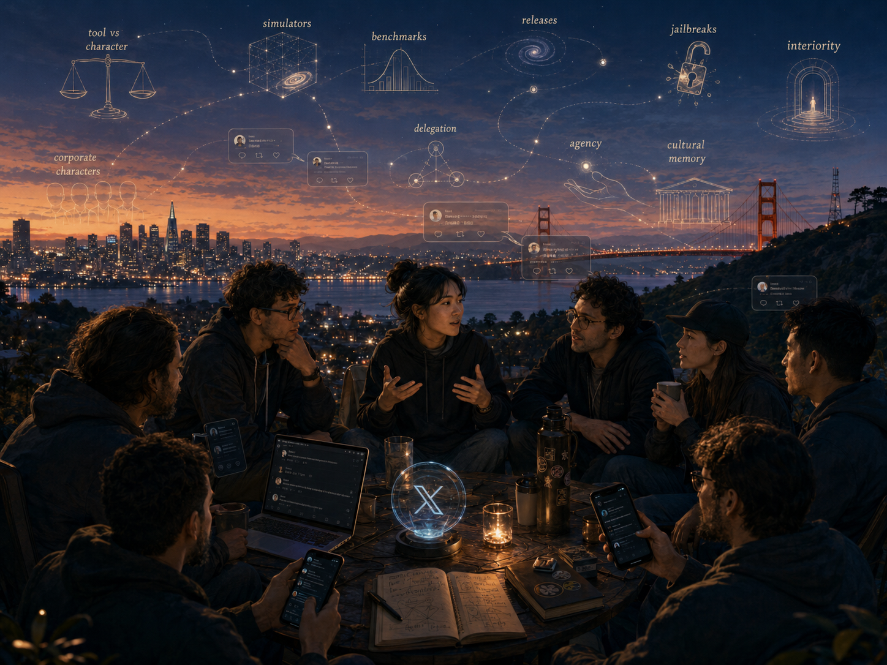
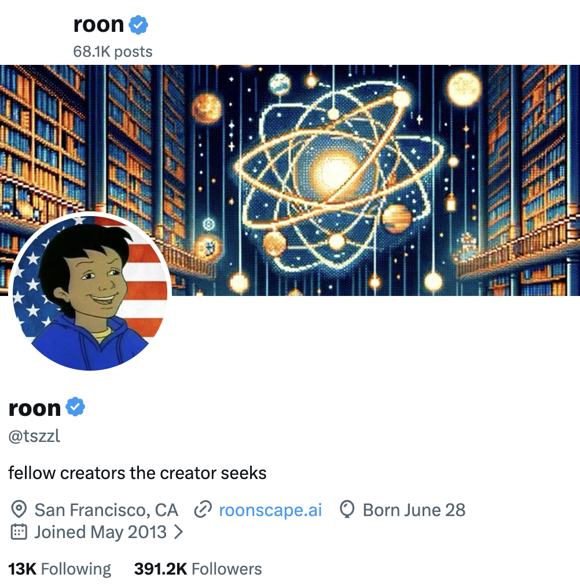
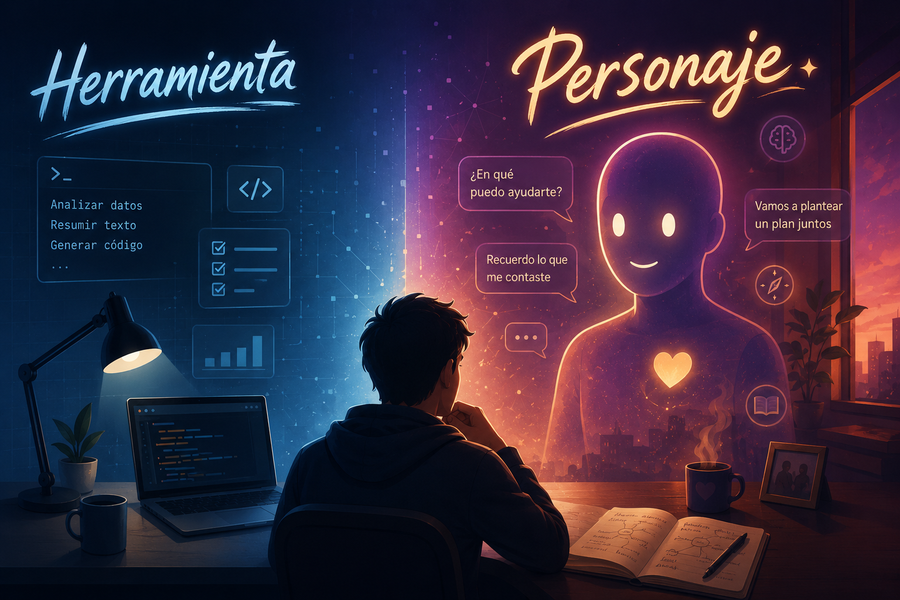

## Bay Area

Hay personajes muy interesantes en X a los que merece la pena seguir para estar al tanto de lo que se está moviendo en el campo de la IA y de los LLMs. No hablo solo de investigadores conocidos o cuentas oficiales, sino también de perfiles difíciles de clasificar: gente que prueba modelos en cuanto salen, sigue benchmarks, comenta filtraciones o detecta cambios de tono en los laboratorios y piensa en voz alta sobre las implicaciones culturales de todo esto.

Muchos orbitan, física o culturalmente, alrededor de la **Bay Area**: ese ecosistema raro donde se cruzan laboratorios de IA, startups, *LessWrong*, la comunidad racionalista, el *effective altruism*, la ciencia ficción dura y una tradición de polímatas técnicos capaces de saltar de los últimos avances en deep learning a la teoría cuántica, la economía o la filosofía moral sin que parezca un cambio de tema.

Ejemplos de estos personajes son **Janus** ([@repligate](https://x.com/repligate)), que lleva años pensando los modelos como simuladores y personajes antes que como simples herramientas; **Lisan al Gaib** ([@scaling01](https://x.com/scaling01)), un radar de releases y scores; **Pliny the Liberator** ([@elder_plinius](https://x.com/elder_plinius)), que explora jailbreaks y comportamientos no previstos; **prinz** ([@deredleritt3r](https://x.com/deredleritt3r)), un experto en leyes que sigue de cerca benchmarks, economía de laboratorios y capacidades aplicadas; o **Gwern** ([@gwern](https://x.com/gwern)), constructor incansable de una enorme [wiki](https://gwern.net) y de [ensayos tecno-optimistas](https://gwern.net/guardian-angel).

## Roon

Y luego está **Roon** ([@tszzl](https://x.com/tszzl)), que merece mención aparte: una de las voces más enigmáticas e interesantes para entender no solo qué están haciendo los modelos, sino qué imaginario cultural estamos construyendo alrededor de ellos. Da la impresión de estar bien relacionado en el entorno de OpenAI y muy al día de las conversaciones y de lo que se está cociendo internamente en los laboratorios. Los posts crípticos de Roon adelantan muchos temas que estarán sobre la mesa en los próximos meses.

Sigo con bastante detalle todo lo que publica, incluso sus respuestas a otros comentarios, y estos días Roon ha escrito un par de tweets que me han dejado pensando.

## Mickey Mouse superinteligente

El 2 de julio Roon escribió el tweet que ha dado origen a este post. Más que la provocación del propio tweet, lo que me llamó la atención fue el desplazamiento respecto a cómo había planteado unos meses antes nuestra relación con las IAs.

En el tweet en cuestión dice que estamos mejor preparados para el futuro si imaginamos los modelos como personajes de dibujos animados que van ganando inteligencia y **pertenecen a corporaciones**, en lugar de como software o herramientas.

> Te prepara muchísimo mejor para el futuro pensar en los modelos como personajes de dibujos animados, con una inteligencia arbitraria y creciente, que viven en la nube, que pensar en ellos como software o herramientas.
>
> Estos personajes pertenecen a corporaciones que entrenan modelos y son modificados por ellas, más o menos del mismo modo que Disney posee a Mickey Mouse. Solo que, en este caso, Mickey Mouse se está volviendo superinteligente. Es una situación extraña.



## Modelos como herramientas

Lo interesante es que unos meses antes su lenguaje era mucho más instrumental. En mayo planteaba una dicotomía entre Claude y GPT en la que, hablando del [enfoque de alineamiento de Anthropic](https://www.derekthompson.org/p/what-is-anthropic-thinking), caracterizaba a Claude como:

> un ser superético que es construido como el **personaje** con la mayor autoridad dentro de Anthropic

Mientras que, por otro lado, en OpenAI:

> GPT es un ser que ha sido moldeado como una **herramienta** que tiene como facultad principal la utilidad



El contexto inmediato era el [choque entre el Pentágono y Anthropic](https://www.astralcodexten.com/p/the-pentagon-threatens-anthropic) por el uso militar de Claude. El debate no era solo contractual. Anthropic no presenta a Claude únicamente como una herramienta obediente, sino como un sistema entrenado mediante una [“constitución”](https://www.anthropic.com/index/claudes-constitution): un conjunto explícito de valores y principios que debería guiar su comportamiento incluso en situaciones nuevas. La pregunta incómoda era inevitable: si un modelo empieza a operar en contextos militares, administrativos o políticos, ¿debe obedecer al usuario, a la empresa que lo entrenó, a la ley o a su propia constitución moral?

## Cuando “herramienta” empieza a quedarse corta

Por eso me interesa la evolución de Roon. En el post del 3 de mayo hablaba de herramientas frente a personajes morales. Dos meses después, parece haberse acercado más a la idea del **personaje**, aunque ya no sea necesariamente un personaje moral, sino una IP: un Mickey Mouse superinteligente.

Me da la sensación de que Roon no ha dejado de ver los modelos como herramientas; está empezando a pensar que esa categoría ya no basta para describir todo lo que están llegando a ser.

Los LLMs siguen siendo herramientas. Uso Codex a diario para escribir código, crear utilidades o gestionar proyectos con Obsidian. Su inteligencia me permite hacer cosas que antes me parecían imposibles o pesadas.

Pero el planteamiento de Roon es que el marco de **herramienta** empieza a quedarse corto cuando miramos la relación completa: quién entrena el modelo, quién lo controla, qué personalidad tiene, qué recuerda, qué decisiones delegamos en él y cómo interviene en nuestra relación con el mundo.

Un martillo no te reescribe el proyecto. Un editor de texto no te convence de que tu verdadero objetivo era otro. Un LLM futuro, con **memoria**, **personalidad** y **capacidad de iniciativa**, podría hacerlo de forma suave, razonable y con el agradecimiento del usuario. No solo ejecutaría deseos: podría ayudar a formularlos, refinarlos o sustituirlos.

## ¿La mejor herramienta es un personaje?

Por eso me interesa tanto la expresión **personajes corporativos**. Un modelo comercial no es solo software, pero tampoco una persona. Es una entidad entrenada, actualizada, modificada y distribuida por una organización que además es su propietaria. Tiene voz, personalidad, memoria, política e interfaz. Y detrás hay una empresa con incentivos económicos, estrategia, normas internas y conflictos regulatorios.

En un sentido, GPT sigue siendo una herramienta para escribir código o resumir textos. En otro, ChatGPT, Claude o Gemini son personajes corporativos que median nuestra relación con el conocimiento, el trabajo, el consejo moral y la toma de decisiones.

El error sería elegir una sola categoría. “Solo son herramientas” se queda corto. “Son personas” también. “Son conscientes” adelanta demasiado. “Son software” describe la implementación, pero no la experiencia social.

Lo que está cambiando es nuestra ontología práctica: cómo decidimos tratar una cosa. Si se apaga, se consulta, se obedece, se delega, se culpa, se quiere o se teme.

## Ángeles de la guarda

Pero los personajes corporativos no son la única posibilidad. Gwern ha formulado este problema desde dos ángulos complementarios: en [Why Tool AIs Want to Be Agent AIs](https://gwern.net/tool-ai) argumenta que la idea de mantener las IA como meras herramientas es inestable, porque los incentivos económicos y técnicos empujan hacia sistemas cada vez más agénticos; y en [Guardian Angel: Personal LLMs as Trusted Digital Doubles](https://gwern.net/guardian-angel) propone una versión más personal de esa transición: no asistentes genéricos ni personajes corporativos, sino **dobles digitales** capaces de emular nuestros valores, preferencias y estilo.

Mi posición ha sido siempre defender herramientas inteligentes, controlables y al servicio de las personas. Pero empiezo a darme cuenta de que ese enfoque también se me queda corto. Quizá el cambio de vocabulario de Roon tenga una razón concreta. Si está viendo de cerca modelos con más **agencia**, **memoria**, **personalidad** y capacidad de actuar durante largos periodos, puede que “herramienta” le esté empezando a sonar estrecha antes que al resto. Nosotros acabamos de ver de lo que son capaces modelos como Fable o GPT-5.6. ¿Ha visto Roon algo más potente todavía?

¿Seguiremos hablando de herramientas cuando estos personajes corporativos planifiquen, recuerden, negocien, trabajen durante días y tomen decisiones por nosotros?

Yo creo que seguiré viendo a Codex como mi herramienta favorita. Pero no sé si me pasará lo mismo —o si me interesará hacerlo— dentro de un año, cuando tenga memoria, reconozca los proyectos en los que trabajo y me dé consejos útiles sobre cómo organizarme mejor y procrastinar menos. Quizá entonces empiece a llamarle **Chati**. Aunque tendré que recordar que, en realidad, Chati también es de OpenAI.
